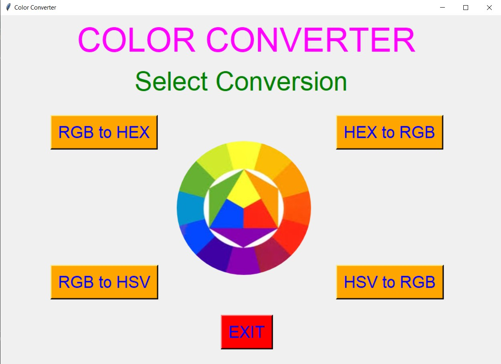
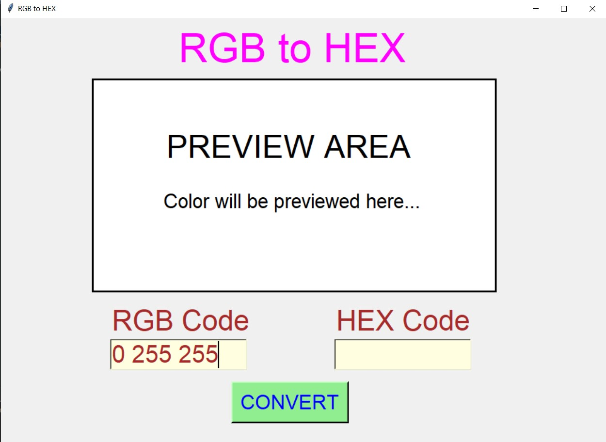
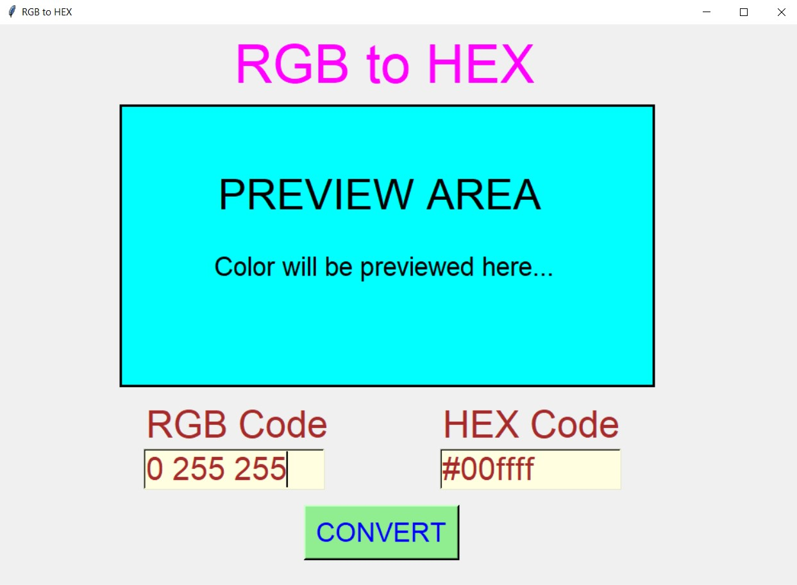
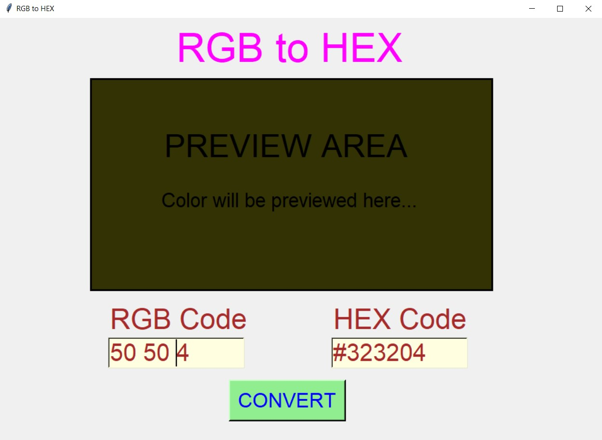
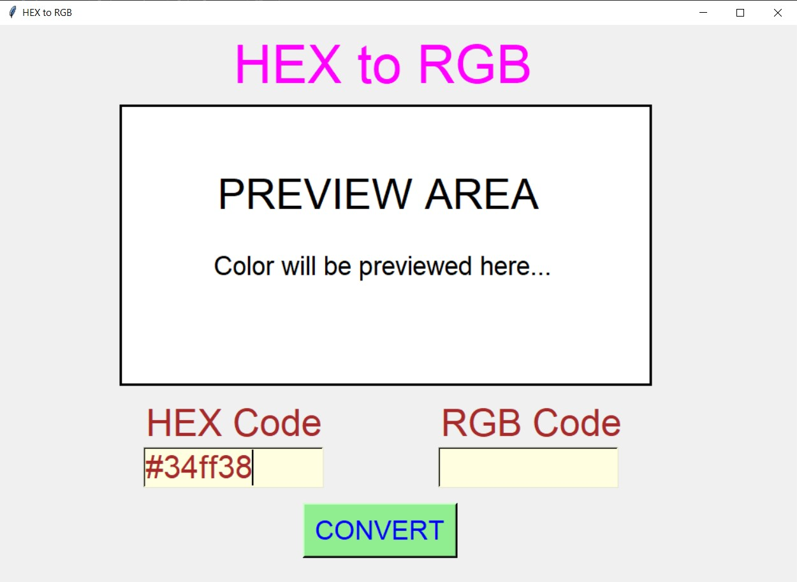
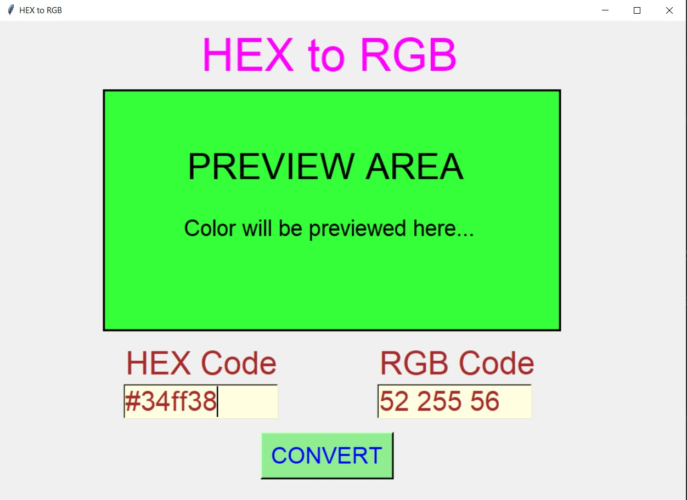
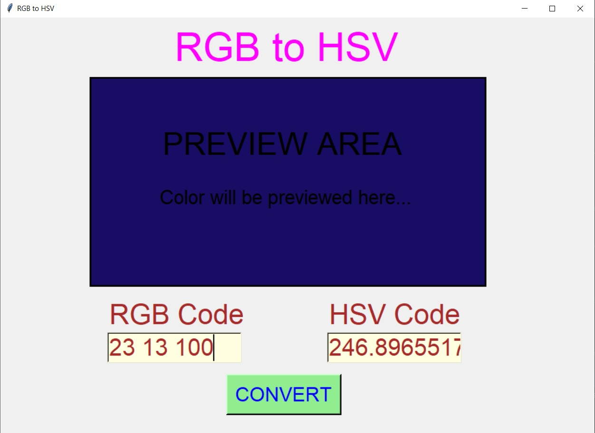
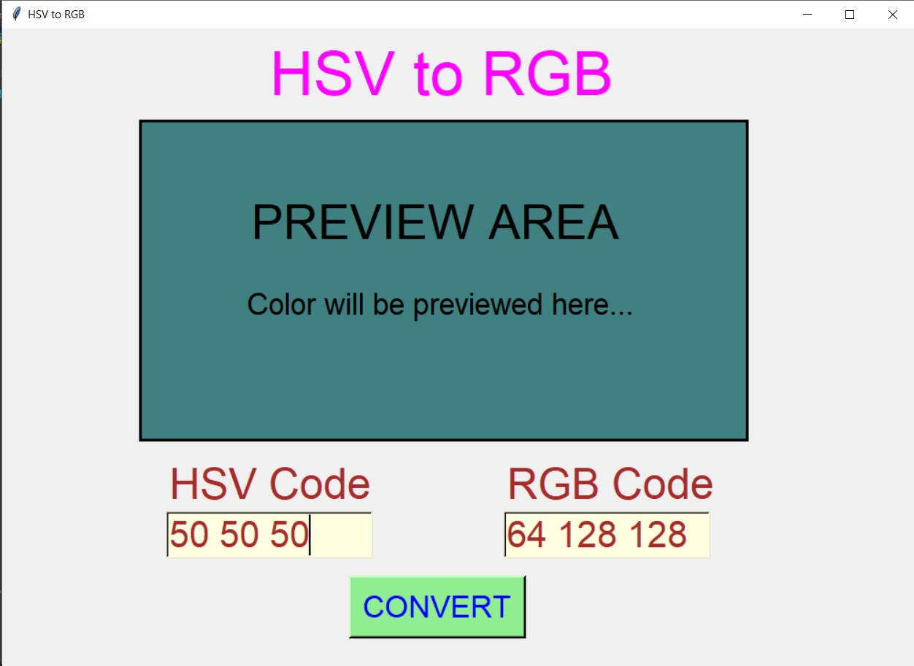
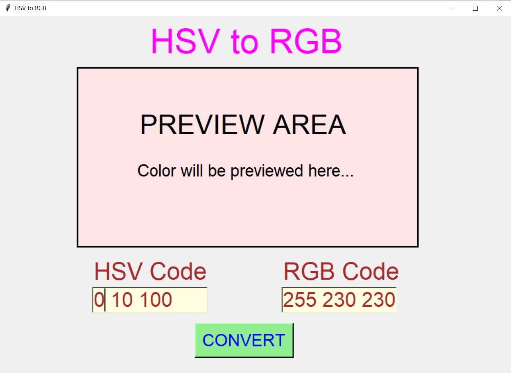
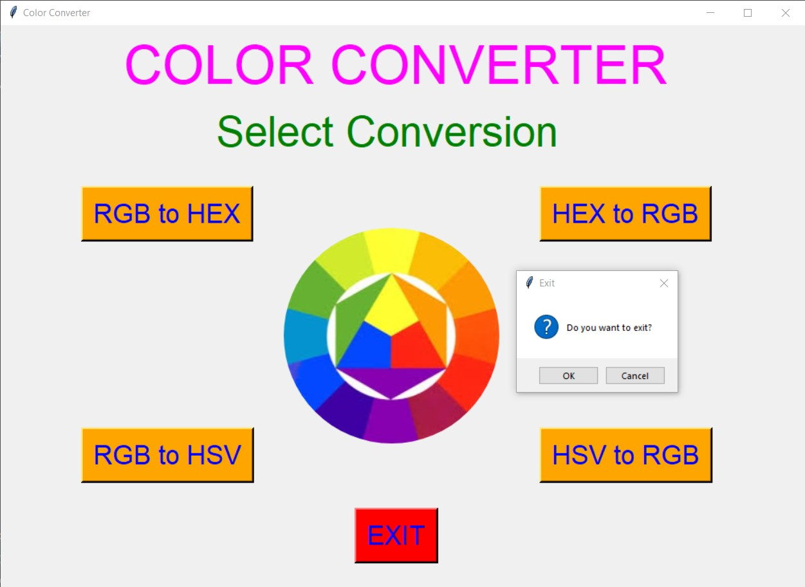

# ✔ COLOR CONVERTER
- #### An Color Converter created in python with tkinter gui.
- #### Using this user will be able to convert RGB color code to HEX color code, HEX to RGB, RGB to HSV and HSV to RGB.
- #### Also while converting user will be shown preview of the color converted in the preview area.

****

# REQUIREMENTS :
- #### python 3
- #### tkinter module
- #### from PIL import Image, ImageTk
- #### colorsys

****

# HOW TO Use it :
- #### User just need to download the file, and run the color_converter.py, on local system.
- #### After running a GUI window appears, here user can select from the four conversion option provided to the user.
- #### When user select any of the four option of conversion, he/she will be directed to new window. Where user enter the first conversion type code and convert that code to second conversion type code by just clicking on the CONVERT button.
- #### Along with conversion user will be previewed the color which user is converting in the preview area.
- #### This way user will be able to convert from RGB color code to HEX color code, HEX to RGB, RGB to HSV and HSV to RGB.
- #### Also there is exit button, clicking on which we get a exit dialog box asking the permission to exit.

# Purpose :
- #### This scripts helps us to easily convert from RGB color code to HEX color code, HEX to RGB, RGB to HSV and HSV to RGB, ans can alos see the preview of color.

# Compilation Steps :
- #### Install tkinter, PIL, colorsys
- #### After that download the code file, and run color_converter.py on local system.
- #### Then the script will start running and user can explore it by comverting the color code from any of the four supported conversion.

****

# SCREENSHOTS :

****

   
   
   
   
   
   
   
   
   
   

****

# Author : 
- ### Akash Ramanand Rajak

****
