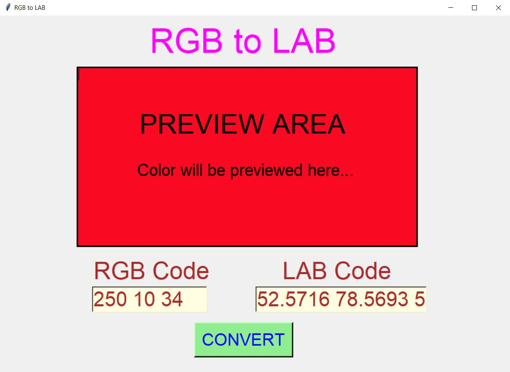
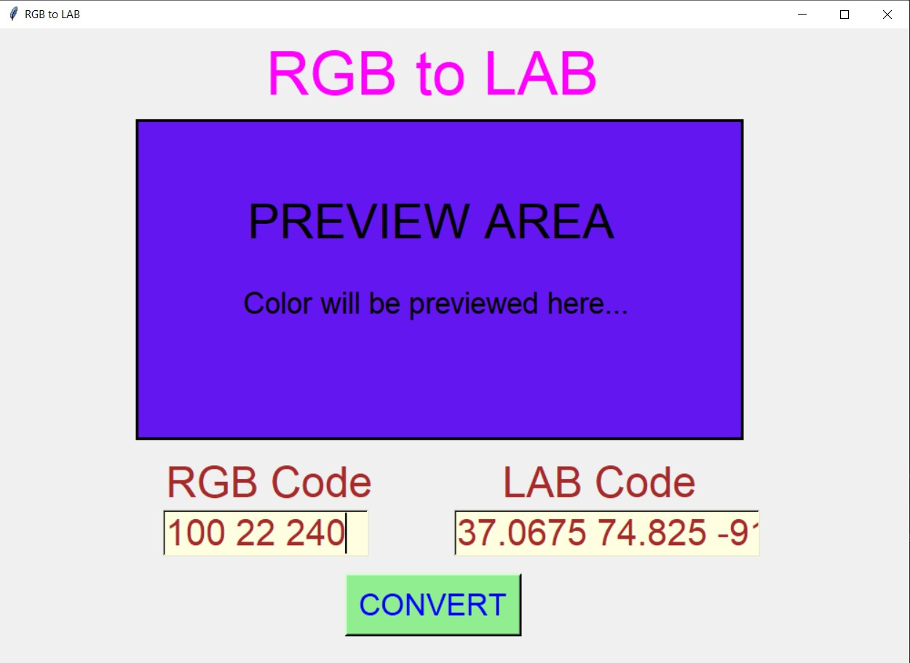
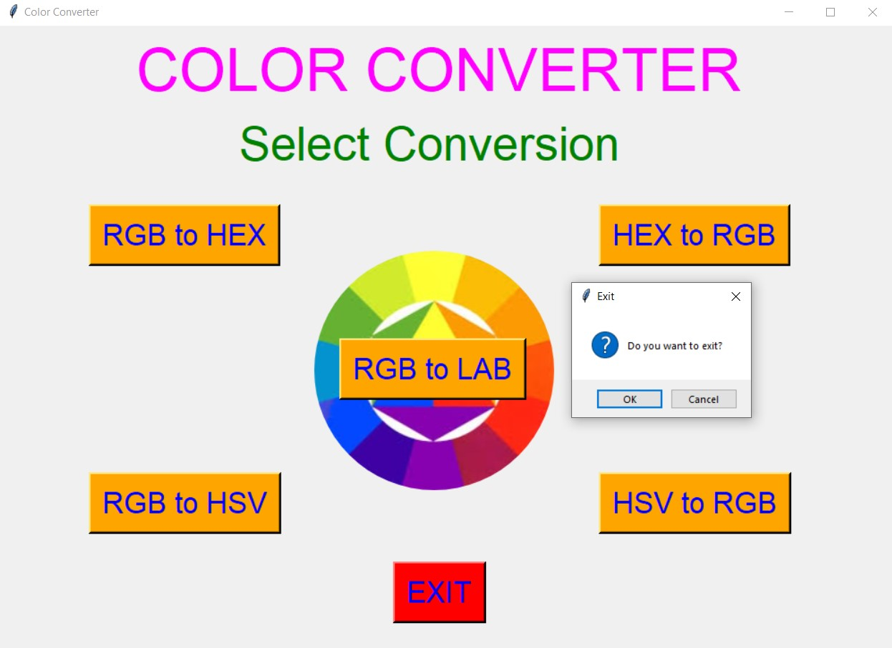

# ✔ COLOR CONVERTER
- #### An Color Converter created in python with tkinter gui.
- #### Using this user will be able to convert RGB color code to HEX color code, HEX to RGB, RGB to HSV, HSV to RGB and RGB to LAB.
- #### Also while converting user will be shown preview of the color converted in the preview area.

****

# Changes Done :
- ### Updated Code with the RGB to LAB color conversion. Here user will be able to convert RGB code to LAB code. In LAB, L stands for Lightness and A and B are chromatic component of color.
- ### Updated the Images in the Images Folder.

****

# SCREENSHOTS :

****

   
   
   
   
   
   
   
   
   
   
   
   
   

****

# Author : 
- ### Akash Ramanand Rajak

