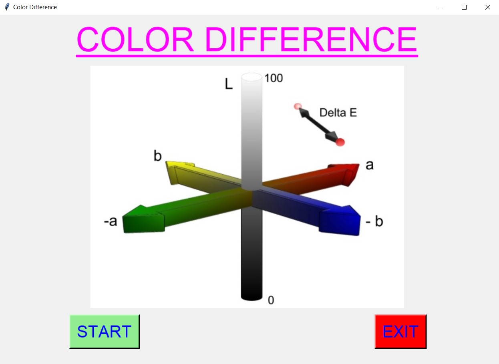
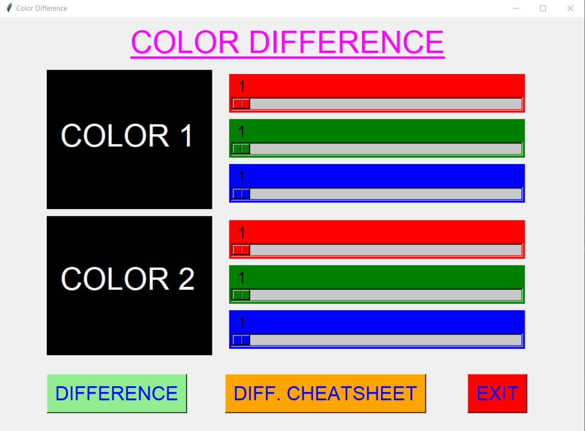
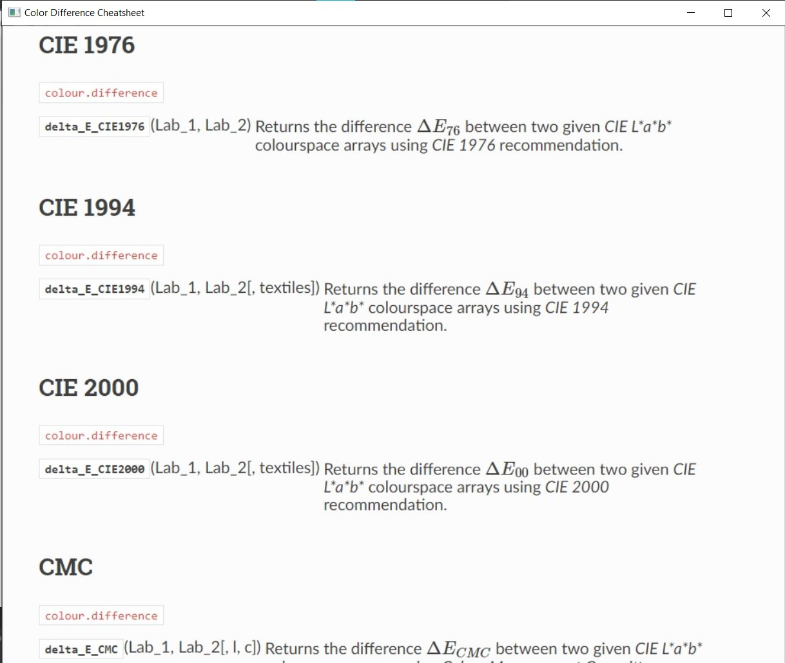
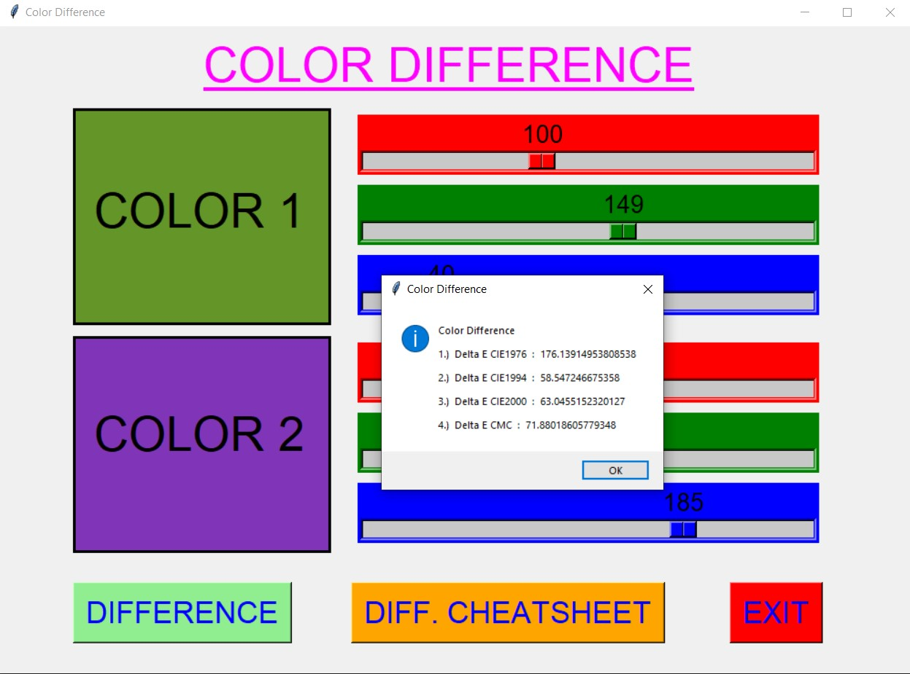
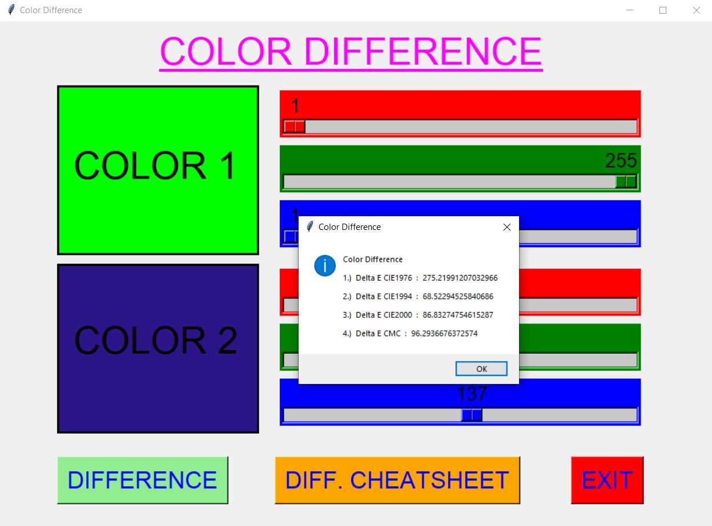
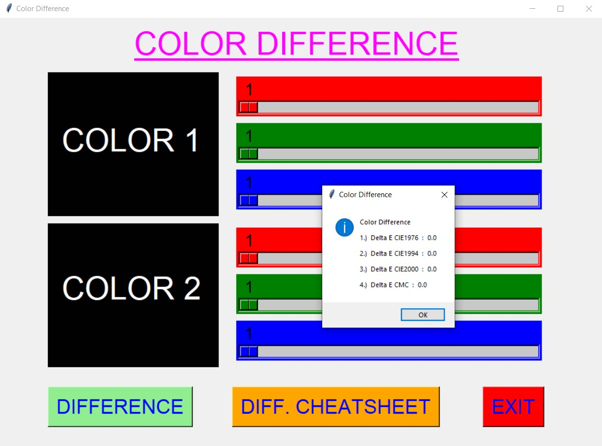
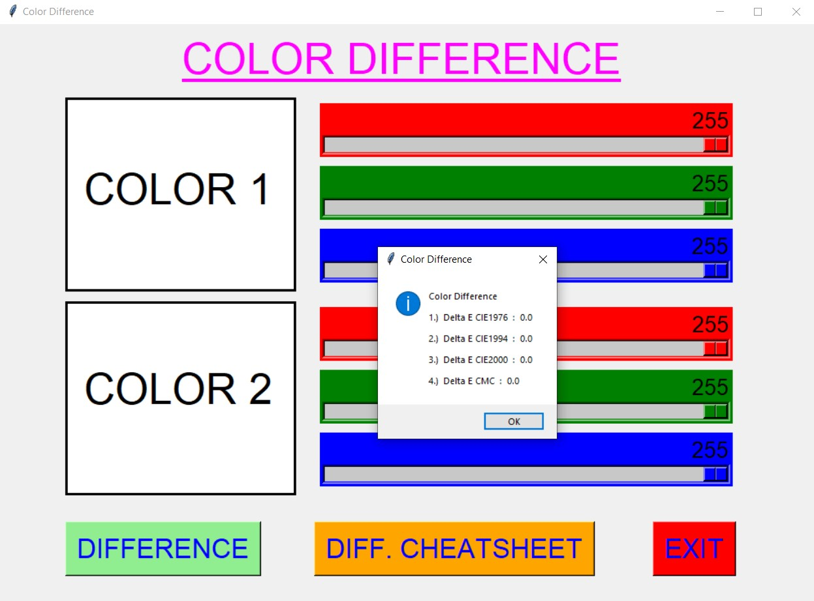
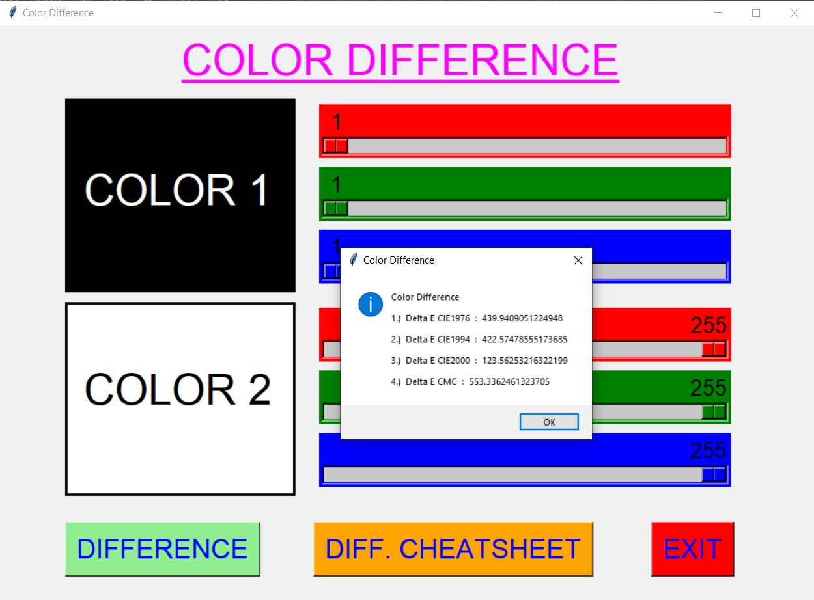
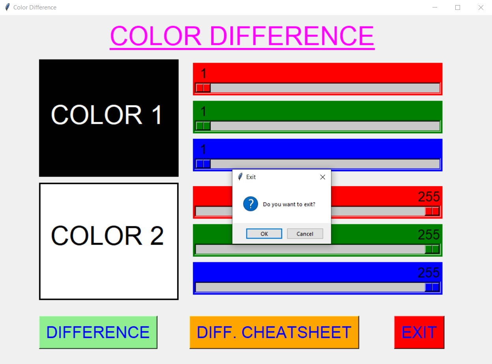

# ✔ COLOR DIFFERENCE
- ### An Color Difference created in python with tkinter gui.
- ### Using this user will be able to get the difference between any two color which can be selected using corresponding color palette.
- ### Also user will be shown the preview of both the color.
- ### The difference will be defined according to four standard difference Delta E CIE1994, Delta E CIE1994, Delta E CIE2000 and Delta E CMC.
- ### Also user will be able see the Color difference cheatsheet.

****

# REQUIREMENTS :
- ### python 3
- ### tkinter module
- ### from PIL import Image, ImageTk
- ### colorsys
- ### cv2
- ### from colormath.color_objects import LabColor
- ### from colormath.color_diff import delta_e_cie1976
- ### from colormath.color_diff import delta_e_cie1994
- ### from colormath.color_diff import delta_e_cie2000
- ### from colormath.color_diff import delta_e_cmc

****

# HOW TO Use it :
- ### User just need to download the file, and run the color_difference.py, on local system.
- ### After running a GUI window appears, user can start the main difference application using START button.
- ### Here user will be able to two color area with corresponding palette and different buttons.
- ### User need to select both the color from using the corresponding color palette, and will be able to find the difference between both the color using DIFFERENCE button.
- ### Also user will be shown the preview of both the color.
- ### The difference will be defined according to four standard difference Delta E CIE1994, Delta E CIE1994, Delta E CIE2000 and Delta E CMC.
- ### Also user will be able see the Color difference cheatsheet.
- ### Also there is exit button, clicking on which we get a exit dialog box asking the permission to exit.

# Purpose :
- ### This scripts helps user to easily get the difference between any two color and also along with cheatsheet.

# Compilation Steps :
- ### Install tkinter, PIL, colorsys, cv2, colormath
- ### After that download the code file, and run color_difference.py on local system.
- ### Then the script will start running and user can explore it by selecting two color using the palette and getting the difference between them.

****

# SCREENSHOTS :

****

   
   
   
   
   
   
   
   
   

****

# Author : 
- ### Akash Ramanand Rajak
