# ✔ COLOR MIXER
- ### An Color Mixer created in python with tkinter gui.
- ### Using this user will be able to mix any two, three, four even multiple colors in any proportion.
- ### Also user will be shown the preview of the individual colors(except for multiple mix) and mixed color preview.

****

# REQUIREMENTS :
- ### python 3
- ### tkinter module
- ### from PIL import Image, ImageTk
- ### import tkinter.messagebox as mbox

****

# HOW TO Use it :
- ### User just need to download the file, and run the color_mixer.py, on local system.
- ### After running a GUI window appears, here user can select any option like MIX 2 COLOR, MIX 3 COLOR, MIX 4 COLOR or even MIX MULTIPLE COLOR.
- ### When user select any of the four option of mixing, he/she will be directed to new window. Where user need to enter the color hex code and proportion of that color in the mixture, and can click on MIX button for mixing.
- ### As soon as color are mixed the user will be shown the preview for the individual colors(except for multiple mix) and mixed color.
- ### Also there is a clear button clicking on which user can clear the preview area and the input entered.
- ### Also there is exit button, clicking on which we get a exit dialog box asking the permission to exit.

# Purpose :
- ### This scripts helps user to easily mix any color and see the preview for the same, either two, three, four or even multiple mix color.

# Compilation Steps :
- ### Install tkinter, PIL
- ### After that download the code file, and run color_mixer.py on local system.
- ### Then the script will start running and user can explore it by selecting any option of mixing, entering details of color hex code and its proportion, and mixing it and seeing the preview.

****

# SCREENSHOTS :

****

  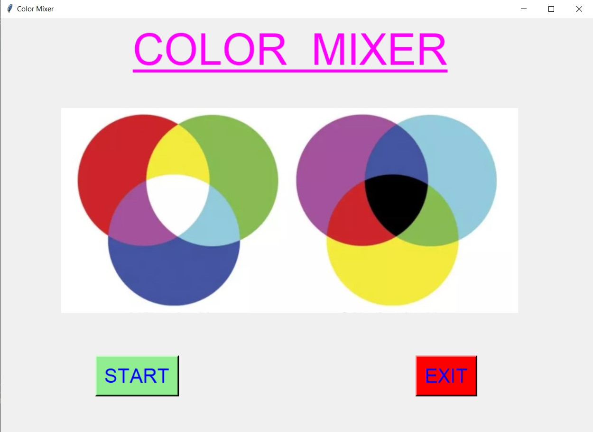 
  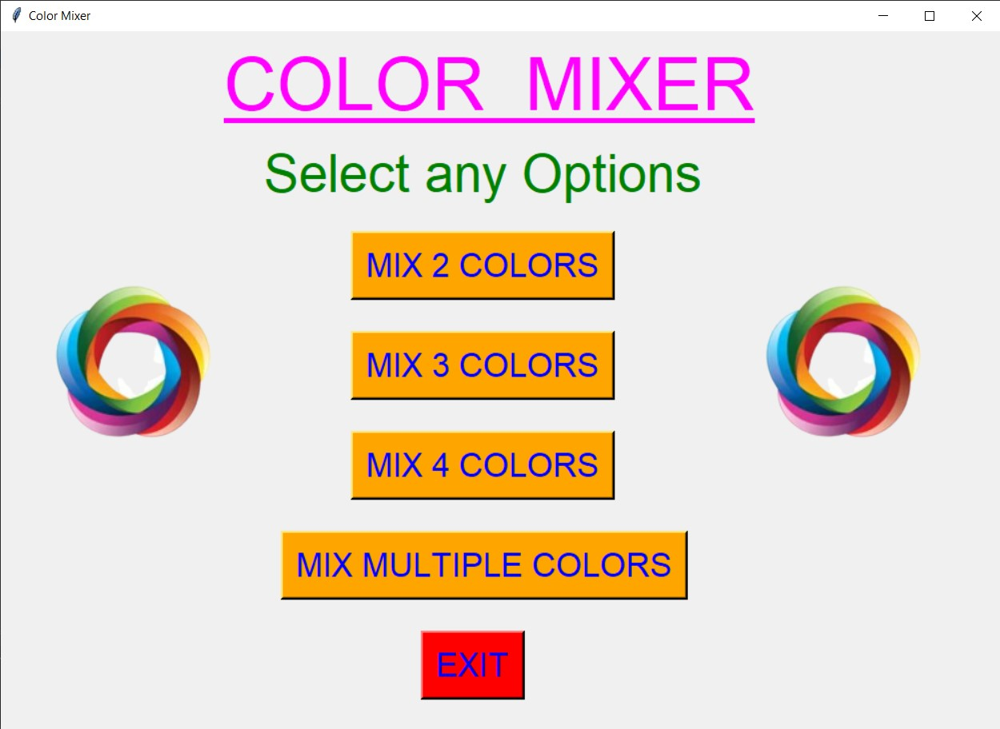 
  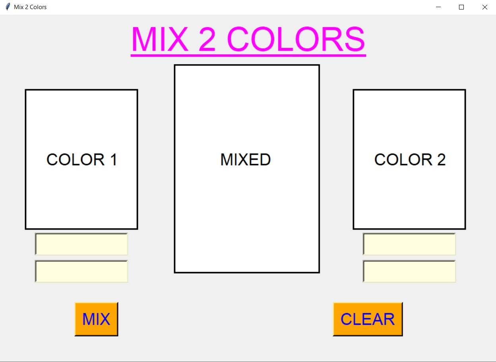 
  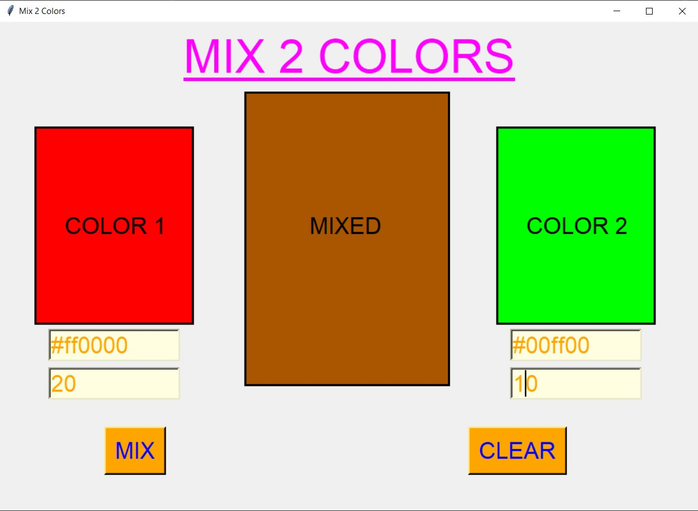 
  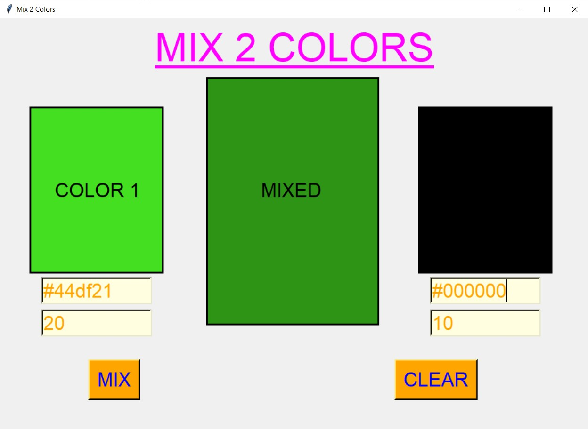 
  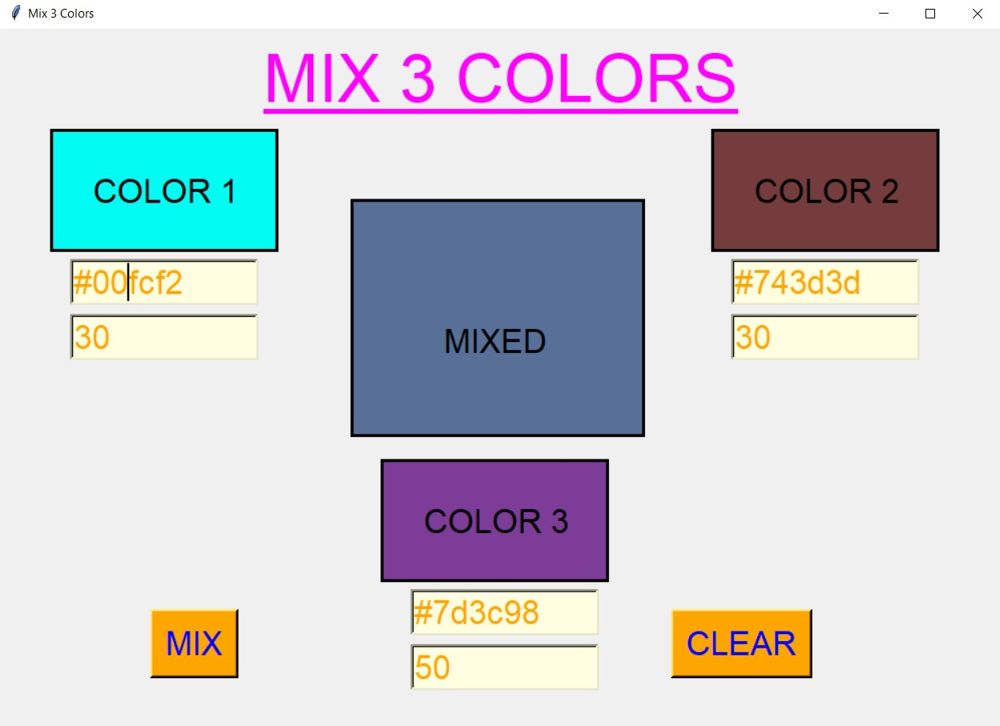 
  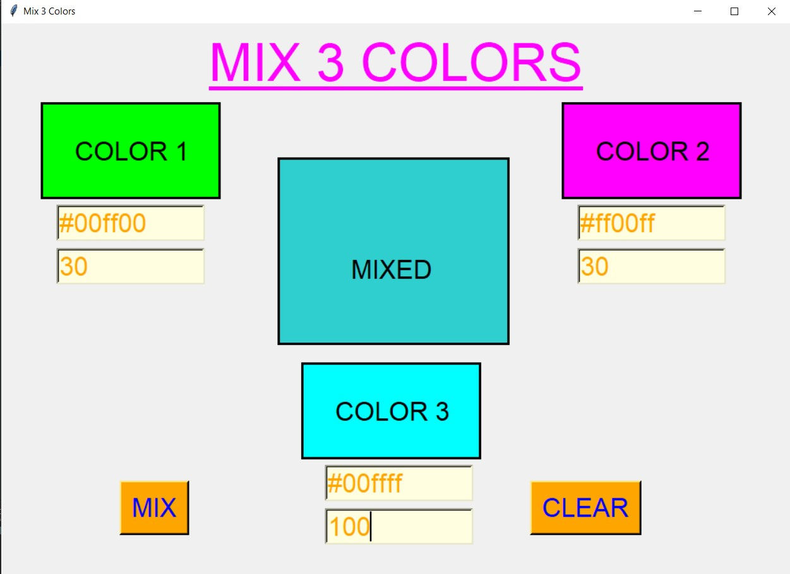 
  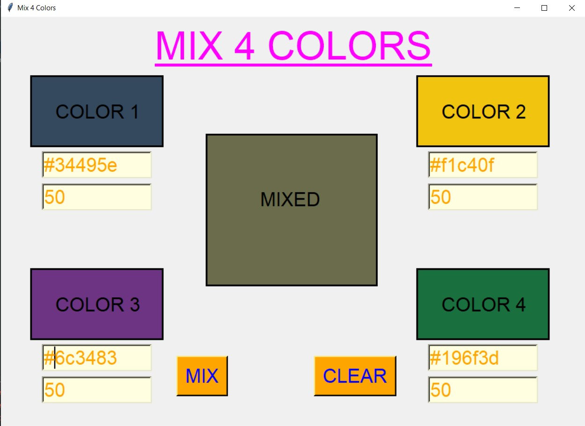 
  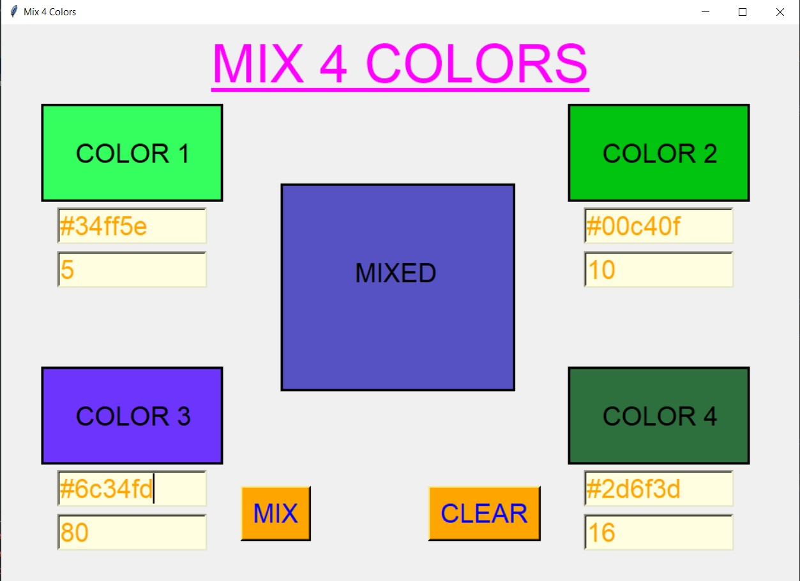 
  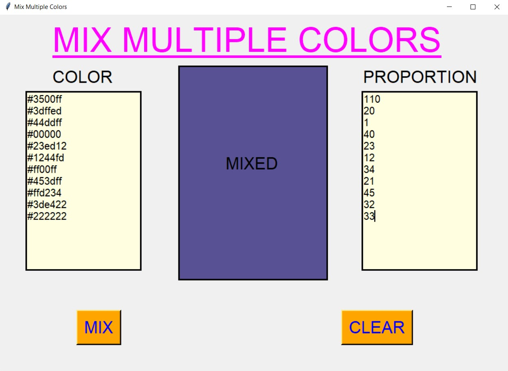 
  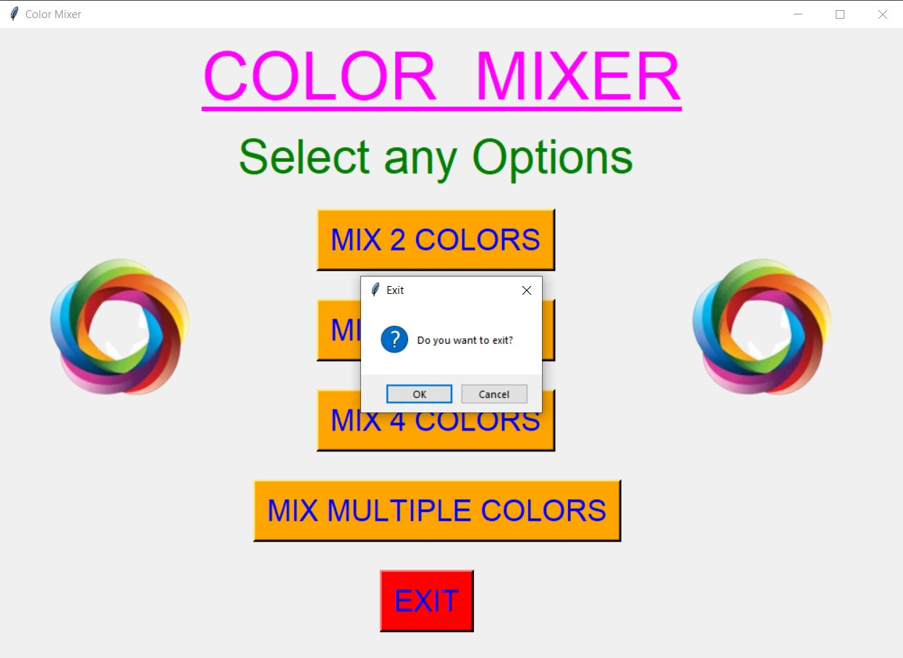 

****

# Author : 
- ### Akash Ramanand Rajak
