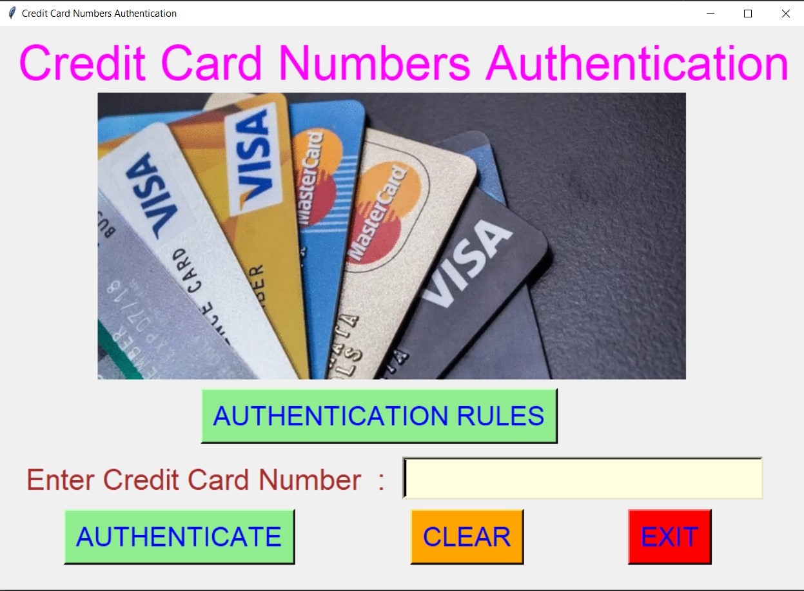
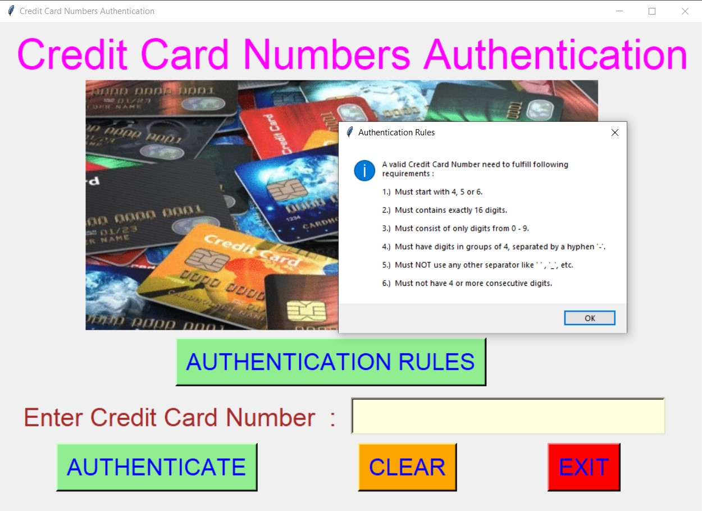
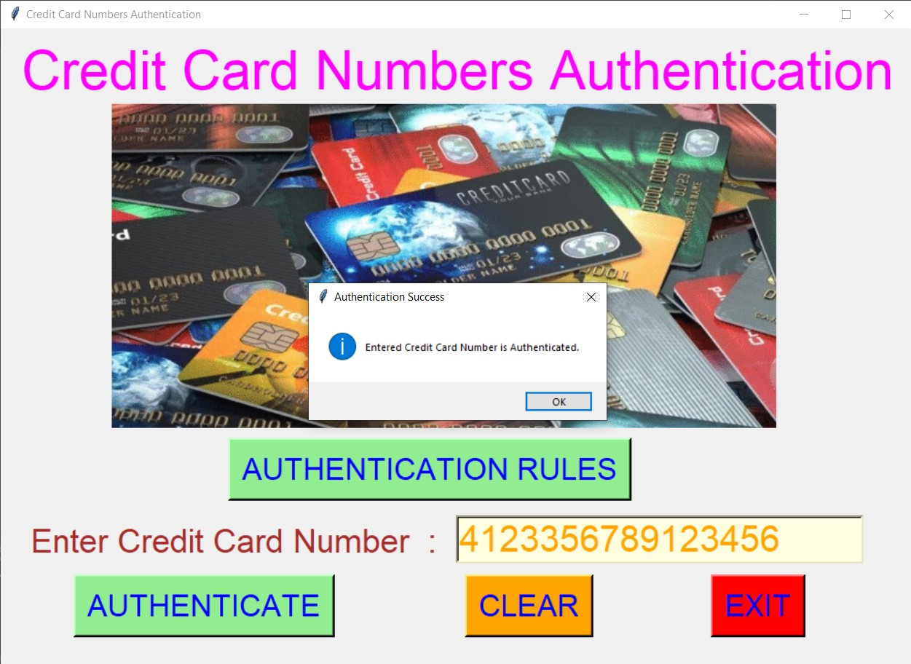

# ✔ CREDIT CARD NUMBER AUTHENTICATION
- #### A "Credit Card Numbers Authentication" is an application created in python with tkinter gui.
- #### In this application, user can easily check whether his/her credit card number is authenticated or not.
- #### Also user will be to see the Authentication rules of the credit card numbers.
- #### And used regex library of python.

****

# REQUIREMENTS :
- #### python 3
- #### tkinter module
- #### from tkinter messagebox module
- #### re

****

# How this Script works :
- #### User just need to download the file and run the credit_card_numbers_authentication.py on their local system.
- #### Now on the main window of the application the user can click on the "AUTHENTICATION RULES" button to see the rules for an authenticated credit card number.
- #### After that there is an entry box for entering Credit Card Number, and when user clicks on the "AUTHENTICATE" button he/she will be able to see whether the entered credit card number is Authenticated or not.
- #### Also there is a CLEAR button, clicking on which user can clears the Credit Card Number entry box to empty.
- #### Also there is an EXIT button, clicking on which exit dialog box appears asking for the permission of the user for closing the window.

# Purrpose :
- #### This scripts helps us to easily check the authenticity of any credit card numbers.

# Compilation Steps :
- #### Install tkinter, re
- #### After that download the code file, and run credit_card_numbers_authentication.py on local system.
- #### Then the script will start running and user can explore it by authenticating any Credit Card Number.

****

# SCREENSHOTS :

****

   
   
   
   
   
   
   

****

# Author :
- ### Akash Ramanand Rajak
