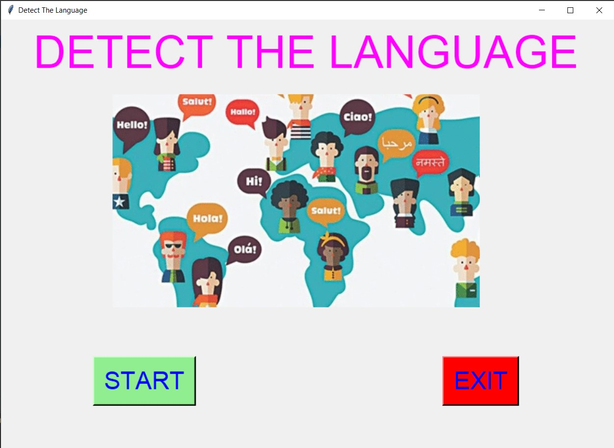
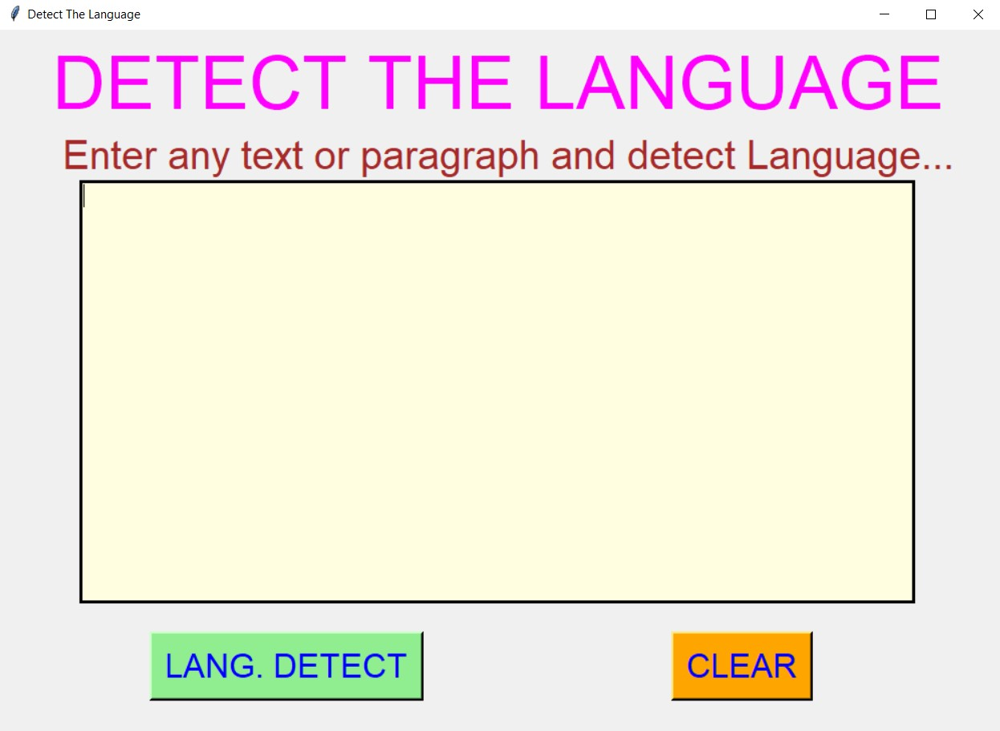
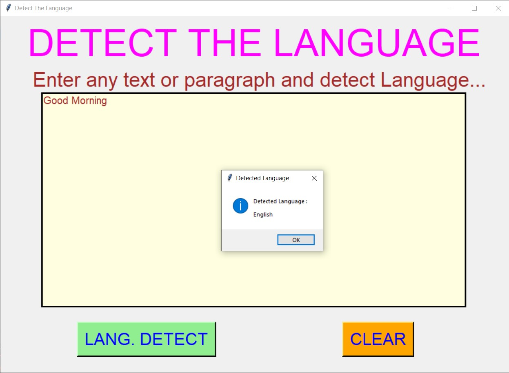
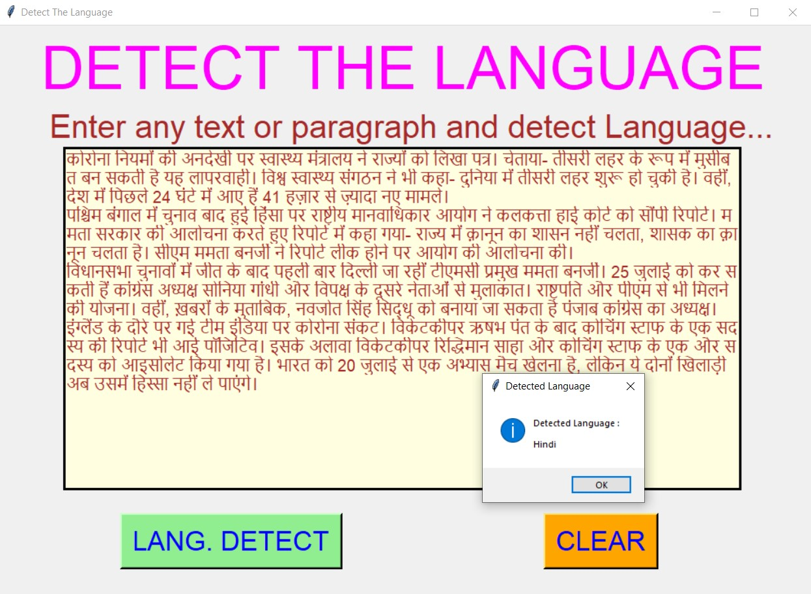
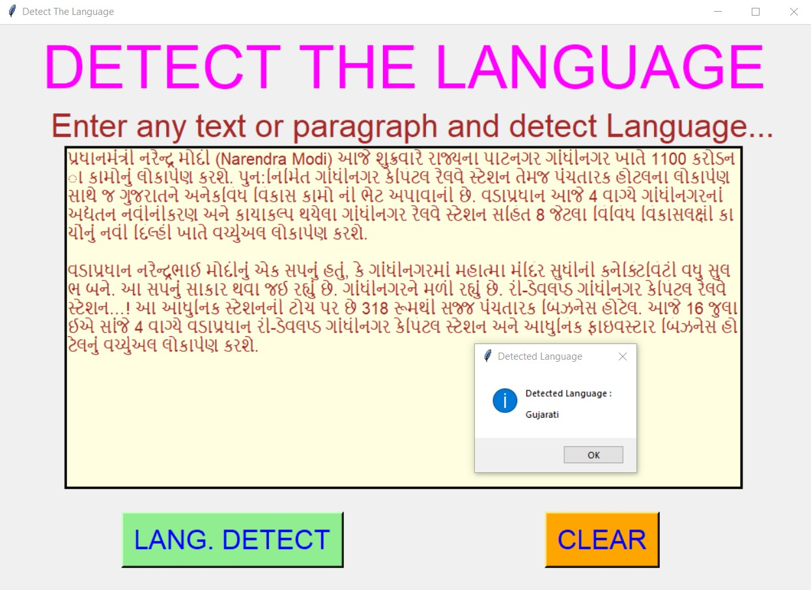
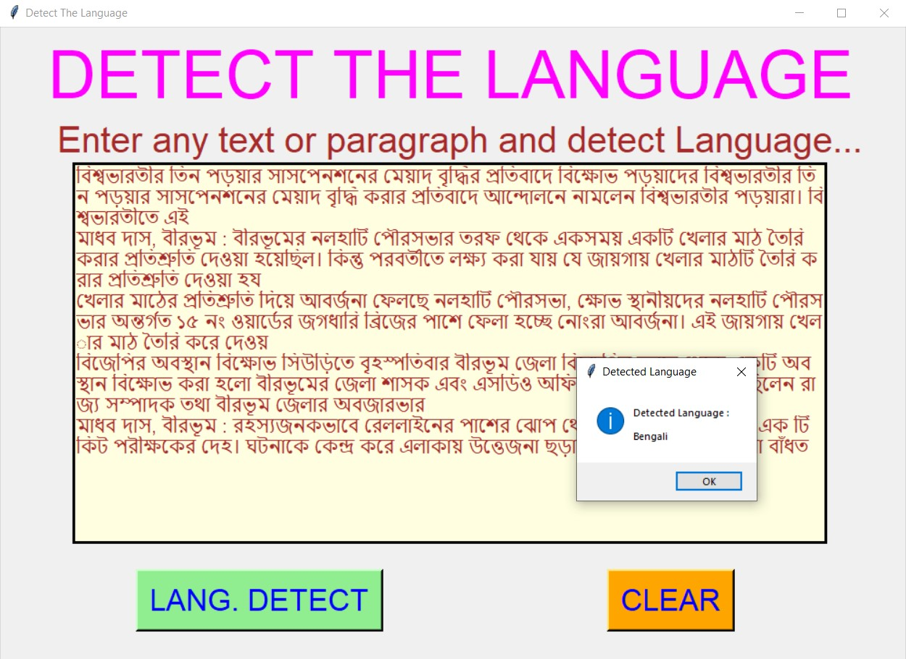
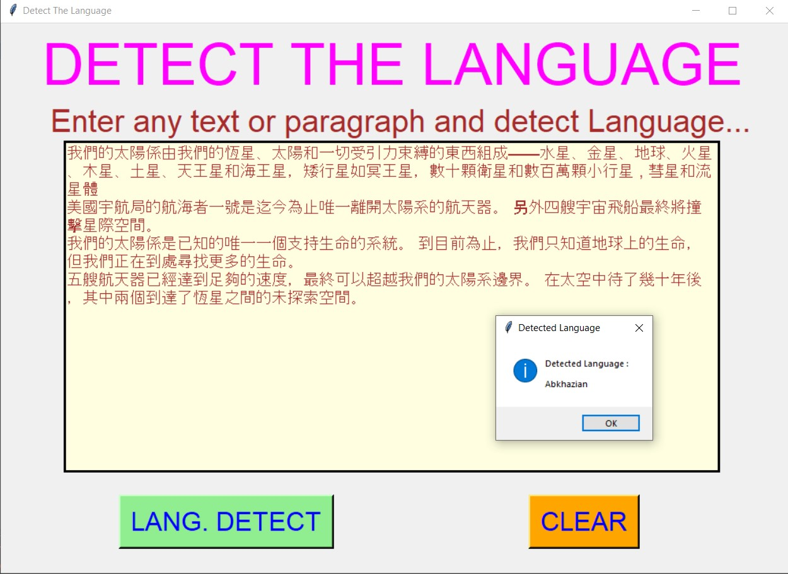

# ✔ DETECT THE LANGUAGE
- #### A "detect The Language" is an application created in python with tkinter gui.
- #### In this application, user will be able to write any text or paragraph in any language and can detect that language.
- #### for implementing this used nltk and pycountry library in python.

****

# REQUIREMENTS :
- #### python 3
- #### tkinter module
- #### from tkinter messagebox module
- #### nltk
- #### pycountry
- #### from nltk.stem import SnowballStemmer

****

# How this Script works :
- #### User just need to download the file and run the detect_the_language.py on their local system.
- #### Now on the main window of the application the user can click on the START button to get started with main application.
- #### ON the new window, user can enter any text or paragraph in the text area provided and by clicking on the LANG. DETECT button, user will be able to detect the language in which text is written.
- #### Also there is a CLEAR button, clicking on which user can clears the text area.
- #### Also there is an EXIT button, clicking on which exit dialog box appears asking for the permission of the user for closing the window.

# Purrpose :
- #### This scripts helps us to easily detect the language of the entered text or paragraph.

# Compilation Steps :
- #### Install tkinter, nltk, pycountry
- #### After that download the code file, and run detect_the_language.py on local system.
- #### Then the script will start running and user can explore it by entering the text in any language and detecting the language for the same.

****

# SCREENSHOTS :

****

   
   
   
   
   
   
   

****

# Author :
- ### Akash Ramanand Rajak
