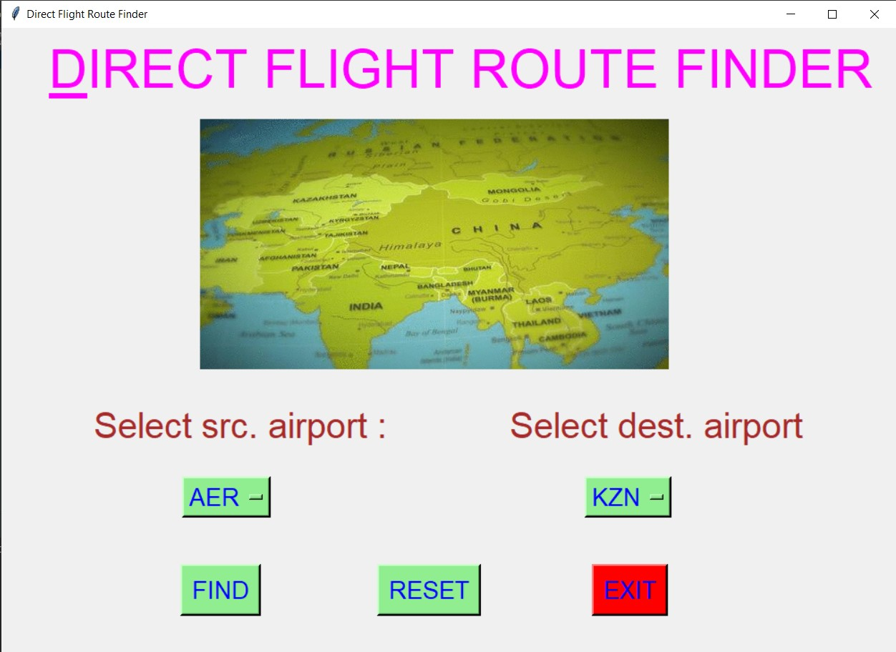
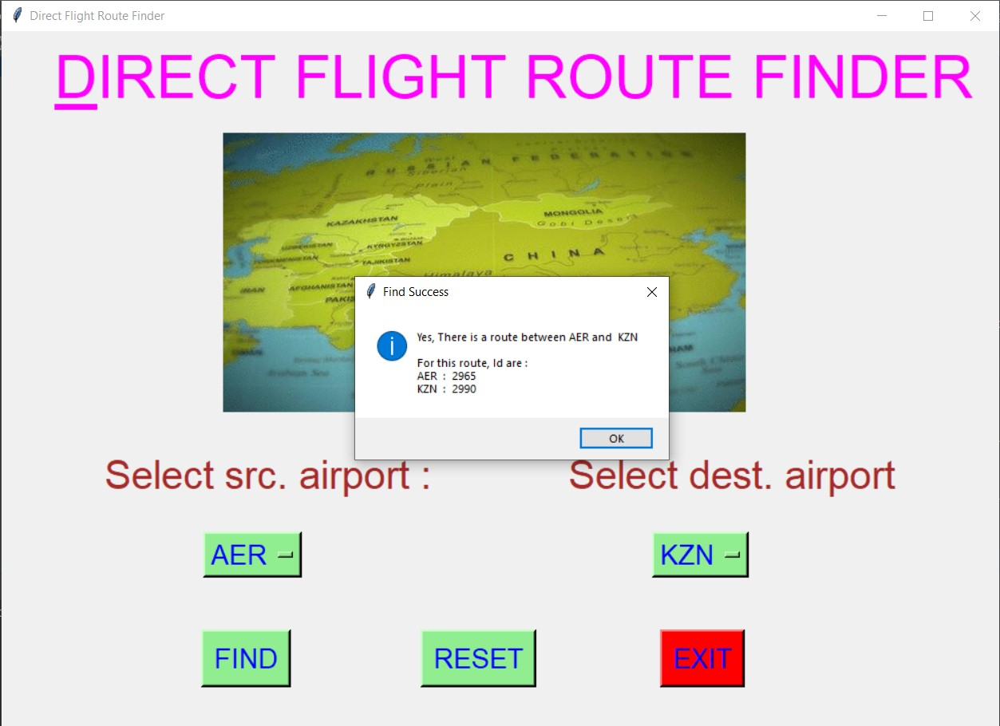
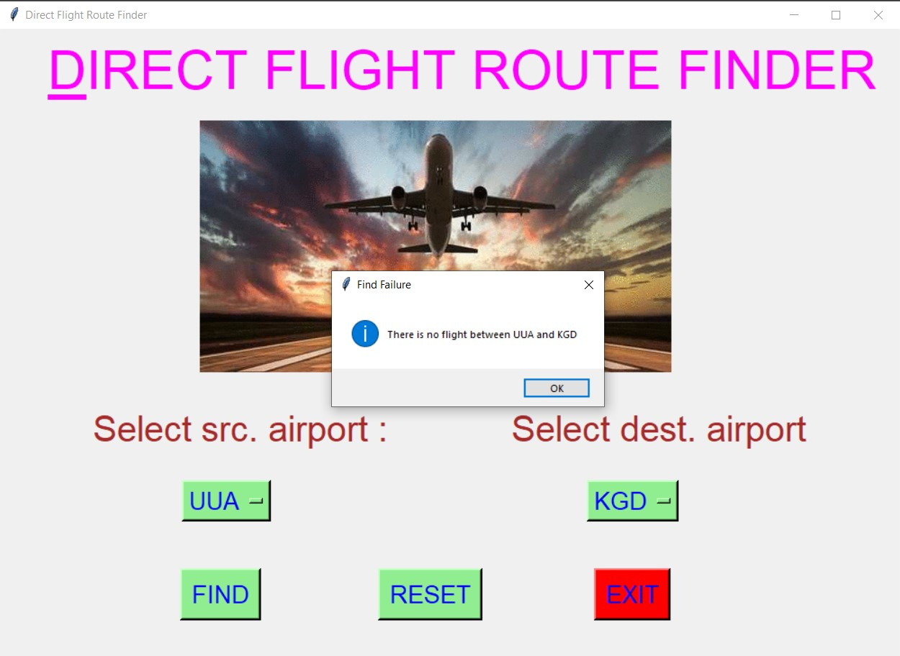
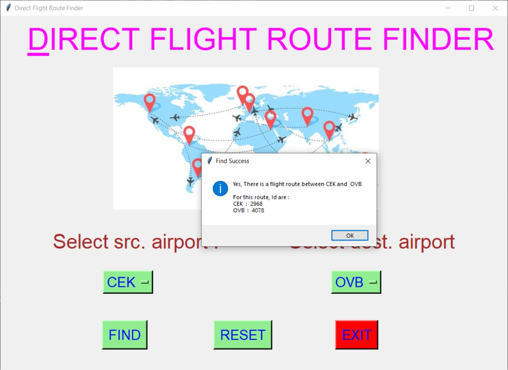
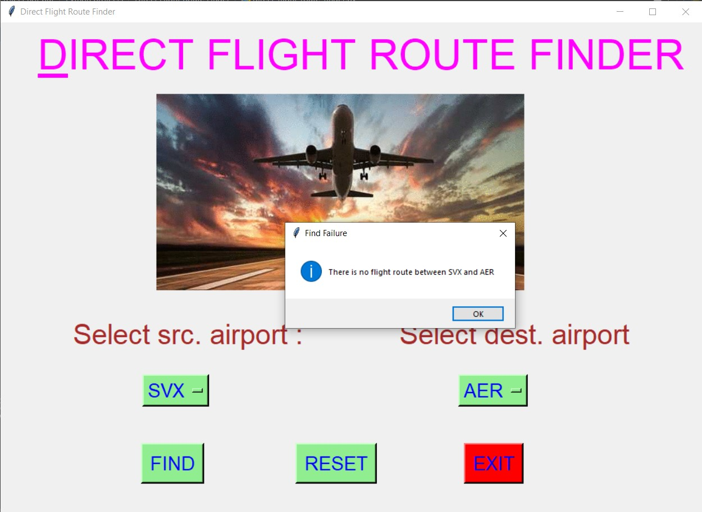
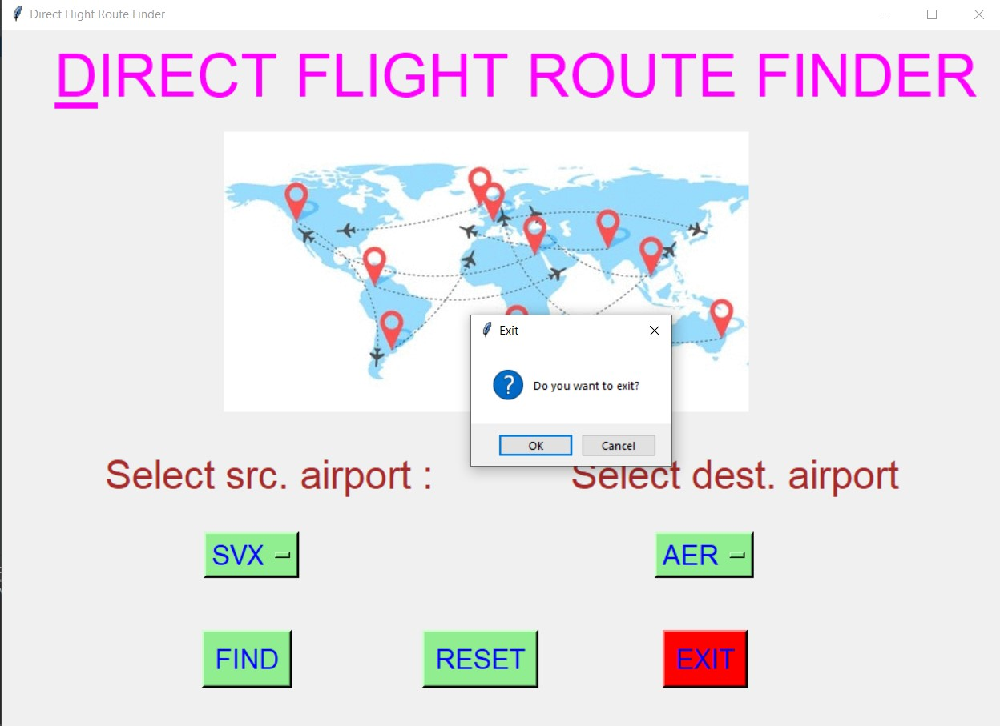

# ✔ DIRECT FLIGHT ROUTE FINDER
- ### A "Direct Flight Route Finder" is an application created in python with tkinter gui.
- ### In this application user can enter any source airport and the destination and can get if check is a direct route between them.
- ### If there exist a route between selected source and destination airport, it also tells us about what is the id for both source and destination airport.

****

# REQUIREMENTS :
- ### python 3
- ### tkinter module
- ### from tkinter messagebox module
- ### PIL module
- ### pandas

****

# How this Script works :
- ### User just need to download the file and run the direct_flight_route_finder.py on their local system.
- ### Now on the main window of the application the user need to select the source and the destination airport for which he/she want to find if route exist between them.
- ### After that, when user click on FIND button, he will get the messagebox showing whether route exist or not.
- ### If route exist, it also tells us the ID's for both airport.
- ### Also there is a reset button, clicking on which user can resets the Option Menu to default source and destination country.
- ### Also there is an exit button, clicking on which exit dialog box appears asking for the permission of the user for closing the window.

# Purrpose :
- ### This scripts helps us to easily get if there exist a direct route between any two countries.
- ### This may helps in scheduling the flight time and also planning for some tour. 

# Compilation Steps :
- ### Install tkinter, pandas
- ### After that download the code file, and run direct_flight_route_finder.py on local system.
- ### Then the script will start running and user can check if route exist by just selecting source and destination country.

****

# SCREENSHOTS :

****

   
   
   
   
   
   

****

# Author :
- ### Akash Ramanand Rajak