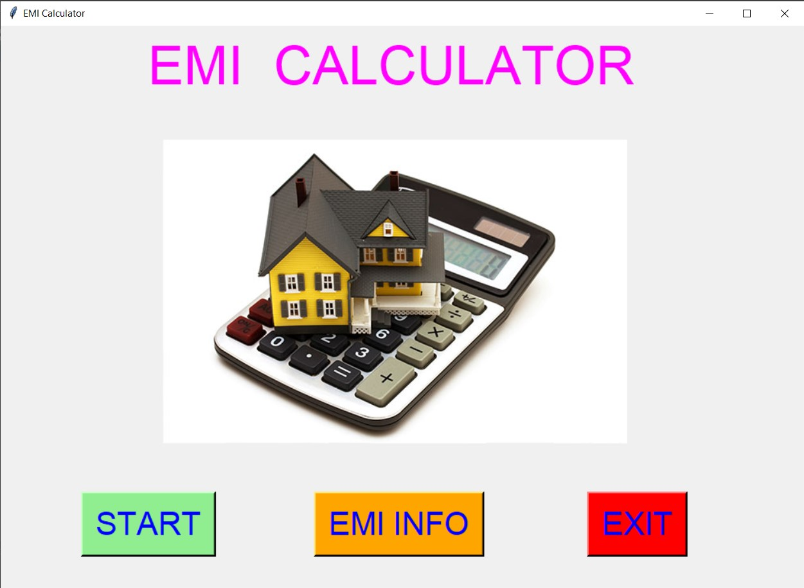
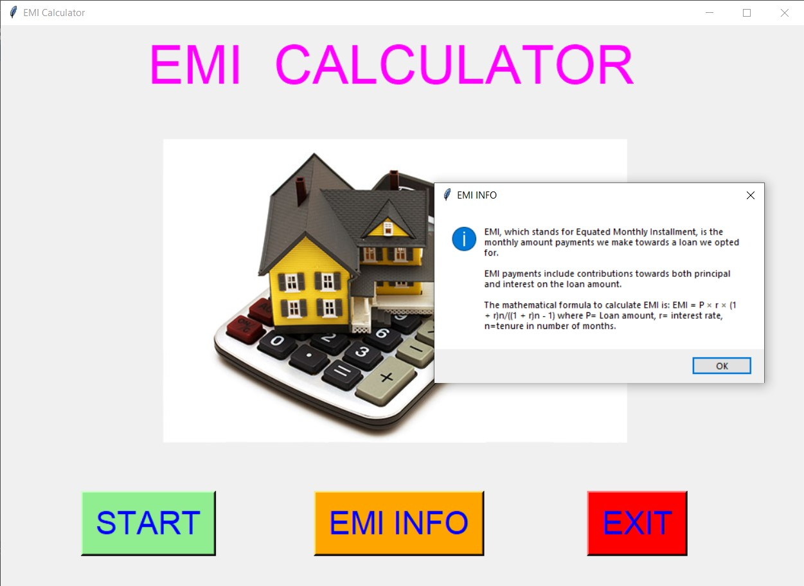
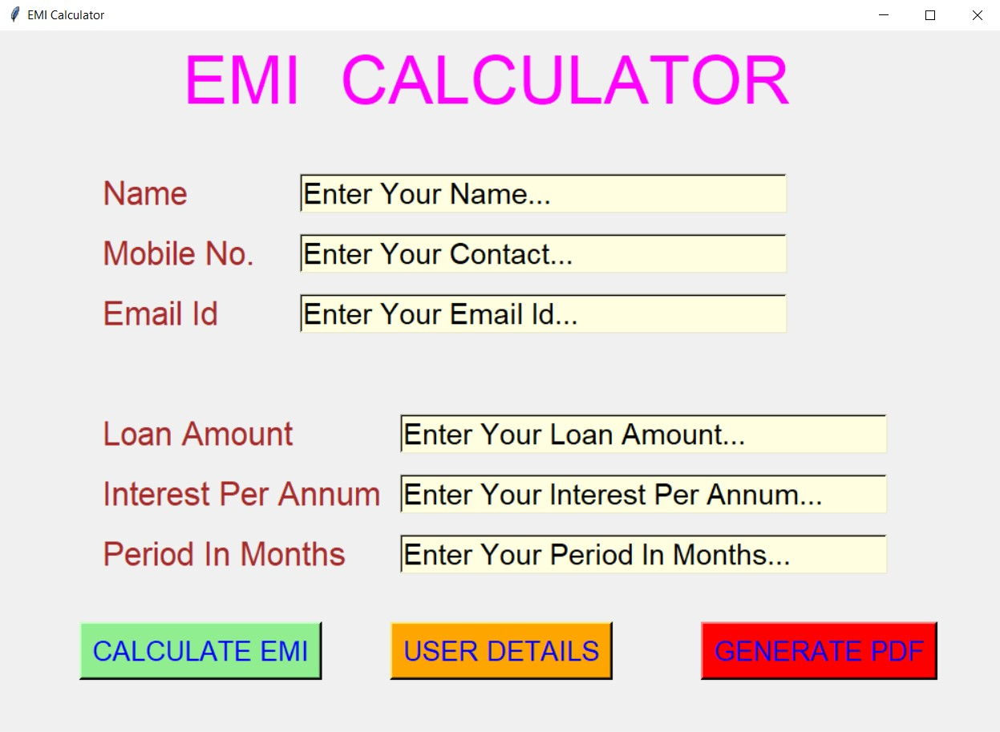
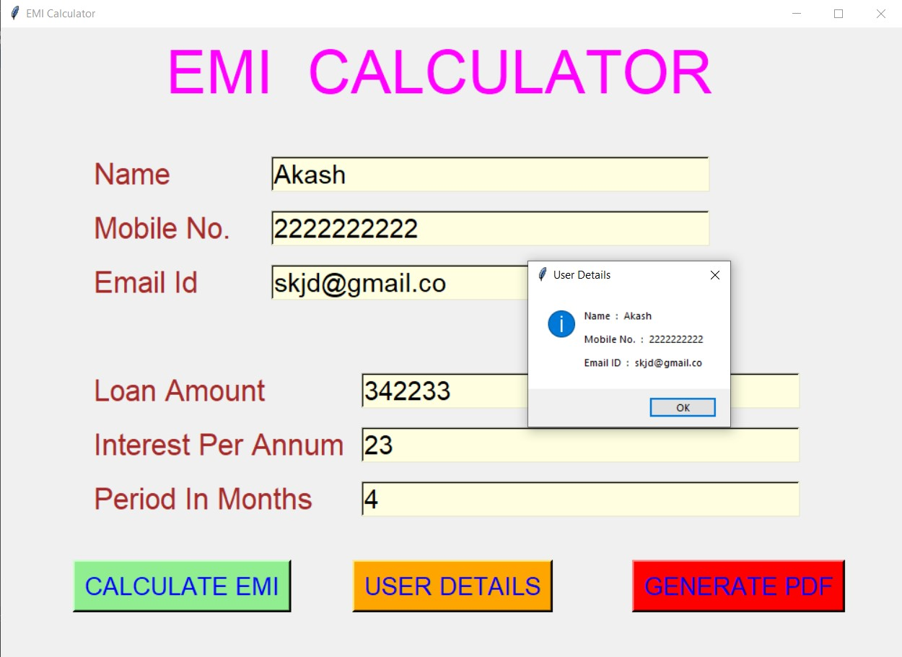
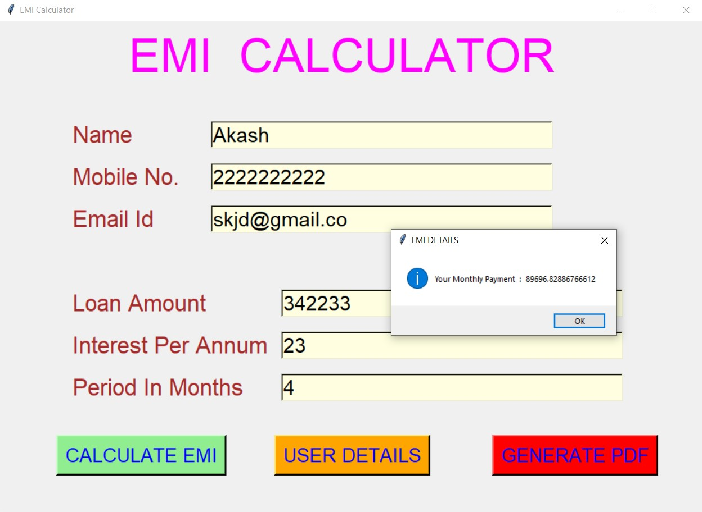
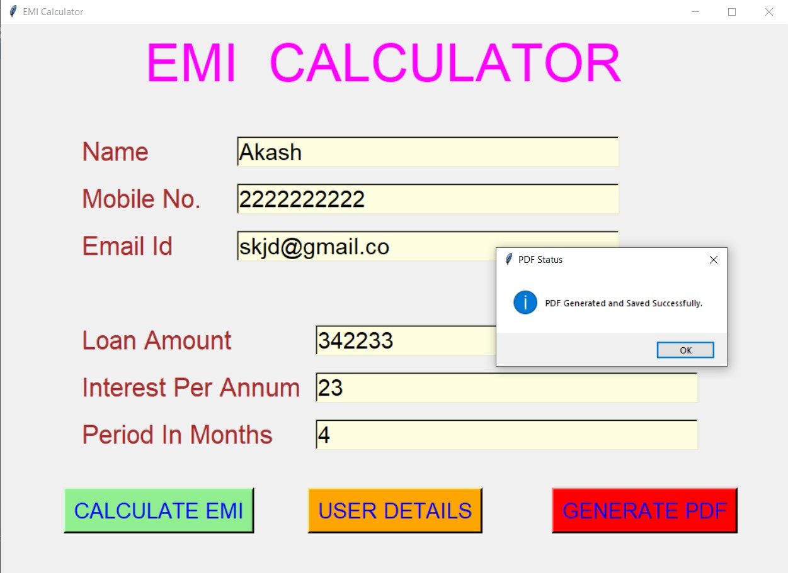
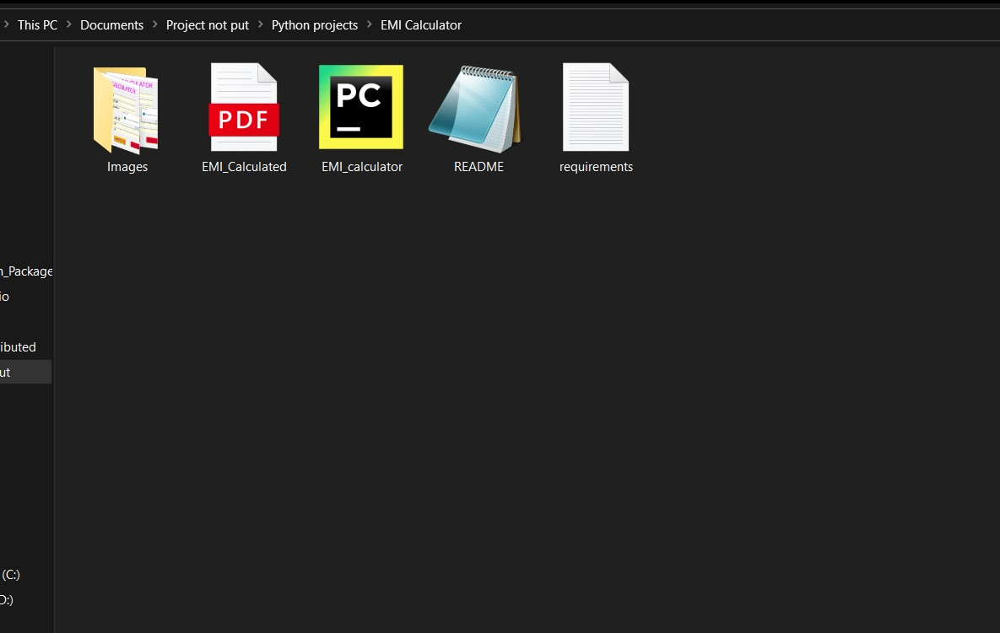
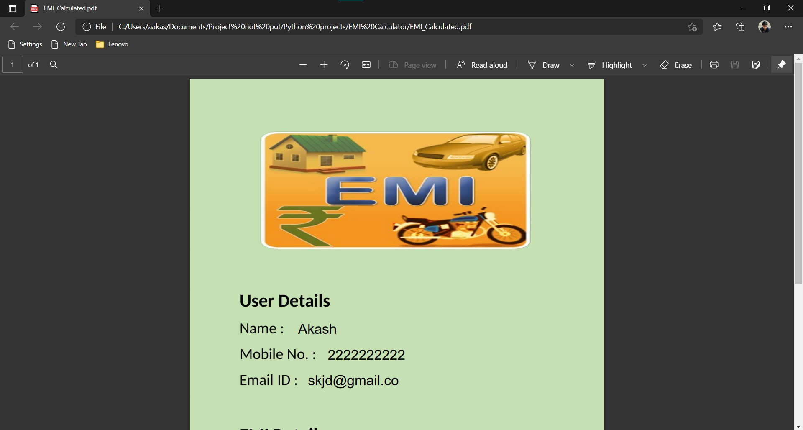
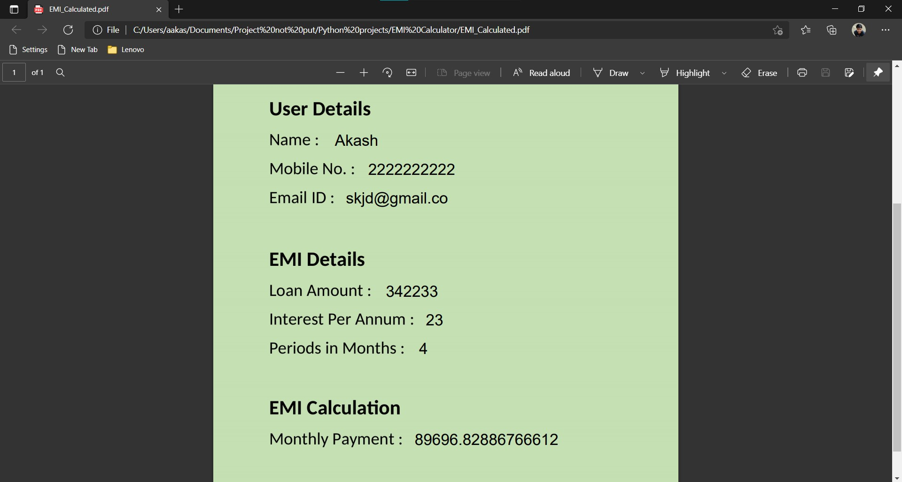
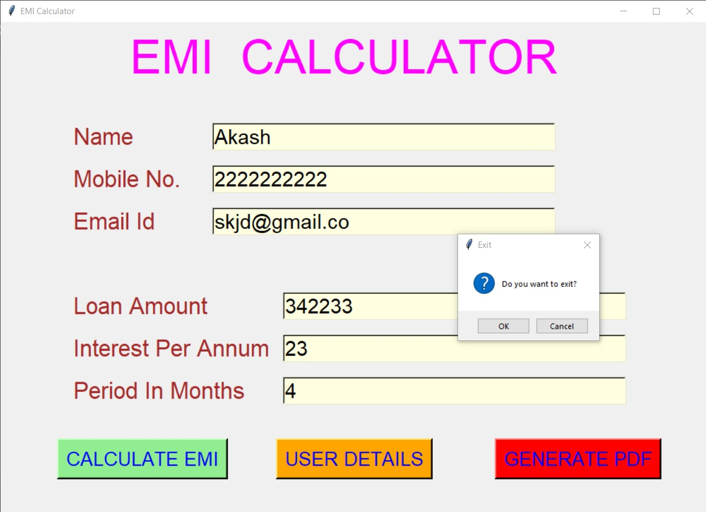

# ✔ EMI CALCULATOR
- #### A "EMI Calculator" is an EMI calculating application created in python with tkinter gui.
- #### In this application, user can calculate the EMI or his/her monthly payments by entering the details like Loan Amount, Interest Per Annum, Period In Months.
- #### Also application will ask user to enter his/her user basic details.
- #### By entering this details, user can calculate the EMI and can also generate the PDF containing user details and EMI details.

****

# REQUIREMENTS :
- ### python 3
- ### tkinter module
- ### from tkinter messagebox module
- ### from PIL import Image, ImageTk
- ### from fpdf import FPDF

****

# How this Script works :
- #### User just need to download the file and run the EMI_calculator.py on their local system.
- #### Now on the main window of appliation, there will be buttons like START and EMI INFO.
- #### When user clicks on the EMI INFO button, user will be able to see info about what is EMI and how it is calculated.
- #### And when user clicks on the START button, the main application of EMI calculation starts, where first user needs to enter his/her Name, Mobile No., and Email ID.
- #### Also user needs to enter details like Loan Amount, Interest Per Annum, Period In Months in the entry box.
- #### After entering this details user can click on CALCULATE EMI button to calculate the EMI, On clicking a message boc will pop up showing his EMI.
- #### Also user can click on the USER DETAILS button to see the details like Name, Mobile No., and Email ID.
- #### Also when user clicks on the GENERATE PDF button, a pop up message will open which shows "PDF Generated and Saved Successfully".
- #### The automatically generated PDF will be saved in the same location where the .py is saved
- #### Also there is an exit button, clicking on which exit dialog box appears asking for the permission of the user for closing the window.

# Purpose :
- #### This scripts helps us to easily calculate the EMI using details like Loan Amount, Interest Per Annum, Period In Months

# Compilation Steps :
- #### Install tkinter, PIL, fpdf
- #### After that download the code file, and run EMI_calculator.py on local system.
- #### Then the script will start running and user can explore it by calculating EMI and generating the PDF.

****

# SCREENSHOTS :

****

   
   
   
   
   
   
   
   
   
   

****

# Name :
- #### Akash Ramanand Rajak

