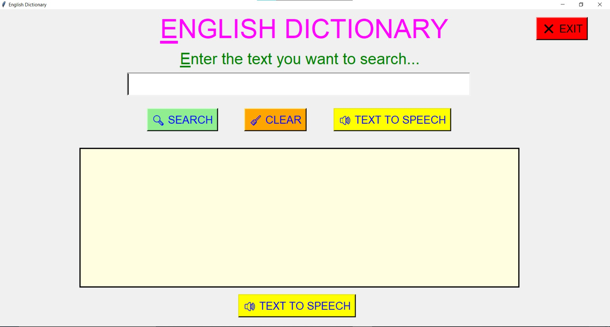
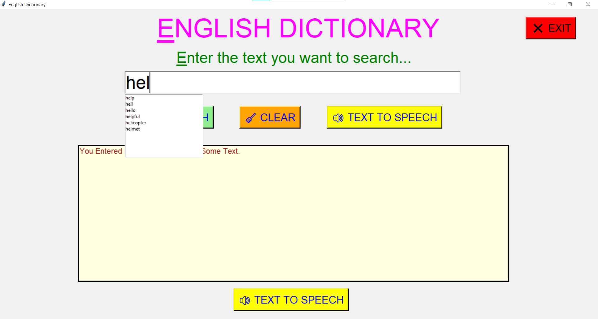
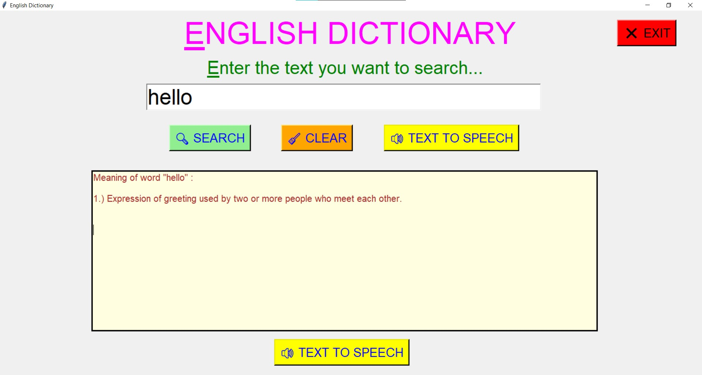
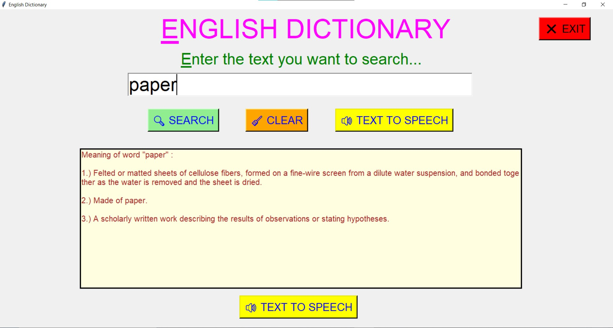
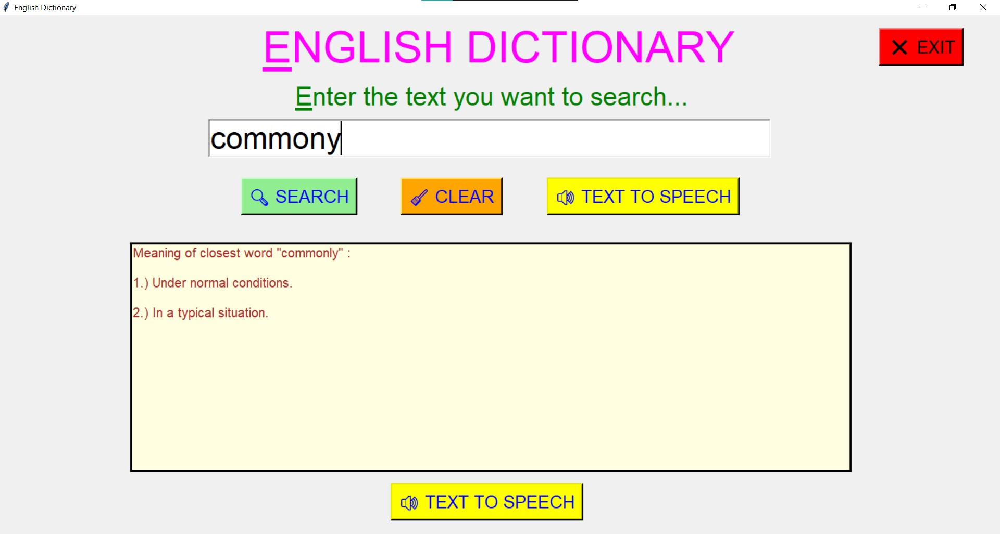
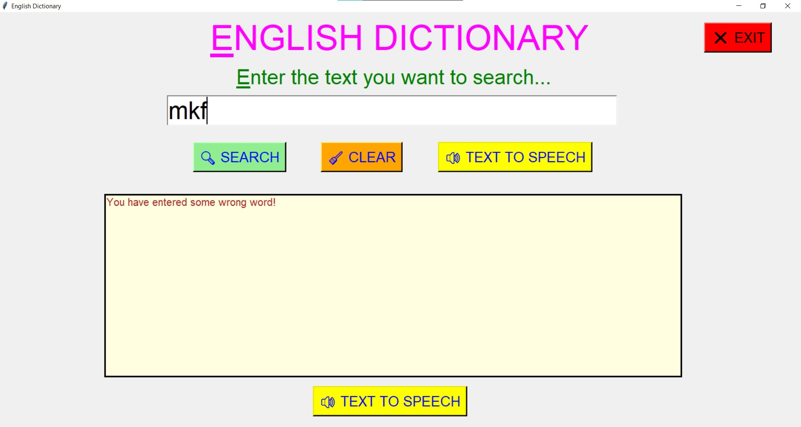
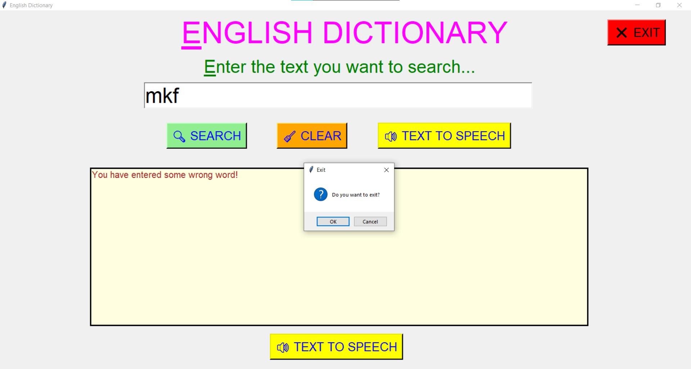

# ✔ ENGLISH DICTIONARY
- #### A "English Dictionary" created in python with tkinter gui.
- #### Used data.json file and used those data importing json library.
- #### Also modified the code for the case of interface (word having multiple meaning), if word is title or noun,  and also developed the closest word matching technique in case of any typo.
- #### Also implemented the autocomplete feature while entering search word.
- #### Also added text to speech feature in both input enter and output text.
- #### Added speech input in search bar.

****

# REQUIREMENTS :
- #### python 3
- #### tkinter module
- #### from tkinter messagebox module
- #### json
- #### difflib.get_close_matches
- #### pandas
- #### io 
- #### pyttsx3 
- #### speech_recognition as sr
- #### pyaudio

# Changes Done :

1. Changed the gui of the dictionary window.
2. Added clear and exit button also.
3. Added data (words.csv) - that contains the list of english words.
4. Using this words.csv data, implemented the auto complete feature, i.e. as we enter any letter in the entry section, we get suggestion of words in dropdown list whose prefix matches with our entered word. 
5. Also while exiting the dictionary, we get a exit dialog box asking us the permission.
6. Added text to speech feature for both input and output area.
7. Added a speech input in search bar, so that user can also search word by speaking text or word.

# Purpose :
- #### This scripts helps us to easily get the meaning of any word be entering text in search area and searching it. Also can get the speech of text and meaning of it. Also can search word by speaking word.

# Compilation Steps :
- #### Install tkinter, json, difflib, pandas, io, pyttsx3, speech_recognition , pyaudio
- #### After that download the code file, and run english_dictionary.py on local system.
- #### Then the script will start running and user can explore it by entering any text and searching it.

# SCREENSHOTS :

****

   
   
   
   
   
   
   
   

****

# Name :
- ### Akash Ramanand Rajak

