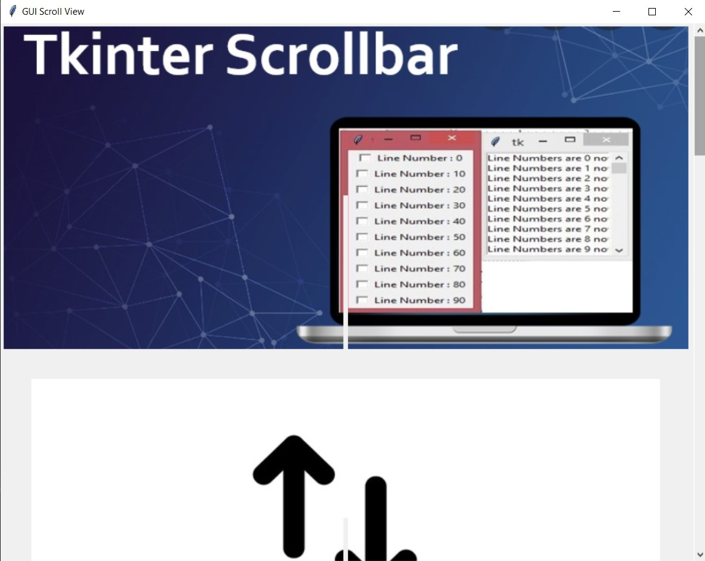
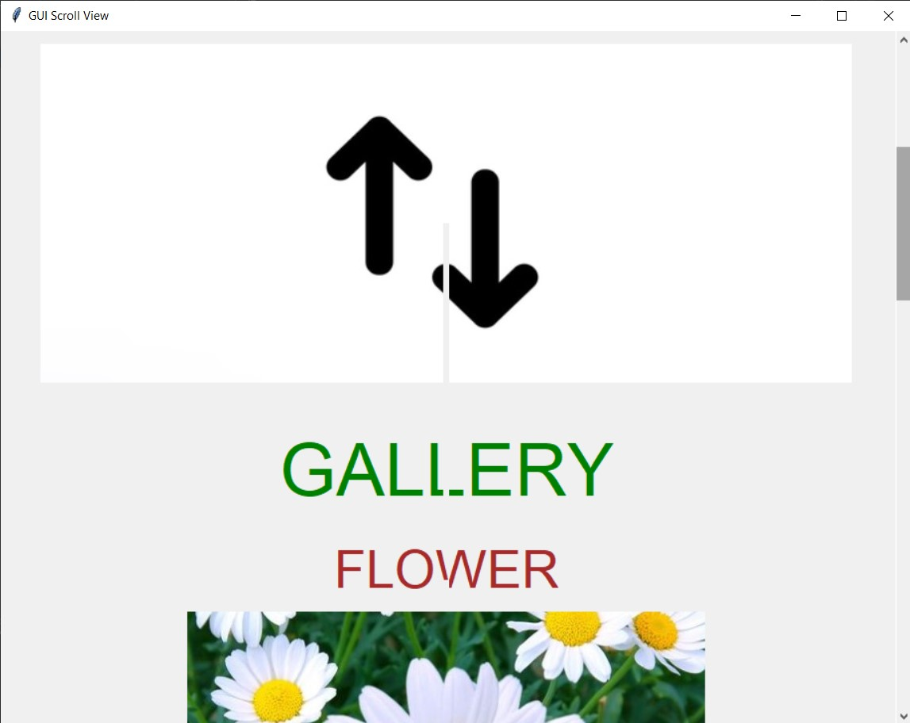
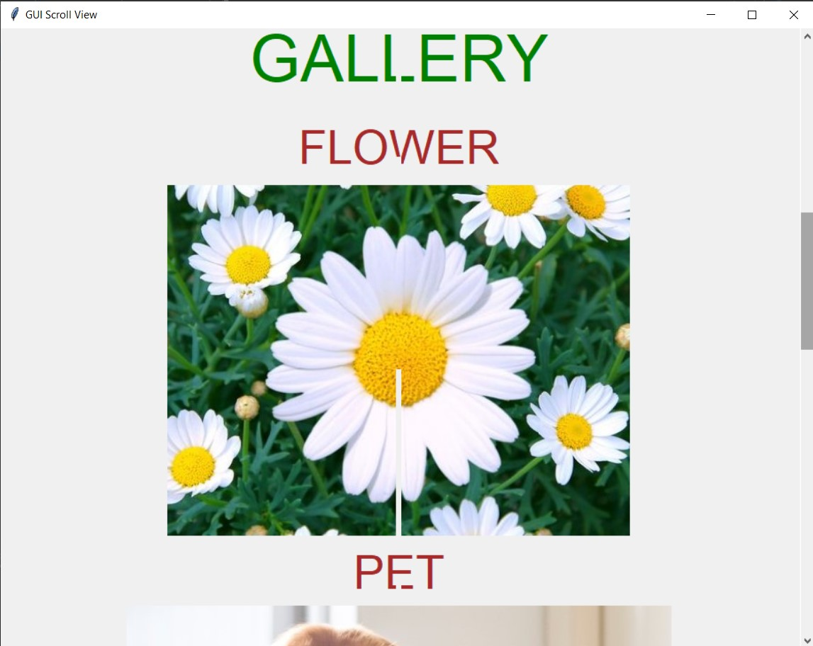
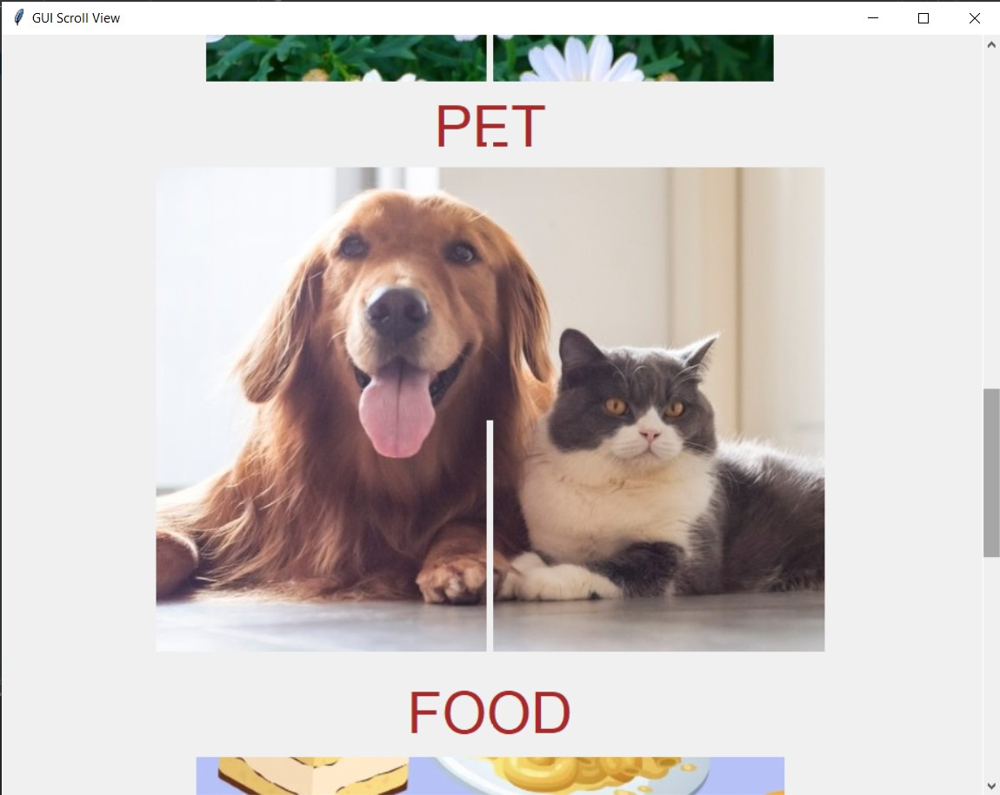
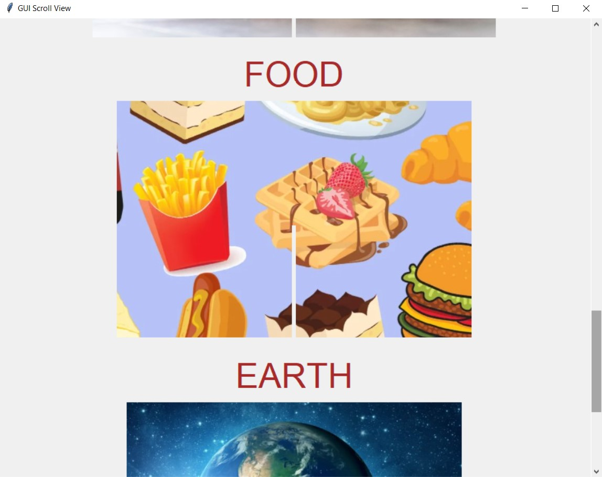
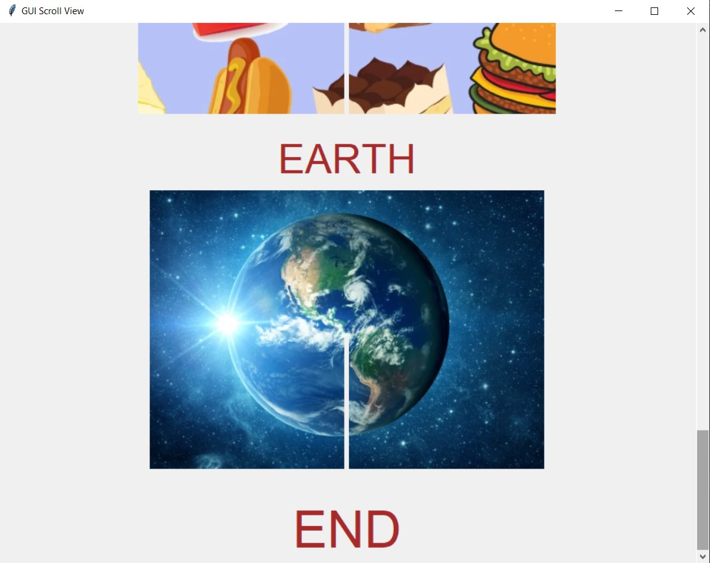

# ✔ GUI Scroll View
- ### An GUI Scroll View created in python with tkinter gui.
- ### Here implemented the scroll bar in the tkinter GUI window.
- ### Normally in tkinter GUI, user had to do everything in the GUI window size only.
- ### So using this user can place multiple widgets like, text, image or button in single video using scroll bar.

****

# REQUIREMENTS :
- ### python 3
- ### tkinter module
- ### from PIL import Image, ImageTk

****

# HOW TO Use it :
- ### User just need to download the file, and run the gui_scroll_view.py, on local system.
- ### After running a GUI window appears, where user will be able to see a vertical scroll bar on the right side of tkinter video.
- ### Using that scroll bar, user can navidate up and down in the GUI window and also be able to add more widgets in single window only.
- ### Also there is exit button, clicking on which we get a exit dialog box asking the permission to exit.

# Purpose :
- ### This scripts helps user to easily get place many widgets in single GUI window of tkinter and can navigate between them using scrol bar.

# Compilation Steps :
- ### Install tkinter, PIL
- ### After that download the code file, and run gui_scroll_view.py on local system.
- ### Then the script will start running and user can explore it by scrolling using the right scroll bar and navigating between different widgets.

****

# SCREENSHOTS :

****

   
   
   
   
   
   

****

# Author : 
- ### Akash Ramanand Rajak
