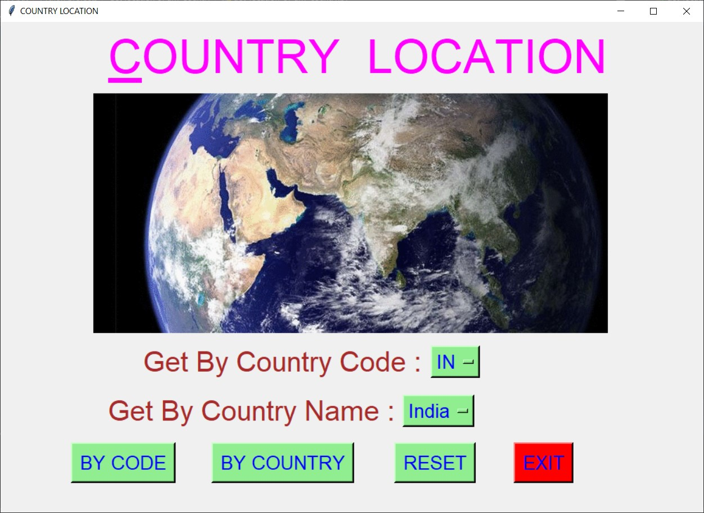
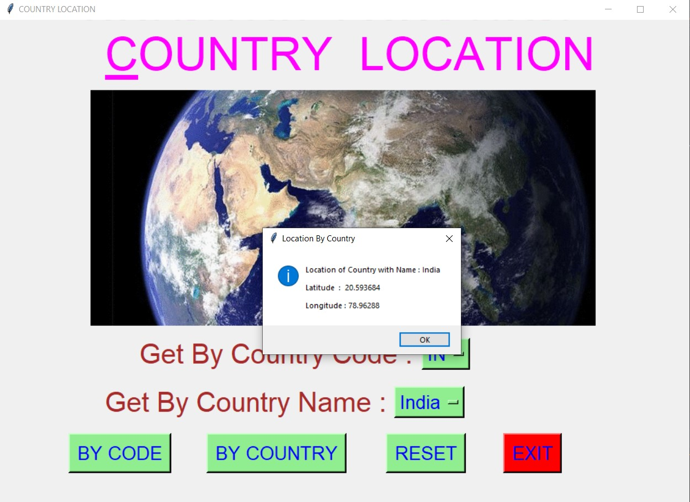
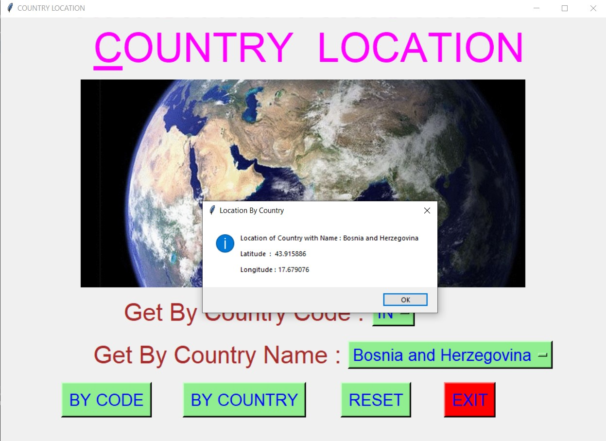
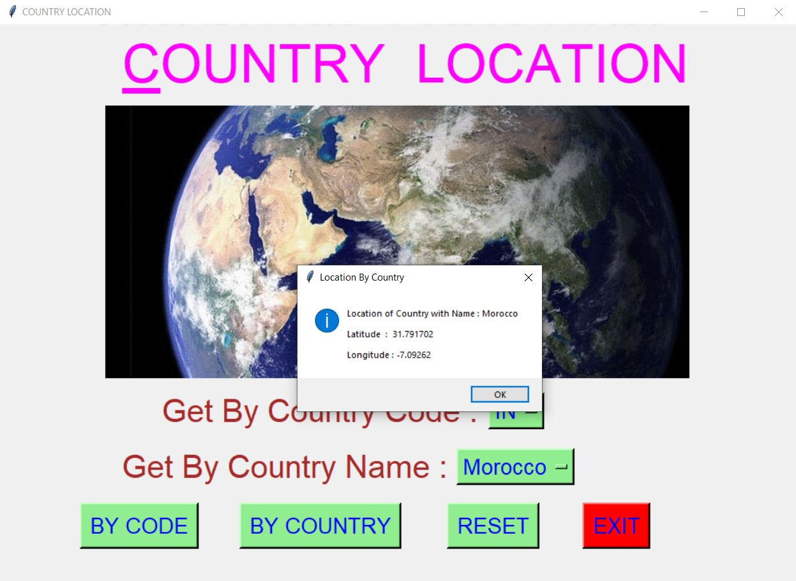
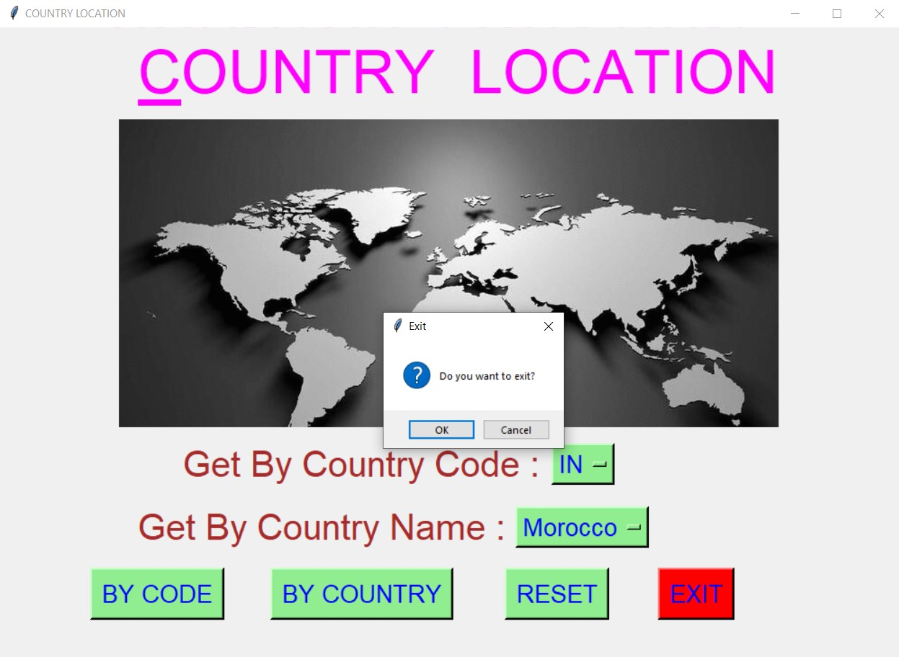

# ✔ GET LOCATION OF ANY COUNTRY
- ### A "Get location of any country" is an application created in python with tkinter gui.
- ### In this application, user can find the location of any country, either by using country name or country code.
- ### The location will be shown in terms of Latitude and Longitude.
- ### for the data, used the world_location.csv data, and read using pandas library.

****

# REQUIREMENTS :
- ### python 3
- ### tkinter module
- ### from tkinter messagebox module
- ### pandas

****

# How this Script works :
- ### User just need to download the file and run the get_location_by_any_country.py on their local system.
- ### Now on the main window of the application the user needs to select either the country code or the country name from the drop down OptionMenu.
- ### After user has chosen the country code, when user clicks on the BY CODE button, he/she will be able to see the location in the message box in terms of Latitude and Longitude.
- ### Abd after user has chosen the country name, when user clicks on the BY COUNTRY button, he/she will be able to see the location in the message box.
- ### Also there is a reset button, clicking on which user can resets both the Option Menu to default character ot integer.
- ### Also there is an exit button, clicking on which exit dialog box appears asking for the permission of the user for closing the window.

****

# SCREENSHOTS :

****

   
   
   
   
   
   
   

****

# Below is the video links of how appliation works :
https://user-images.githubusercontent.com/57003737/122977771-6a3e3300-d3b3-11eb-913d-b33939bb166f.mp4
