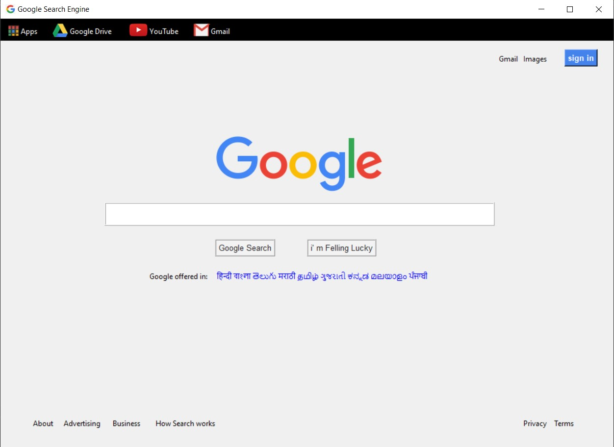
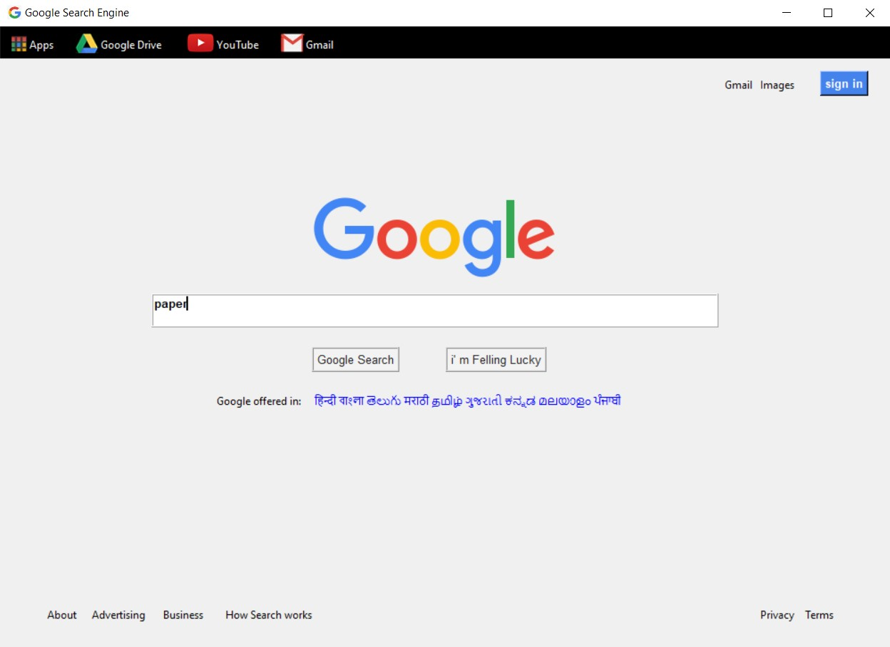
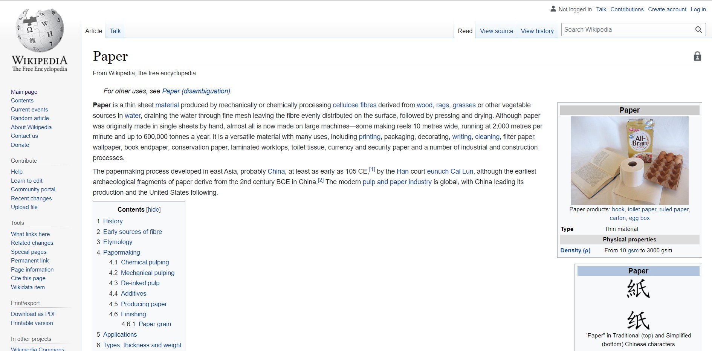
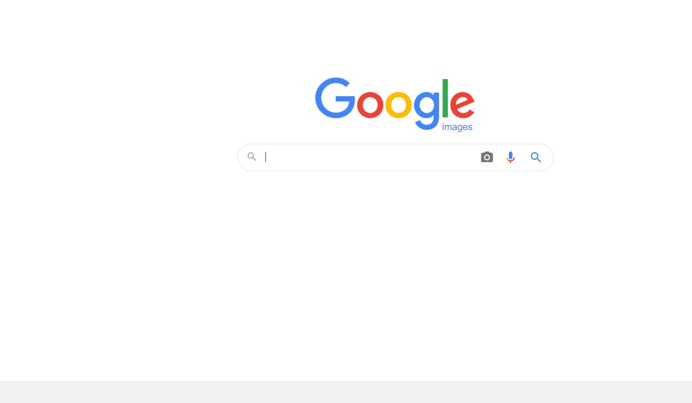
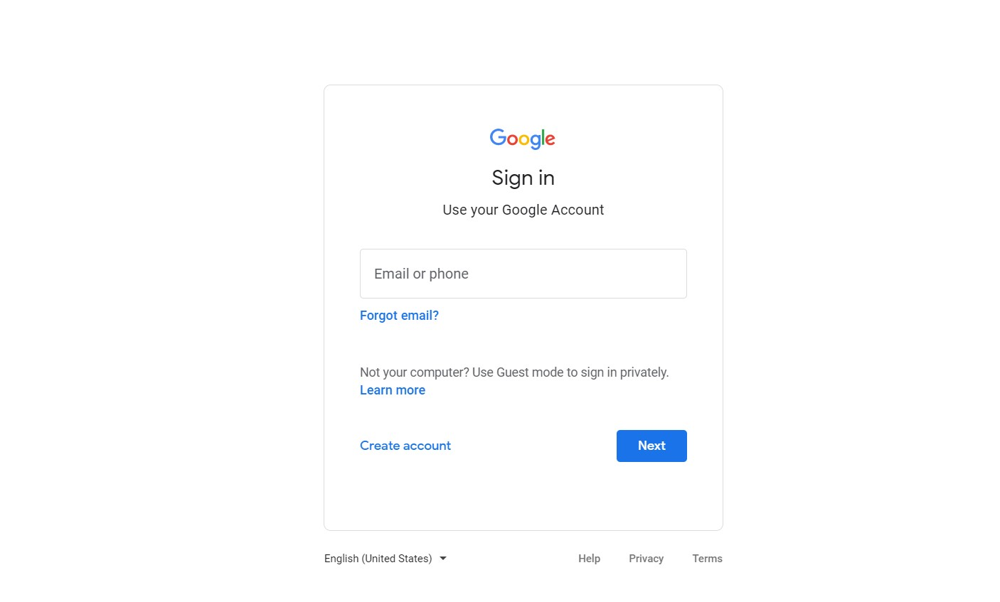

# ✔ GOOGLE SEARCH ENGINE
- ### A "Google Search Engine" is an application created in python with tkinter gui.
- ### It's GUI is same as the GUI of google new tab gui.
- ### In this application, there is an option for Google Apps, Google Drive, Youtube, Gmail, Images in Google tab, Signin option of Google.
- ### Also a Google Search is implemented using googlesearch library of python.
- ### Also there is option for seeing the About, advertising, business and how search works section in it.
- ### Also there will be option for seeing the terms and privacy section of the google.

****

# REQUIREMENTS :
- ### python 3
- ### tkinter module
- ### webbrowser
- ### PIL
- ### googlesearch

****

# How this Script works :
- ### User just need to download the file and run the google_search_engine.py on their local system.
- ### Now on the main window of the application, a gui same as how google website is looking will appear.
- ### From the application we can navigate to Google Apps, Google Drive, Youtube, Gmail, Images in Google tab, Signin option of Google.
- ### Also we can search anything in the search bar using google search.
- ### Also there is option for seeing the About, advertising, business and how search works section in it.
- ### Also there will be option for seeing the terms and privacy section of the google.

# Purpose :
- ### This scripts helps user to use the google type search application in tkinter GUI.

# Compilation Steps :
- ### Install tkinter, PIL, webbrowser, googlesearch
- ### After that download the code file, and google_search_engine.py on local system.
- ### Then the script will start running and user can explore each and every option given in GUI.

****

# SCREENSHOTS :

****

   
   
   
   
   
   
   

****

# Below is sample video showing how the application works :

   

****

# Name :
- ### Akash Ramanand Rajak

