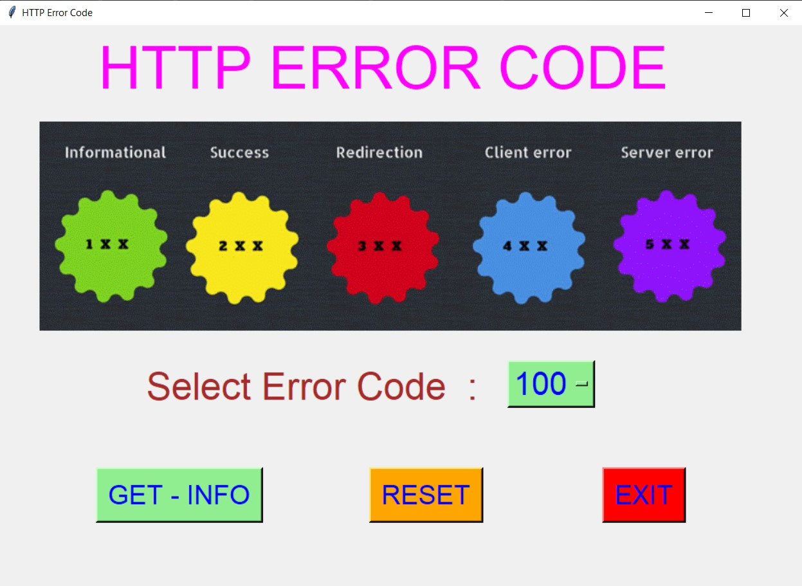
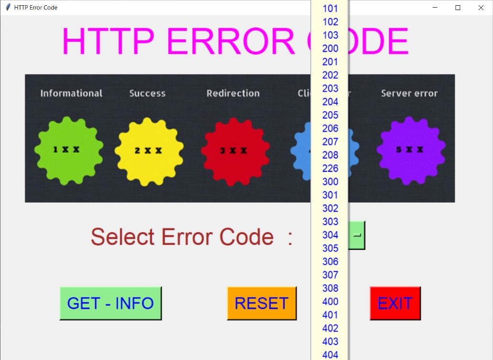
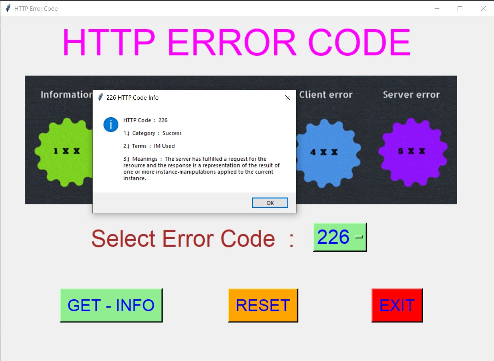
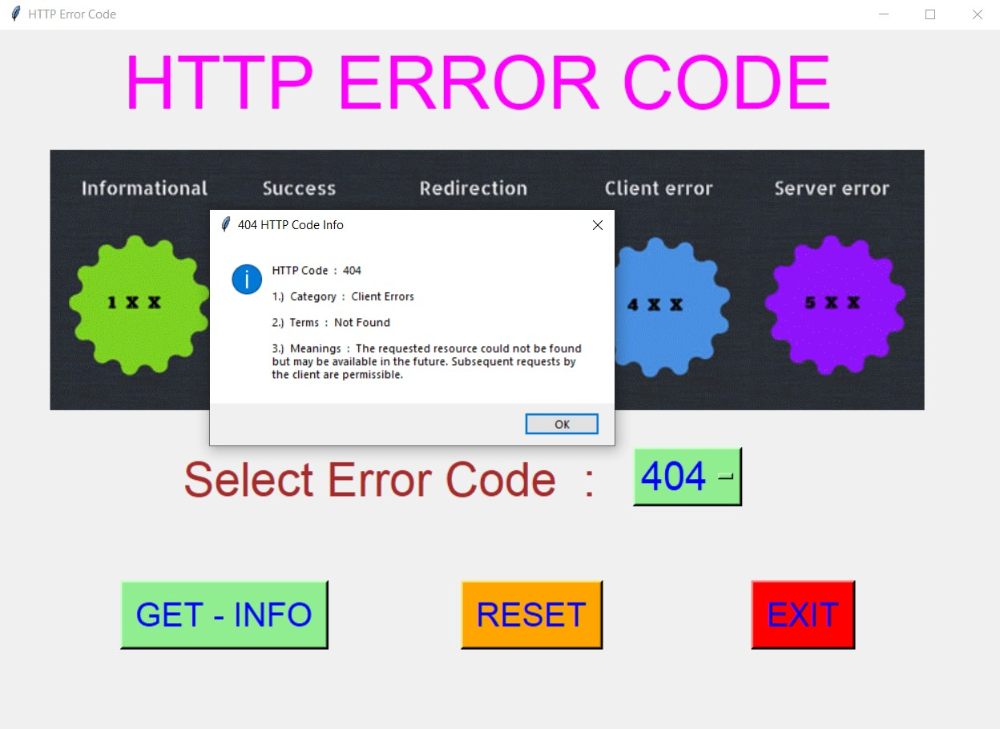
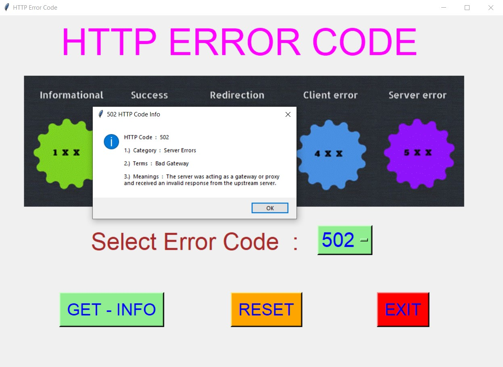

# ✔ HTTP ERROR CODE
- #### A "HTTP Error Code" is an application created in python with tkinter gui.
- #### In this application, user can get the info about HTTP code.
- #### The details will be in Code, Category, Terms and meanings.
- #### for the data, used the code_data.json data, and loaded using json library.

****

# REQUIREMENTS :
- #### python 3
- #### tkinter module
- #### from tkinter messagebox module
- #### jspon

****

# How this Script works :
- #### User just need to download the file and run the http_error_code.py on their local system.
- #### Now on the main window of the application the user can start the main application using START button.
- #### On the main application user need to select the HTTP code from the drop down list.
- #### After selecting code when
- #### Also there is a RESET button, clicking on which user can resets both the Option Menu to default code "100".
- #### Also there is an EXIT button, clicking on which exit dialog box appears asking for the permission of the user for closing the window.

# Purpose :
- #### This scripts helps user to easily get the informatin about any HTTP code.

# Compilation Steps :
- #### Install tkinter, json
- #### After that download the code file, and run http_error_code.py on local system.
- #### Then the script will start running and user can explore it by selecting HTTP Code and getting details about that selected code.

****

# SCREENSHOTS :

****

   
   
   
   
   
   
   
   

****

# Author :
- ### Akash Ramanand Rajak
