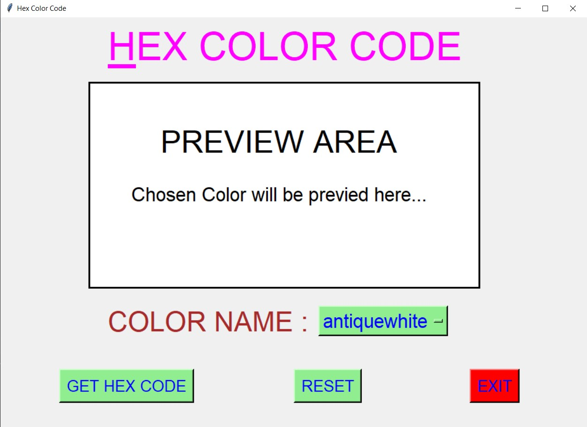
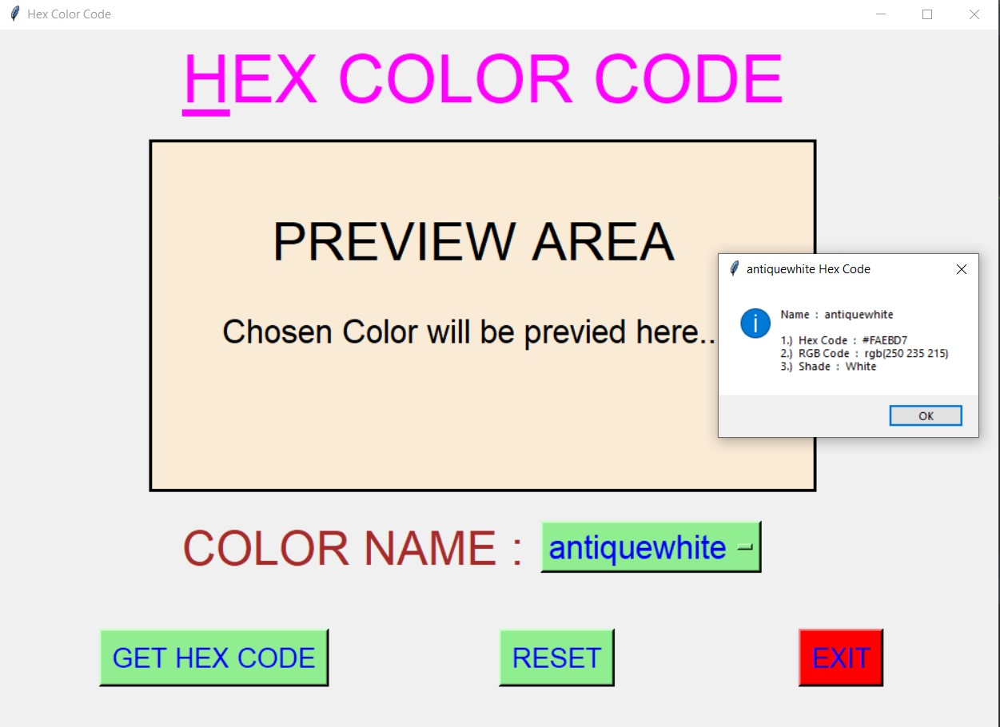
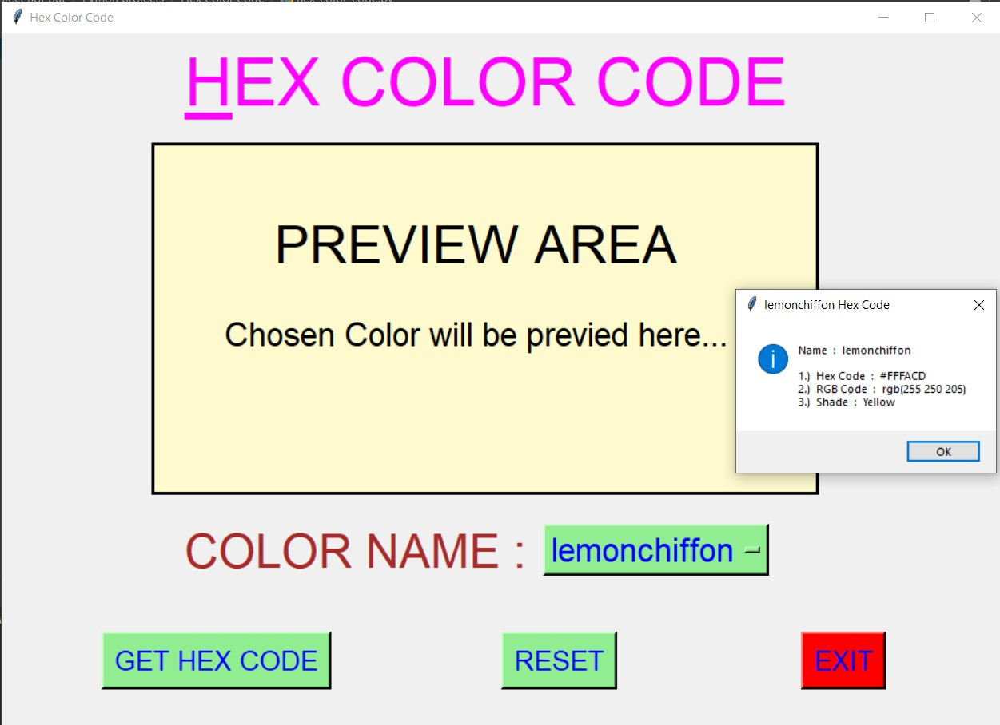
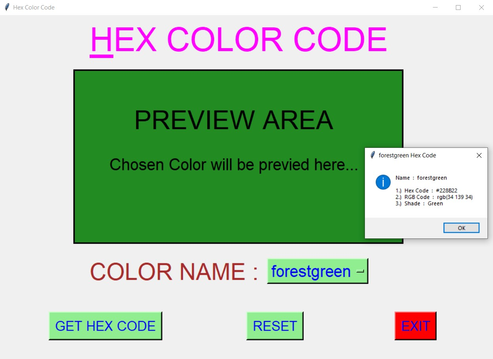
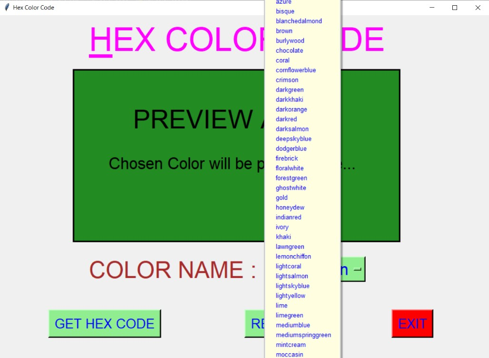
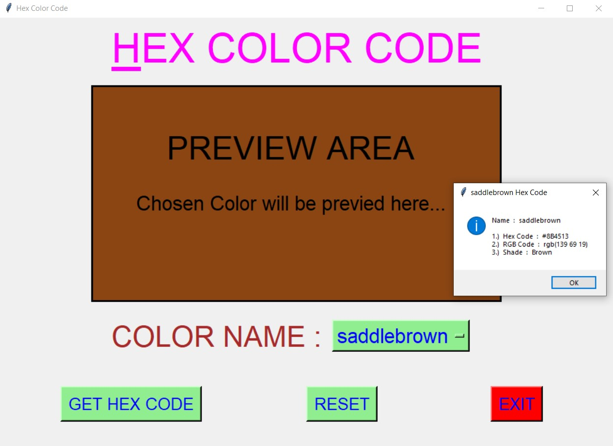
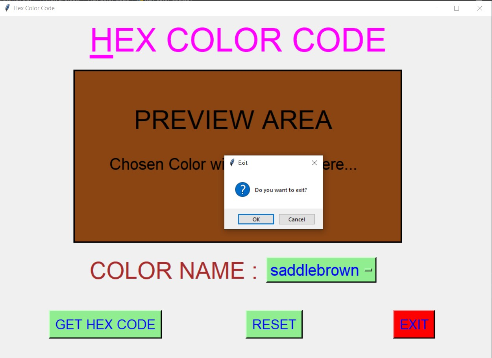

# ✔ HEX COLOR CODE
- #### A "Hex Color Code" is an application created in python with tkinter gui.
- #### In this application, user can get the html hex code and rgb code, along with the shade to which a color belongs to.
- #### Also along with those details, user will also be previewed the chosen color in the preview area, how the color looks like.
- #### for the data, used the hex_data.csv data, and read using pandas library.

****

# REQUIREMENTS :
- #### python 3
- #### tkinter module
- #### from tkinter messagebox module
- #### pandas

****

# How this Script works :
- #### User just need to download the file and run the hex_color_code.py on their local system.
- #### Now on the main window of the application the user needs to select the name of Color Name from the drop down OptionMenu.
- #### After user has chosen the name of Color, when user clicks on the BY "GET HEX CODE" button, he/she will be able to see the html hex code and rgb code of that color and the shade to which that color belongs to.
- #### Along with the above details, user will also be able to see the preview of the color, like how its look like in the preview area.
- #### Also there is a RESET button, clicking on which user can resets both the Option Menu to default color name "antiquewhite".
- #### Also there is an EXIT button, clicking on which exit dialog box appears asking for the permission of the user for closing the window.

# Purpose :
- #### This scripts helps user to easily get the hex code, rgb code, shade and the preview of the color.

# Compilation Steps :
- #### Install tkinter, pandas
- #### After that download the code file, and run hex_color_code.py on local system.
- #### Then the script will start running and user can get the hex code, rgb code, shade and the preview of the color, by just selecting the color name.

****

# SCREENSHOTS :

****

   
   
   
   
   
   
   

****

# Author :
- ### Akash Ramanand Rajak
