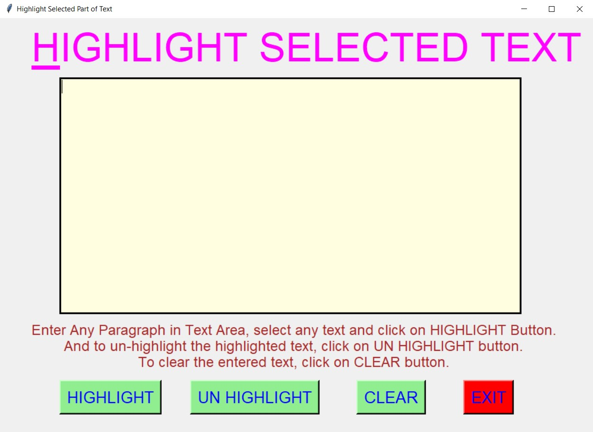
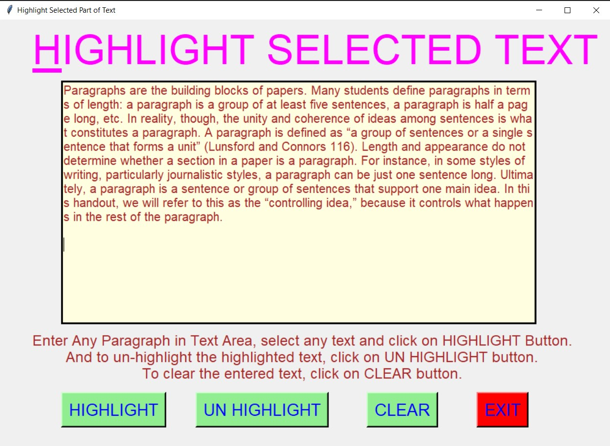
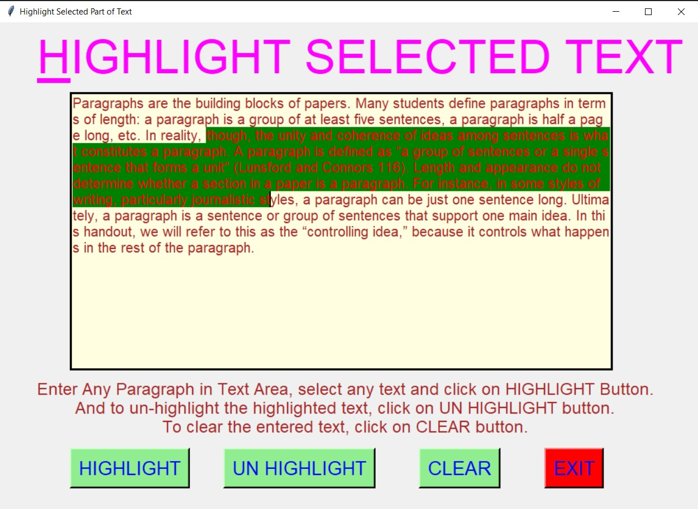
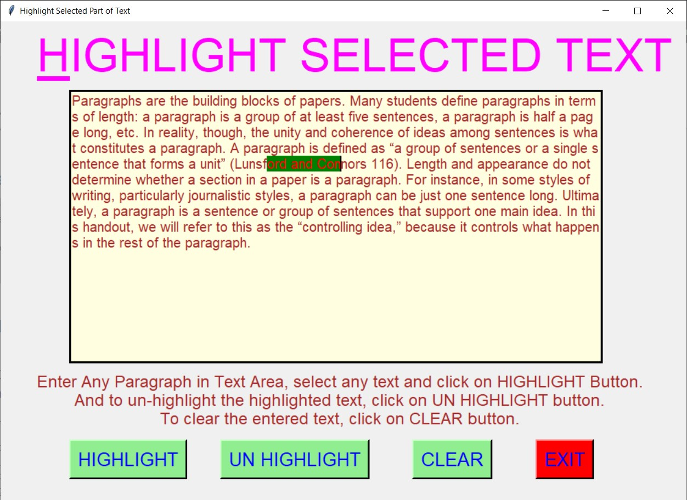
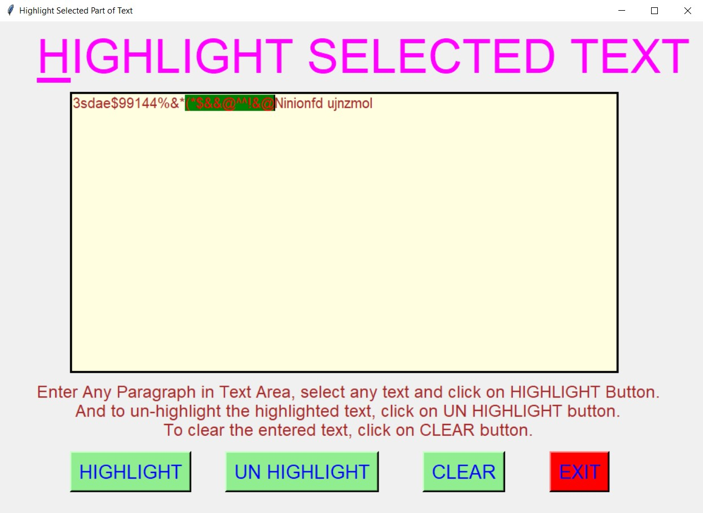

# ✔ HIGHLIGHT SELECTED PART OF TEXT
- ### A "Highlight Selected Part of Text" is an application created in python with tkinter gui.
- ### In this application user first need to enter some paragraph in the text area given.
- ### Then user can select any part of text and click on highlight button to highlight them.
- ### And to un highlight the highlighted text, this can also be done using un highlight button.

****

# REQUIREMENTS :
- ### python 3
- ### tkinter module
- ### from tkinter messagebox module

****

# How this Script works :
- ### User just need to download the file and run the highlight_selected_part_of_text.py on their local system.
- ### Now on the main window of the application, the user is allowed to enter any text or paragraph in given text area.
- ### After entering the text or paragraph in text area provided, when user selects any part of it and clicks on the highlights button, then the selected part will get highlighted with both  different background and foreground colour.
- ### Also there is a clear button, clicking on which user can clears the input text area.
- ### Also there is an exit button, clicking on which exit dialog box appears asking for the permission of the user for closing the window.

# Purpose :
- ### This scripts helps us to easily highlight any part of text in the pargraph.
- ### This canbe very useful incase of making notes while going through text or highlighting main points.

# Compilation Steps :
- ### Install tkinter, pandas
- ### After that download the code file, and run highlight_selected_part_of_text.py on local system.
- ### Then the script will start running and user can highlight and unhighlight any part of paragraph through given buttons.

****

# SCREENSHOTS :

****

   
   
   
   
   

****
