# ✔ IP ADDRESS EXTRACTOR-VALIDATOR
- #### A "IP Address Extractor-Validator" is an application created in python with tkinter gui.
- #### In this application, user will be able to check extract all the IP Address present from any text or paragraph.
- #### Using this application user can also check whether an IP Address is valid or not, and if valid it also let us know of which type either IPv4 or IPv6.
- #### For implementing used re and sys library in Python.

****

# REQUIREMENTS :
- #### python 3
- #### tkinter module
- #### from tkinter messagebox module
- #### from PIL import Image, ImageTk
- #### re
- #### sys

****

# How this Script works :
- #### User just need to download the file and run the IP_address_extractor-validator.py on their local system.
- #### Now on the main window of the application the user will be able to see two buttons START and DETAILS. On clicking on DETAILS, it will show details aout IP Address. And on clickin on the START button, the main application will start.
- #### In the main application, first will have an option of either go for extracting IP adresses from text or go for checking the validity of IP address.
- #### When user go for extracting IP addresses, user can enter any text or paragraph and on cliking on the EXTRACT button, it will show all the valid IP address in the message box.
- #### And if user go for checking the validity, there user can enter any IP address and check for it's validity. And if valid, it also tells about that IP address is of what type either IPv4 or IPv6. 
- #### Also there is an exit button, clicking on which exit dialog box appears asking for the permission of the user for closing the window.

# Purpose :
- #### This scripts helps us to easily extract all IP addresses from text or paragraph and can also easily check for the validity of any IP address.

# Compilation Steps :
- #### Install tkinter, PIL, re, sys
- #### After that download the code file, and run IP_address_extractor-validator.py on local system.
- #### Then the script will start running and user can explore it by extracting the IP addresses and checking the validity of IP addresses.

****

# SCREENSHOTS :

****

  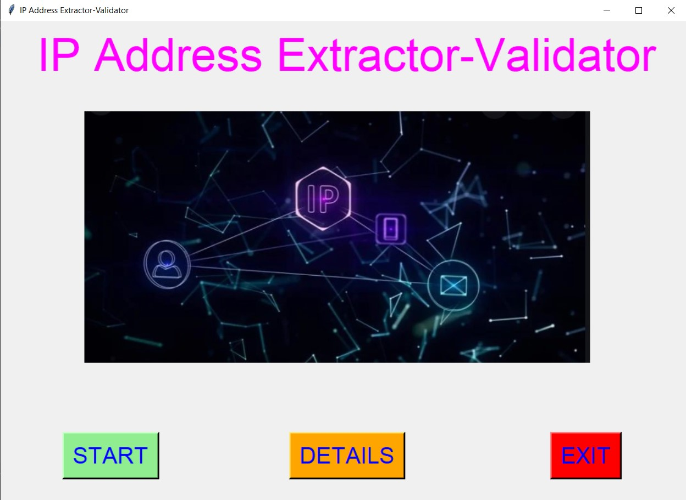 
  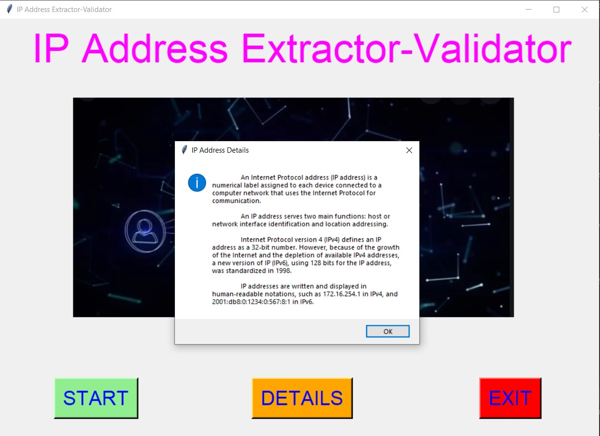 
  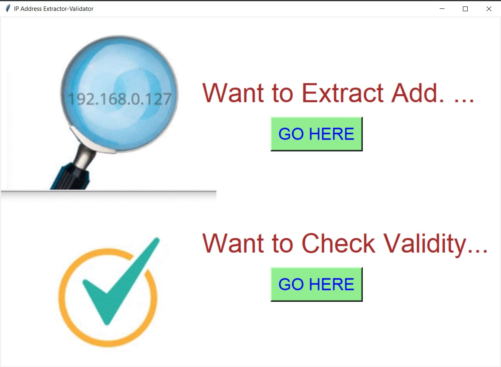 
  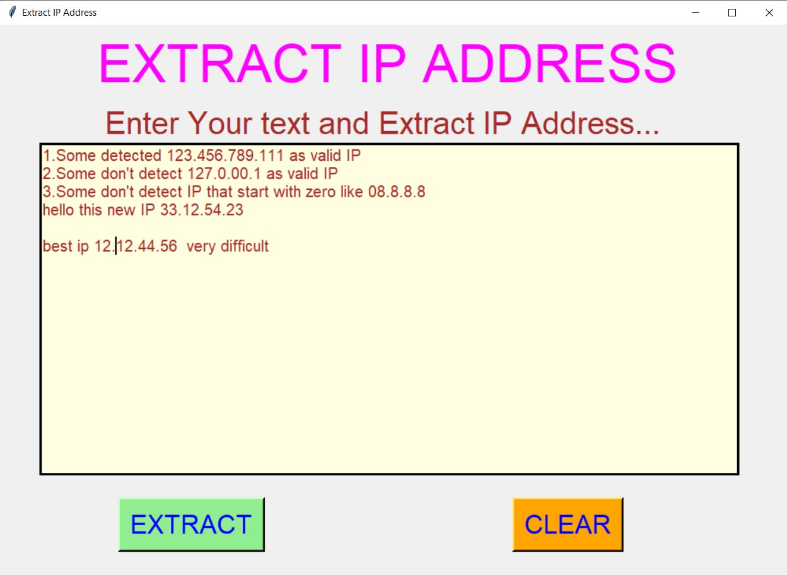 
  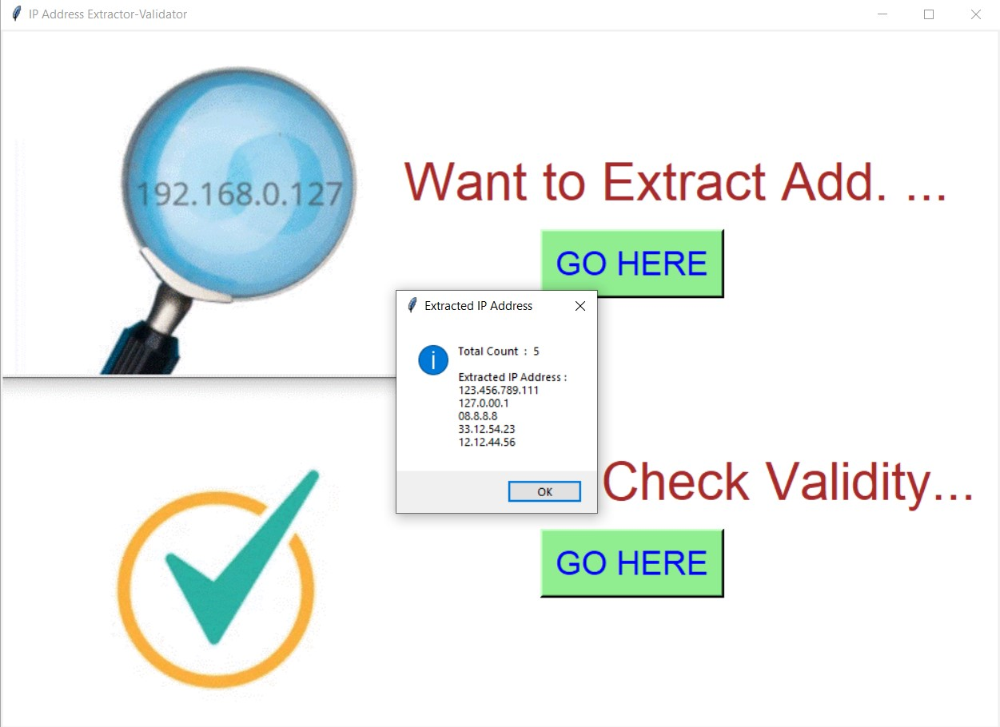 
  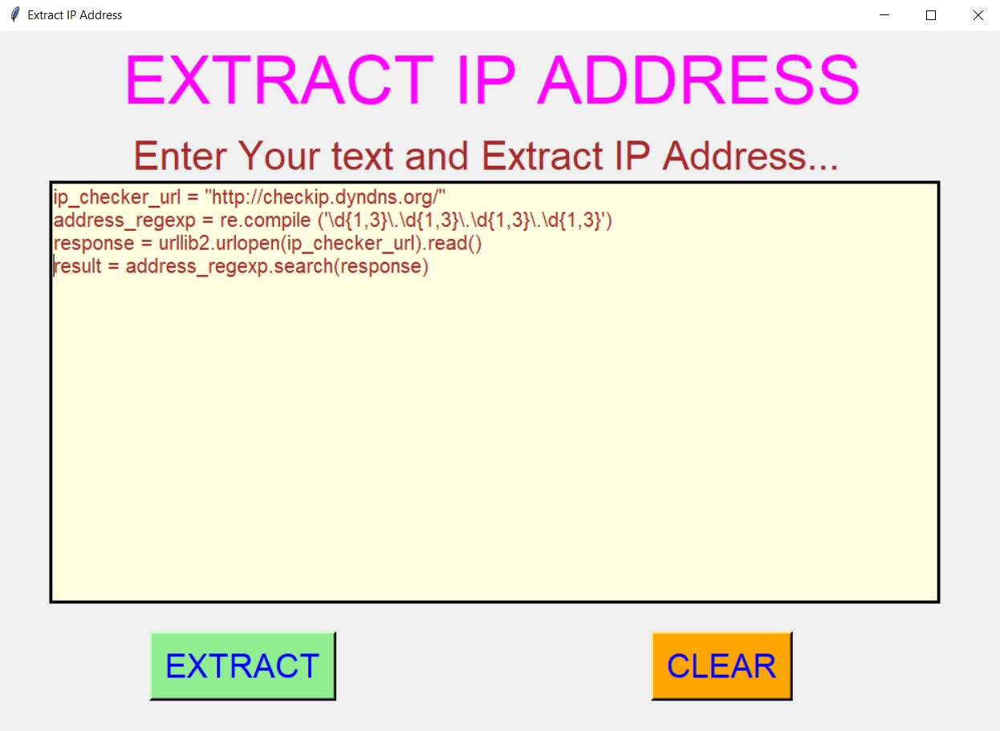 
  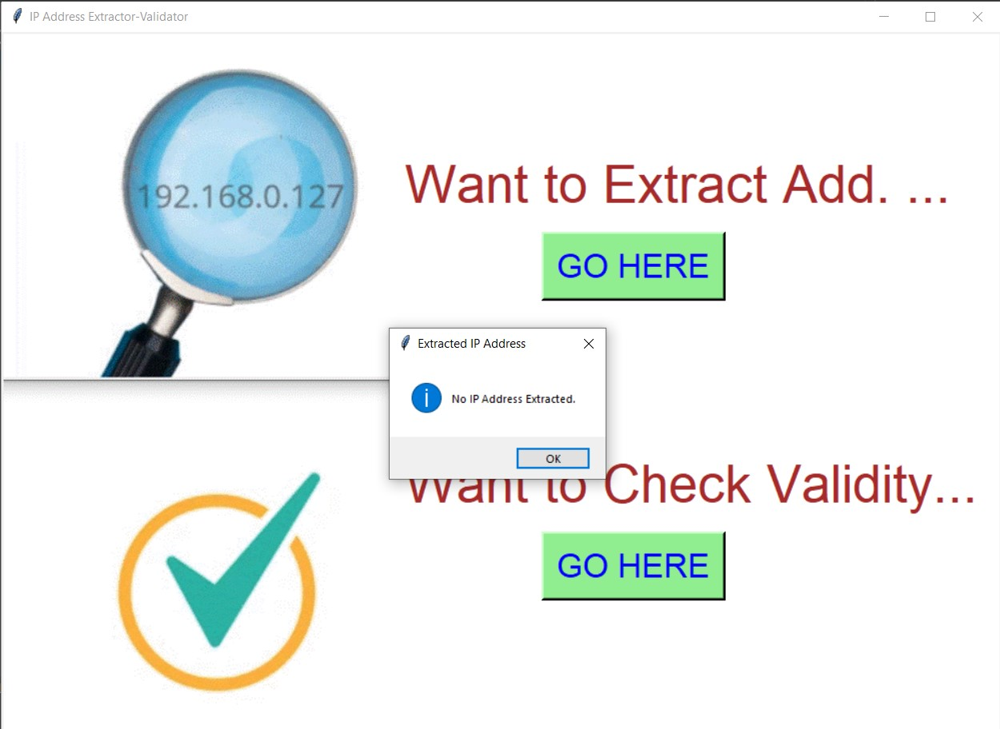 
  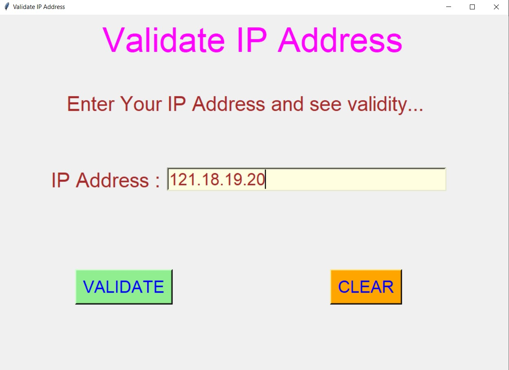 
  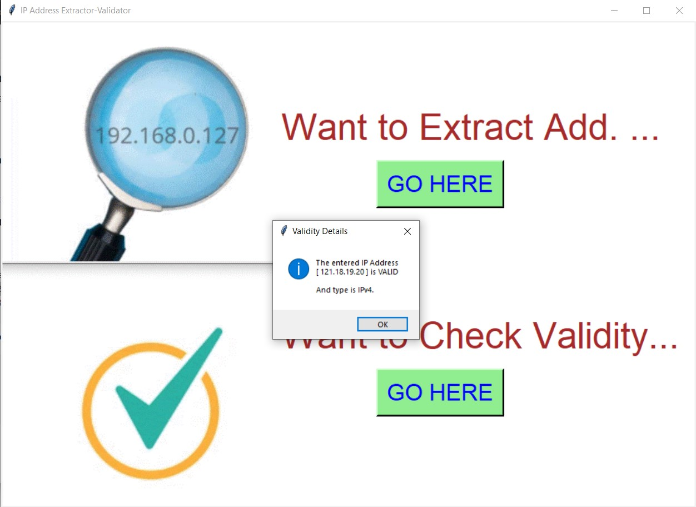 
  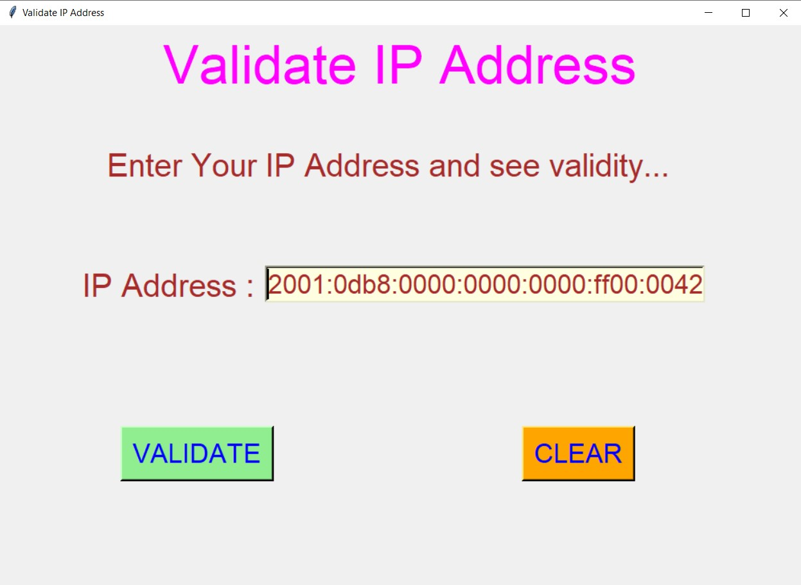 
  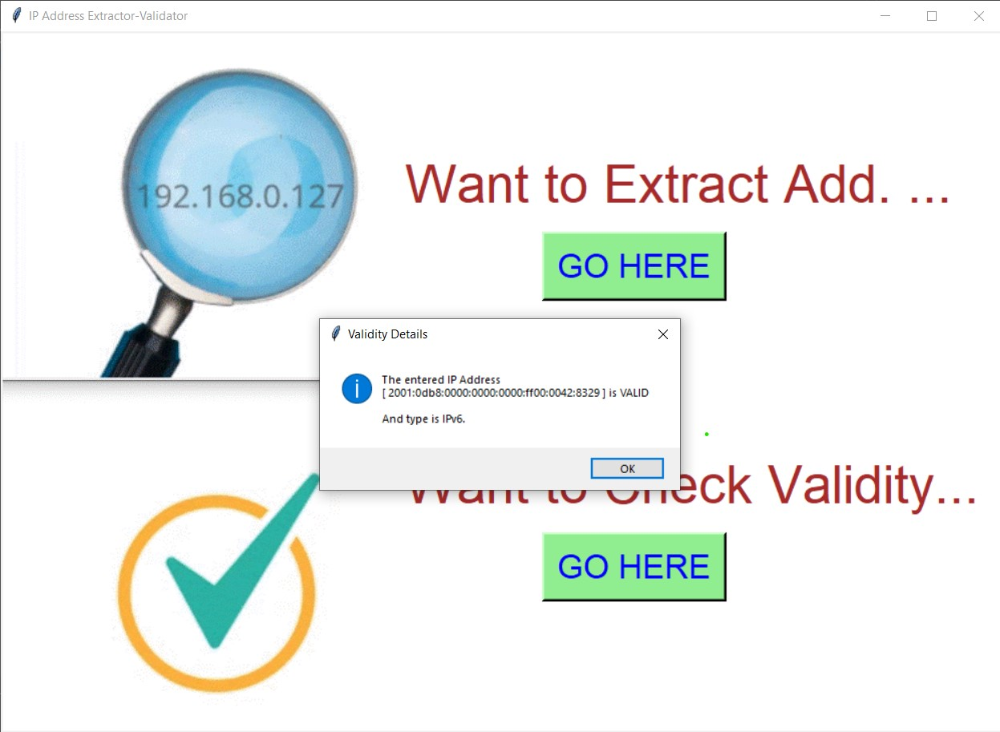 
  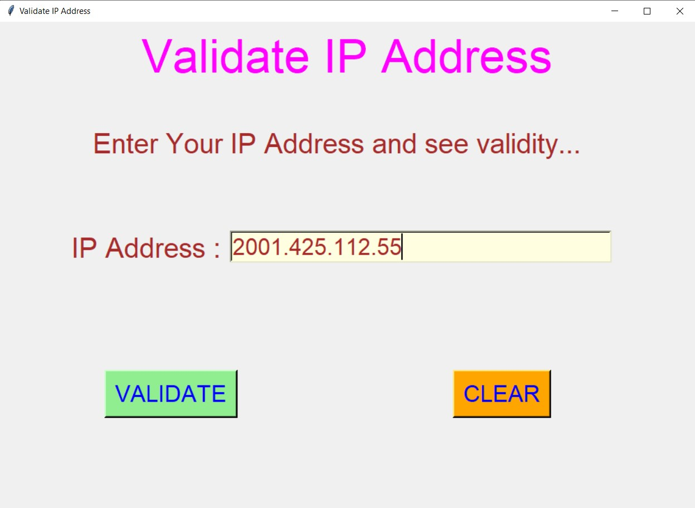 
  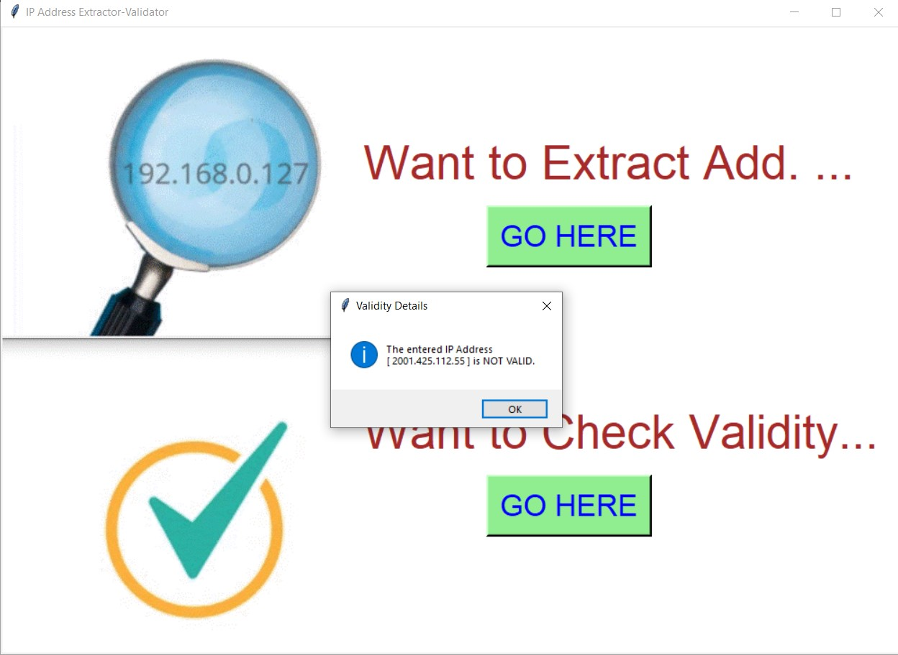 

****

# Author :
- ### Akash Ramanand Rajak
