# ✔ IMAGE SEARCH
- ### An Image Search is an image searching application created in python with tkinter gui.
- ### In this application user can select an image from the local system, will be able to search all the related images on the web page.
- ### Also user will be able to see the URL generated for searching on webpage.

****

# REQUIREMENTS :
- ### python 3
- ### tkinter module
- ### filedialog from tkinter
- ### import tkinter.messagebox
- ### json
- ### requests
- ### webbrowser

****

# HOW TO Use it :
- ### User just need to download the file, and run the image_search.py, on local system.
- ### After running a GUI window appears, where user can see button like START and EXIT.
- ### After user clicks on the START button a main image searching application window will appear, where user needs to select an image file using SELECT button from the local system.
- ### After selecting the image, preview of selected image will appear on screen on left side, and on right side there will be button like SEARCH and EXIT.
- ### After user has selected image to search, user can search that image on webpage using SEARCH button.
- ### As soon as user clicks on the SEARCH button, a webpage will open which will show images related to selected button.
- ### Also the URL generated for webpage will be shown at the bottom text space given.
- ### Also there is exit button, clicking on which we get a exit dialog box asking the permission to exit.

# Purpose :
- ### This scripts helps user to easily segment the any image from local system and search all the related images on the webpage.

# Compilation Steps :
- ### Install tkinter, PIL, json, requests, webbrowser
- ### After that download the code file, and run image_search.py on local system.
- ### Then the script will start running and user can explore it by selecting any image and searching it on the webpage.

****

# SCREENSHOTS :
****

   
  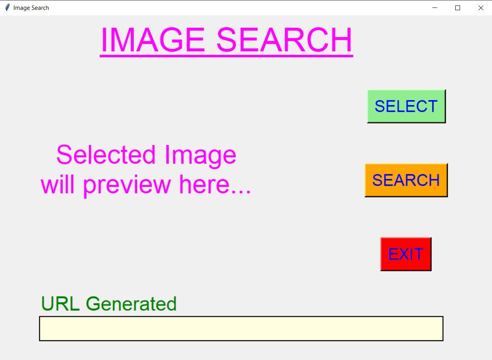 
  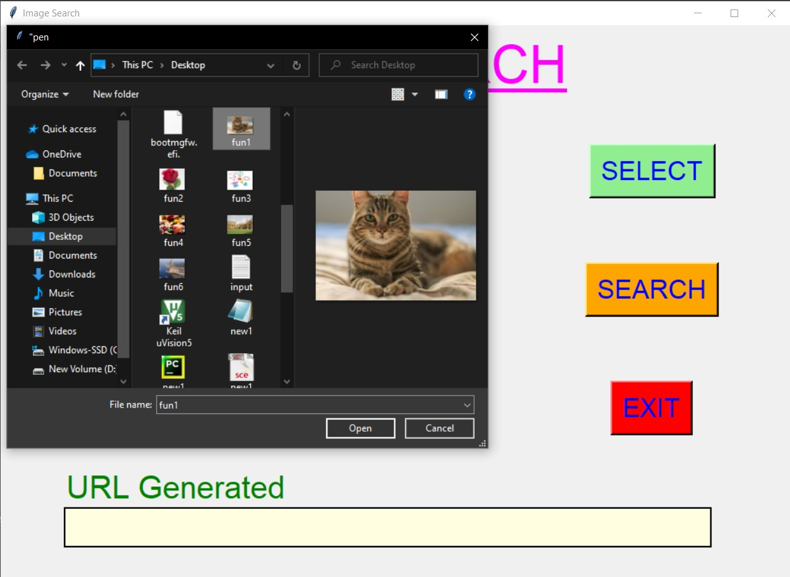 
  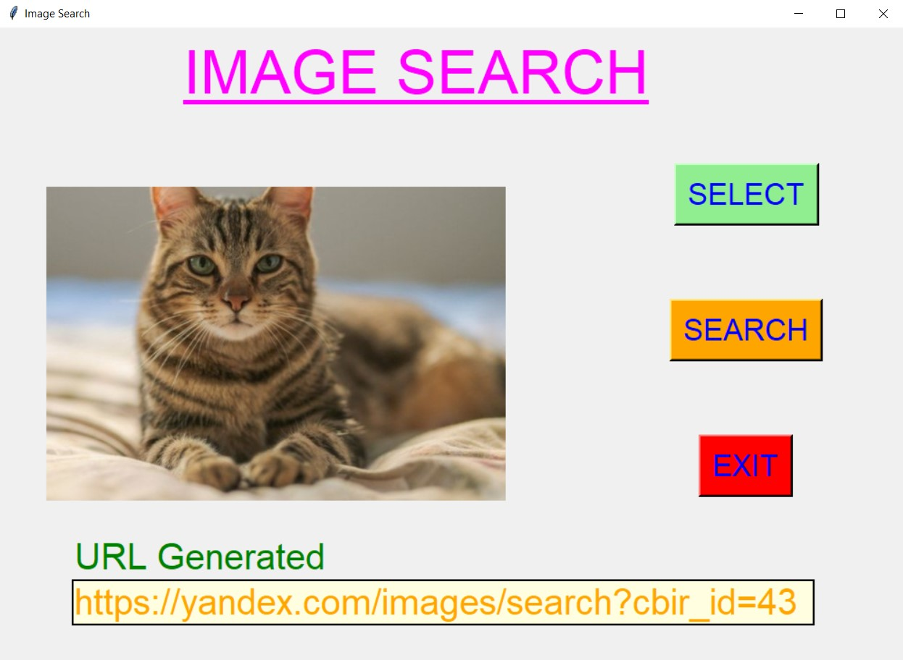 
  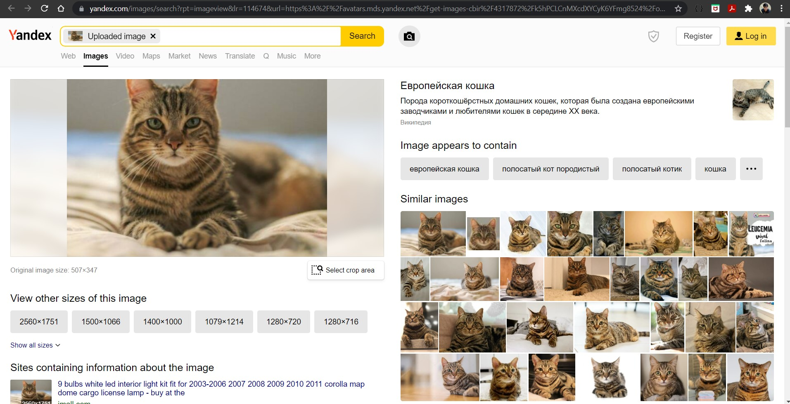 
  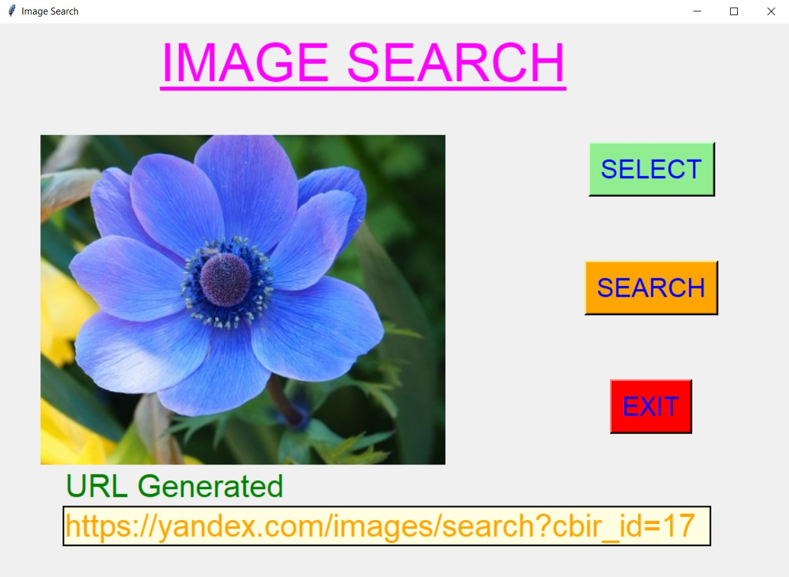 
  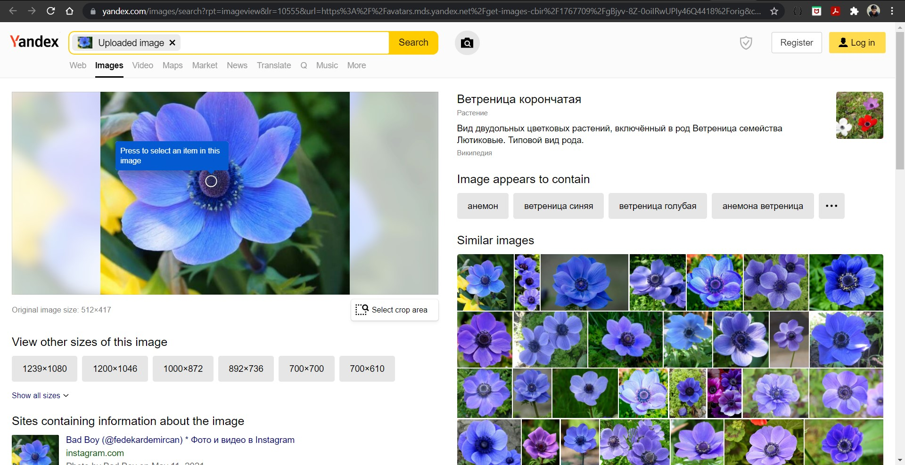 
  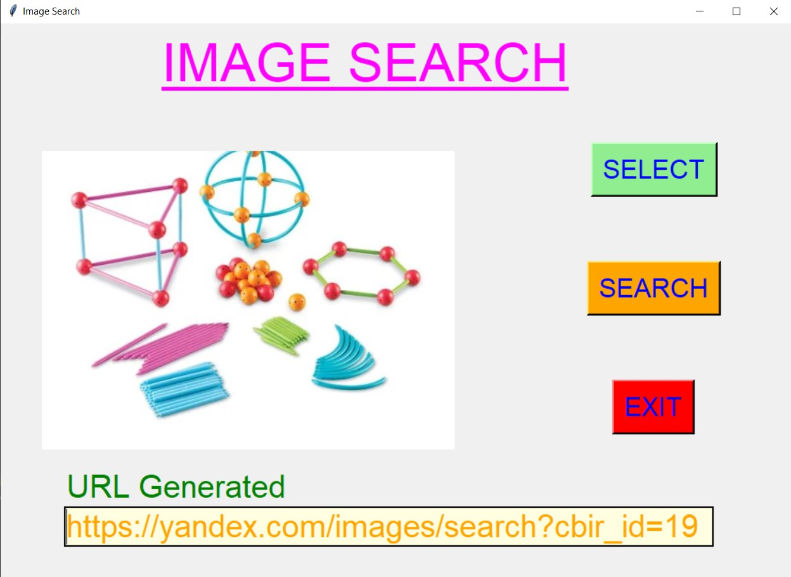 
  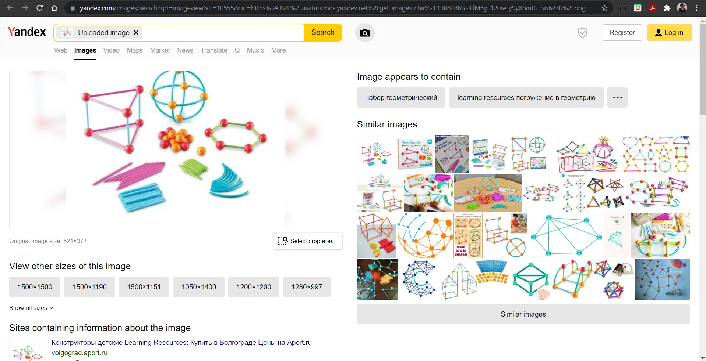 
  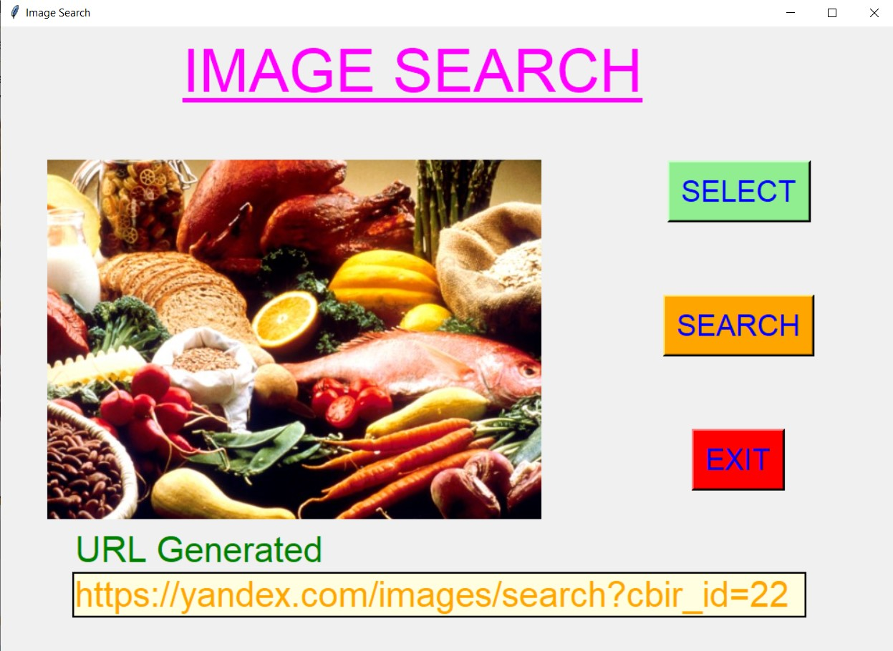 
   
  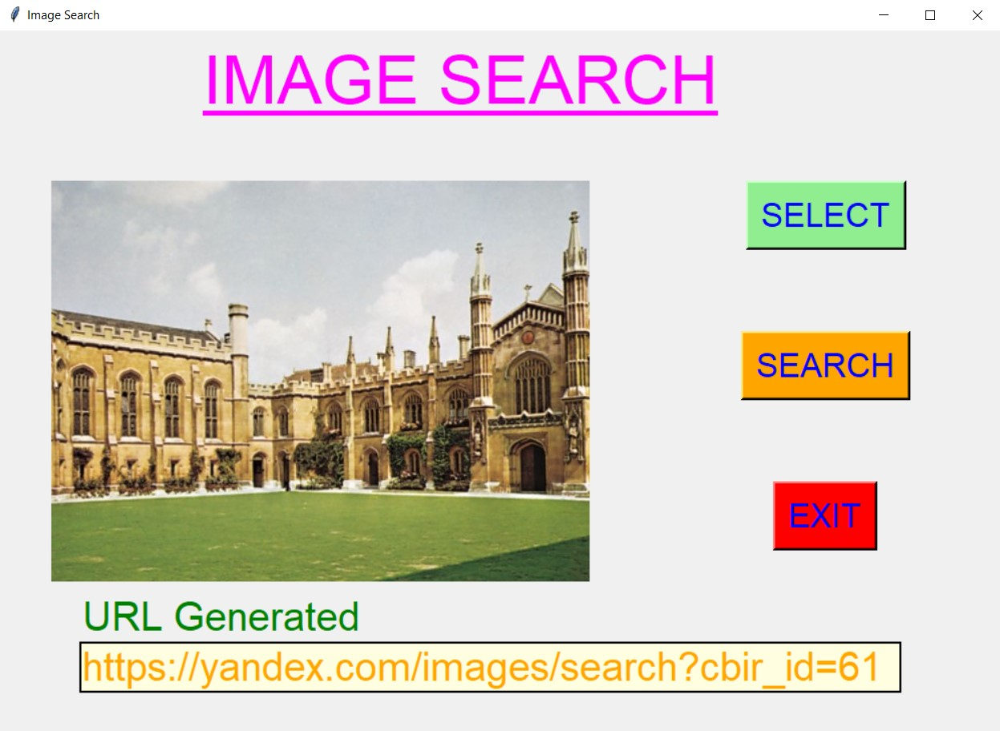 
   
   
  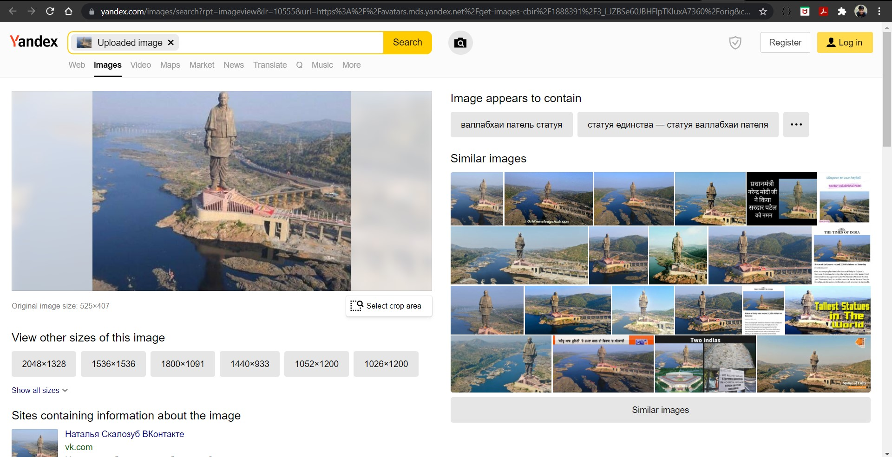 

****

# Name : 
- ### Akash Ramanand Rajak
