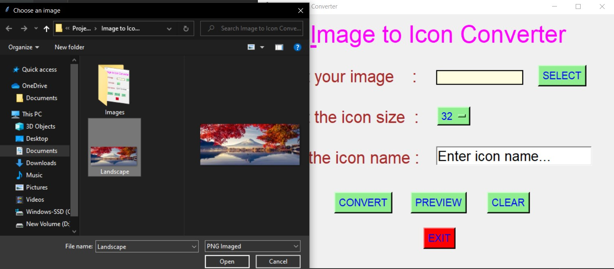
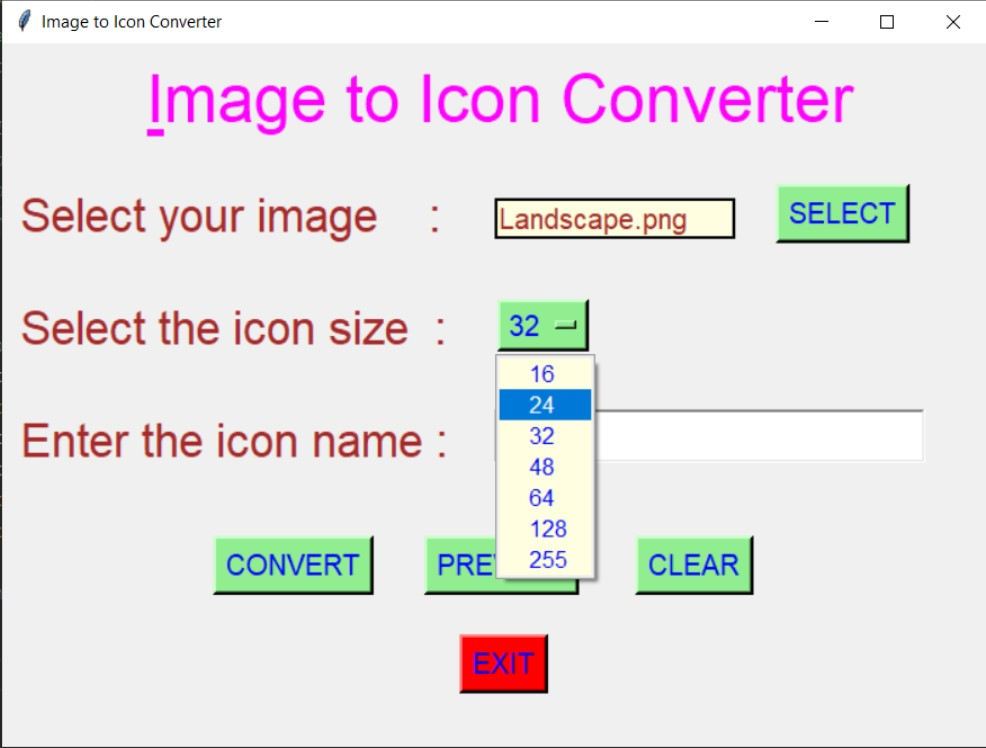
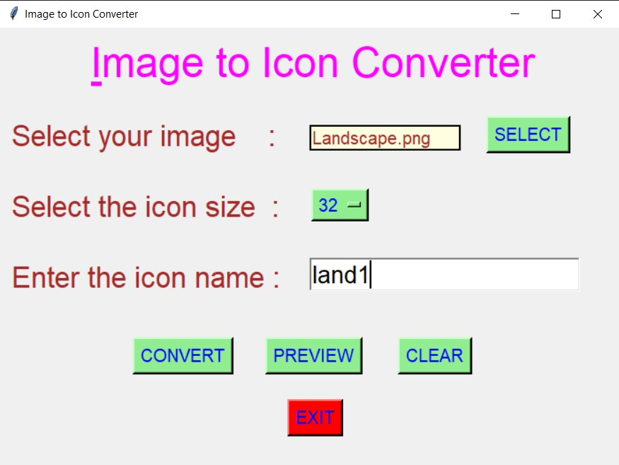
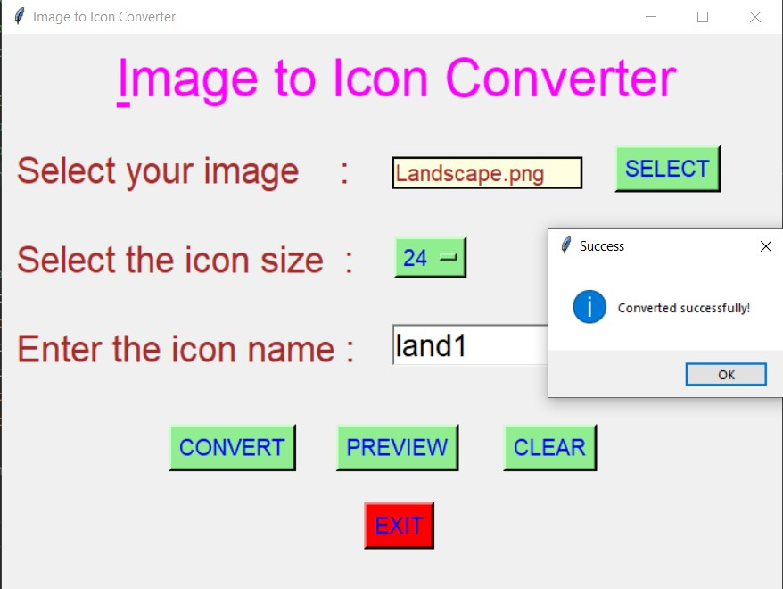
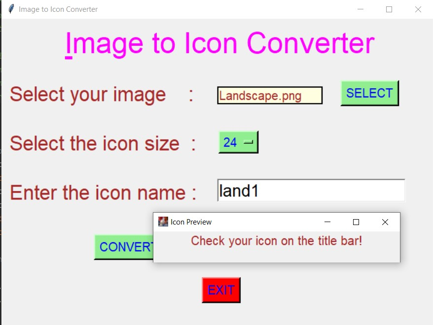
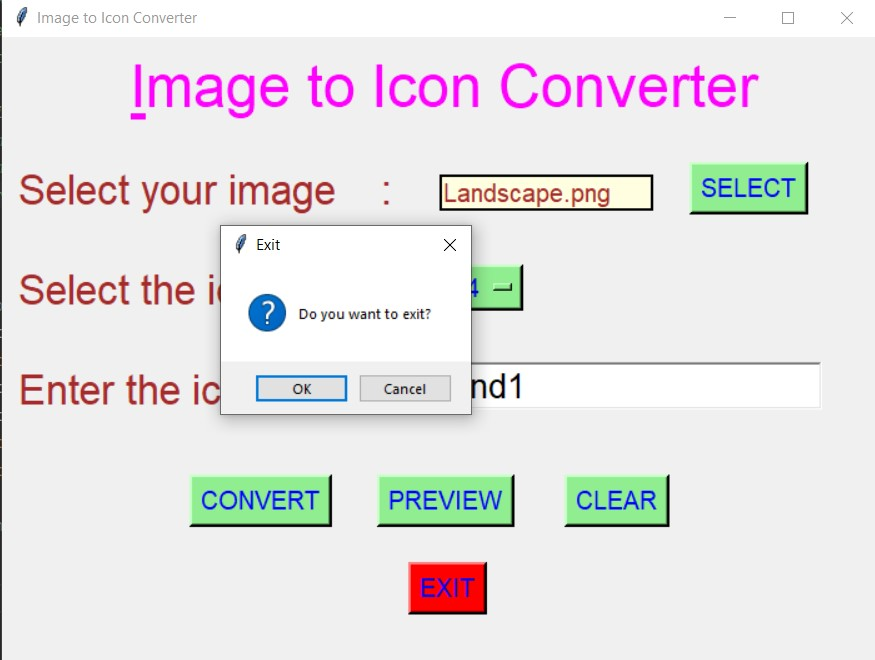
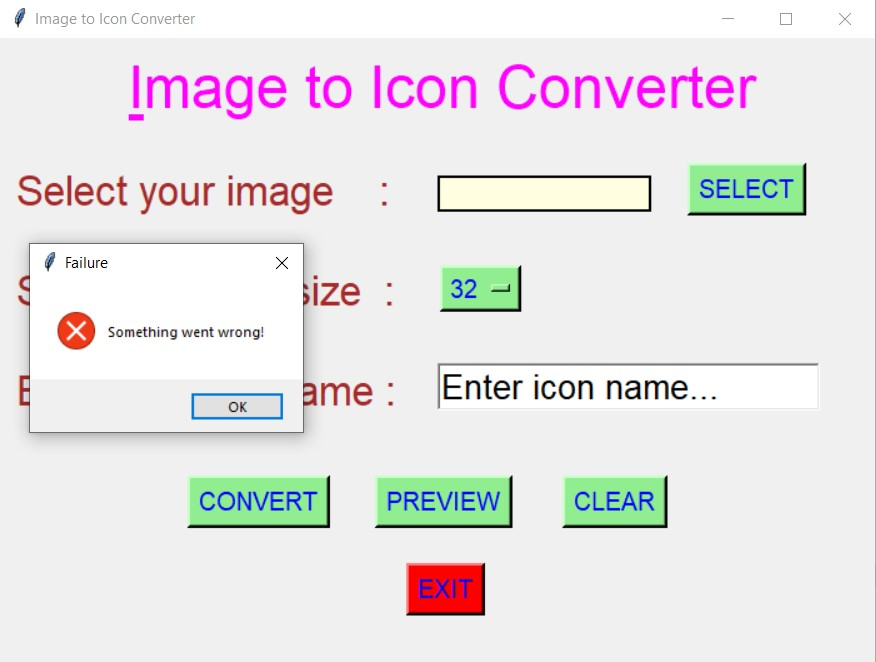

# ✔ IMAGE TO ICON CONVERTER
- ### An Image to Icon Converter created in python with tkinter gui.
- ### Using this we can convert any image (.jpg, .png or any other) to .ico (icon) file.

****

# REQUIREMENTS :
- ### python 3
- ### os module
- ### tkinter module
- ### filedialog from tkinter

****

# HOW TO Use it :
- ### User just need to download the file, and run the image_to_icon_converter.py, on local system.
- ### After running a GUI window appears, click on select and add image from the local system.
- ### select the size from the drop down list.
- ### Enter the name of the icon file you want.
- ### Click on convert, then one message appears "Converted Successfully!".
- ### Also if we select nothing and try to convert , we get a message "Something went wrong!".
- ### Also we can click on preview button to see how icon looks like.
- ### Also there is exit button, clicking on which we get a exit dialog box asking the permission to exit.

****

# SCREENSHOTS :

****

   
   
   
   
   
   
   
   

****

# Author : 
- ### Akash Ramanand Rajak

****