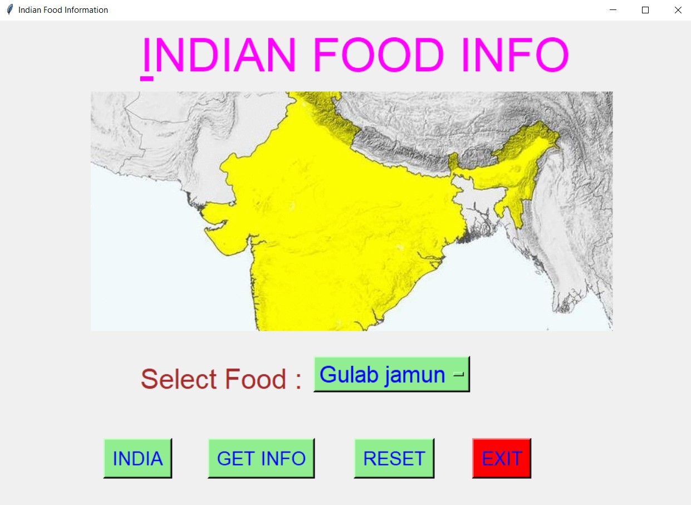
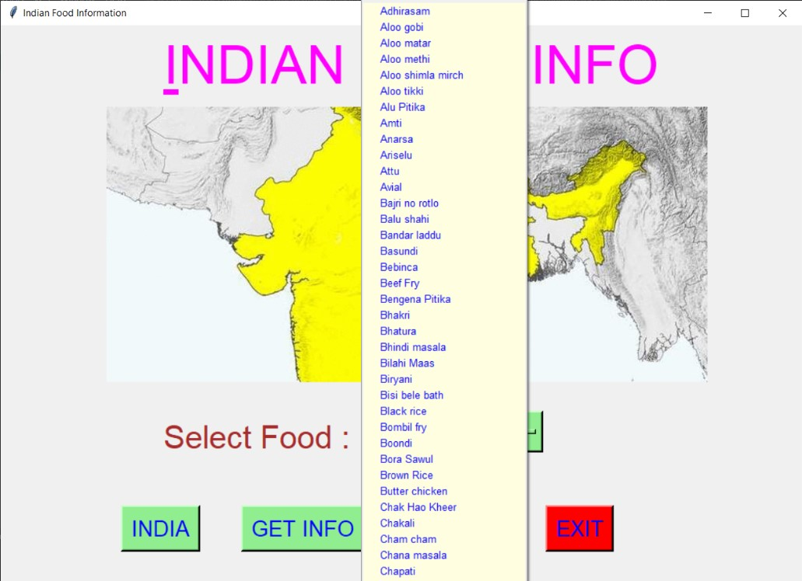
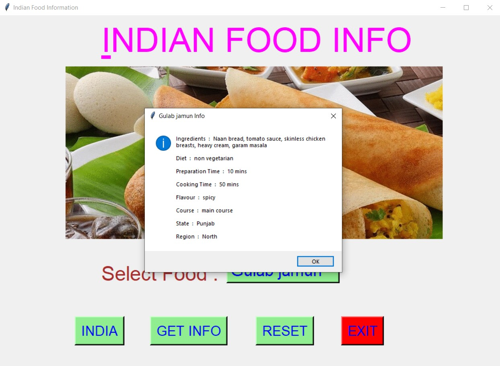
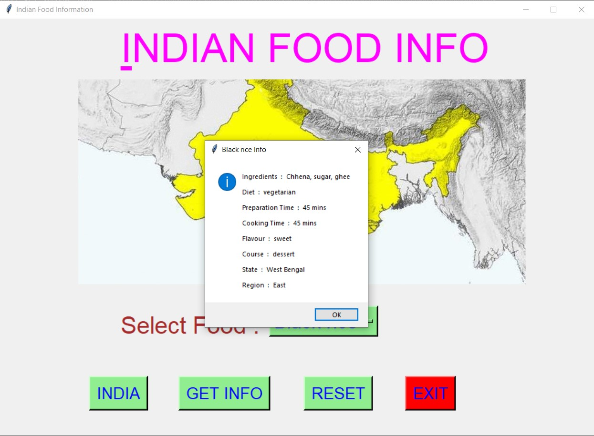
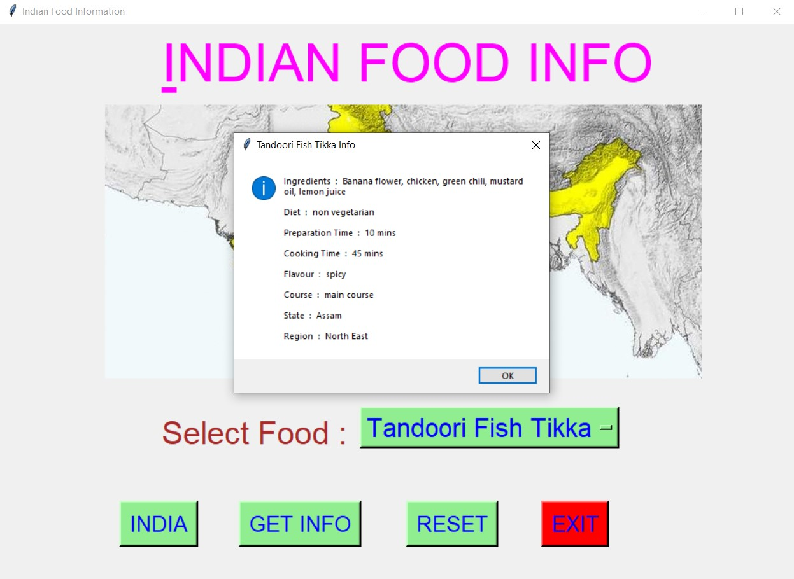
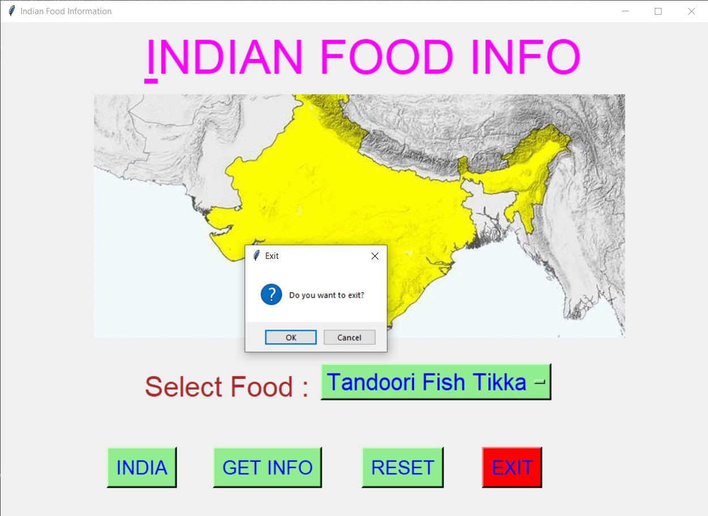

# ✔ INDIAN FOOD INFORMATION
- ### A "Indian Food Information" is an application created in python with tkinter gui.
- ### In this application, user can find the information about any Indian food.
- ### The information can be like Diet, Preparation time, Cooking time, Flavour, Course, State and Region.
- ### for the data, used the indian_food.csv data, and read using pandas library.

****

# REQUIREMENTS :
- ### python 3
- ### tkinter module
- ### from tkinter messagebox module
- ### pandas

****

# How this Script works :
- ### User just need to download the file and run the indian_food_information.py on their local system.
- ### Now on the main window of the application the user needs to select the food name from the drop down OptionMenu.
- ### After user has chosen the food name, when user clicks on the BY GET INFO button, he/she will be able to see that selected food information in the message box.
- ### Also there is a INDIA button, clicking on which shows where India stands among other countries of the world in terms of food.
- ### Also there is a reset button, clicking on which user can resets both the Option Menu to default character ot integer.
- ### Also there is an exit button, clicking on which exit dialog box appears asking for the permission of the user for closing the window.

****

# SCREENSHOTS :

****

   
   
   
   
   
   
   

****

# Author :
- ### Akash Ramanand Rajak
