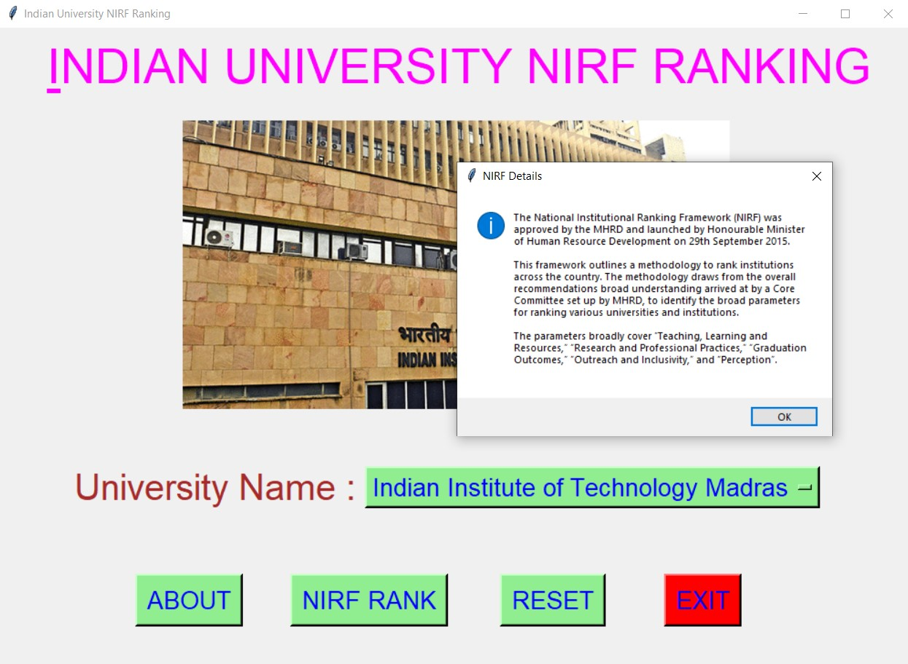
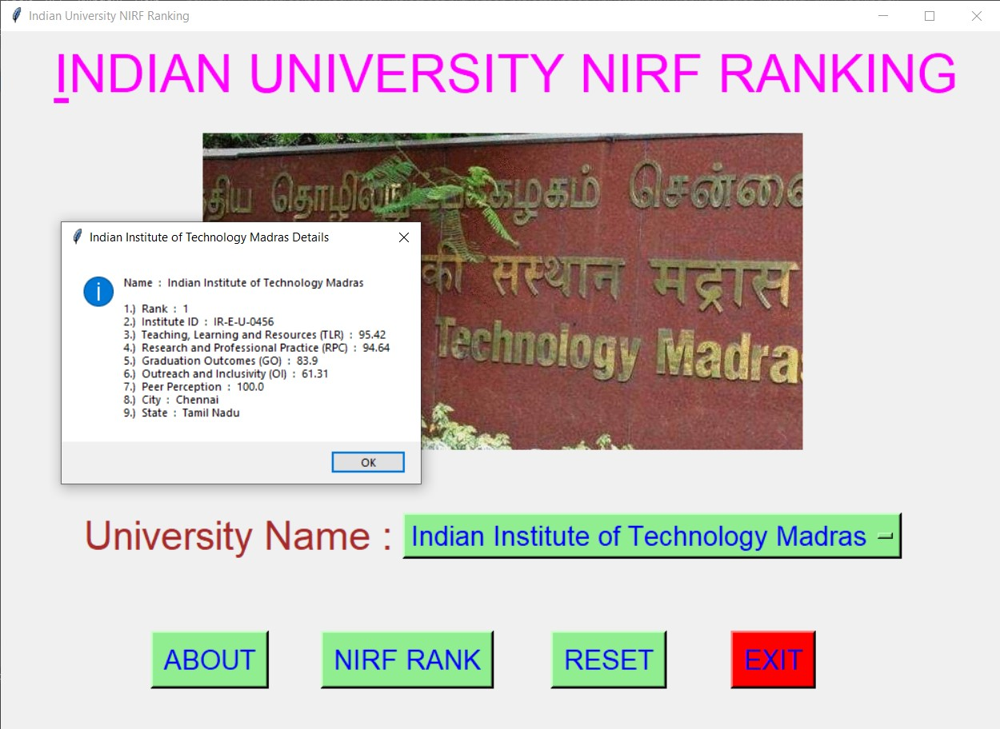
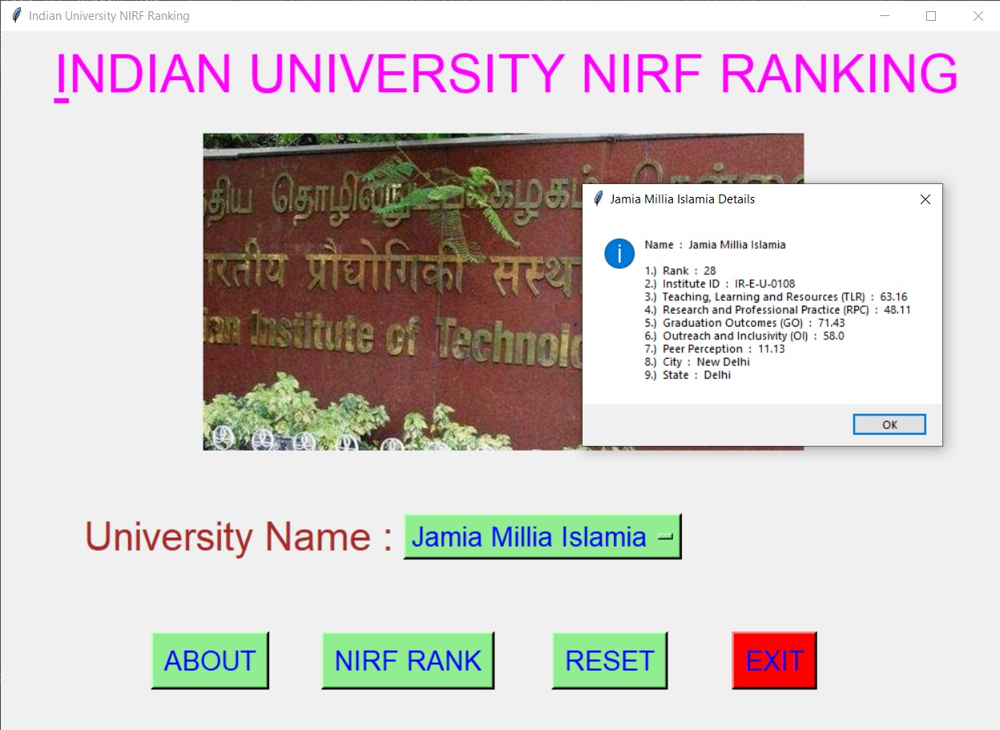
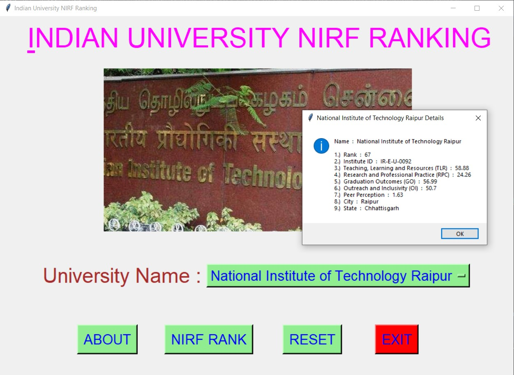
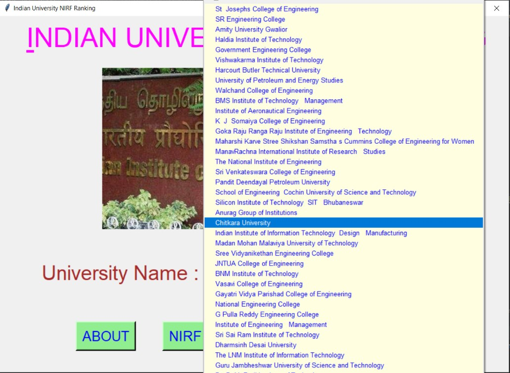
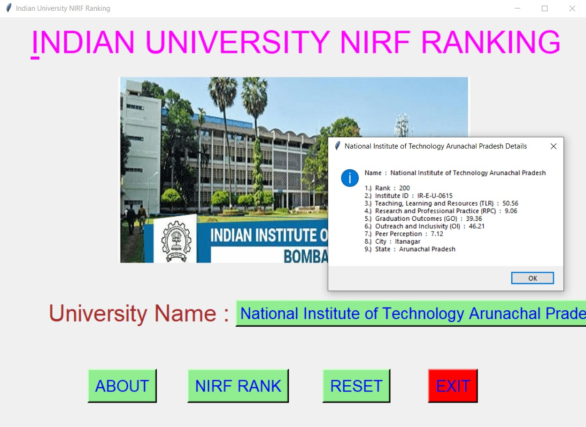
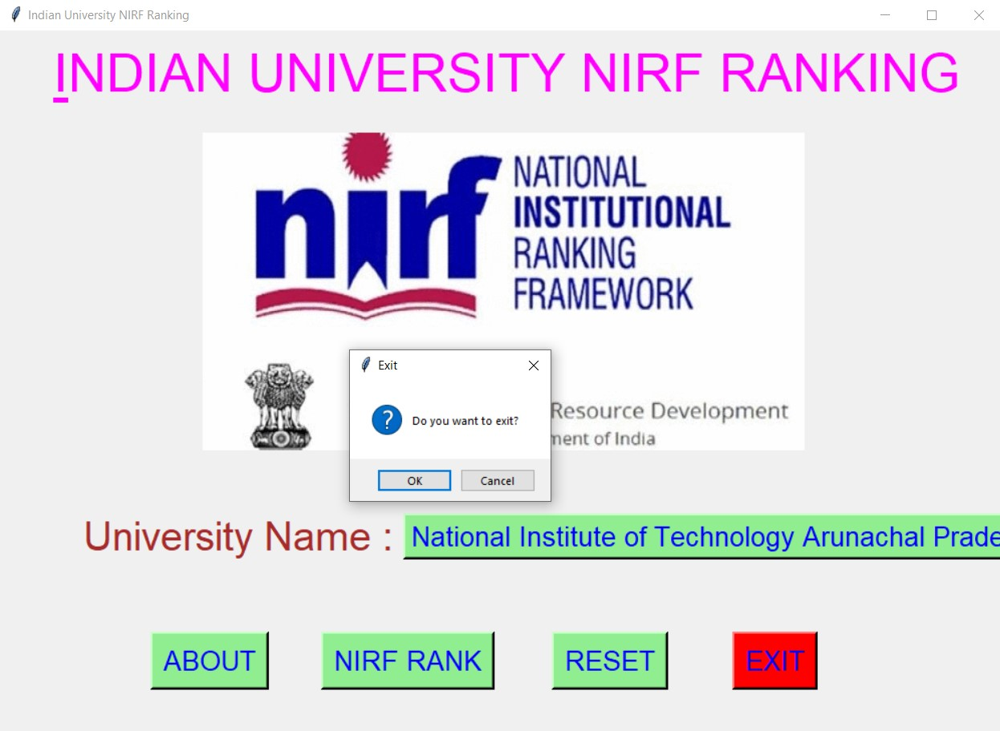

# ✔ INDIAN UNIVERSITY NIRF RANKING
- ### A "Indian University NIRF Ranking" is an application created in python with tkinter gui.
- ### In this application, user can get the NIRF Ranking of TOP 200 University.
- ### Along with NIRF, other details like, Institute ID, Teaching, Learning and Resources (TLR), Research and Professional Practice (RPC), Graduation Outcomes (GO), Outreach and Inclusivity, Peer Perception, City and State.
- ### for the data, used the engineering.csv data, and read using pandas library.

****

# REQUIREMENTS :
- ### python 3
- ### tkinter module
- ### from tkinter messagebox module
- ### pandas

****

# How this Script works :
- ### User just need to download the file and run the indian_university_NIRF_ranking.py on their local system.
- ### Now on the main window of the application the user needs to select the name of University from the drop down OptionMenu.
- ### After user has chosen the name of University, when user clicks on the BY NIRF RANK button, he/she will be able to see the NIRF RANK of that selected University along with some details.
- ### Also there is a NIRF button, clicking on which user can see about NIRF, what it it and when was it implemented.
- ### Also there is a RESET button, clicking on which user can resets both the Option Menu to default element name "Indian Institute of Technology Madras".
- ### Also there is an EXIT button, clicking on which exit dialog box appears asking for the permission of the user for closing the window.

# Purrpose :
- ### This scripts helps us to easily get NIRF Ranking of top 200 University along with information about 5 things (TLR, RPC, GO, OI, and Peer Perception) which is used in calculating NIRF Ranking.

# Compilation Steps :
- ### Install tkinter, pandas
- ### After that download the code file, and run indian_university_NIRF_ranking.py on local system.
- ### Then the script will start running and user can get the NIRF Ranking of any university from given list..

****

# SCREENSHOTS :

****

   
   
   
   
   
   
   
   

****

# Author :
- ### Akash Ramanand Rajak
