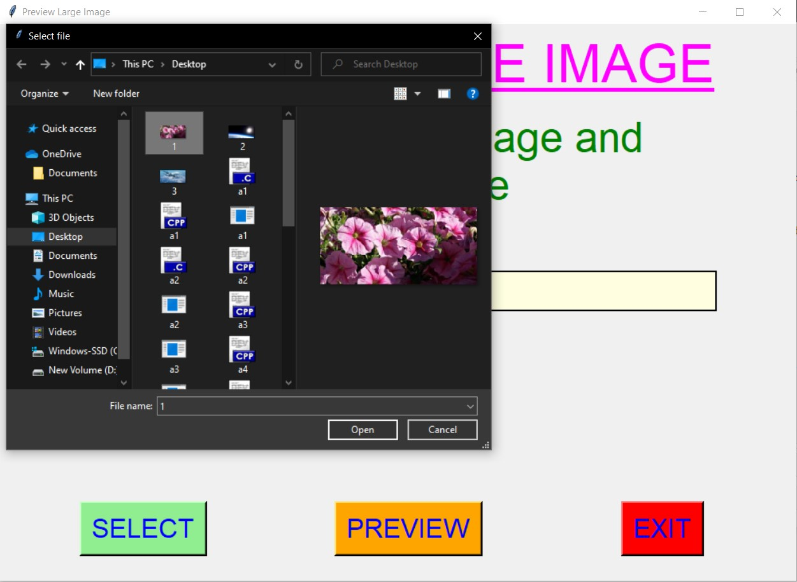
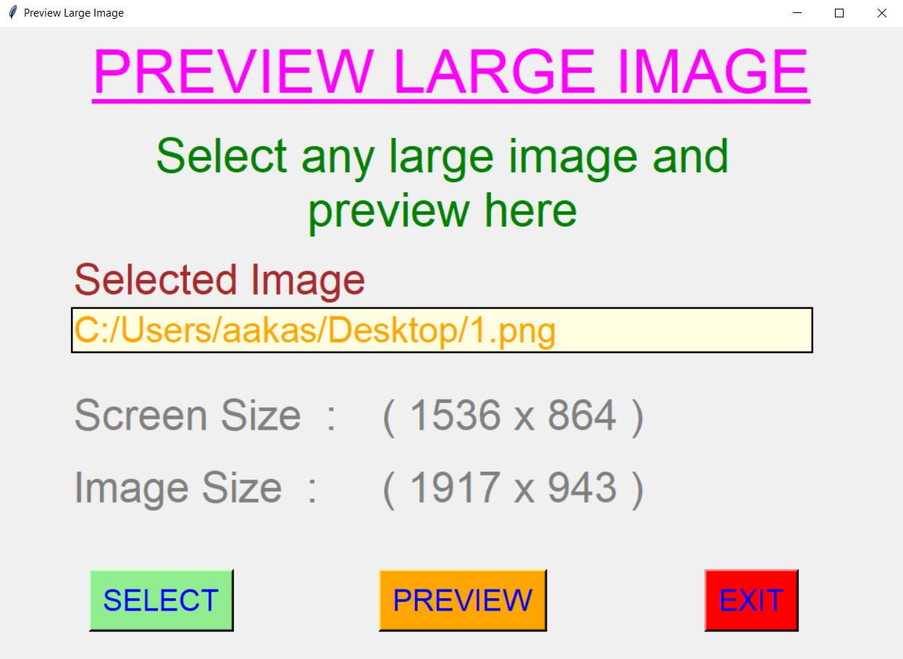
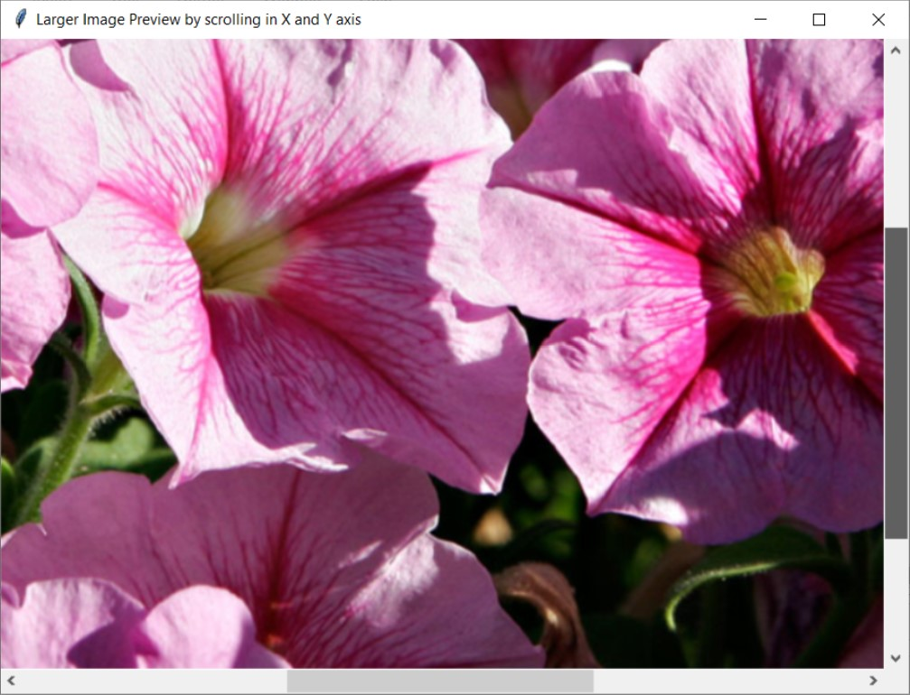
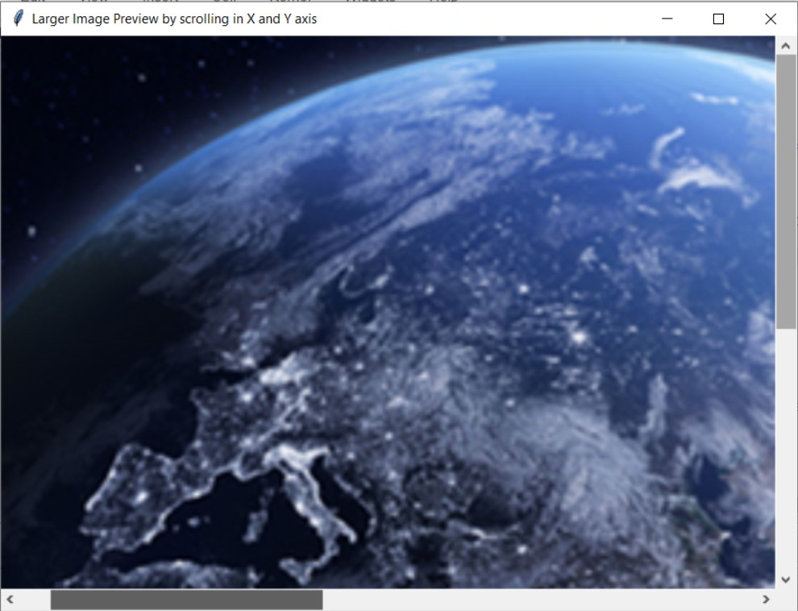
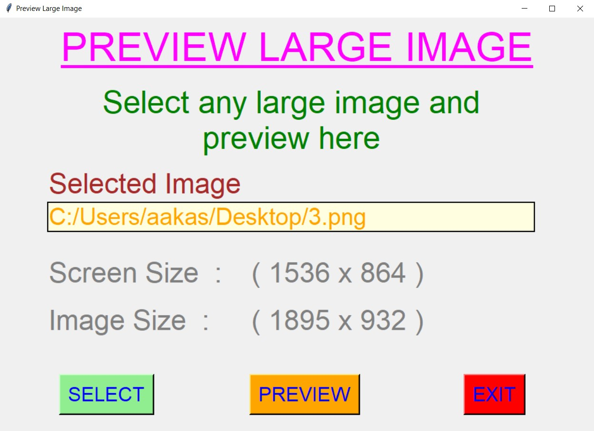
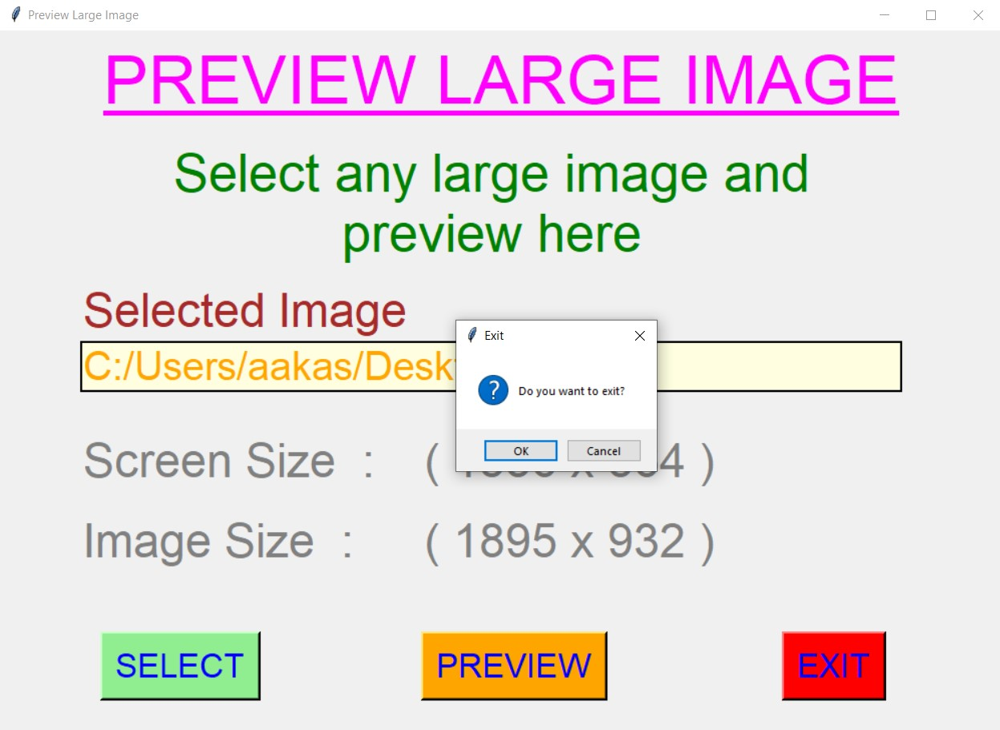

# ✔ LARGE IMAGE PREVIEW
- ### A "Large Image Preview" is an application created in python with tkinter gui and OpenCv library.
- ### In this application user can select any large image and preview that selected image using the X and Y scrollbars in new window.
- ### Along with that user will also get details about screensize and the image size.

****

# REQUIREMENTS :
- ### python 3
- ### cv2 module
- ### tkinter module
- ### filedialog from tkinter
- ### cv2
- ### numpy

****

# HOW TO Use it :
- ### User just need to download the file, and run the large_image_preview.py, on local system.
- ### After that a new GUI window will open, in which user will have buttons like SELECT, REVIEW, and EXIT.
- ### User can select any large image file from the local system, using SELECT button.
- ### After user has selected the image, user will be able to see the screen size and image size on the window ans also the path of the image selected.
- ### After that when user clicks on the PREVIEW button, user will able to see the preview in new window with scrollbars in X and Y axis.
- ### Also there is an EXIT button, clicking on which asks user to exit the window.

# Purpose :
- ### This scripts helps user to easily see the preview of large image in new window with X and Y scrollbars.

# Compilation Steps :
- #### Install tkinter, cv2, numpy
- #### After that download the code file, and run large_image_preview.py on local system.
- #### Then the script will start running and user can explore selecting any large image and preview it in new window with scrollbars.

****

# SCREENSHOTS :

****

   
   
   
   
   
   
   
   
   

****

# Name : 
- ### Akash Ramanand Rajak
