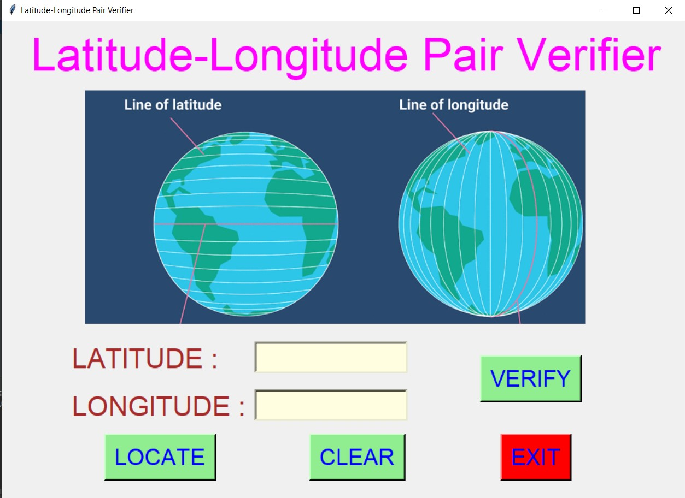
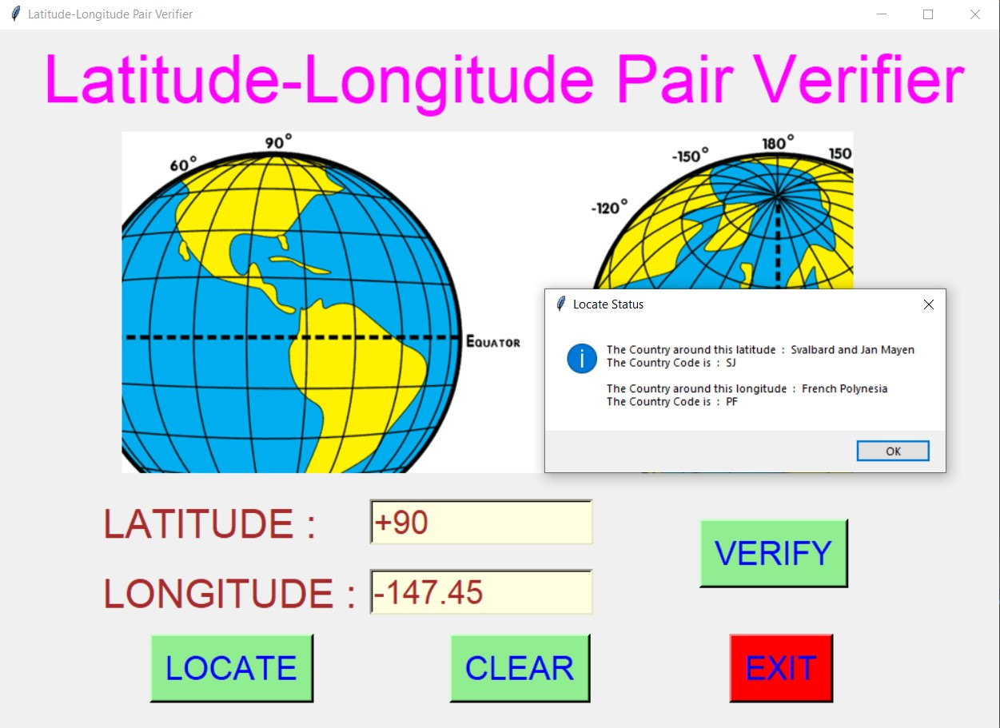
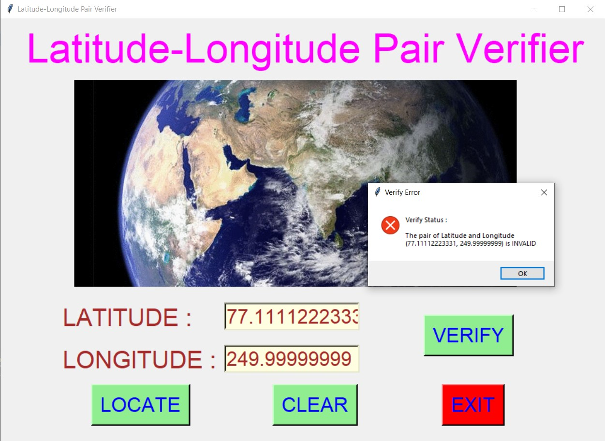
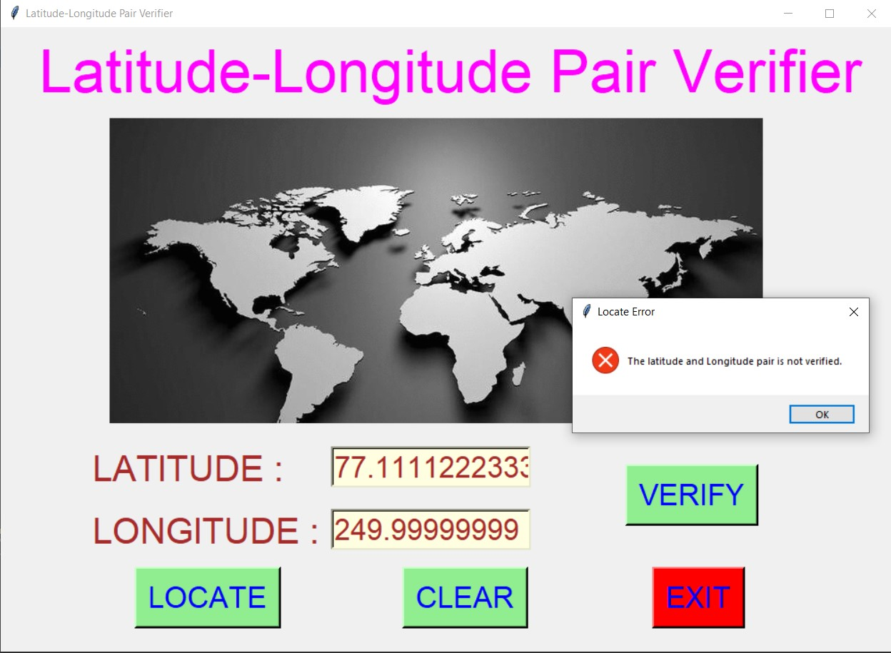
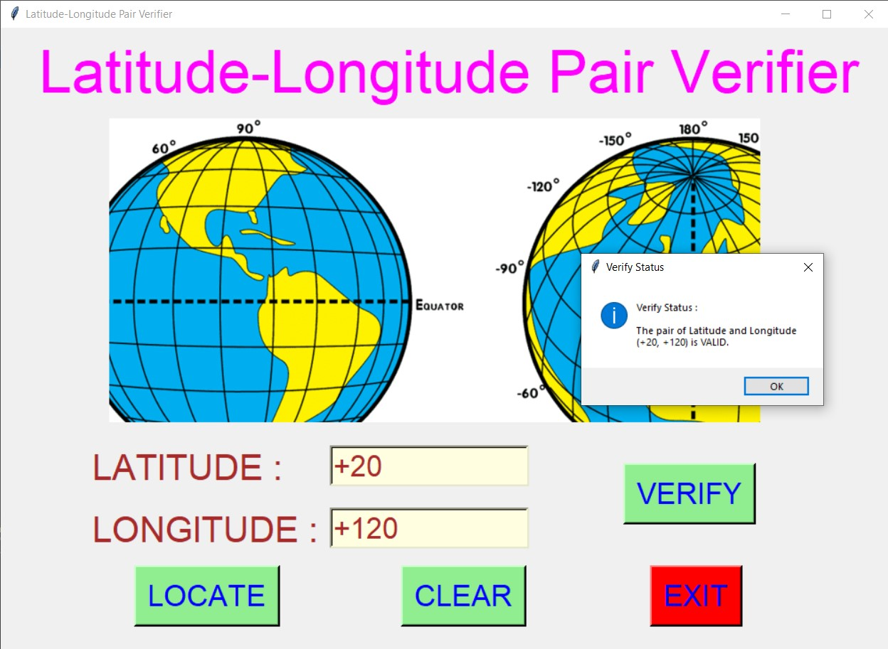
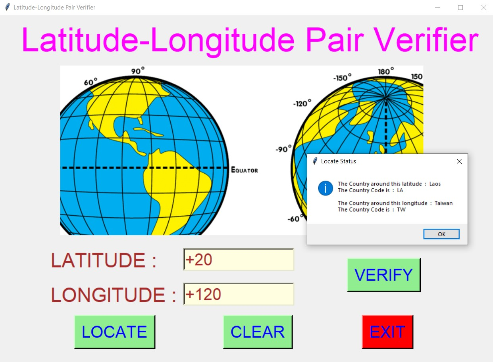
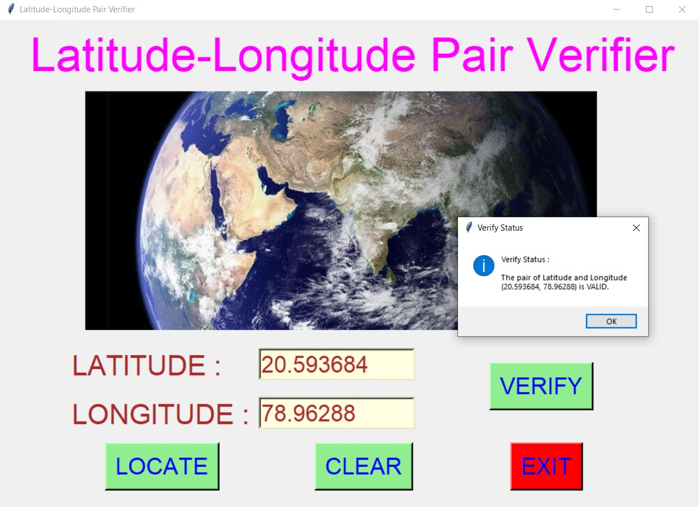
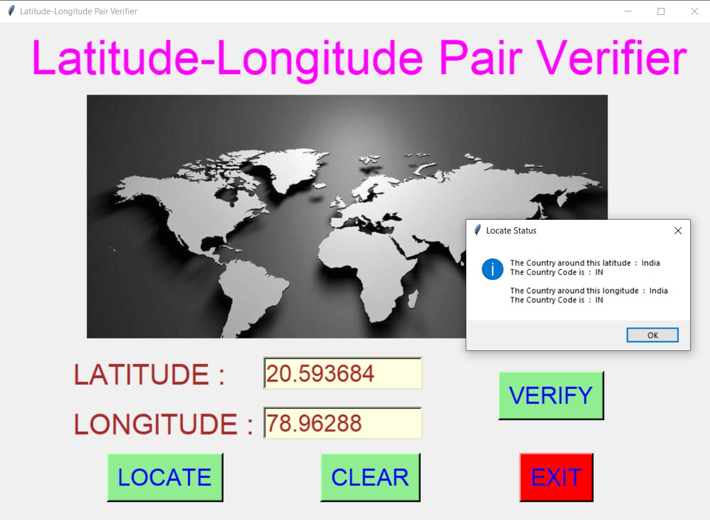
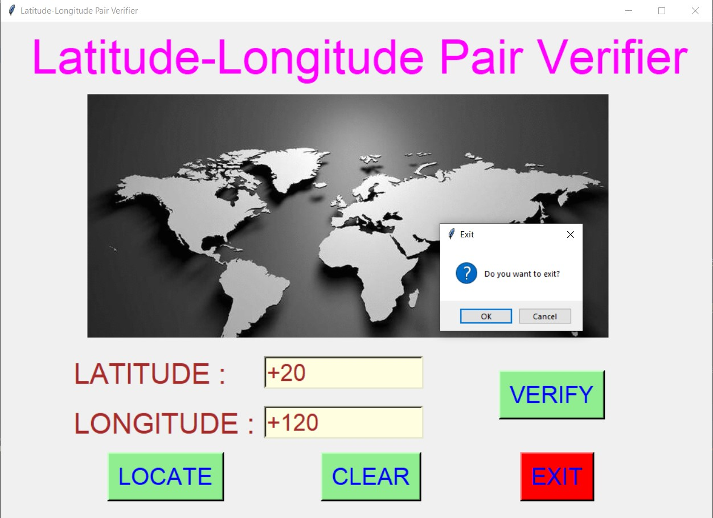

# ✔ LATITUDE - LONGITUDE PAIR VERIFIER
- #### A "Latitude - Longitude Pair Verifier" is an application created in python with tkinter gui.
- #### In this application, user can enter any latitude and longitude and verify whether that latitude and longitude pair is valid or not.
- #### Also if the pair is valid then user can also locate that latitude and longitude on the earth and see which country is around that latitude and longitude along with country code.
- #### Also is the pair is not valid, then error message will be shown for the same and that latitude and longitude cannot be located using locate button.
- #### for locating, used the world_location.csv data, and read using pandas library.

****

# REQUIREMENTS :
- #### python 3
- #### tkinter module
- #### from tkinter messagebox module
- #### pandas
- #### re

****

# How this Script works :
- #### User just need to download the file and run the latitude-longitude_pair_verifier.py on their local system.
- #### Now on the main window of the application the user needs to enter the latitude and longitude pair in the given entry box.
- #### After user has entered the pair, when user clicks on the VERIFY button, he/she will get to know whether that pair is valid or not.
- #### If pair is not valid user will get the error for the same.
- #### If that pair is valid then user can locate that on the earth map ans see which counrty is around that latitude and longitude.
- #### If that pair is not valid then user will not be able to locate that latitude and longitude.
- #### Also there is an exit button, clicking on which exit dialog box appears asking for the permission of the user for closing the window.

# Purpose :
- #### This scripts helps user to easily verify any pair of longitude and latiude.

# Compilation Steps :
- #### Install tkinter, pandas, re
- #### After that download the code file, and run latitude-longitude_pair_verifier.py on local system.
- #### Then the script will start running and user can explore it by verifying ths latitude - longitude pair and locating it if valid.

****

# SCREENSHOTS :

****

   
   
   
   
   
   
   
   
   
   

****

# Name :
- #### Akash Ramanand Rajak

