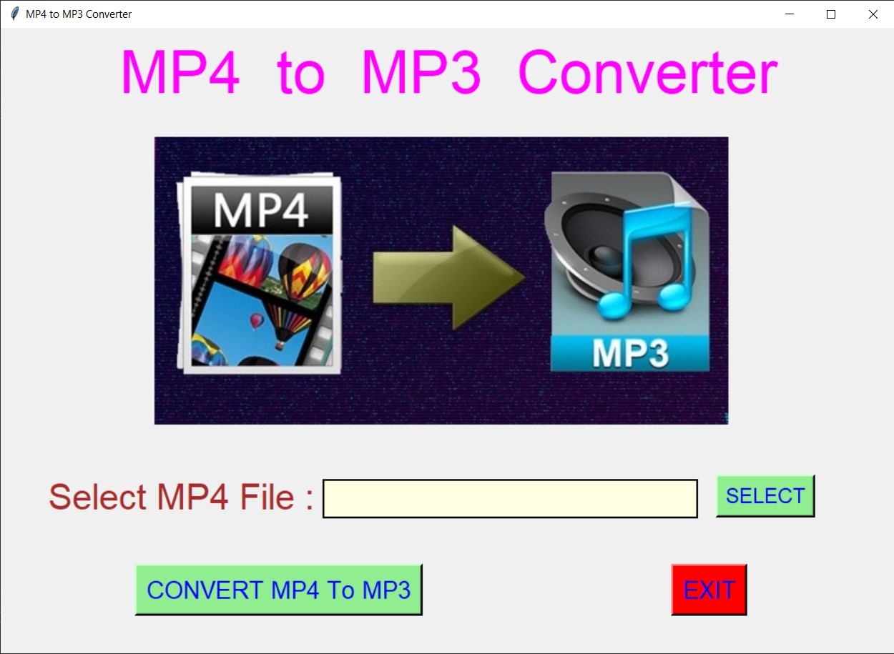
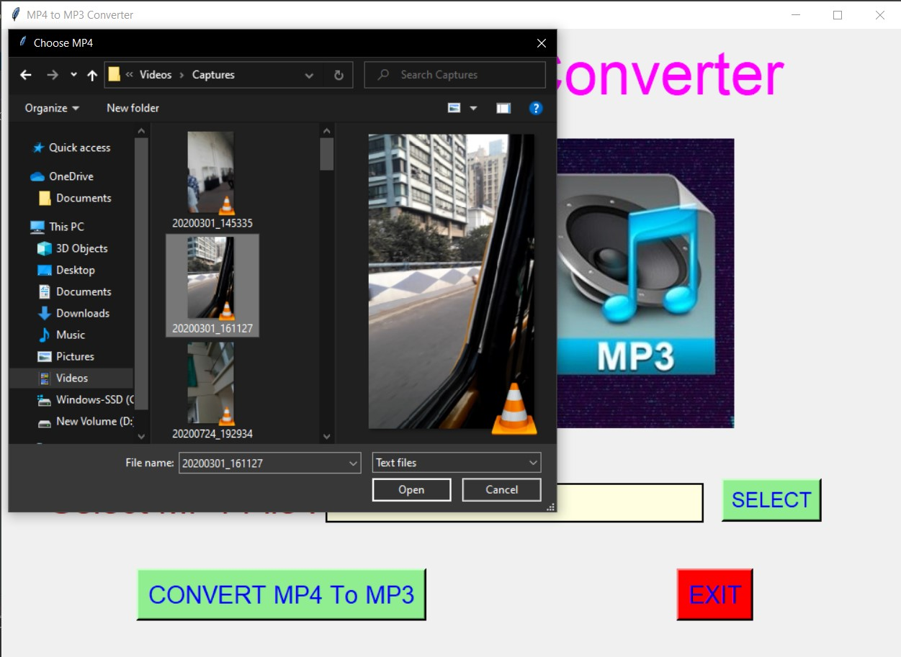
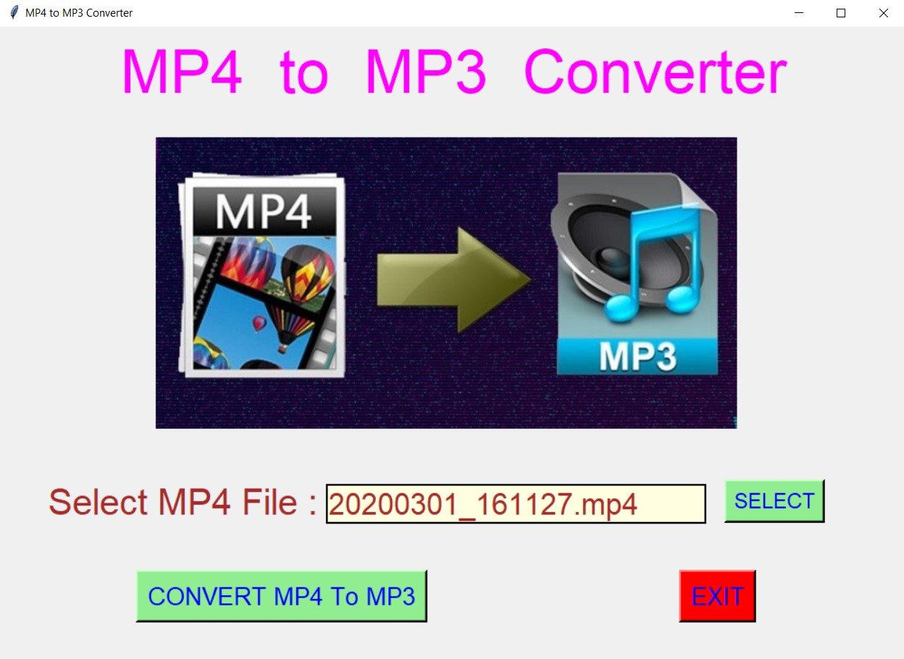
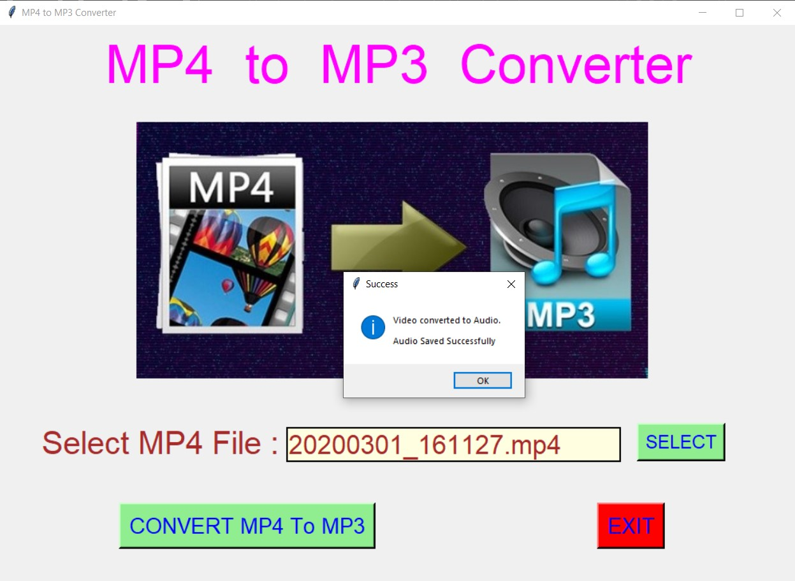
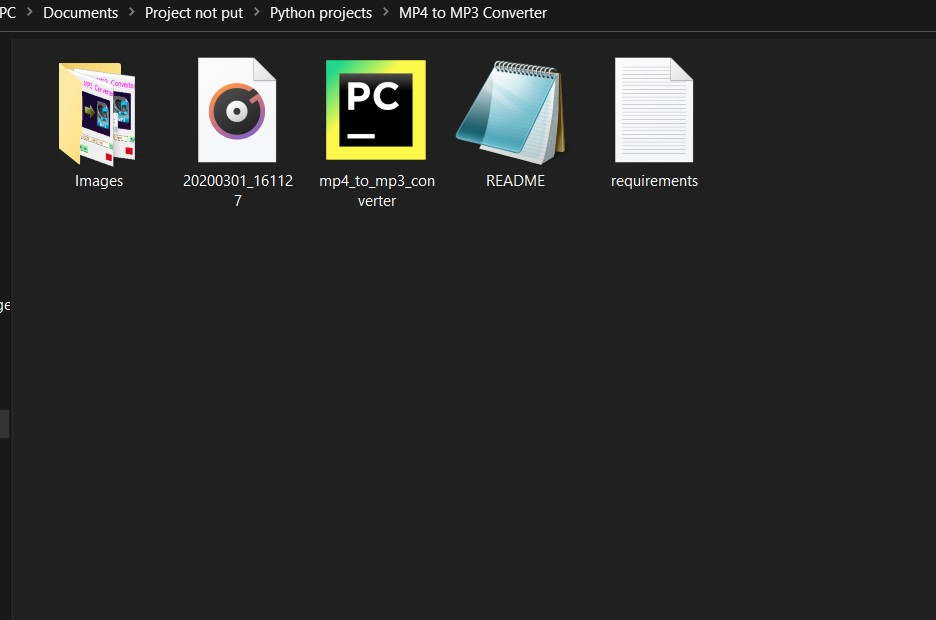
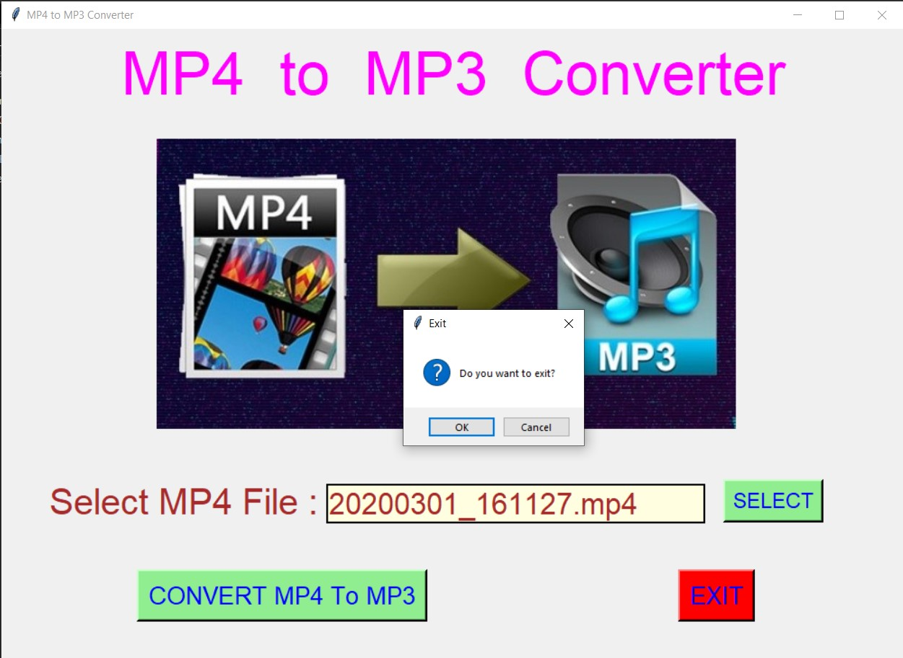

# ✔ MP4 TO MP3 CONVERTER
- ### A MP4 to MP3 Converter is an application created in python with tkinter gui.
- ### In this application user will be able to convert any mp4 video file to audio file.
- ### After conversion is successful, file will be saved automatically with file_name.mp3.

****

# REQUIREMENTS :
- ### python 3
- ### tkinter module
- ### from tkinter messagebox module
- ### PIL
- ### os
- ### moviepy

****

# How this Script works :
- ### User just need to download the file and run the mp4_to_mp3_converter.py on their local system.
- ### Now on the main window of the application user needs to select the mp4 file from the local system using SELECT button which he/she wants to convert to audio.
- ### After selecting the mp4 file, user will be able to see the filename of the video selected in the textarea.
- ### After that when user click on CONVERT MP4 To MP3, conversion will takes place and after a success messgae will be displayed on the screen.
- ### And the audio file will be saved automatically in the project folder.

# Purpose :
- ### This scripts helps user to easily convert any mp4 files to mp3 files.

# Compilation Steps :
- ### Install tkinter, python3, PIL, os, moviepy
- ### After that download the code file, and run mp4_to_mp3_converter.py on local system.
- ### Then the script will start running and user can explore it by selecting mp4 file and converting to the corresponding mp3 file.

****

# SCREENSHOTS :

****

   
   
   
   
   
   

****

# Name :
- ### Akash Ramanand Rajak
