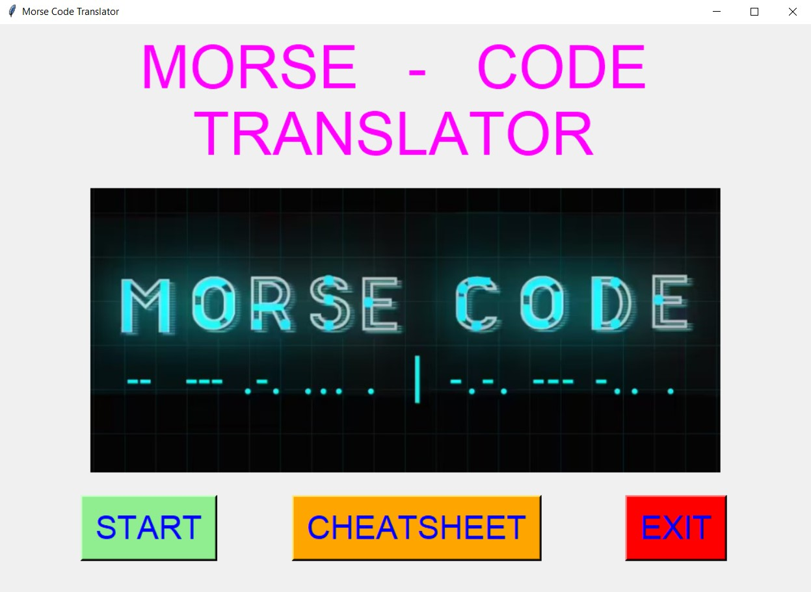
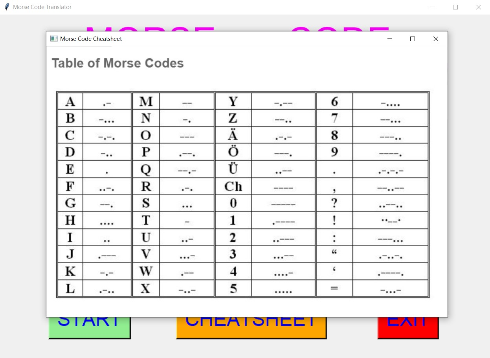
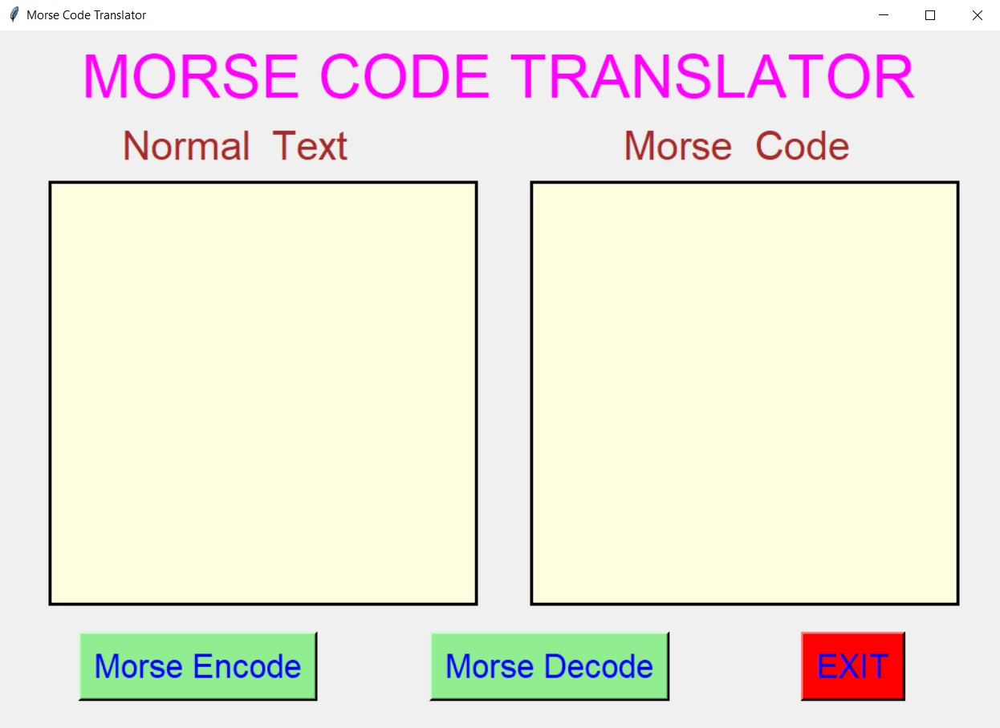
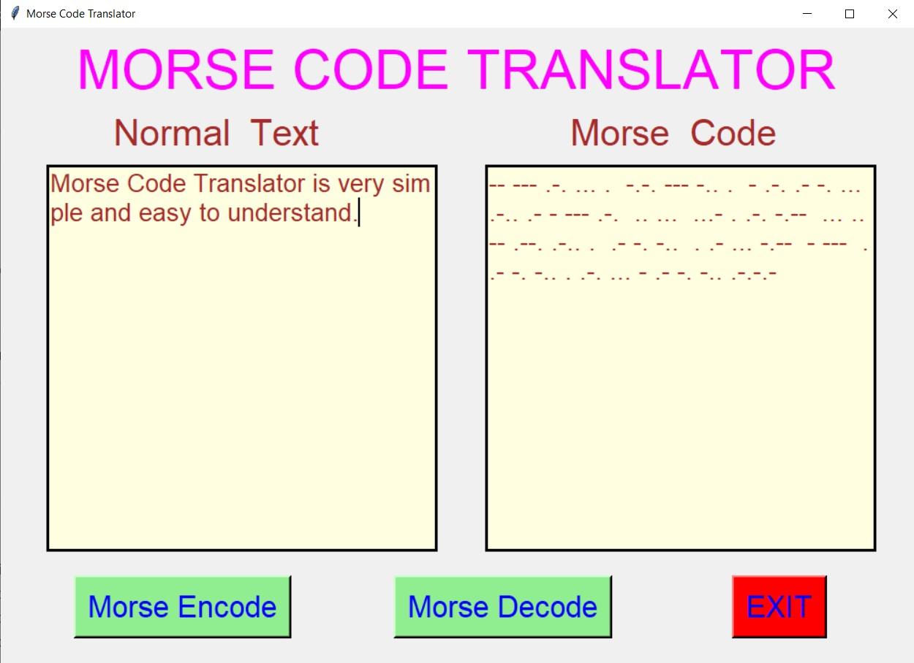
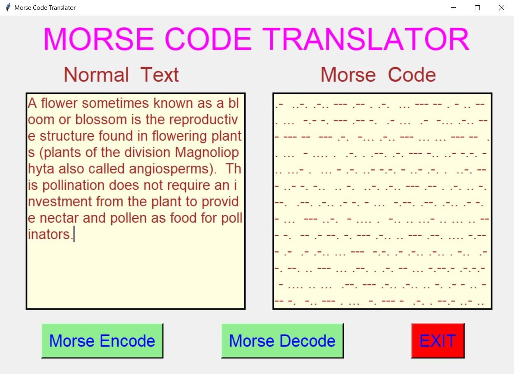
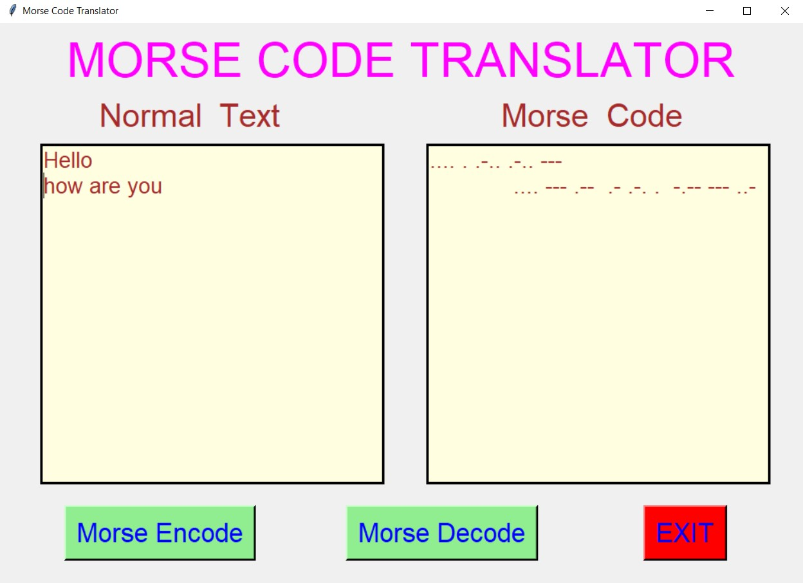
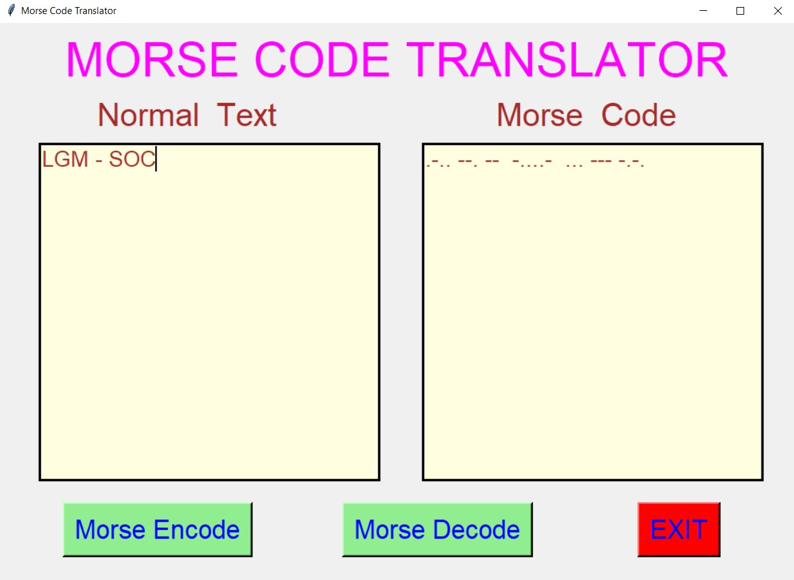

# ✔ MORSE CODE TRANSLATOR
- ### A "Morse Code Translator" is an application created in python with tkinter gui.
- ### In this application, user will be able to translate any normal text to its equivalent MORSE code, and vice versa.
- ### Along with that user will also be able to see the Morse Code Cheatsheet.

****

# REQUIREMENTS :
- ### python 3
- ### tkinter module
- ### from tkinter messagebox module
- ### from PIL import ImageTk, Image
- ### cv2

****

# How this Script works :
- ### User just need to download the file and run the morse_code_translator.py on their local system.
- ### Here user will be able to see the sample cheatsheet for basic morse code translation using CHEATSHEET button.
- ### Now on the main window of the application the user can click on the START button to get started with main application.
- ### On the new window, user will be able to see two text area one for Normal text and other one for Morse Code.
- ### Here user can enter any text in Normal text area and will be able to encode to Morse Code using MORSE ENCODE button.
- ### Also user will be able to translate any morse code to Normal text using MORSE DECODE button.
- ### Also there is an EXIT button, clicking on which exit dialog box appears asking for the permission of the user for closing the window.

# Purrpose :
- ### This scripts helps user to easily translate from Normal text to Morse Code or vice versa.

# Compilation Steps :
- ### Install tkinter, cv2
- ### After that download the code file, and run morse_code_translator.py on local system.
- ### Then the script will start running and user can explore it by entering the normal text translating it to equivalent Morse Code and vice versa.

****

# SCREENSHOTS :

****

   
   
   
   
   
   
   
   

****

# Author :
- ### Akash Ramanand Rajak
