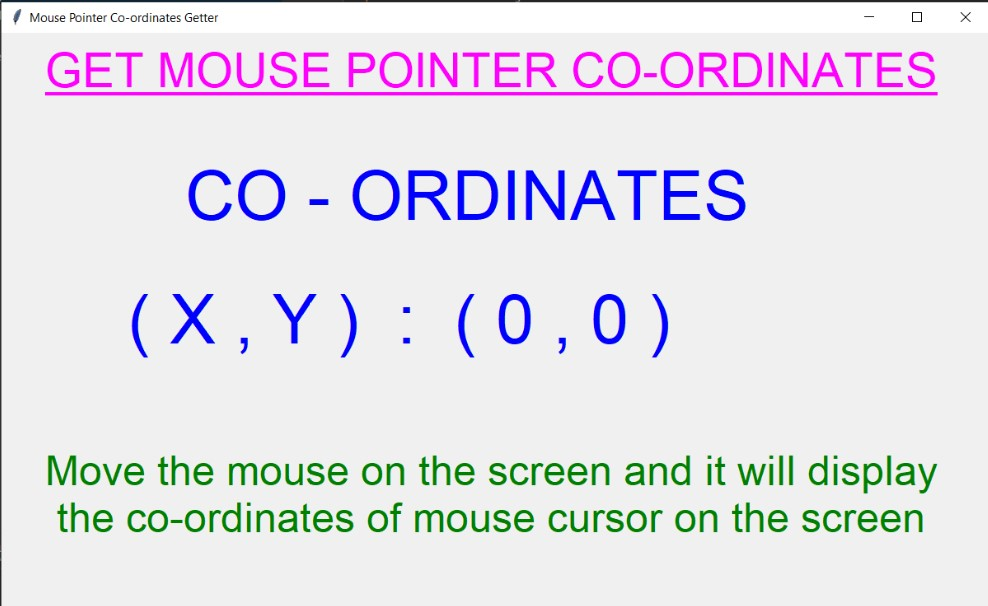
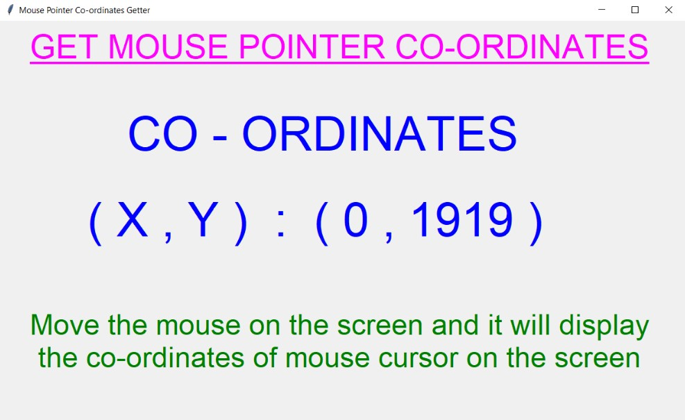
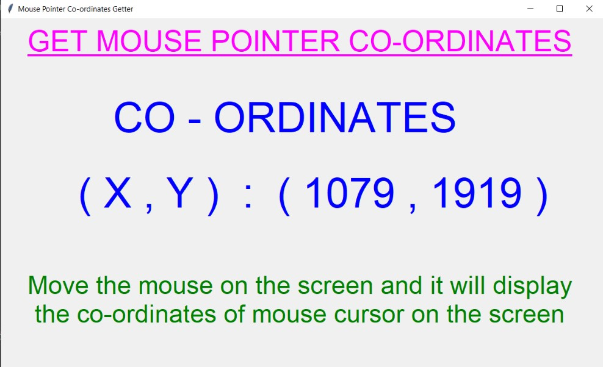
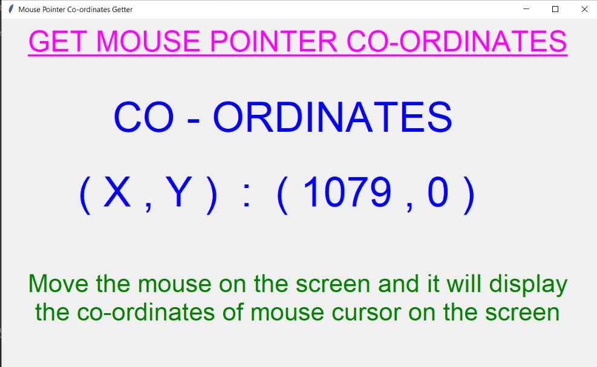
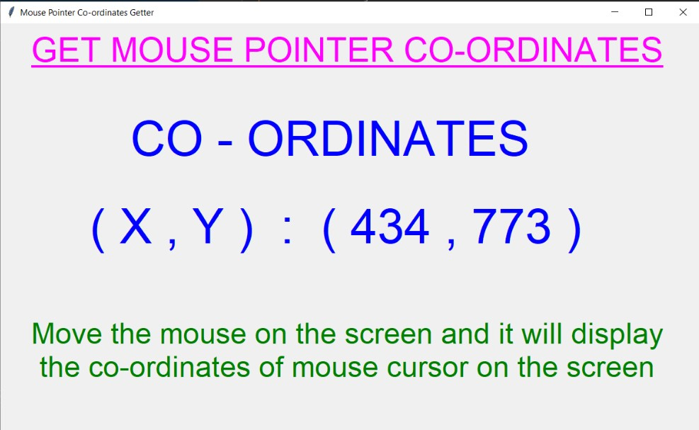
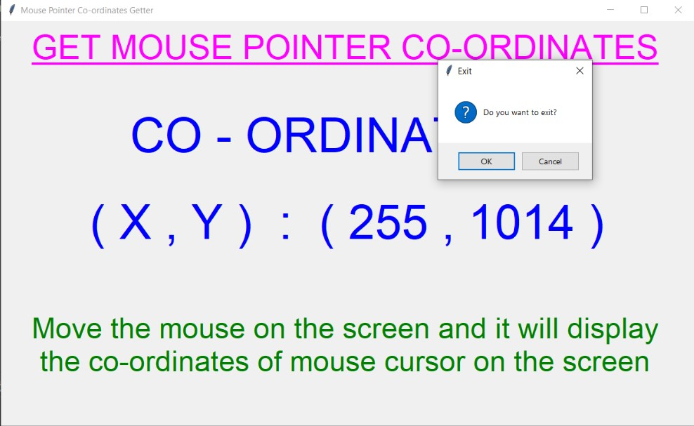

# ✔ MOUSE POINTER CO-ORDINATES GETTER
- ### A Mouse Pointer Co-ordinates Getter is an application created in python with tkinter gui.
- ### In this application, user can get the x,y co-ordinates of his/her mouse pointer on the screen.
- ### The co-ordinates will change accordingly as user moves the mouse.
- ### Using this user will also be able to see what's the height and widht of his/her PC or Computer screen. 

****

# REQUIREMENTS :
- ### python 3
- ### tkinter module
- ### from tkinter messagebox module
- ### pyautogui

****

# How this Script works :
- ### User just need to download the file and run the mouse_pointer_co-ordinates_getter.py on their local system.
- ### Now the main window of the application opens and user can move the mouse and will get the co-ordinates of each instant position of his/her mouse pointer on the screen.
- ### Also user can use this application to find the height and width of his/her screen of PC/computer.
- ### Also there is an exit button, clicking on which exit dialog box appears asking for the permission of the user for closing the window.

# Purpose :
- ### This scripts helps us to easily get the instant position of mouse pointer on the screen.

# Compilation Steps :
- ### Install tkinter, pyautogui
- ### After that download the code file, and run mouse_pointer_co-ordinates_getter.py on local system.
- ### Then the script will start running and get the co-ordinates as mentioned.
****

# SCREENSHOTS :

****

   
   
   
   
   
   

****

# Name :
- ### Akash Ramanand Rajak
