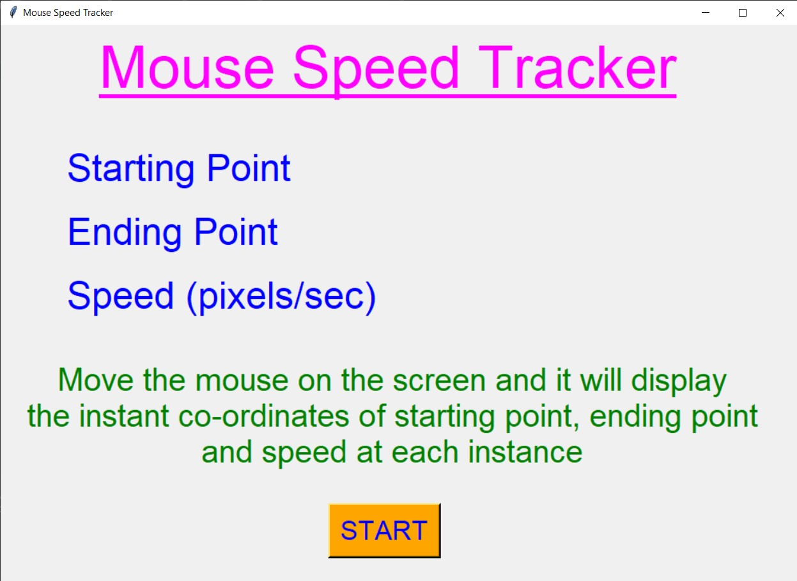
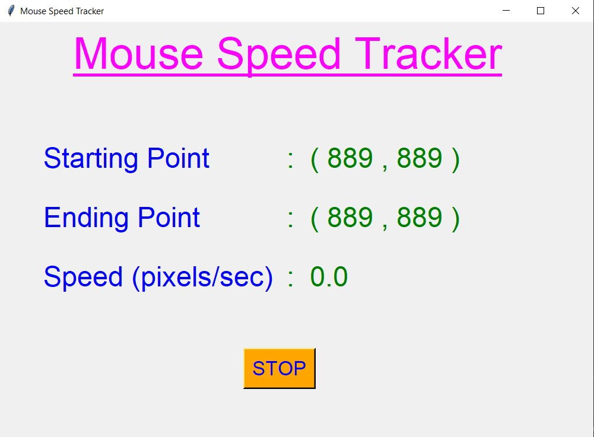
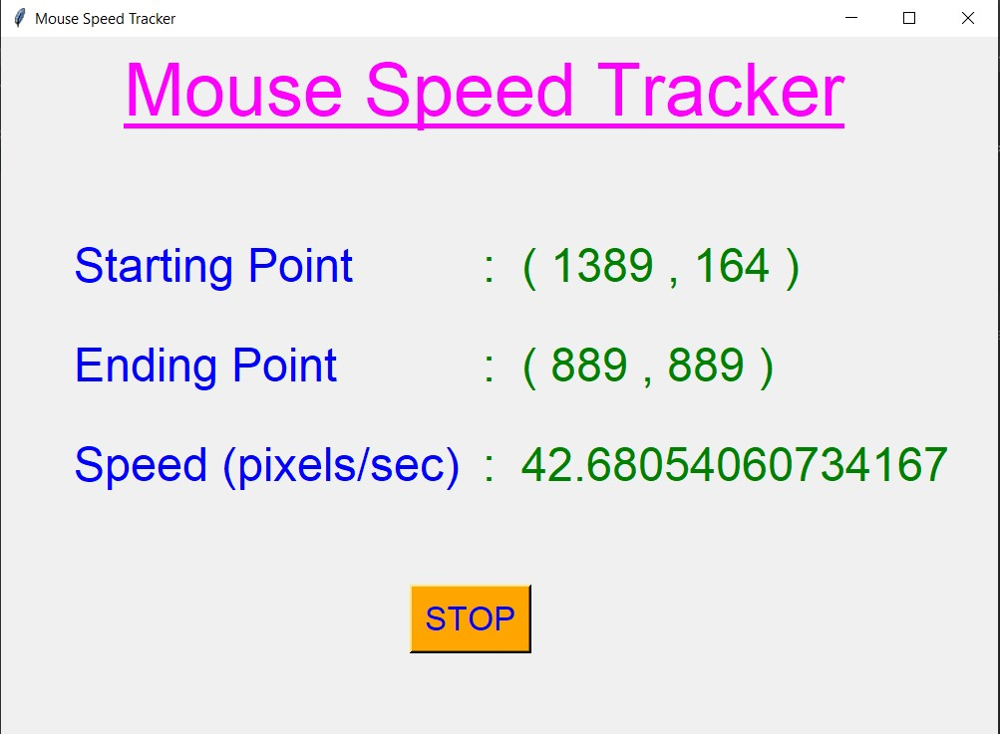
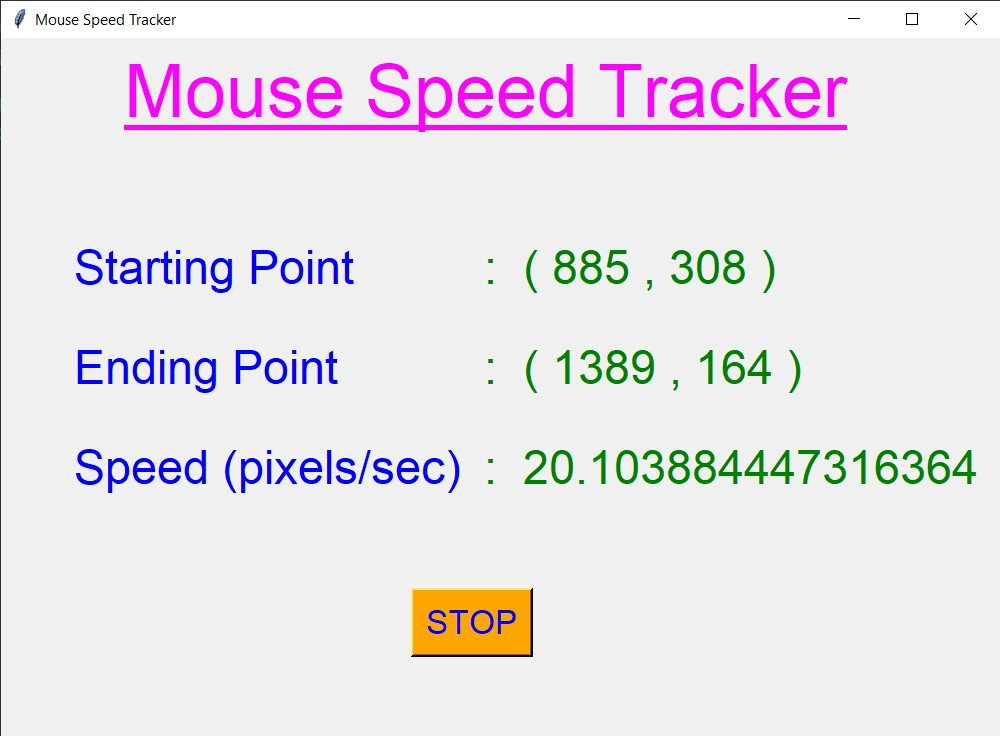
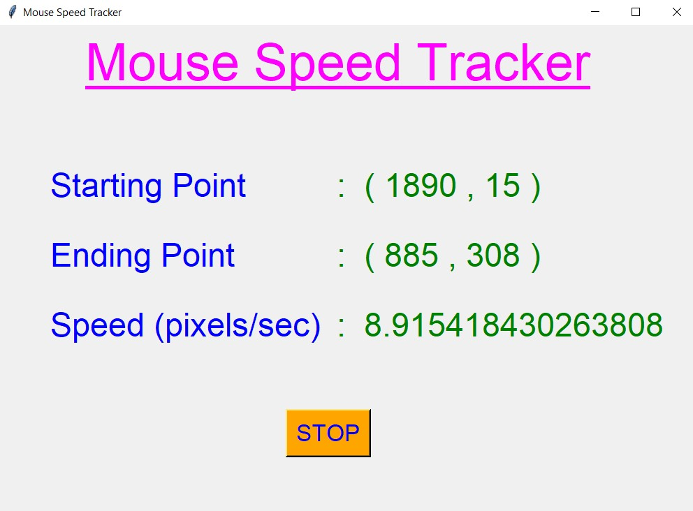
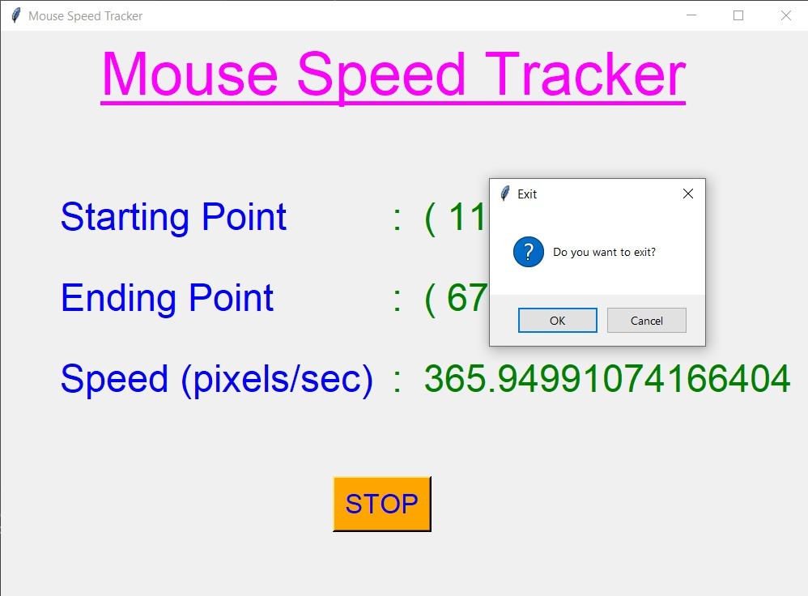

# ✔ MOUSE SPEED TRACKER
- ### A Mouse Speed Tracker is an application created in python with tkinter gui.
- ### In this application, user can get the x,y co-ordinates of starting point of mouse, ending point and also the speed with which the mouse has been taken from starting point to ending point.
- ### The speed will be displayed in pixels/sec.

****

# REQUIREMENTS :
- ### python 3
- ### tkinter module
- ### from tkinter messagebox module
- ### sys
- ### math
- ### time
- ### PyQt5.QtGui import QCursor
- ### PyQt5.QtWidgets import QApplication

****

# How this Script works :
- ### User just need to download the file and run the mouse_speed_tracker.py on their local system.
- ### Now the main window of the application opens and user can start the application using start button.
- ### User can get the x,y co-ordinates of starting point of mouse, ending point and also the speed with which the mouse has been taken from starting point to ending point.
- ### The speed will be displayed in pixels/sec.
- ### Also there is an stop button, clicking on which exit dialog box appears asking for the permission of the user for closing the window.

# Purpose :
- ### This scripts helps us to easily get the instant position of start and end point of mouse pointer on the screen, and also the speed between this point.

# Compilation Steps :
- ### Install tkinter, sys, time, math, PyQt5
- ### After that download the code file, and run mouse_speed_tracker.py on local system.
- ### Then the script will start running and get the speed of the mouse pointer.
****

# SCREENSHOTS :

****

   
   
   
   
   
   

****

# Name :
- ### Akash Ramanand Rajak
