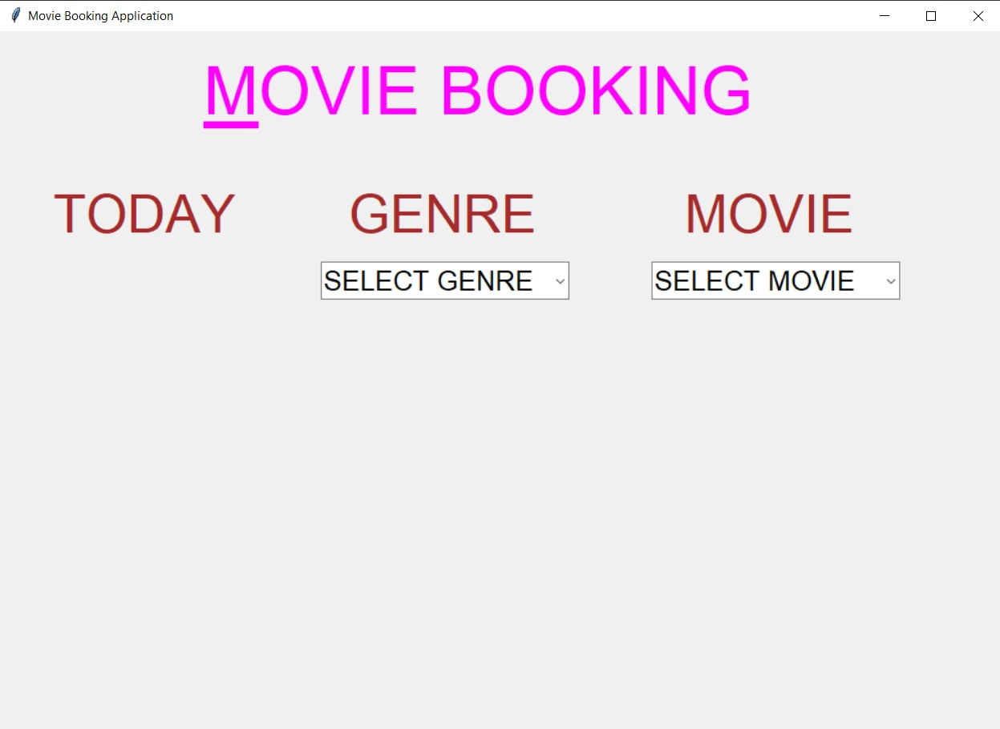
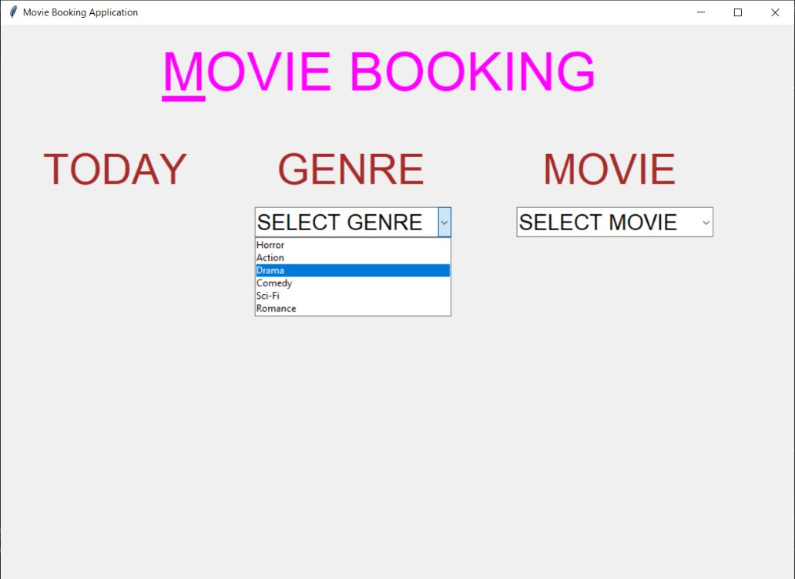
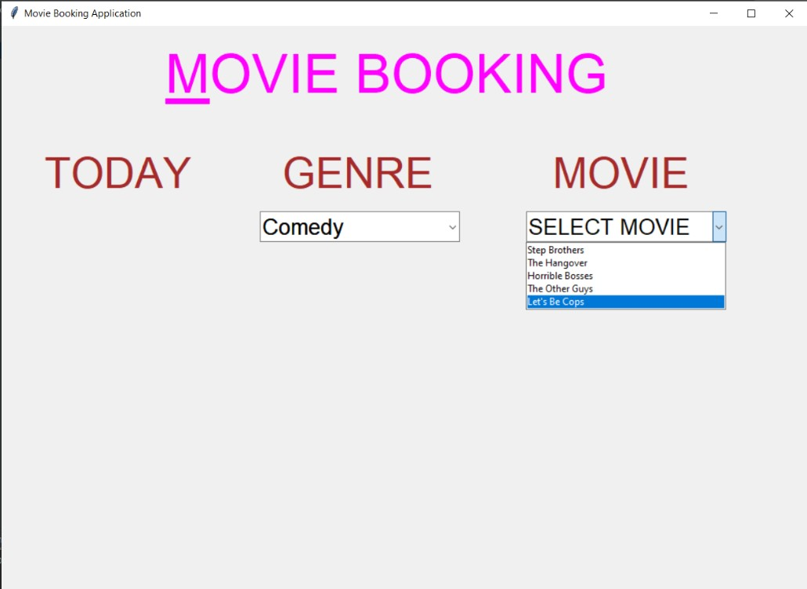
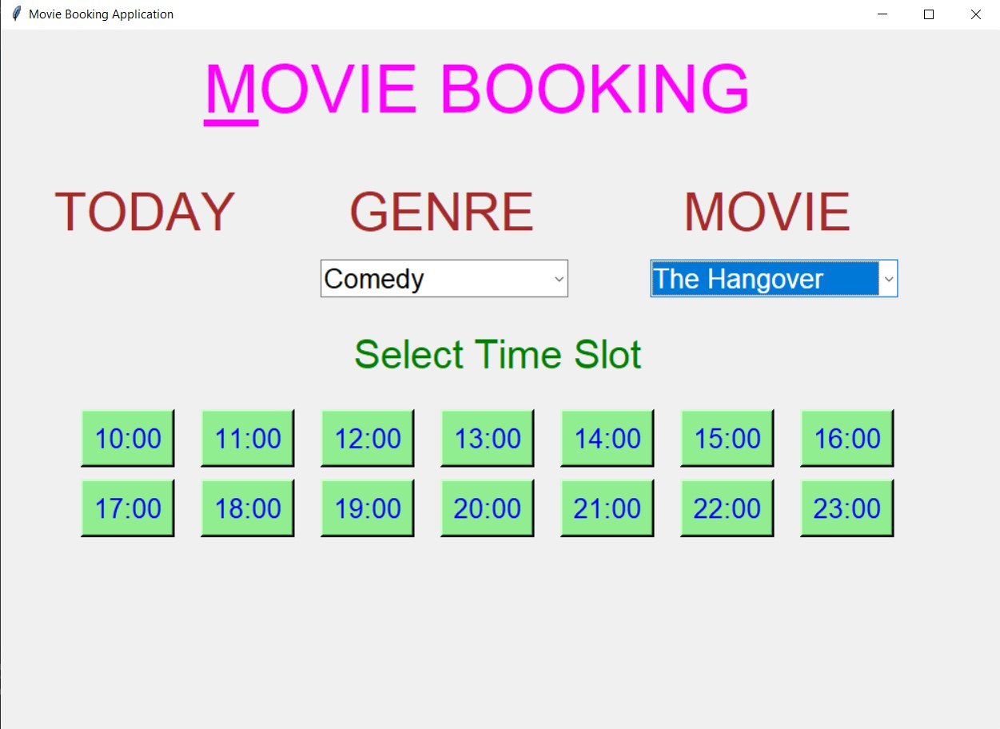
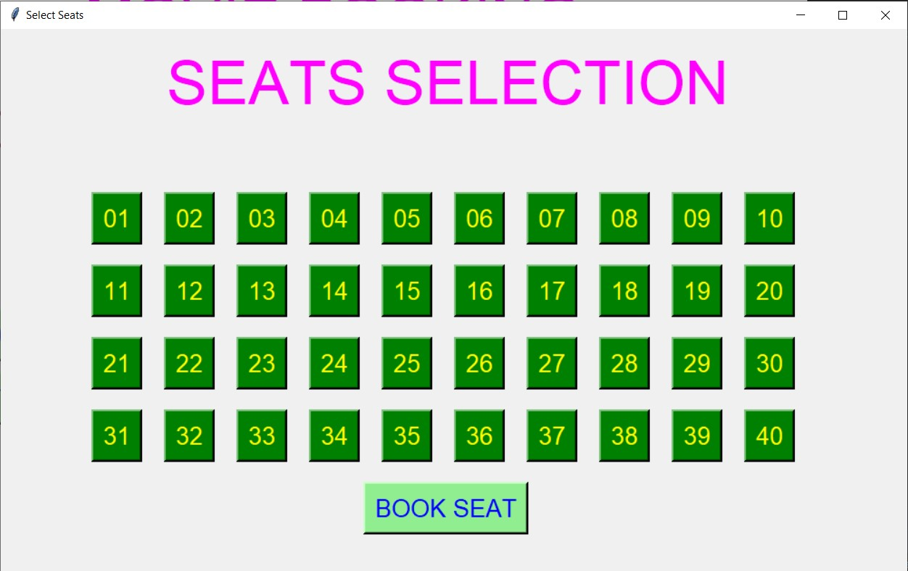
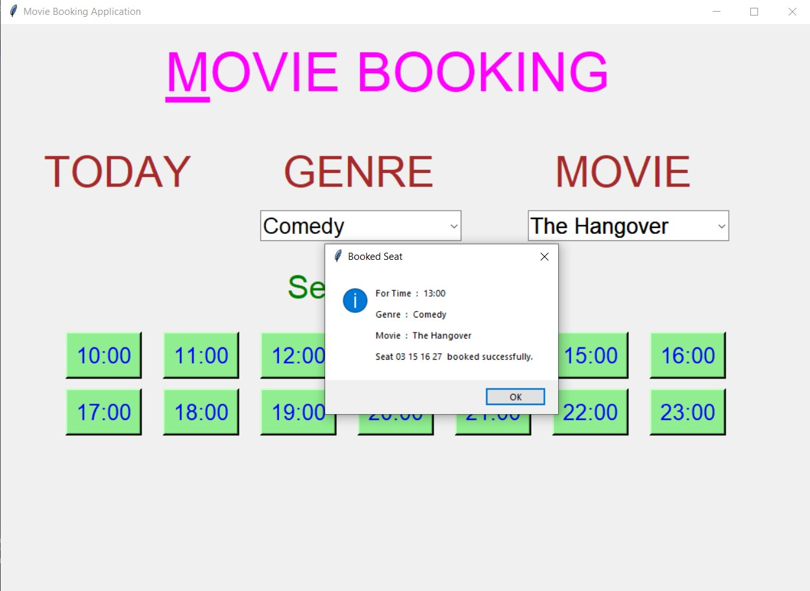
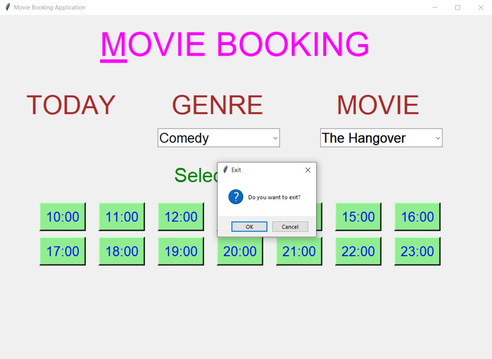

# ✔ MOVIE BOOKING APPLICATION
- ### A Movie Booking Application created in python with tkinter gui.
- ### In this game, the user can select the movie genre, movie name, select time of his/her choice, and also can select seats in theatre of his/her choice.
- ### At After booking the seat, user will get the message about details of his/her booking.

****

# REQUIREMENTS :
- ### python 3
- ### tkinter module
- ### from tkinter messagebox module

****

# How this Script works :
- ### User just need to download the file and run the movie_booking_application.py on their local system.
- ### Now on the main window of the game the user will asked to select his/her Movie Denre Choice and then also ask to select movie Name.
- ### After selecting both, time selecting option wil appear, in which user can select any time of his/her choice.
- ### After user has selected the time slots, on pop up window will open asking user to select the seats he/she wants to book.
- ### After that when user clicks on the BOOK SEAT, he/she will get the message of his/her booking details.

# Purpose :
- ### This scripts helps us to get the idea of how the movie tickets are booked online.

# Compilation Steps :
- ### Install tkinter, python3
- ### After that download the code file, and run movie_booking_application.py on local system.
- ### Then the script will start running and user can explore and book movie tickets of his/her own choice of movie and genre.

****

# SCREENSHOTS :

****

   
   
   
   
   
   
   

****

# Below is also a sample video of how application works :

   

****

# Name :
- ### Akash Ramanand Rajak
