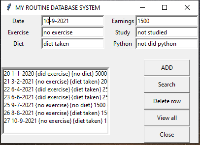
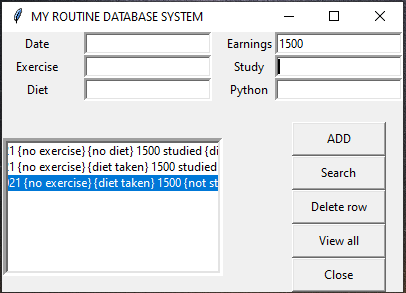

# Project Title
## My-Routine-Database-System
## Aim
The main aim of this project is to create a user interactable database where the user can store the log of their routines through a graphical user interface.
## Description
This My Routine Database System is a desktop application where we can update our daily routine. The frontend of this project is made up of Tkinter. The widgets used in development of this frontend are Label, Entry, Listbox, and Button. The backend of the project is developed with MYSQL. Here in this application we can add data, we can delete a particular data, we can view the data as a whole or we can also search by a particular data. Finally we can close the application by using close button.
## The widgets used in development of this frontend are
* Label
* Entry
* Button
* Listbox
## Prerequisites
* Firstly you need to have a Python 3.x in your PC, you can [download here](https://www.python.org/downloads/)
* Install Tkinter packer for that use command "pip install tkinter"
* You have to setup MYSQL database. For that you need to [download MYSQL here](https://www.mysql.com/downloads/)
* Next you have to install mysql.connector, for that go to command promt and use this command "pip3 install mysql-connector"
## Workflow of the project
* Give the required inputs in the entry widgets provided in the window.
* If we want add that data to the database then we have to click on the ADD button widget.
* If we want to view all the data at a whole then click on the View all button widget.
* If we want to delete a particular row then select the row and click Delete row button widget.
* If we want to search for a particular data then give that data as input and click on a Search button widget.
* Finally to close the window click on Close button widget.
## Sample output

## Contributor
#### @LasyaGanesuni
