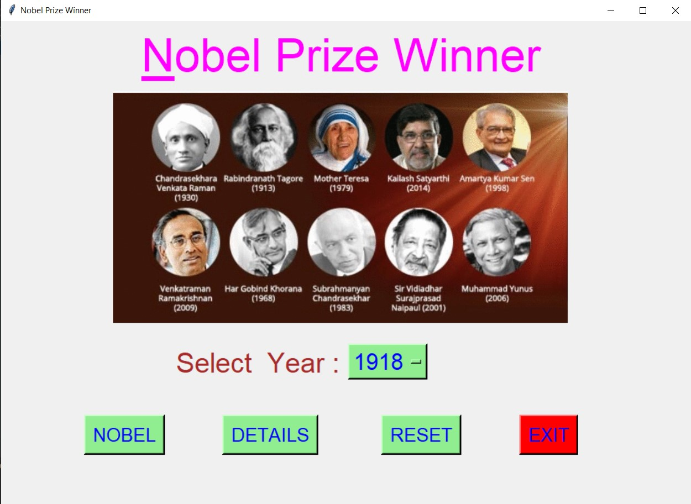
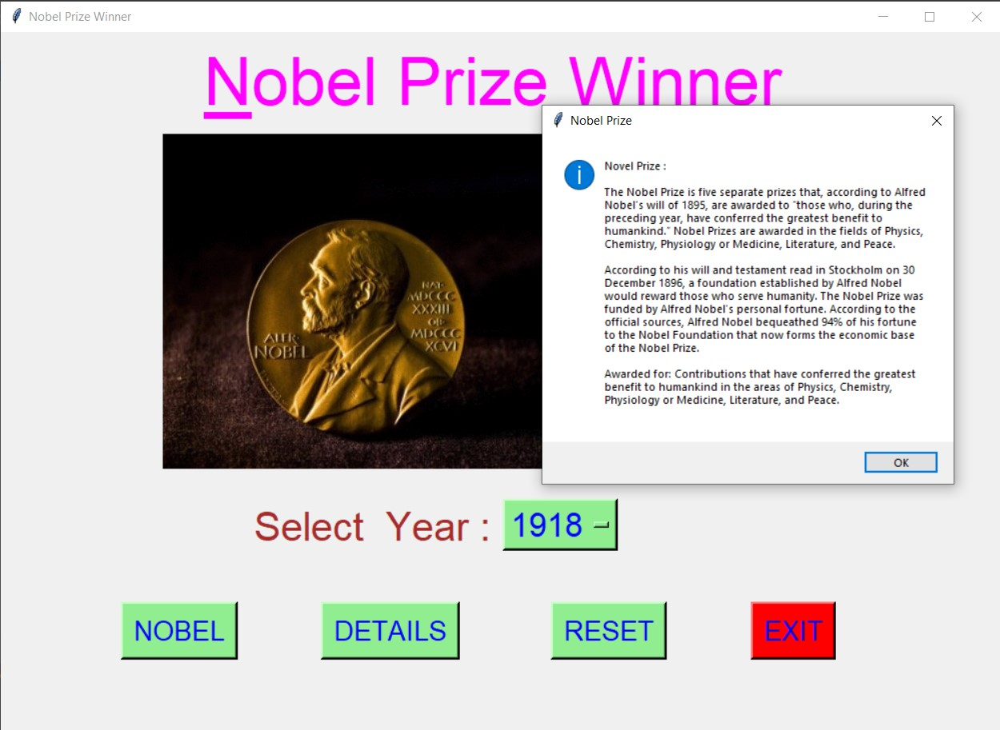
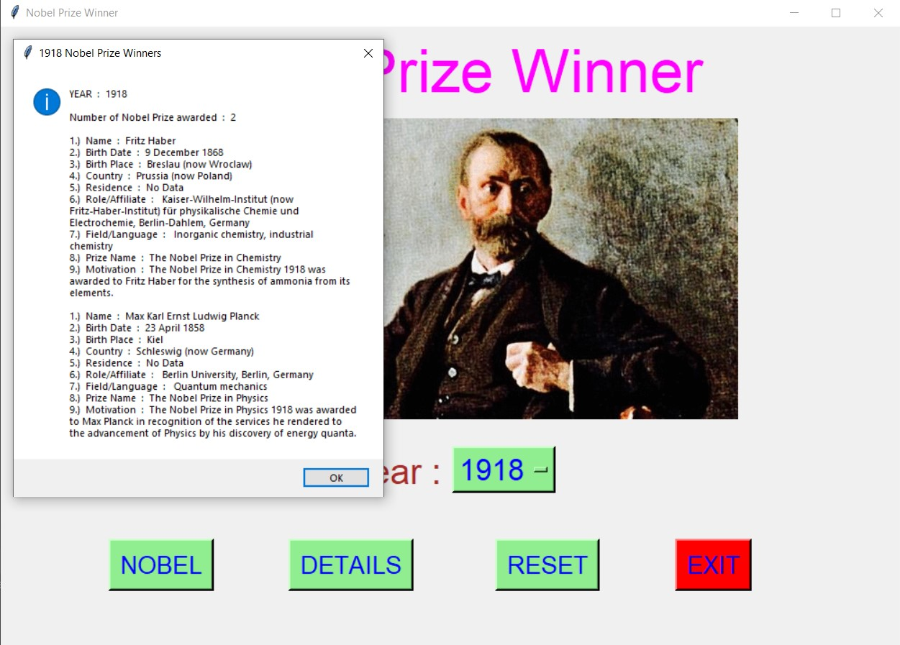
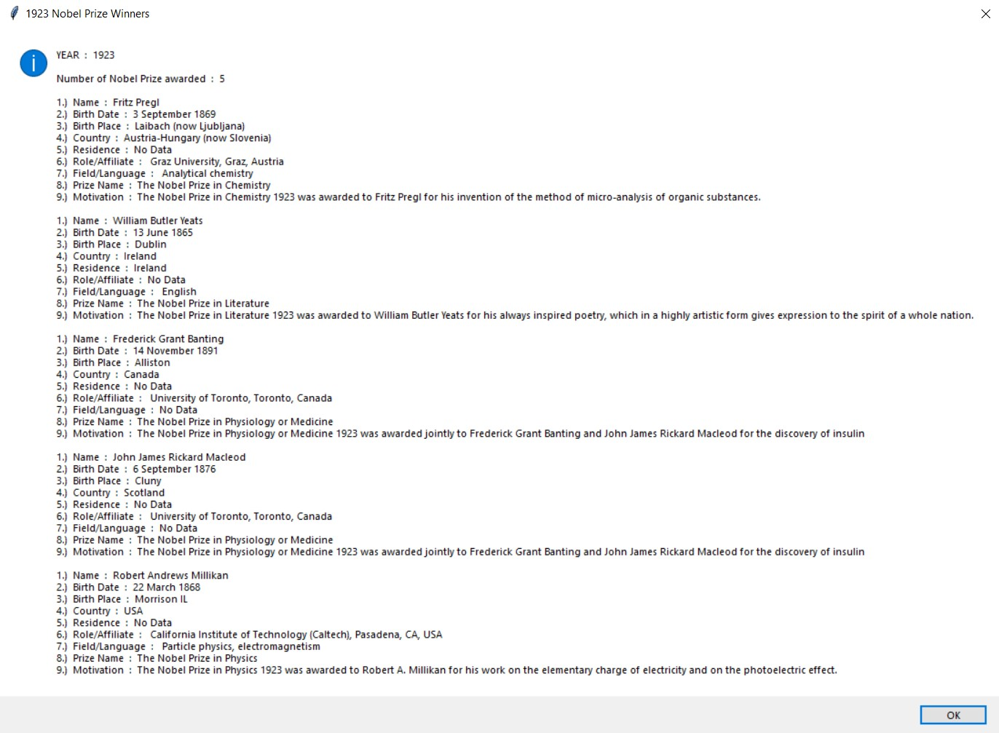
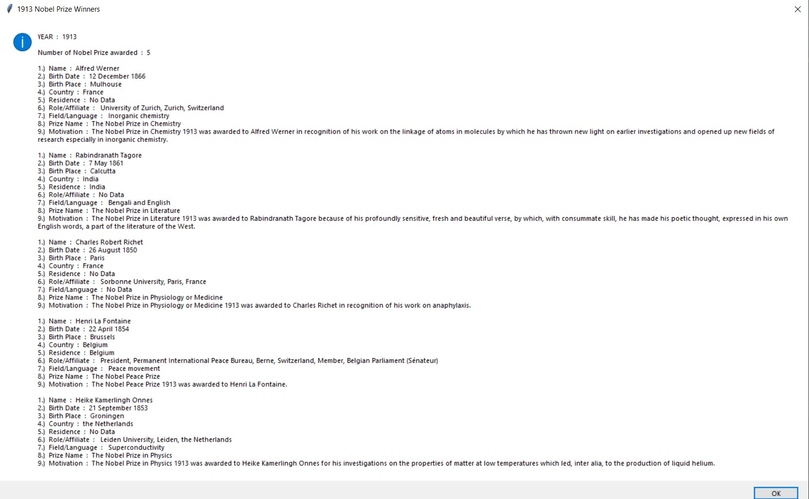
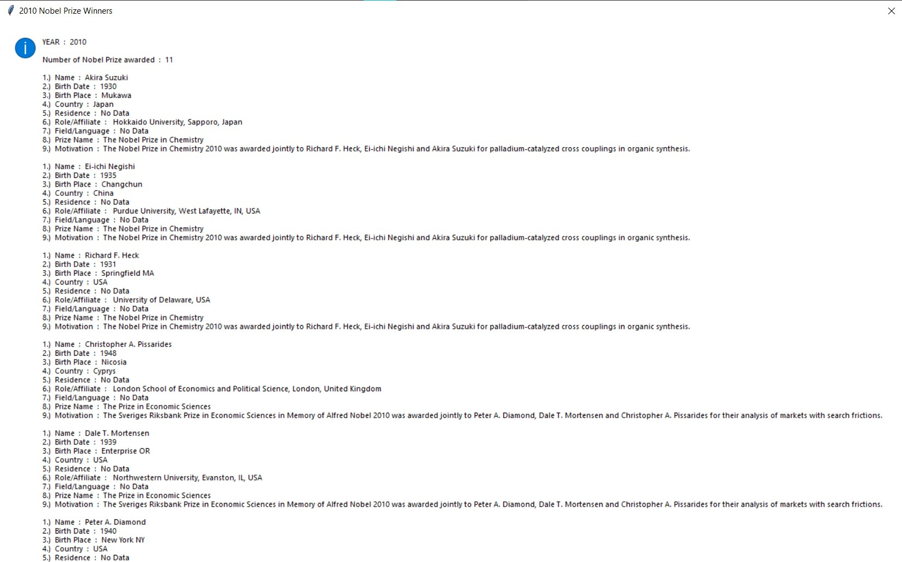
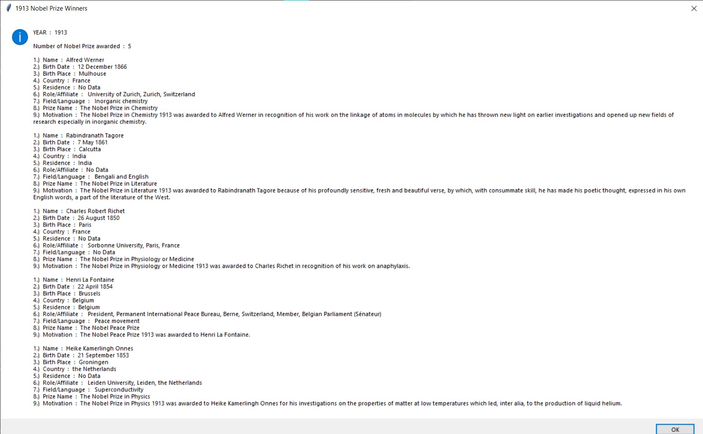
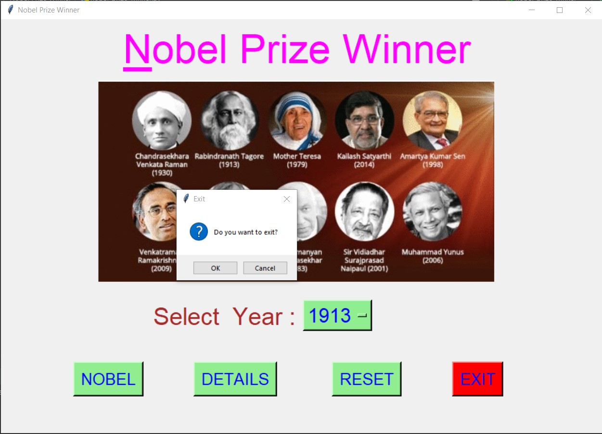

# ✔ NOBEL PRIZE WINNER
- ### A "Nobel Prize Winner" is an application created in python with tkinter gui.
- ### In this application, user can find the details about how many Nobel Prize were awarded in any year from 1901 to 2010.
- ### The details for each Nobel Prize Winner will be in terms their names, their Birth Date, their Birth Place, form which Country, their Residence,  their Role/Affiliate, their Field/Language, Prize Name, what was their Motivation.
- ### for the data, used the nobel.csv data, and read using pandas library.

****

# REQUIREMENTS :
- ### python 3
- ### tkinter module
- ### from tkinter messagebox module
- ### pandas

****

# How this Script works :
- ### User just need to download the file and run the nobel_prize_winner.py on their local system.
- ### Now on the main window of the application the user needs to select the year from the drop down OptionMenu.
- ### After user has chosen the year, when user clicks on the DETAILS button, he/she will be able to see the details about Number of Nobel Prize awarded in that selected year and for each years it will show detailed information about their names, their Birth Date, their Birth Place, form which Country, their Residence,  their Role/Affiliate, their Field/Language, Prize Name, what was their Motivation.
- ### Also there is a NOBEL button, clicking on which shows What is Nobel Prize and when it was started.
- ### Also there is a reset button, clicking on which user can resets both the Option Menu to default year 1901.
- ### Also there is an exit button, clicking on which exit dialog box appears asking for the permission of the user for closing the window.

# Purrpose :
- ### This scripts helps us to easily get every details about how many Nobel Prize were awarded in any year from 1901 to 2010.

# Compilation Steps :
- ### Install tkinter, pandas
- ### After that download the code file, and run spacex_mission_detailernobel_prize_winner.py on local system.
- ### Then the script will start running and user can explore each year's Nobel Prize Winner with many details.

****

# SCREENSHOTS :

****

   
   
   
   
   
   
   
   

****

# Author :
- ### Akash Ramanand Rajak
