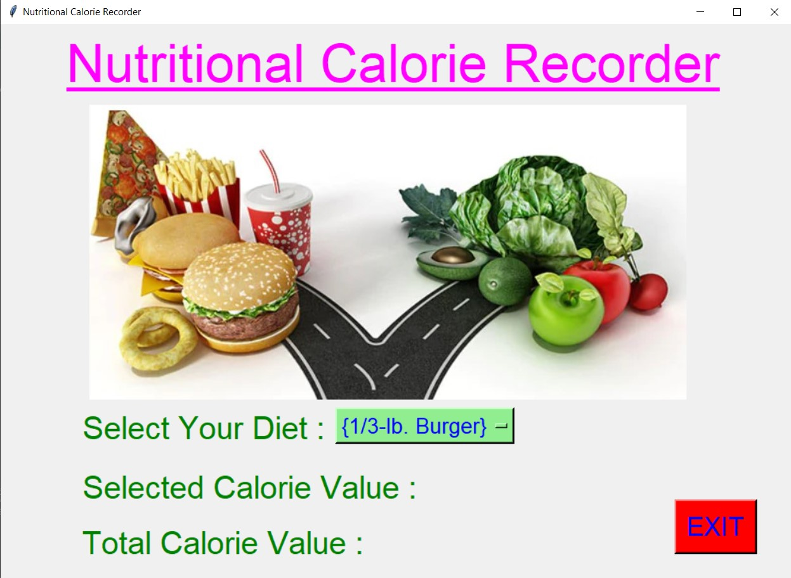
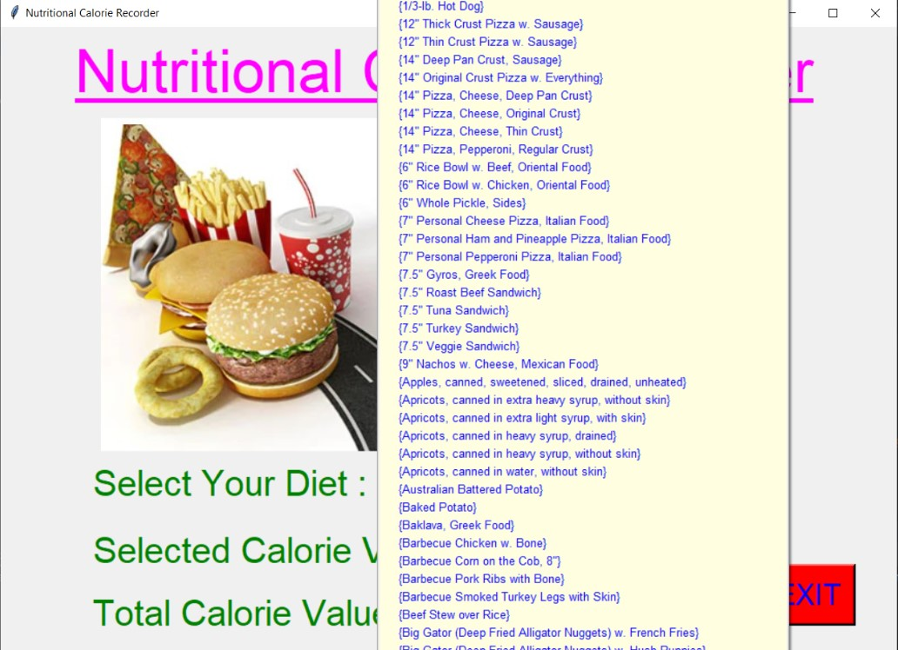
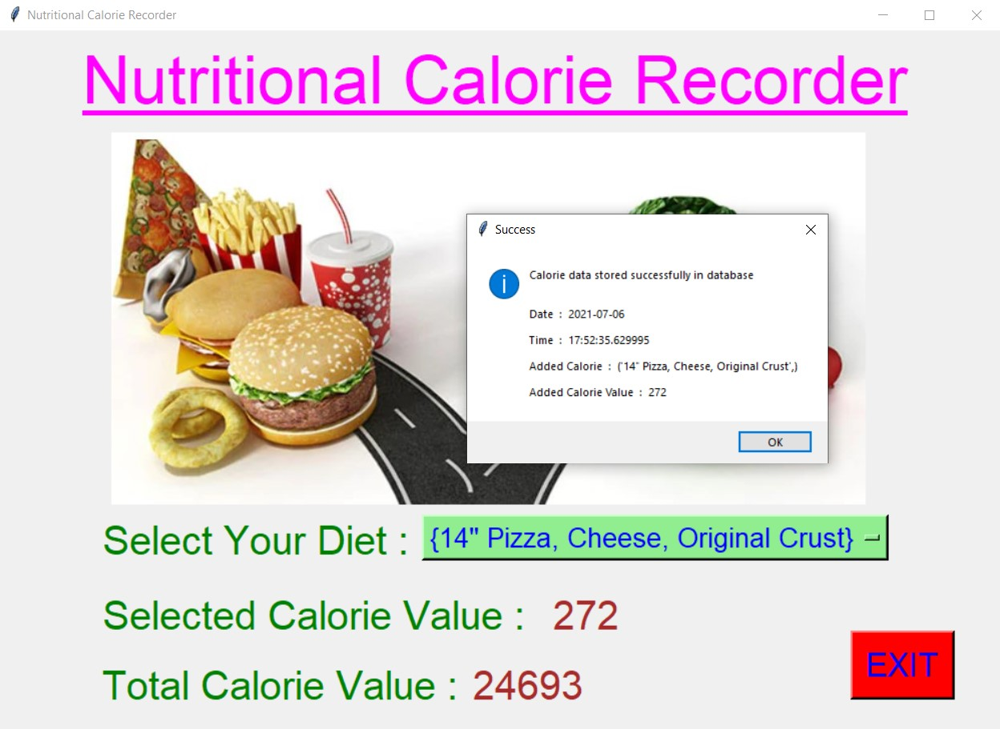
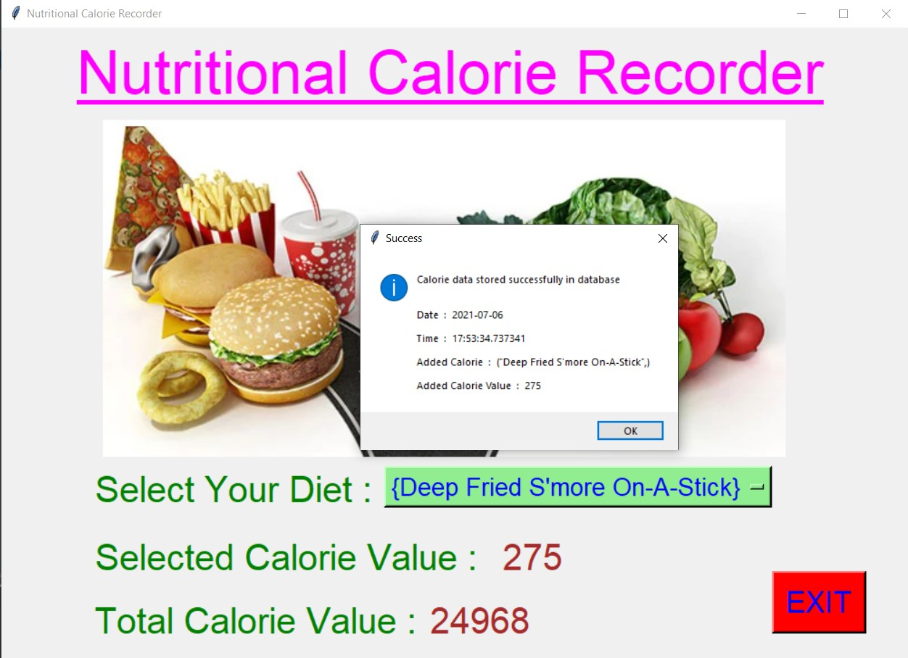
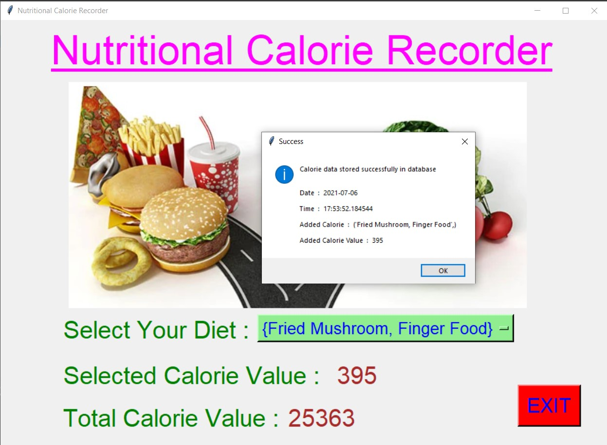
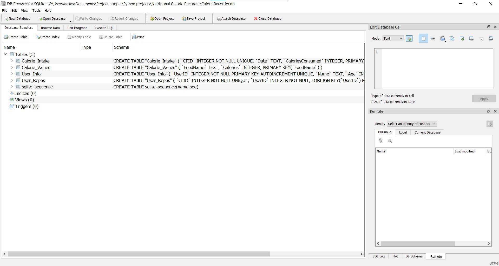
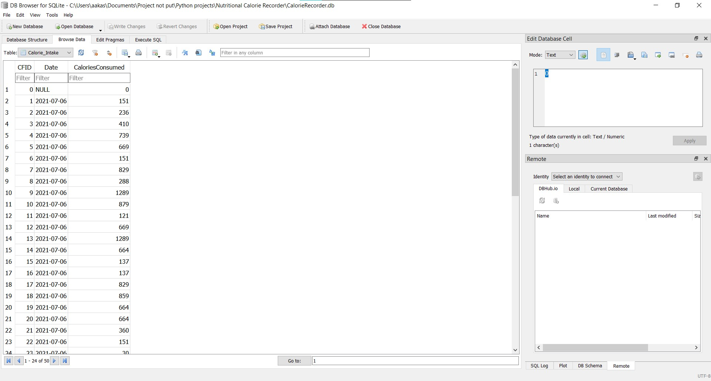
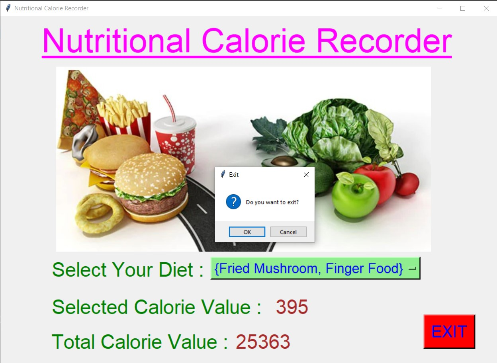

# ✔ NUTRITIONAL CALORIE RECORDER
- ### A "Nutritional Calorie Recorder" is an application created in python with tkinter gui.
- ### In this application, user can get the full hands on idea about how much total calories he/she has consumed till now, and also how much calories he/she is consuming on taking the current food meal.
- ### Every time when user takes certain meals, he/she just need to select that meal from the option menu, and at the same time he calorie of the selected food will be stored in the database "CalorieRecorder.db".
- ### Also when user select the meal, he/she gets the details through message box about, Data stored successfully in database, On what day it was stored, At what time, What was the meal and what was the calorie value for that meal.
- ### Thus using this application user can keep track of daily calories consumption.

****

# REQUIREMENTS :
- ### python 3
- ### tkinter module
- ### from tkinter messagebox module
- ### from PIL import Image, ImageTk, ImageDraw
- ### datetime
- ### sqlite3

****

# How this Script works :
- ### User just need to download the file and run the nutritional_calorie_recorder.py on their local system.
- ### Now on the main window of the application the user needs to select the meal that he/she will take that day at that time.
- ### After user has selected the food meal, he/she will be able to see the calorie value of that meal, and the total calories he/she had comsumed till now.
- ### Also when user select the meal, he/she gets the details through message box about, Data stored successfully in database, On what day it was stored, At what time, What was the meal and what was the calorie value for that meal.
- ### Thus using this application user can keep track of daily calories consumption.
- ### Also there is an exit button, clicking on which exit dialog box appears asking for the permission of the user for closing the window.

# Purrpose :
- ### This scripts helps user to easily track the daily calorie consumption and can stay healthy accordingly.

# Compilation Steps :
- ### Install tkinter, PIL, datetime, sqlite3
- ### After that download the code file, and run nutritional_calorie_recorder.py on local system.
- ### Then the script will start running and user can explore the application and can track the daily calorie consumption.

****

# SCREENSHOTS :

****

   
   
   
   
   
   
   
   

****

# Author :
- ### Akash Ramanand Rajak
