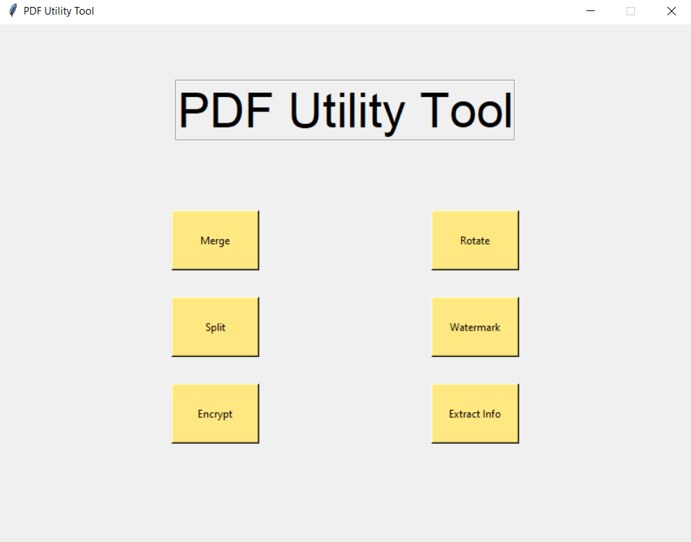
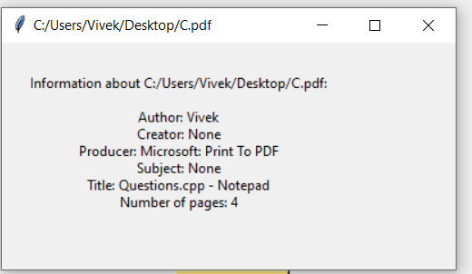

# PDF Utility Tool

## Aim

Work with PDFs offline and make changes to the pdfs in a GUI.

## Purpose

This tool makes it easy to perform the following operations:

- PDF Splitting
- Merge two PDFs
- Encrypt a PDF
- Add Watermark
- Rotate PDF

## Short description of package/script

- This PDF tool utilizes `PyPDF` module to work with PDF
- The GUI is made with the `tkinter`.

## Setup instructions

To install the dependencies
`pip install PyPDF2`

To run the script
`python main.py`

- A GUI will open up, select the option and follow the instruction
- The Output PDF will be generated in the current working directory.

## Output

 

 

## Author(s)

[Vivek](https://github.com/vivekthedev)
