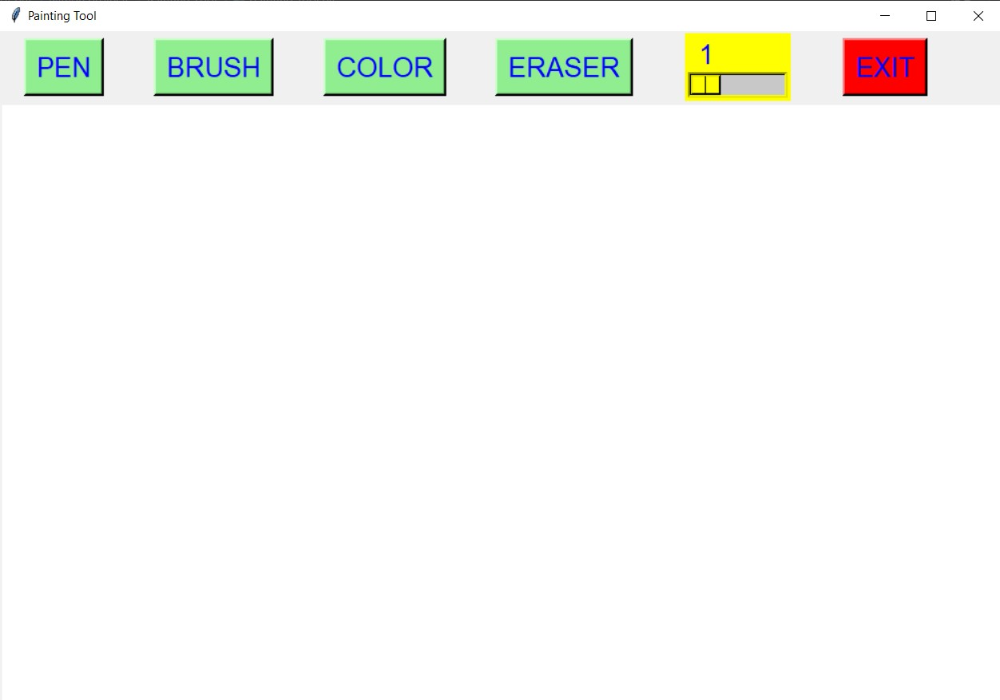
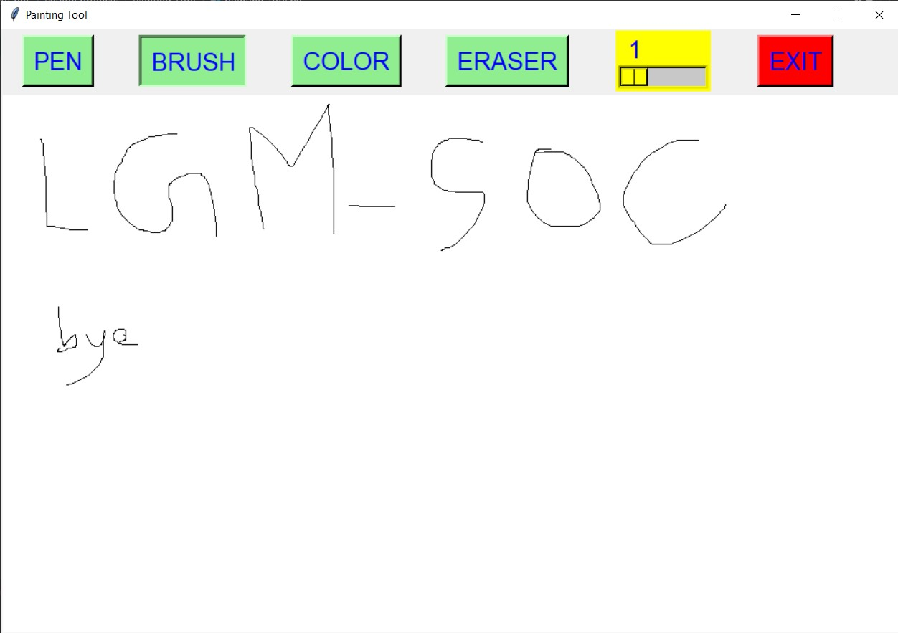
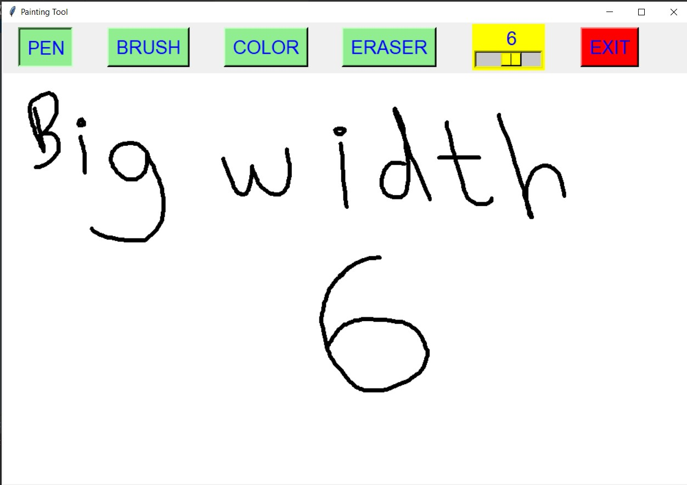
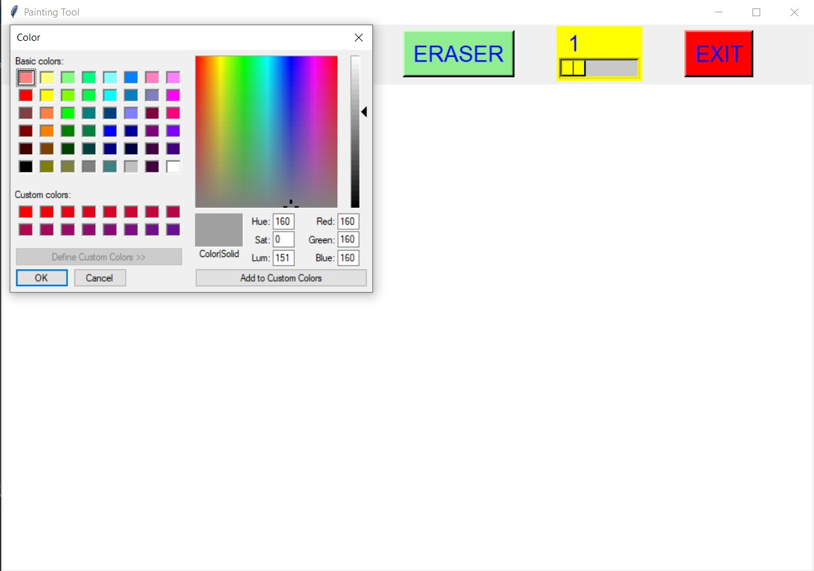
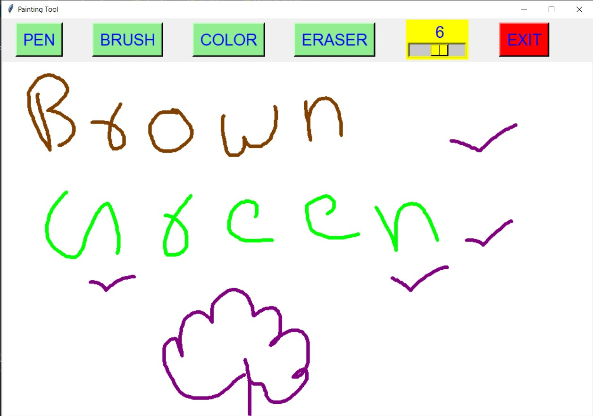
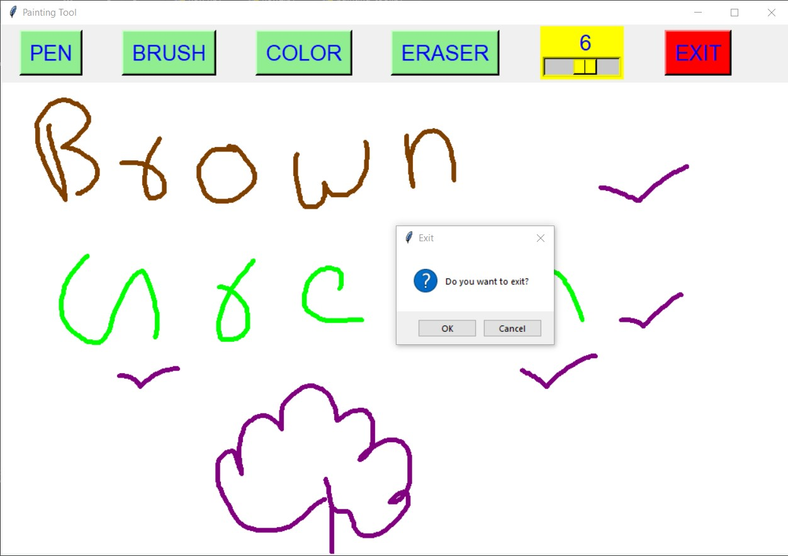

# ✔ PAINTING TOOL
- ### A Paintng Tool is an simple paint application created in python with tkinter gui.
- ### In this application user will be given a drawing area along with button like PEN, BRUSH, COLOUR, ERASER and EXIT.
- ### Using PEN button, user can select the pen and start drawing or writing a freehand design.
- ### Using BRUSH button, user can select brush and start drawing.
- ### User can also select the colour of his/her choices and also can erase after drawing.
- ### Also user can change the width of PEN, using scale which is provided of length 10, and user can set any width of PEN from 1 to 10.

****

# REQUIREMENTS :
- ### python 3
- ### tkinter module
- ### from tkinter messagebox module
- ### from tkinter.colorchooser import askcolor

****

# How this Script works :
- ### User just need to download the file and run the painting_tool.py on their local system.
- ### Now on the main window of the application, there will be different button and a drawing area below it.
- ### User first need to select the PEN, inorder to draw anything on the drawing area.
- ### By default the width of PEN will be 1, and user can chenge it using scale provided to him(from 1 to 10).
- ### Also the colour of PEN will be black by default, which user can change using the COLOUR button.
- ### Clicking on the colour a pop up window of many colour will open, and user can choose any one and click on OK.
- ### Also there is choice to user to draw using brush, which user can get using BRUSH button. 
- ### Also there is an exit button, clicking on which exit dialog box appears asking for the permission of the user for closing the window.

# Purpose :
- ### This scripts helps us to draw any free-handed design of any width, any colour and can erase also.

# Compilation Steps :
- ### Install tkinter, python3
- ### After that download the code file, and run painting_tool.py on local system.
- ### Then the script will start running and user can explore and play with it by drawing any free-handed design.

****

# SCREENSHOTS :

****

   
   
   
   
   
   

****

# Below is the link to sample video of how this painting tool works :

   

# Name :
- ### Akash Ramanand Rajak

