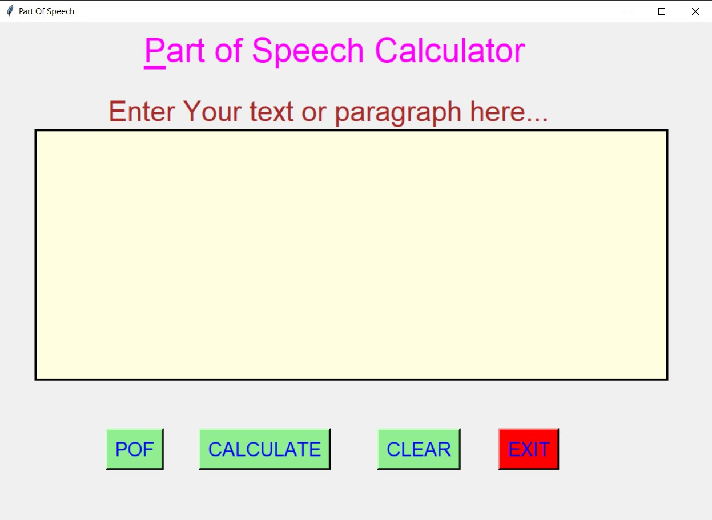
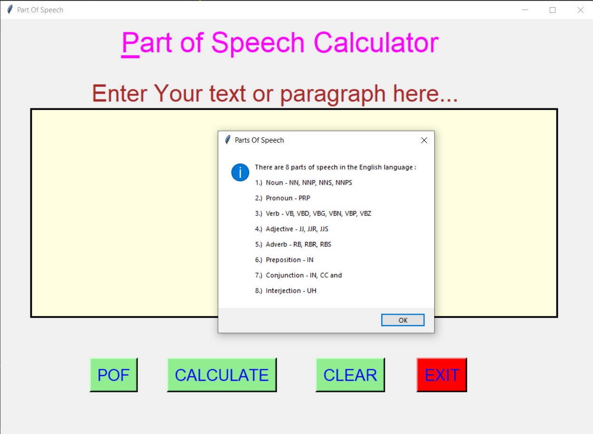
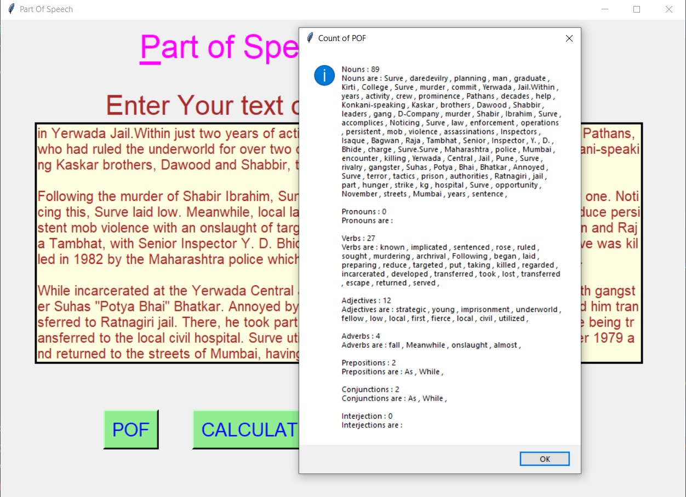
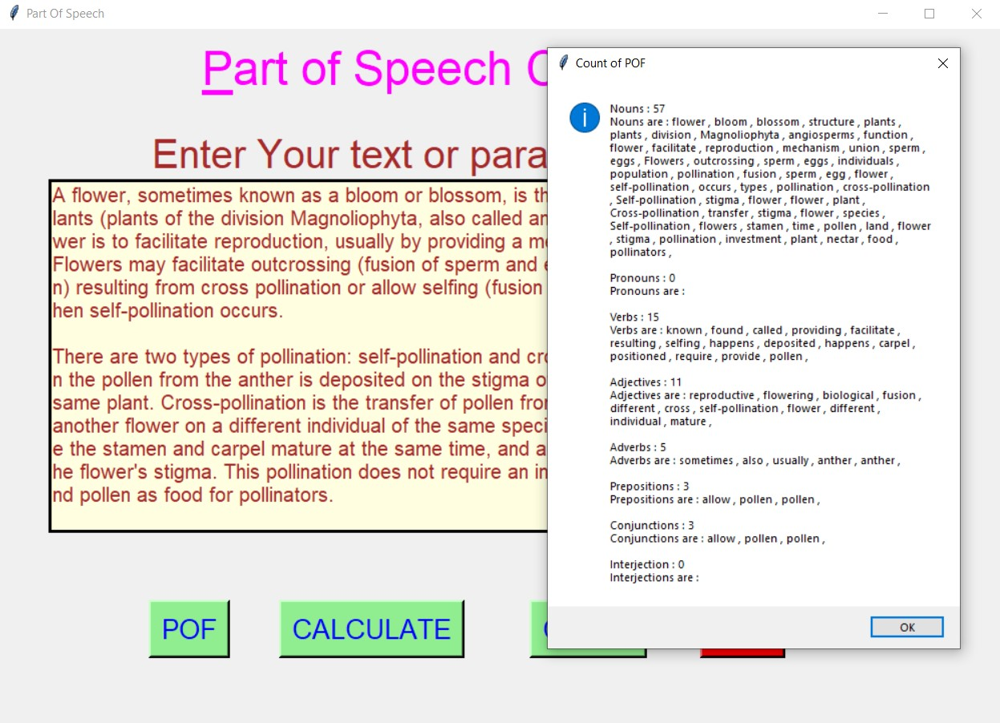
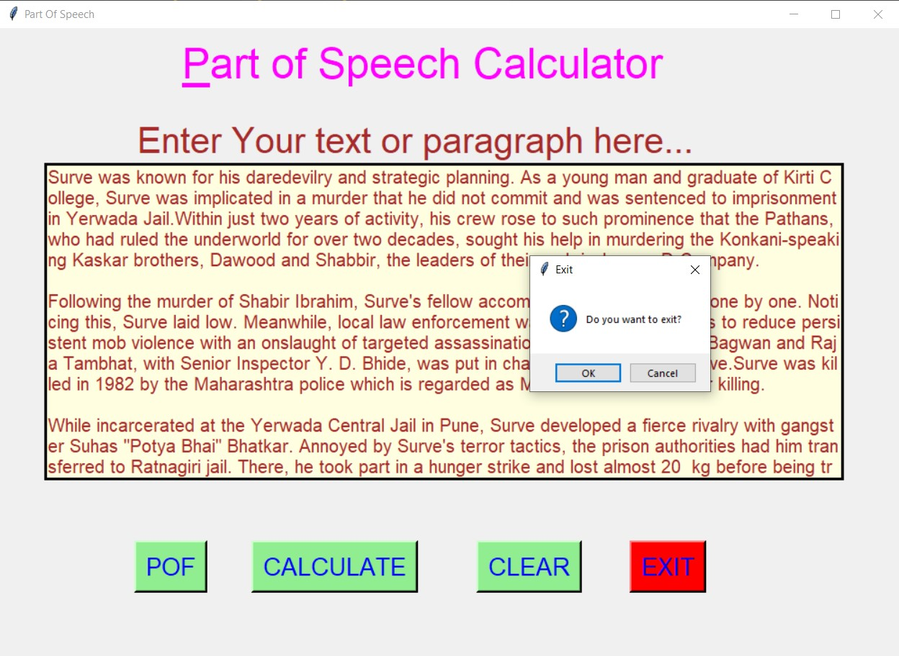

# ✔ PART OD SPEECH CALCULATOR
- ### A Part of Speech Calculator is an application created in python with tkinter gui.
- ### In this application user can enter any text or sentence or paragraph, and will be able to get the count of each part of speech and what are they.

****

# REQUIREMENTS :
- ### python 3
- ### tkinter module
- ### from tkinter messagebox module
- ### PIL module
- ### nltk
- ### from nltk.corpus import stopwords
- ### from nltk.tokenize import word_tokenize, sent_tokenize

****

# How this Script works :
- ### User just need to download the file and run the part_of_speech_calculator.py on their local system.
- ### Now on the main window of the game the user allowed to enter any text oe paragraph in given text area.
- ### After entering the text in text area provided, when user clicks on the calculate button, a message box will be shown on the screen, showing the count of each part of speech and what are they.
- ### Also there is a POF button, clicking on which user can see the 8 parts of speech in English.
- ### Also there is a clear button, clicking on which user can clears the input text area.
- ### Also there is an exit button, clicking on which exit dialog box appears asking for the permission of the user for closing the window.

****

# SCREENSHOTS :

****

   
   
   
   
   

****
