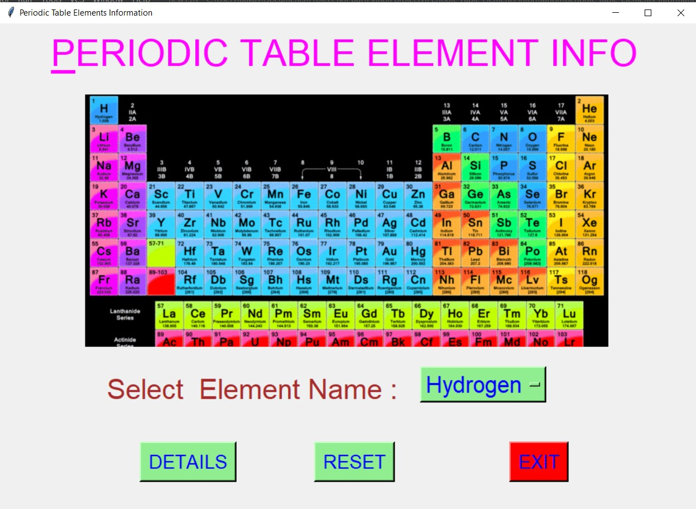
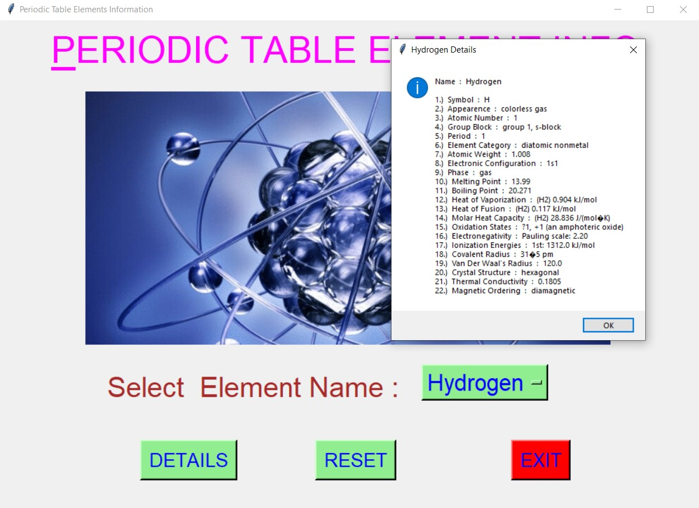
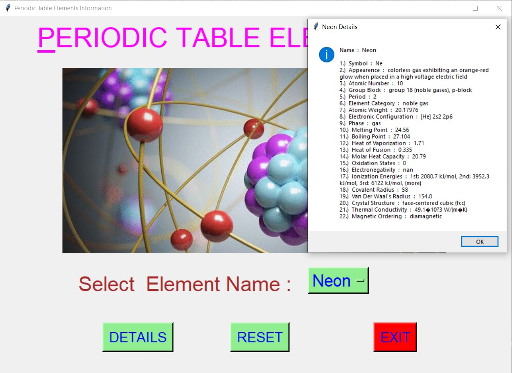
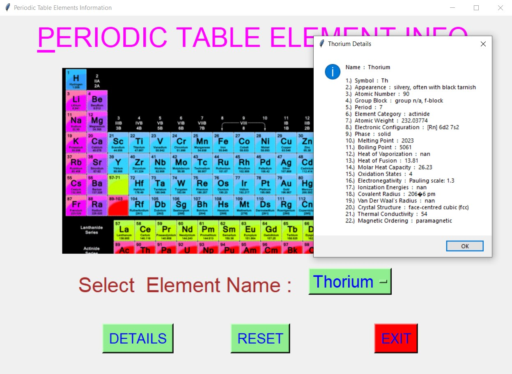
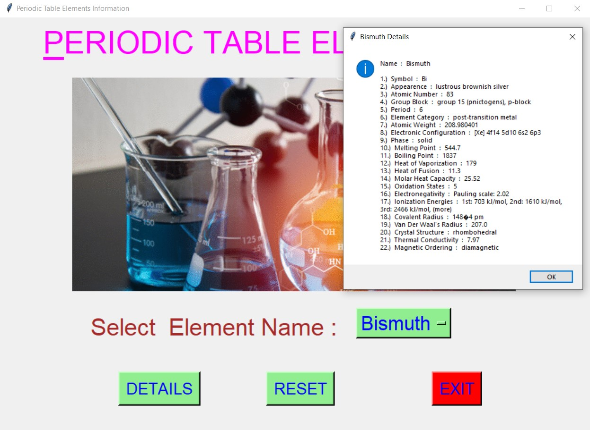
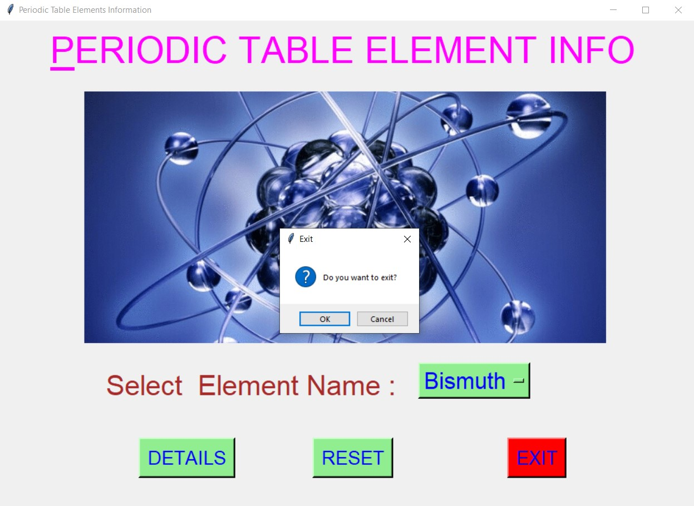

# ✔ PERIODIC TABLE ELEMENTS INFORMATION
- ### A "Periodic Table Elements Information" is an application created in python with tkinter gui.
- ### In this application, user can find the details about any periodic table elements.
- ### Here it supports all the 118 elements of the periodic table.
- ### The details for each mission will be in terms of Name, Symbol, Appearence, Atomic Number, Group Block, Period, Element Category, Atomic Weight, Electronic Configuration, Phase, Melting Point, Boiling Point, Heat of Vaporization, Heat of Fusion, Molar Heat Capacity, Oxidation States, Electronegativity, Ionization Energies, Covalent Radius, Van Der Waal's Radius, Crystal Structure, Thermal Conductivity, Magnetic Ordering.
- ### for the data, used the periodic_table.csv data, and read using pandas library.

****

# REQUIREMENTS :
- ### python 3
- ### tkinter module
- ### from tkinter messagebox module
- ### pandas

****

# How this Script works :
- ### User just need to download the file and run the periodic_table_elements_information.py on their local system.
- ### Now on the main window of the application the user needs to select the name of element from the drop down OptionMenu.
- ### After user has chosen the name of element, when user clicks on the BY DETAILS button, he/she will be able to see the details all the properties and details about that element selected.
- ### Also there is a reset button, clicking on which user can resets both the Option Menu to default element name "Hydrogen".
- ### Also there is an exit button, clicking on which exit dialog box appears asking for the permission of the user for closing the window.

# Purrpose :
- ### This scripts helps us to easily get every details about any element from the 118 element of periodic table elements.

# Compilation Steps :
- ### Install tkinter, pandas
- ### After that download the code file, and run periodic_table_elements_information.py on local system.
- ### Then the script will start running and user can get the details about any element from the periodic table.

****

# SCREENSHOTS :

****

   
   
   
   
   
   

****

# Author :
- ### Akash Ramanand Rajak
