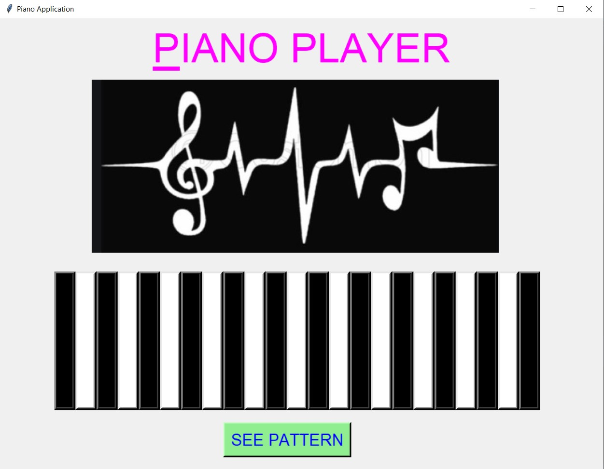
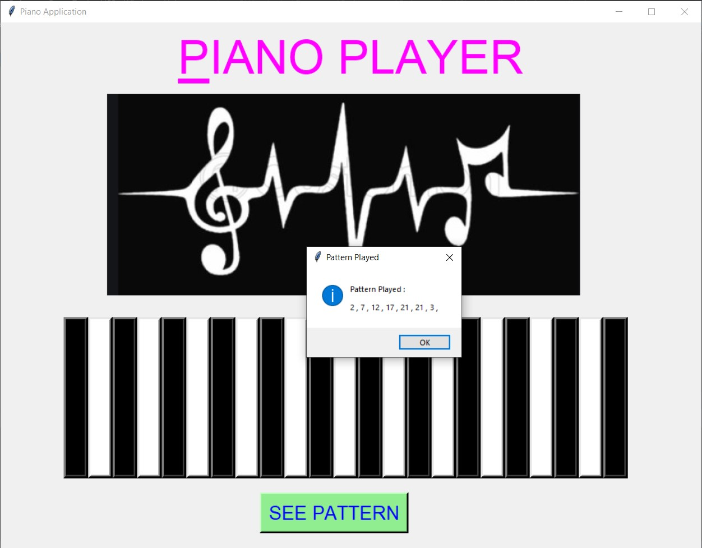
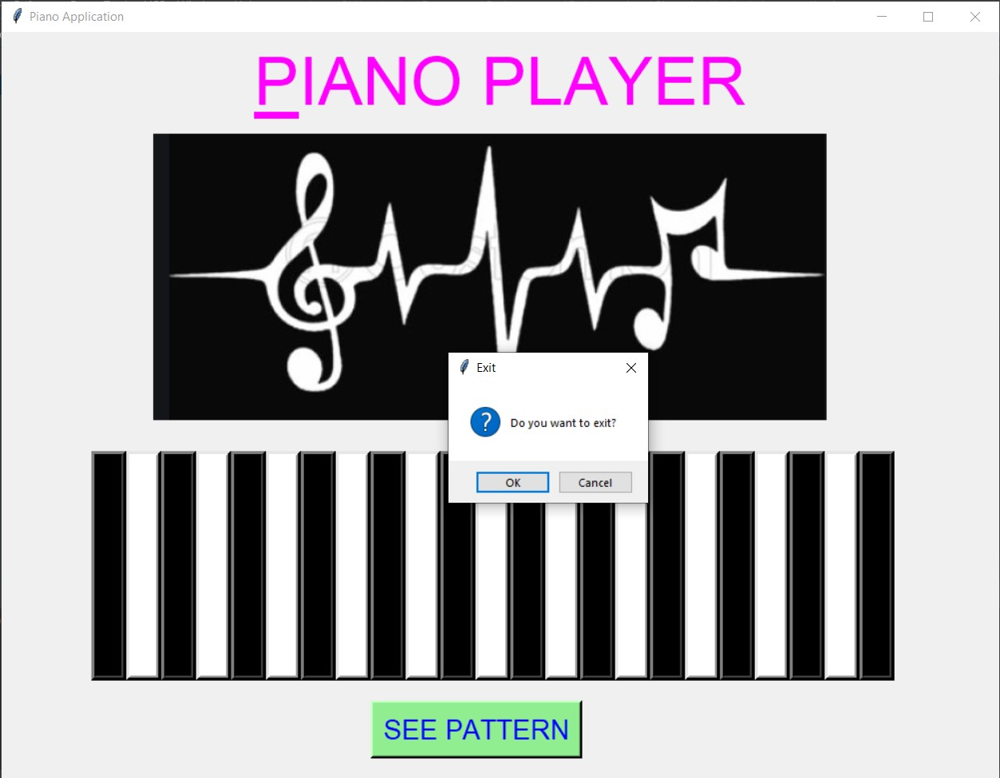

# ✔ PIANO APPLICATION
- ### A "Piano Application" is an application created in python with tkinter gui.
- ### In this application, user will be given a piano board with 23 alternate black and white buttons.
- ### And for each piano button, we have embedded different sound in it.
- ### for playing sound corresponding to each piano button, we used playsound library of python.
- ### Also after playing, there also option to see in what pattern user has played in message by clicking on SEE PATTERN button.

****

# REQUIREMENTS :
- ### python 3
- ### tkinter module
- ### from tkinter messagebox module
- ### from PIL import ImageTk, Image
- ### from playsound import playsound

****

# How this Script works :
- ### User just need to download the file and run the piano_application.py on their local system.
- ### Now on the main window of the application, the user will be able to see the piano board and a SEE PATTERN button.
- ### Now user can start playing the piano by clicking on any piano button of his/her choices and feel the music.
- ### Also after playing, there also option to see in what pattern user has played in message by clicking on SEE PATTERN button.
- ### Also there is an exit button, clicking on which exit dialog box appears asking for the permission of the user for closing the window.

# Purpose :
- ### This scripts helps us to easily play piano and feel each sound, and can also see the pattern in which played.

# Compilation Steps :
- ### Install tkinter, PIL, playsound
- ### After that download the code file, and run piano_application.py on local system.
- ### Then the script will start running and user can explore new music by playing the piano.

****

# SCREENSHOTS :

****

   
   
   

****

# Below is link for sample video with sound :

https://user-images.githubusercontent.com/57003737/124353083-e6414200-dc21-11eb-976c-8de69e04c98d.mp4

****

# Name :
- ### Akash Ramanand Rajak

