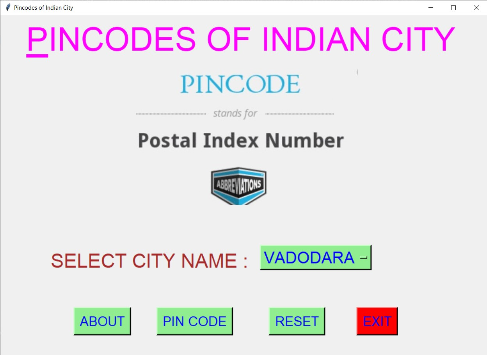
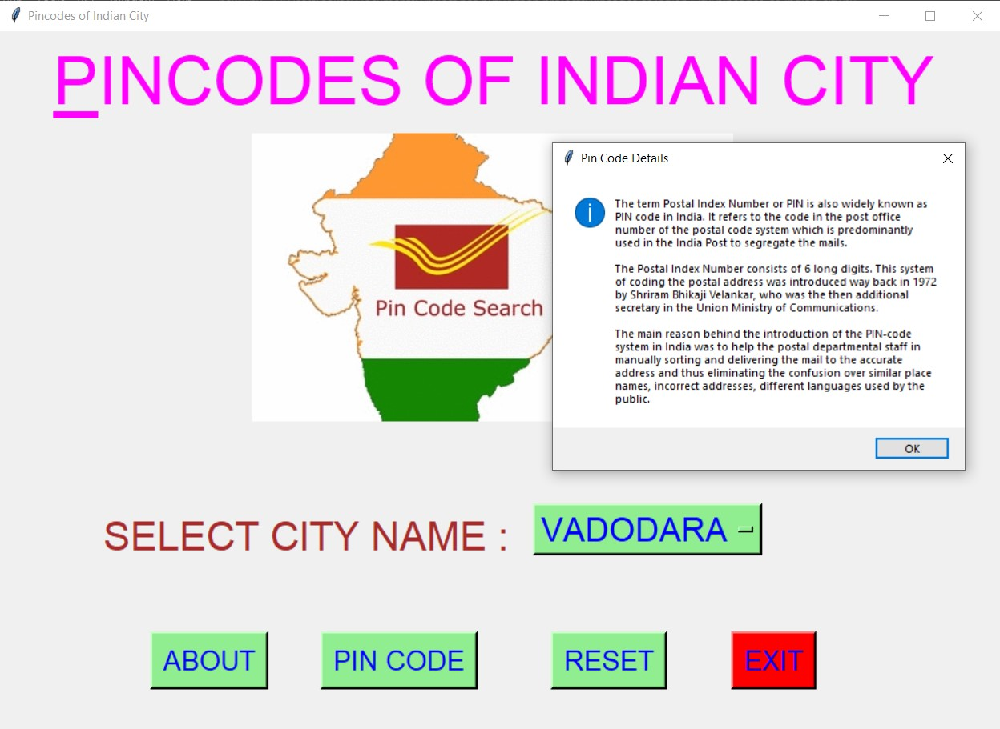
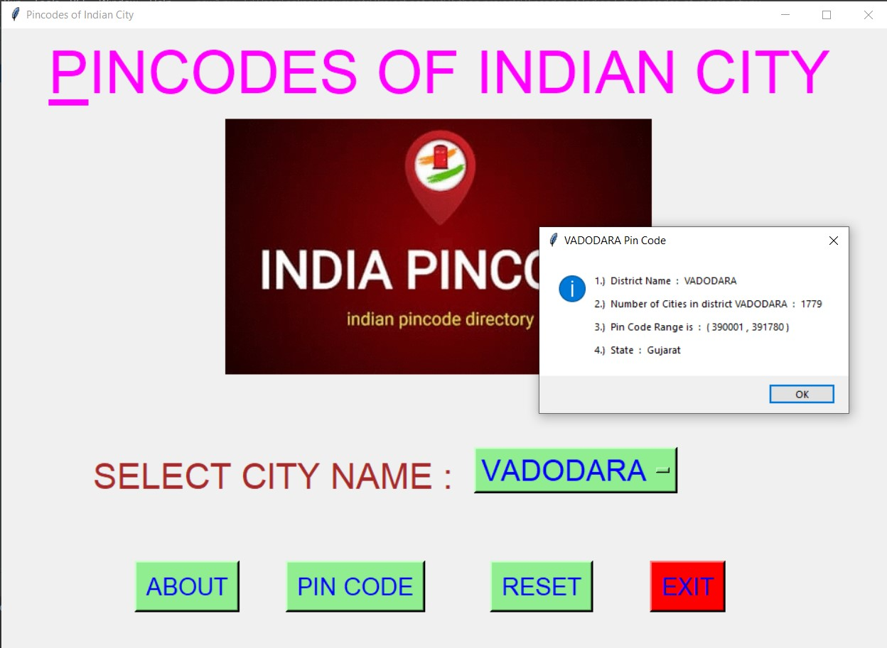
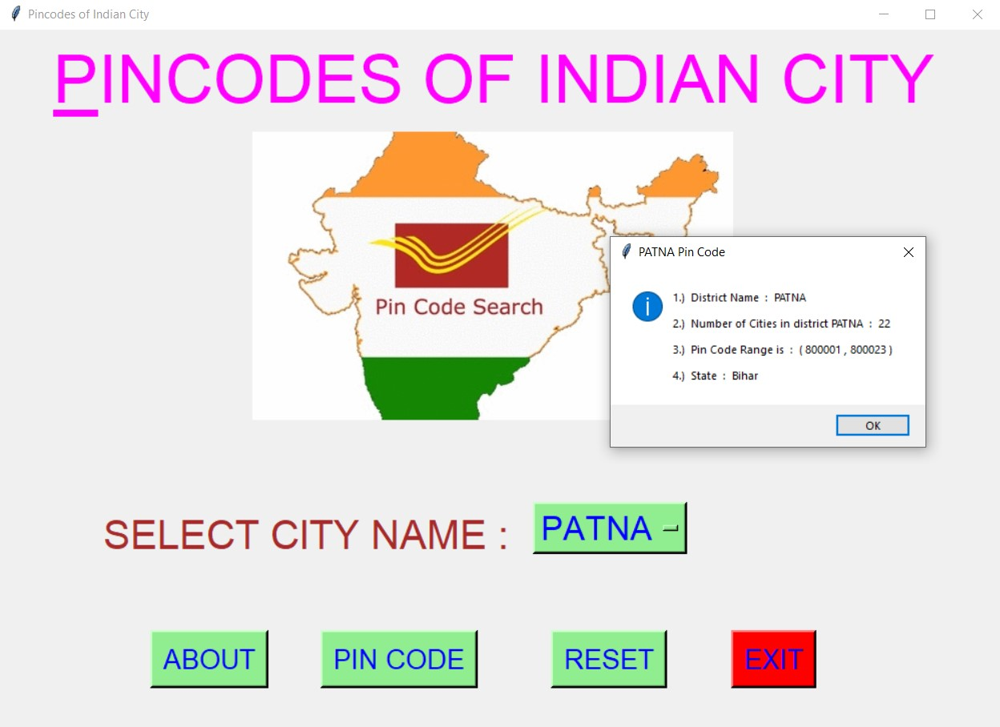
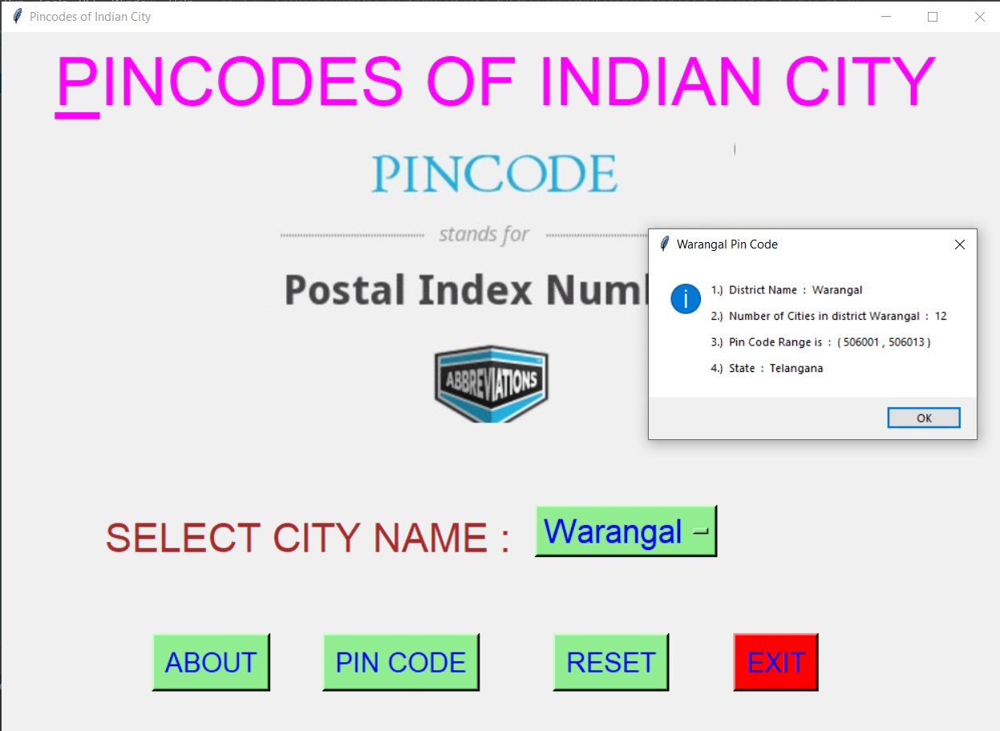
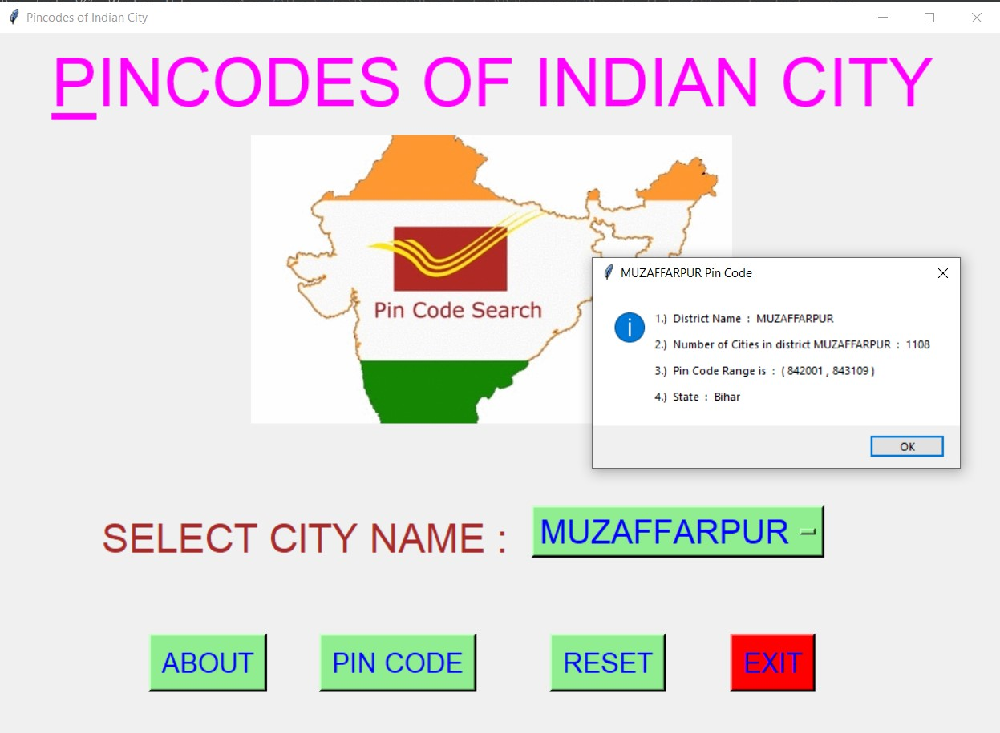
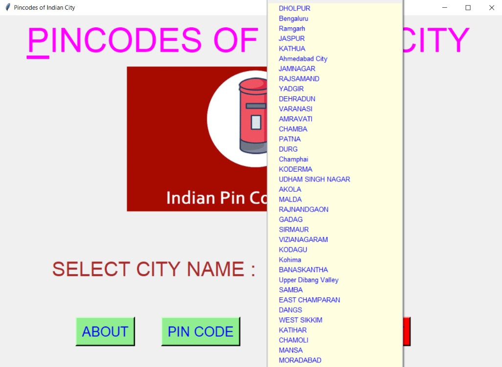
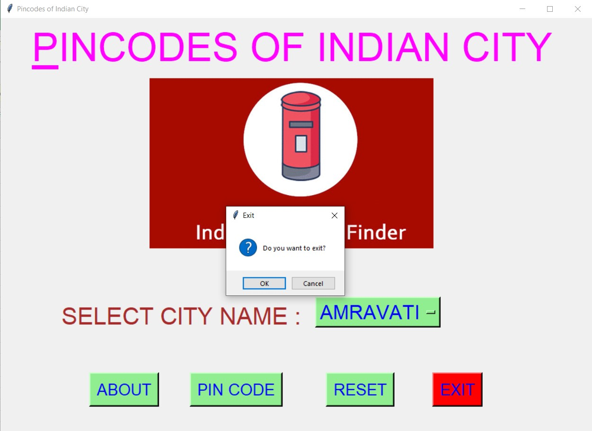

# ✔ PINCODES OF INDIAN CITY
- ### A "Pincodes of Indian City" is an application created in python with tkinter gui.
- ### In this application, user can get No. of cities in selected district, Range of Pincode of those cities and the state name.
- ### It supports almost 600 - 700 district of India.
- ### for the data, used the pincode_data.csv data, and read using pandas library.

****

# REQUIREMENTS :
- ### python 3
- ### tkinter module
- ### from tkinter messagebox module
- ### pandas

****

# How this Script works :
- ### User just need to download the file and run the pincodes_of_indian_city.py on their local system.
- ### Now on the main window of the application the user needs to select the name of district from the drop down OptionMenu.
- ### After user has chosen the name of district, when user clicks on the BY PIN CODE button, he/she will be able to see the No. of cities in selected district, Range of Pincode of those cities and the state name.
- ### Also there is a ABOUT button, clicking on which user can see about What is Pin Code and when was it implemented.
- ### Also there is a RESET button, clicking on which user can resets both the Option Menu to default element name "Vadodara" (default District).
- ### Also there is an EXIT button, clicking on which exit dialog box appears asking for the permission of the user for closing the window.

# Purpose :
- ### This scripts helps us to easily get No. of cities in selected district, Range of Pincode of those cities and the state name.

# Compilation Steps :
- ### Install tkinter, pandas
- ### After that download the code file, and run pincodes_of_indian_city.py on local system.
- ### Then the script will start running and user can get the Number of Cities and Range of Pin Code of any district from given list..

****

# SCREENSHOTS :

****

   
   
   
   
   
   
   
   

****

# Author :
- ### Akash Ramanand Rajak
