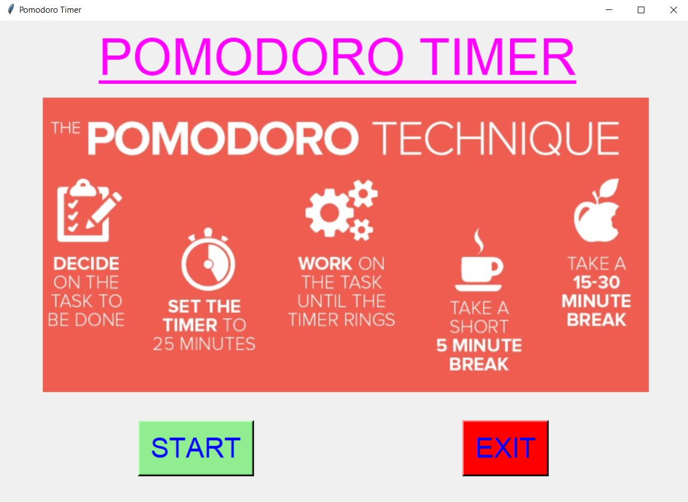
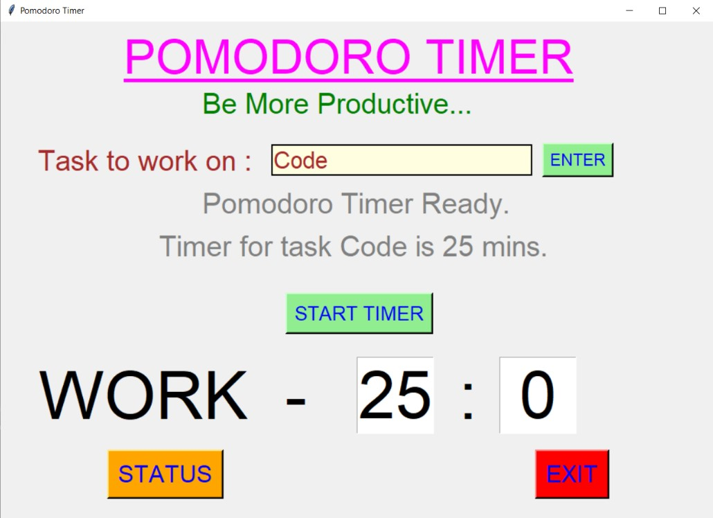
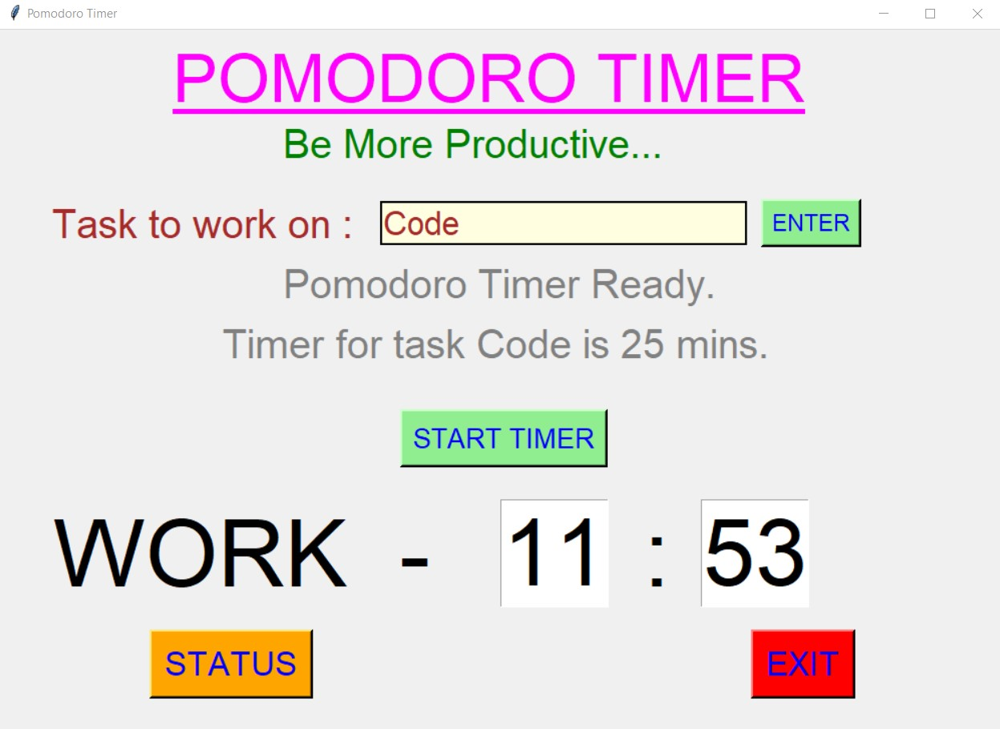
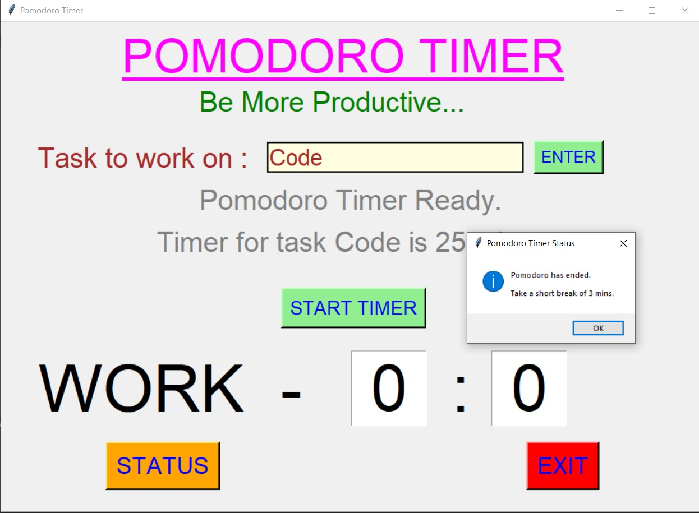
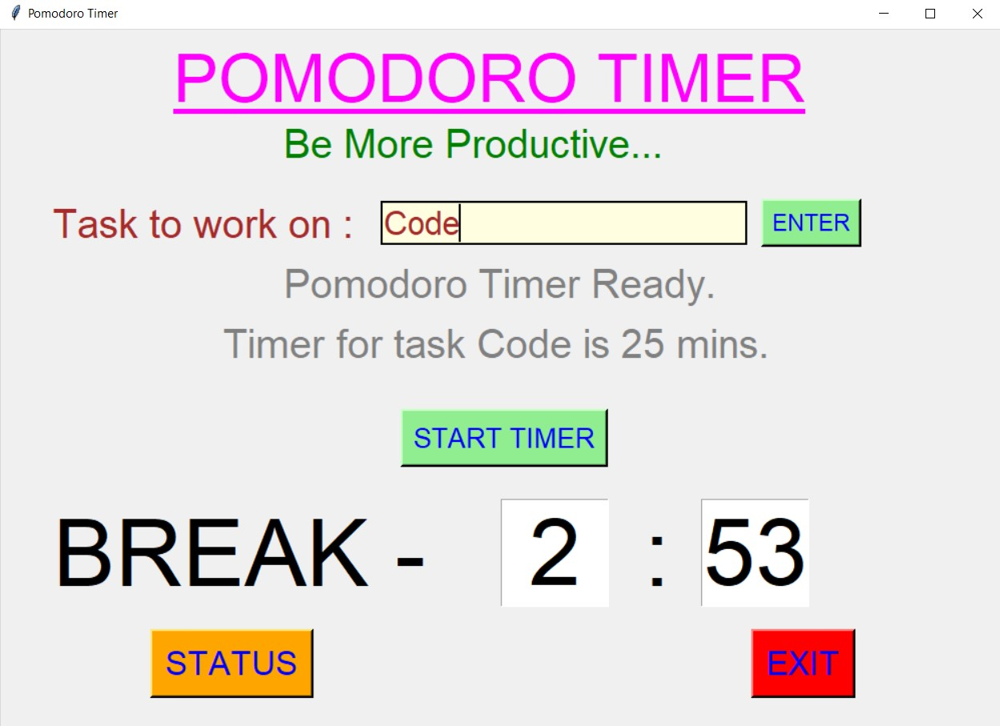
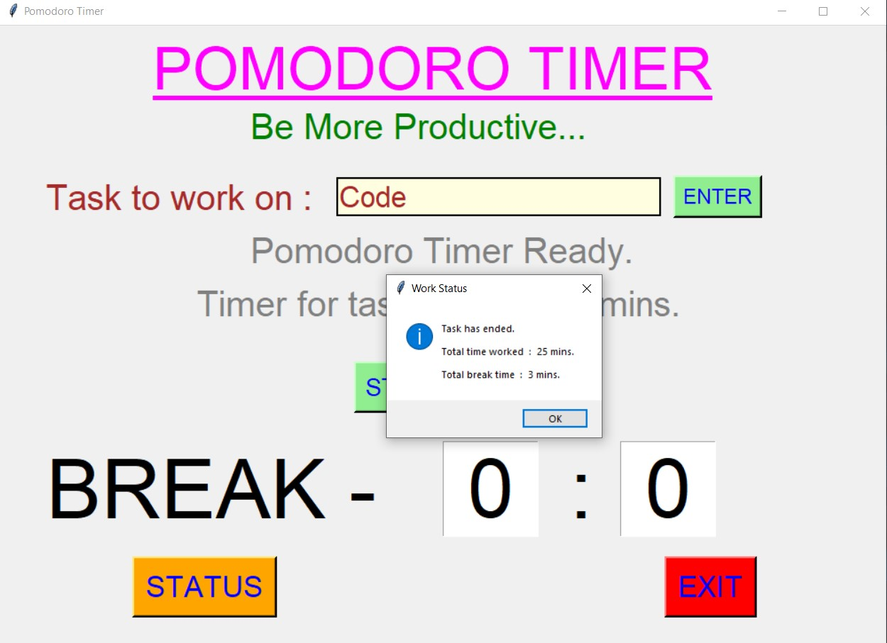
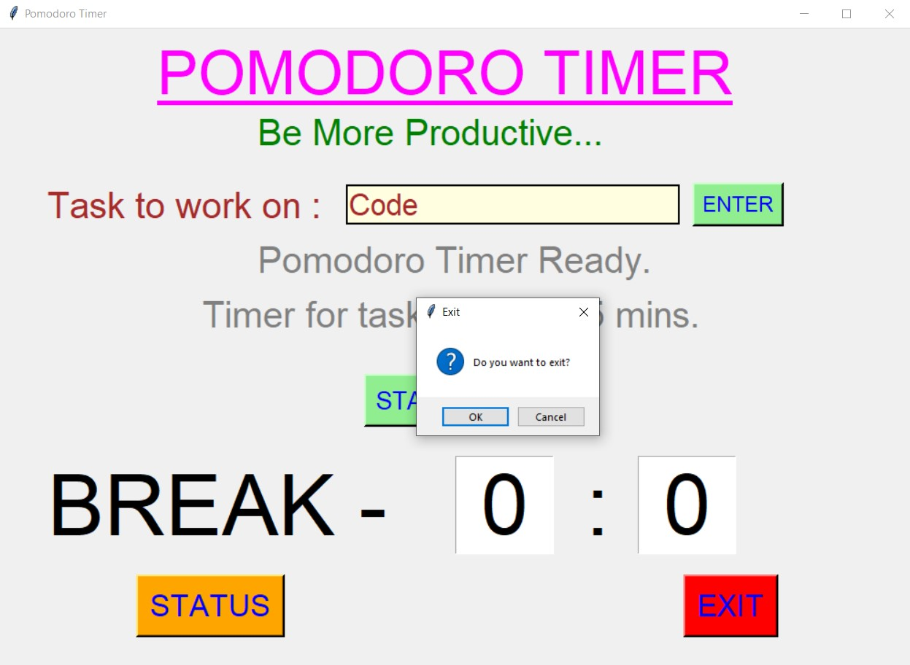

# ✔ POMODORO TIMER
- ### A "Pomodoro Timer" is an application created in python with tkinter gui.
- ### In this application, user will be able to be more productive in his/her work by working on any task according to Pomodoro timer and taking break accordingly after task.
- ### Along with that user will also be to see the status of work after task is done.

****

# REQUIREMENTS :
- ### python 3
- ### tkinter module
- ### from tkinter messagebox module
- ### from pil import ImageTk, Image
- ### time

****

# How this Script works :
- ### User just need to download the file and run the pomodoro_timer.py on their local system.
- ### Now on the main window of the application the user can click on the START button to get started with main application.
- ### On the new window, user will be able to see a text area where user needs to enter the enter the task to be done.
- ### After that when user clicks on the ENTER button, user will be able to see the status of whether the Pomodoro timer is ready along with working time for that task.
- ### After working time counter gets over, it will allow user to take break upto 3 mins.
- ### Also there is an EXIT button, clicking on which exit dialog box appears asking for the permission of the user for closing the window.

# Purrpose :
- ### This scripts helps user to easily get more productive in their jobs and task by working according to Pomodoro timer.

# Compilation Steps :
- ### Install tkinter, pil, time
- ### After that download the code file, and run pomodoro_timer.py on local system.
- ### Then the script will start running and user can explore it by entering any task, getting the time counter for that task, and working accordingly.

****

# SCREENSHOTS :

****

   
   
   
   
   
   
   
   
   

****

# Author :
- ### Akash Ramanand Rajak
