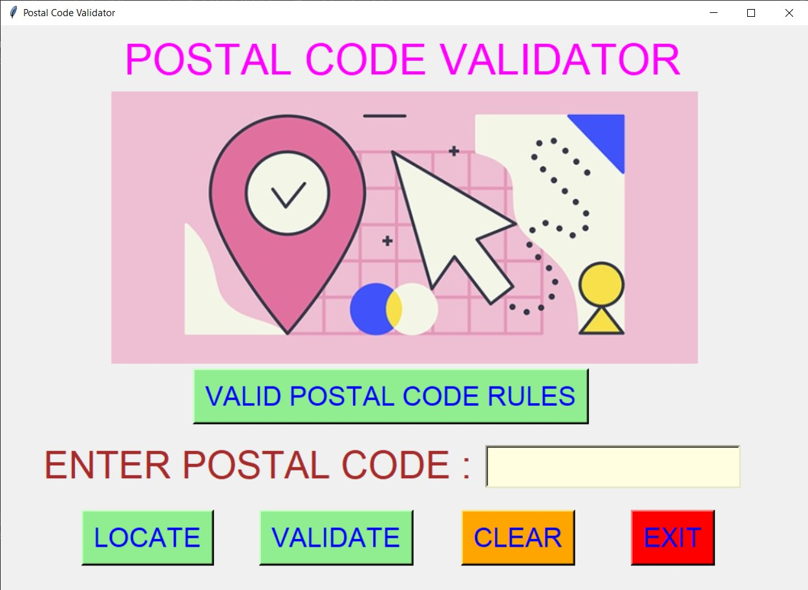
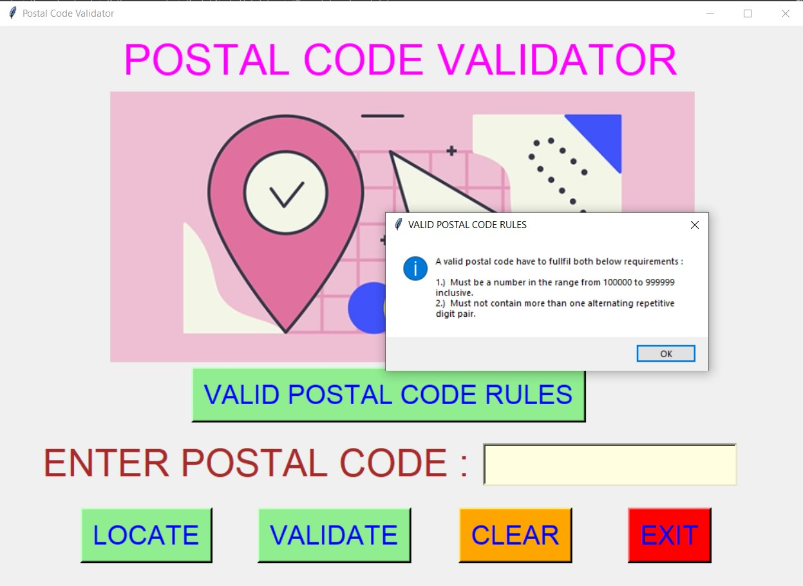
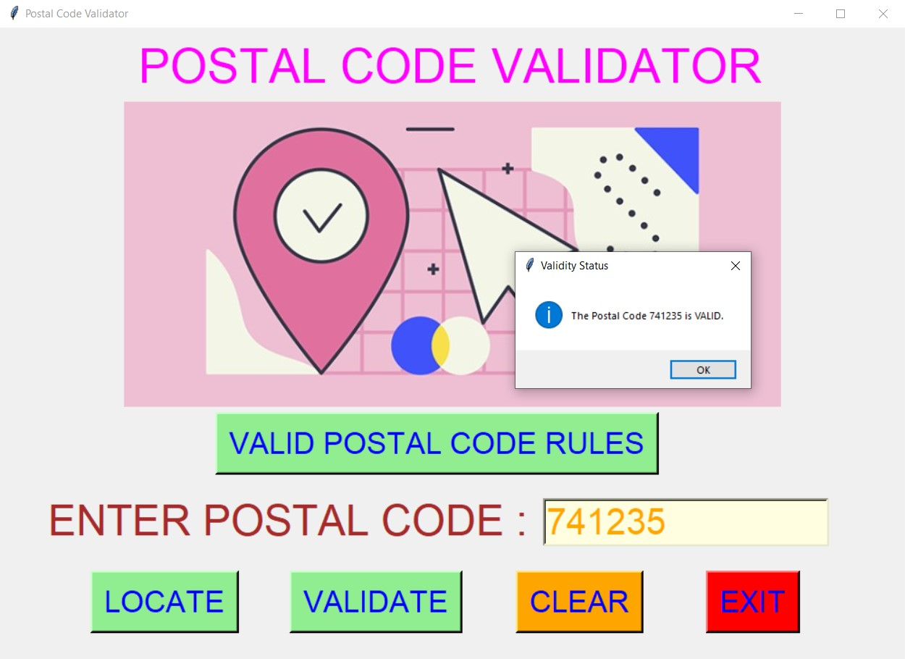
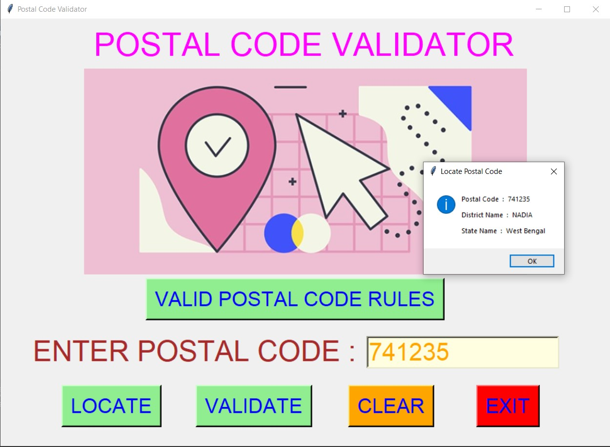
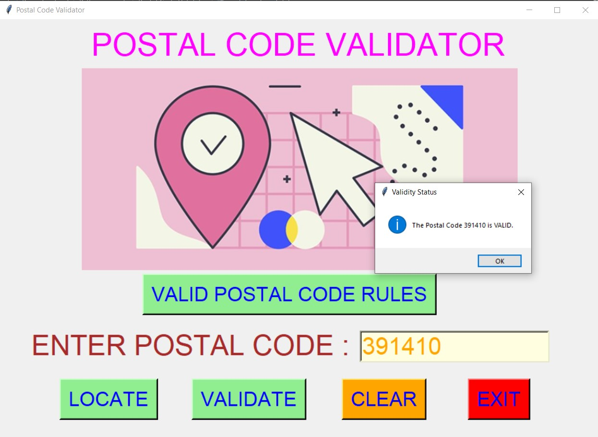
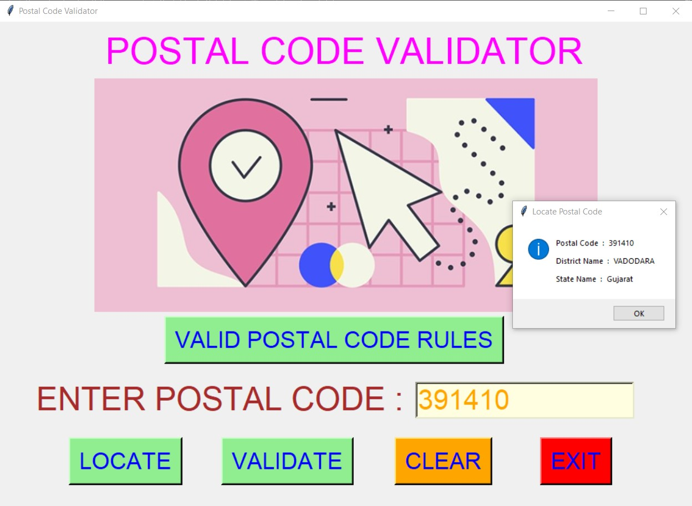
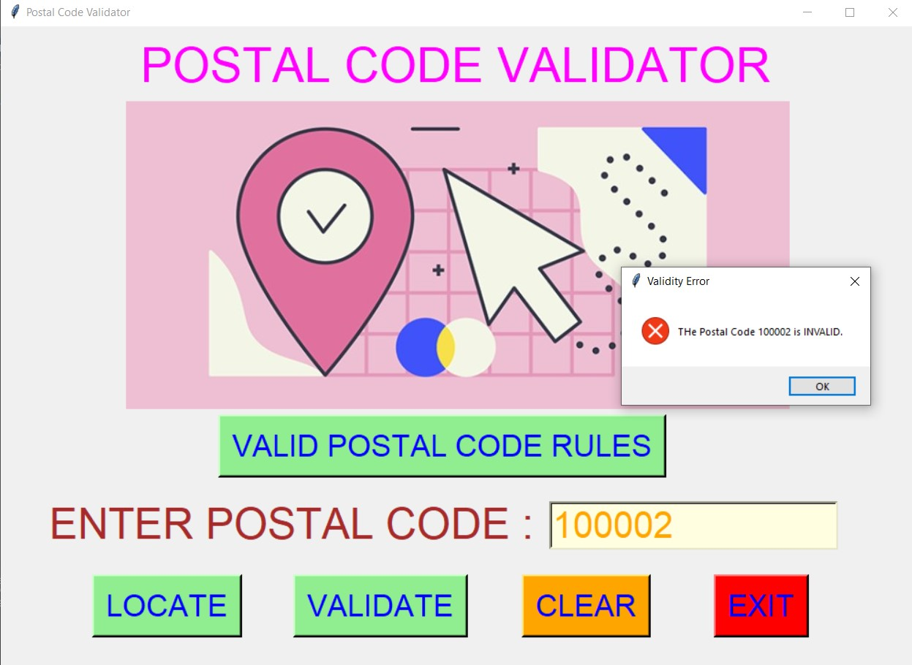
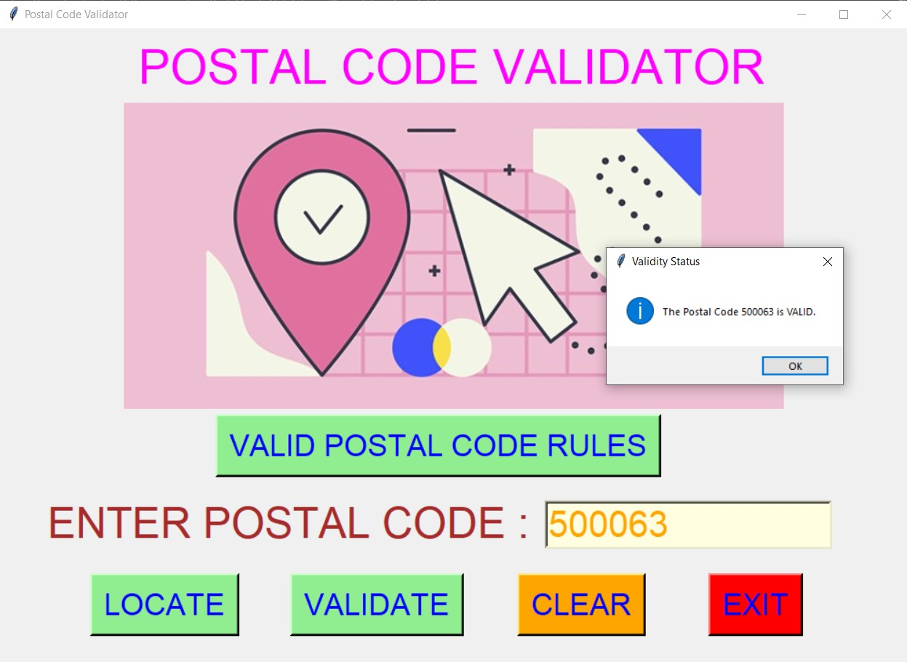
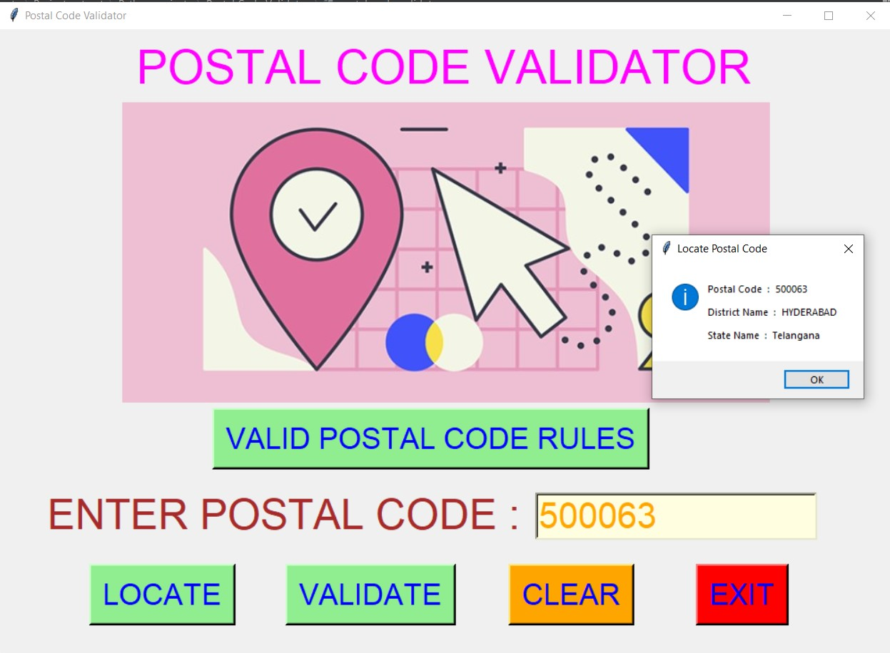

# ✔ POSTAL CODE VALIDATOR
- #### A "Postal Code Validator" is an application created in python with tkinter gui.
- #### In this application, user can check the validity of the postal code by entering the Postal Code.
- #### Also if the postal code is valid, then user will also be able to locate it and see that postal code belong to which city in INDIA.
- #### For checking validity of Postal code regex library of python and for locating use pincode_data.csv data.

****

# REQUIREMENTS :
- #### python 3
- #### tkinter module
- #### from tkinter messagebox module
- #### pandas
- #### re
- #### from PIL import Image, ImageTk

****

# How this Script works :
- #### User just need to download the file and run the postal_code_validator.py on their local system.
- #### Now on the main window of the application the user can click on the "VALID POSTAL CODE RULES" button to see the rules for valid Postal Code.
- #### After that there is an entry box for entering Postal Code, and when user clicks on the "VALIDATE" button he/she will be able to see if the Postal Code is valid or not.
- #### And when user clicks on the "LOCATE" button, he/she will be able to locate and see that postal code belongs to which city of INDIA if VALID.
- #### Also there is a CLEAR button, clicking on which user can clears the Postal Code entry box to empty.
- #### Also there is an EXIT button, clicking on which exit dialog box appears asking for the permission of the user for closing the window.

# Purrpose :
- #### This scripts helps us to easily verify any postal code and check the location of postal code if valid.

# Compilation Steps :
- #### Install tkinter, pandas, PIL, re
- #### After that download the code file, and run postal_code_validator.py on local system.
- #### Then the script will start running and user can explore it by verifying Postal code and locating it.

****

# SCREENSHOTS :

****

   
   
   
   
   
   
   
   
   
   

****

# Author :
- ### Akash Ramanand Rajak
