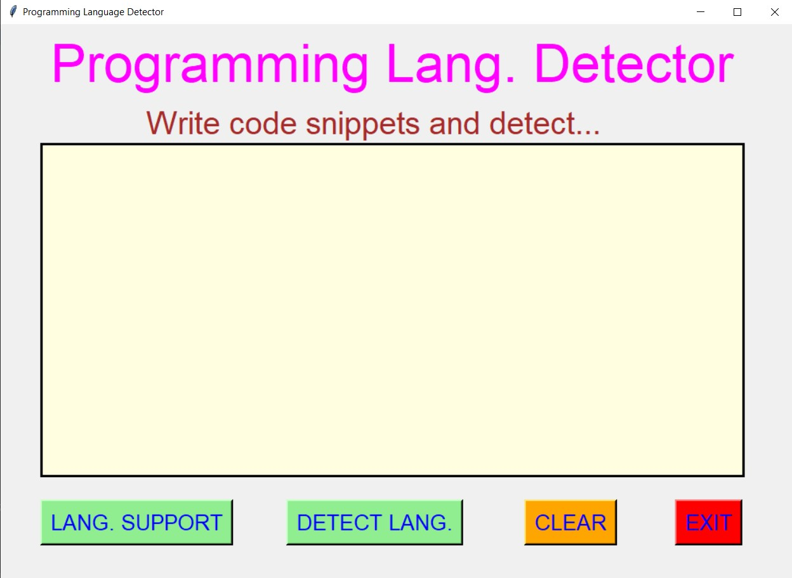
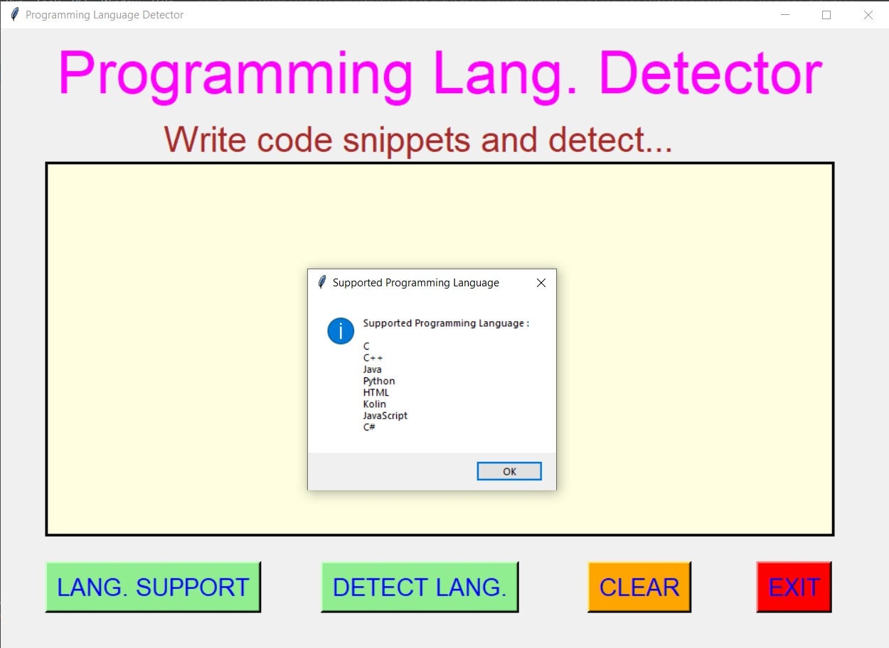
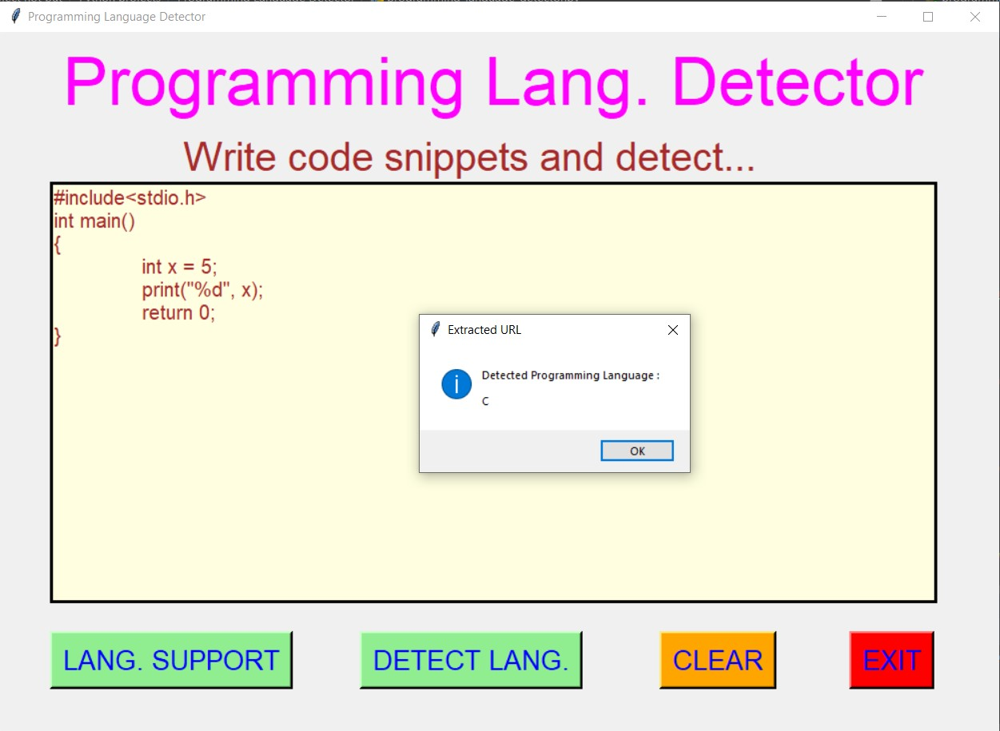
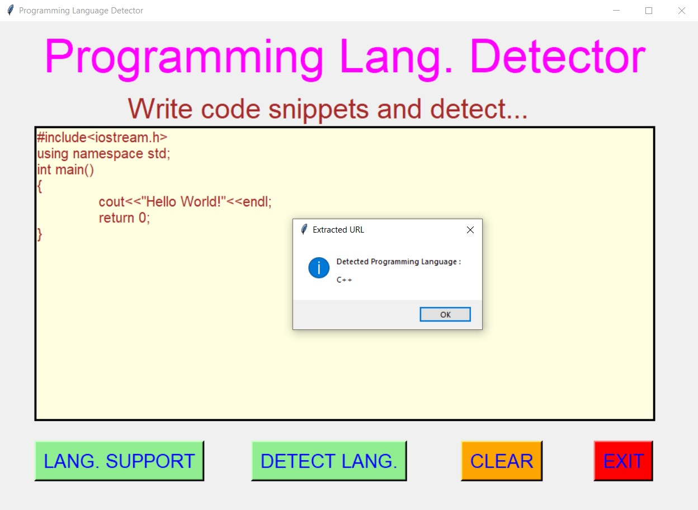
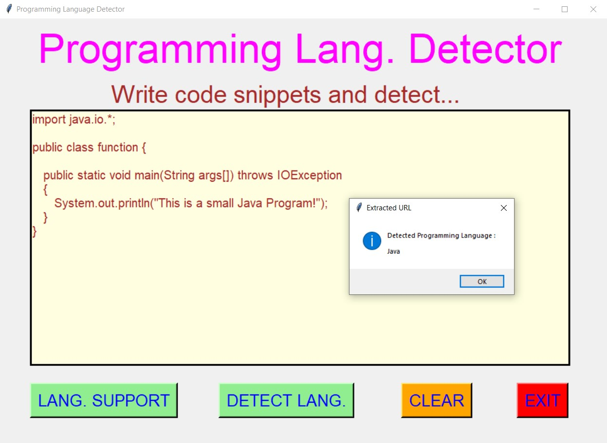
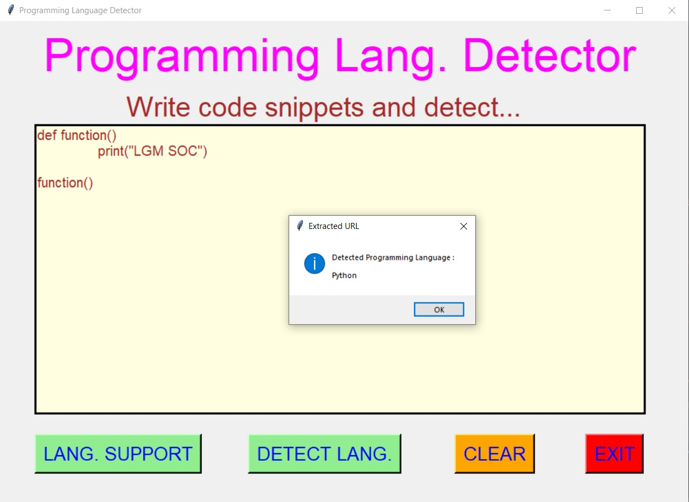
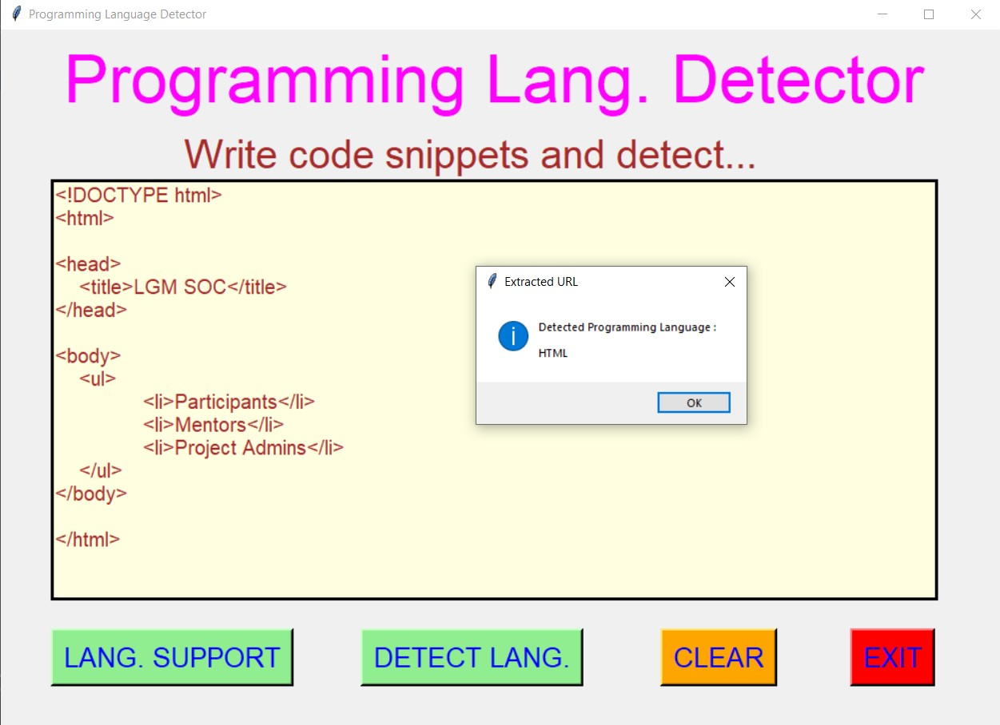
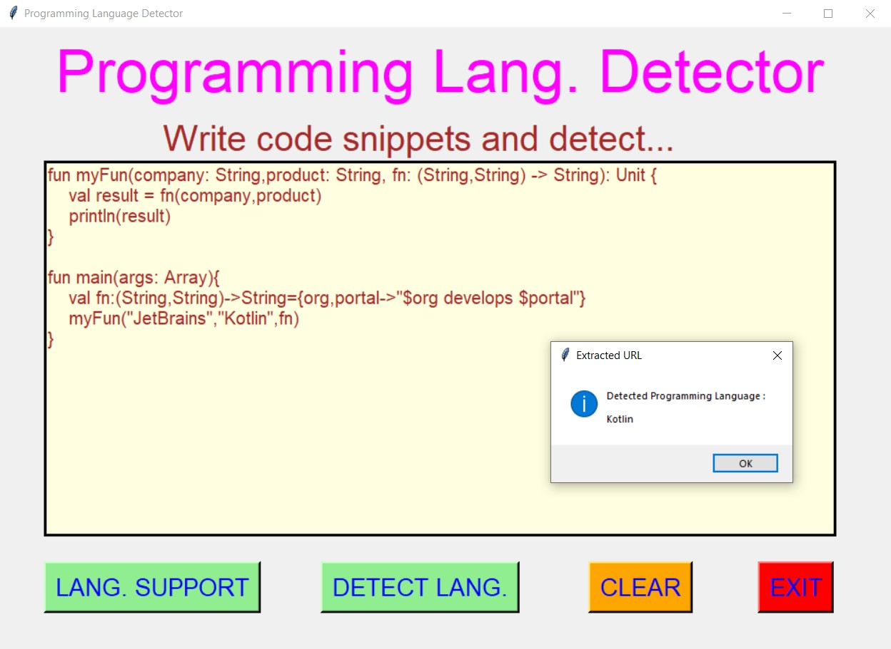
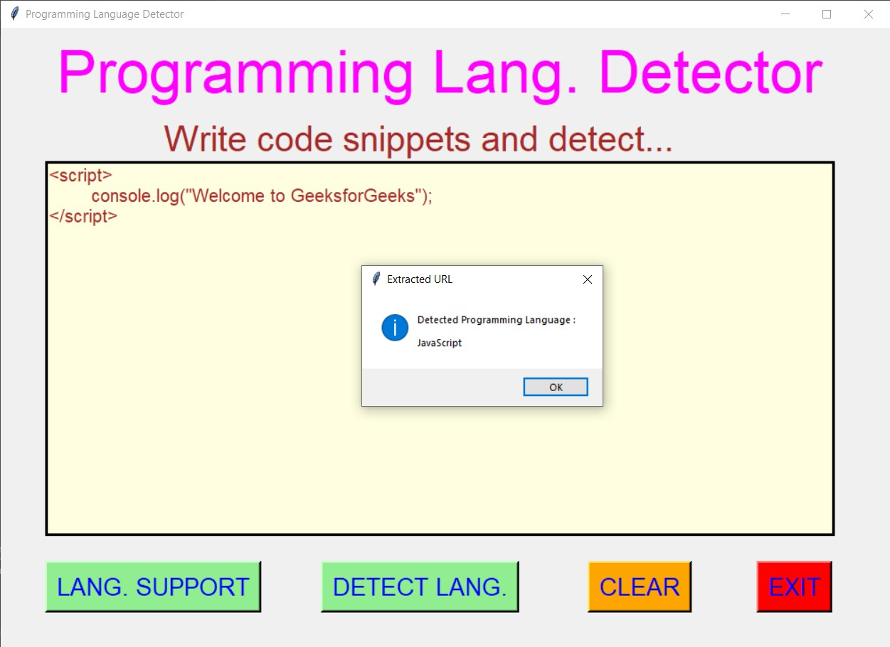
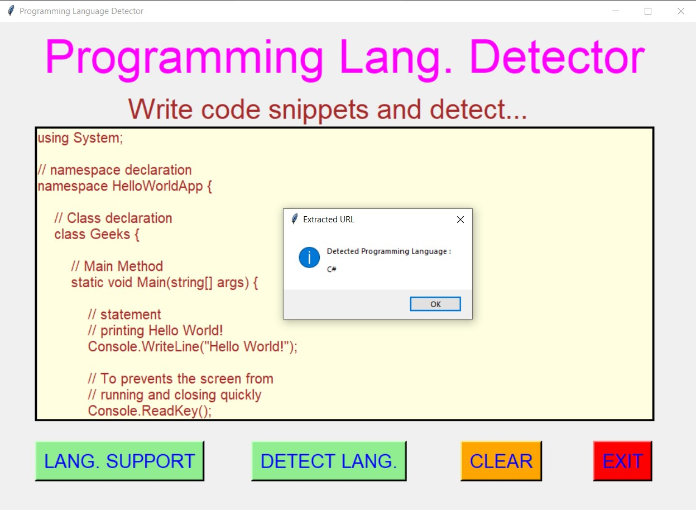

# ✔ PROGRAMMING LANGUAGE DETECTOR
- #### A "Programming Language Detector" is an application created in python with tkinter gui.
- #### In this application, user will be allowed to first enter the code snippets of the supported programming language.
- #### Supported Programming Language : C, C++, Java, Python, HTML, Kotlin, JavaScript and C#.
- #### After entering the code snippets, user will be able to see in which programming he/she has written that code snippets.
- #### And for implementing this, used the re library of python.

****

# REQUIREMENTS :
- #### python 3
- #### tkinter module
- #### from tkinter messagebox module
- #### re

****

# How this Script works :
- #### User just need to download the file and run the programming_language_detector.py on their local system.
- #### Now on the main window of the application the user will be allowed to first enter the code snippets of the supported programming language.
- #### Supported Programming Language : C, C++, Java, Python, HTML, Kotlin, JavaScript and C#.
- #### After entering the text, when user clicks on the DETECT LANG. button, user will be able to see in which programming he/she has written that code snippets.
- #### Also there is a button LANG. SUPPORT, clicking on which user will be able to see the language supported by this application.
- #### Also there is a clear button, clicking on which user can clears the text or paragraph entered in the given text area.
- #### Also there is an exit button, clicking on which exit dialog box appears asking for the permission of the user for closing the window.

# Purpose :
- ### This scripts helps us to easily detect in which programming language that code snippets belong among supported language.

# Compilation Steps :
- ### Install tkinter, re
- ### After that download the code file, and run programming_language_detector.py on local system.
- ### Then the script will start running and user can explore it by entering code snippets and detecting the language.

****

# SCREENSHOTS :

****

   
   
   
   
   
   
   
   
   
   

****

# Author :
- ### Akash Ramanand Rajak
