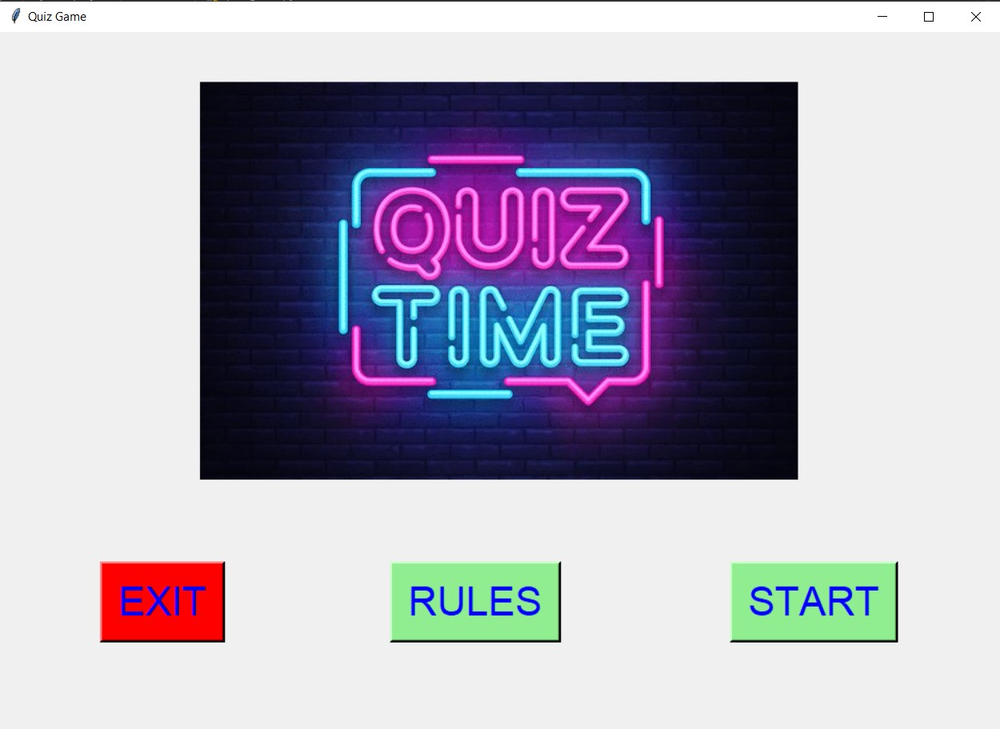
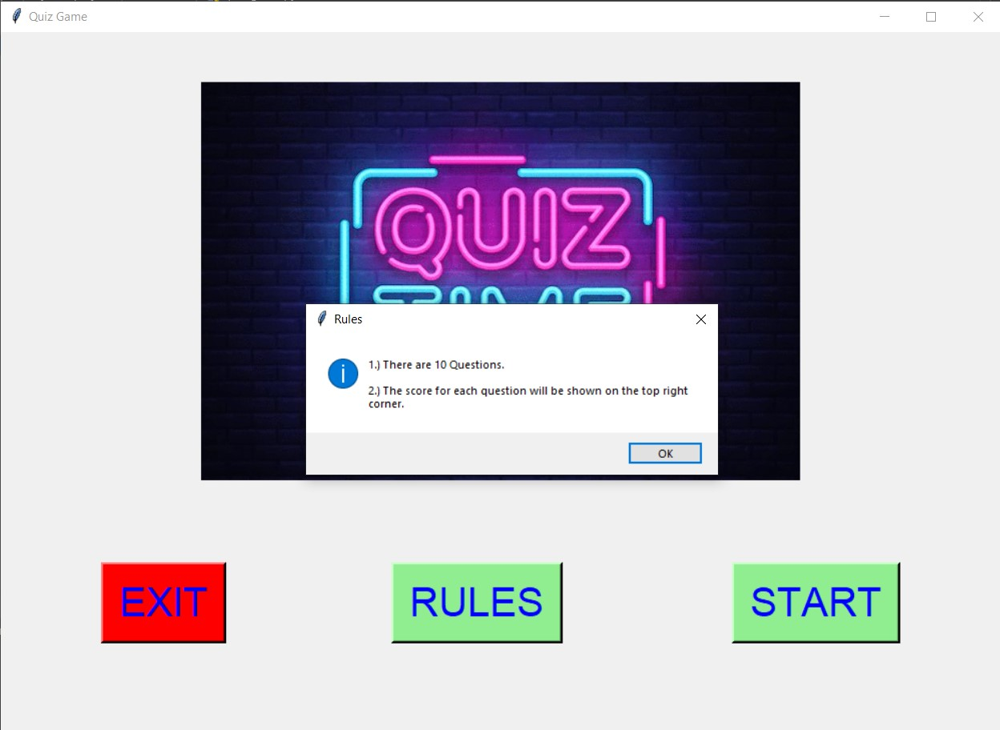
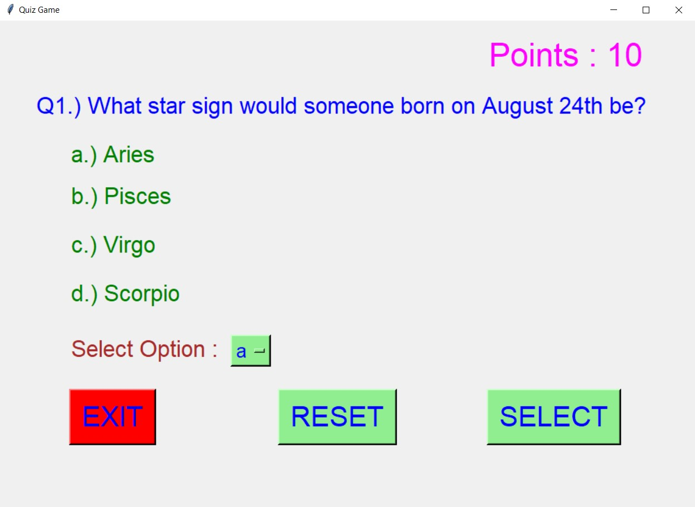
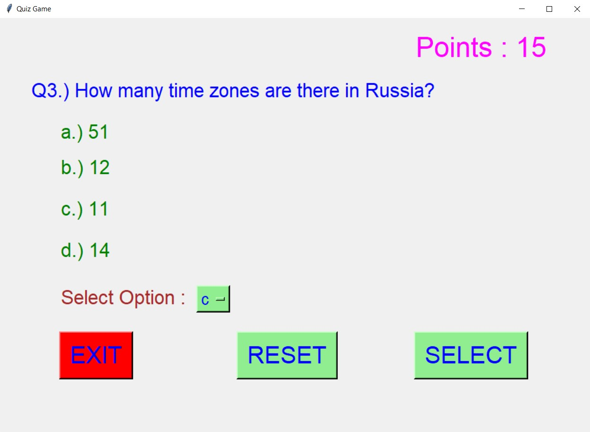
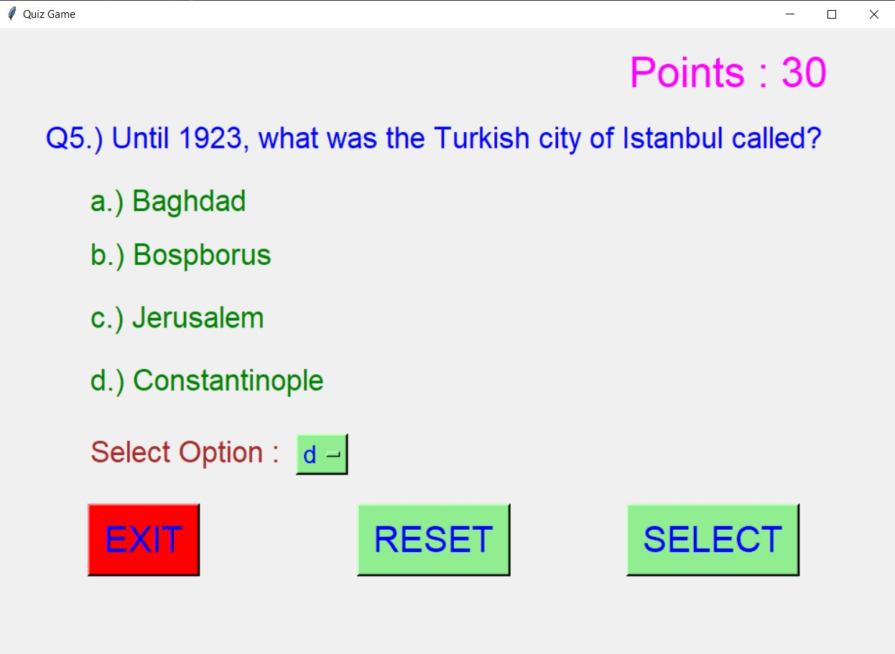
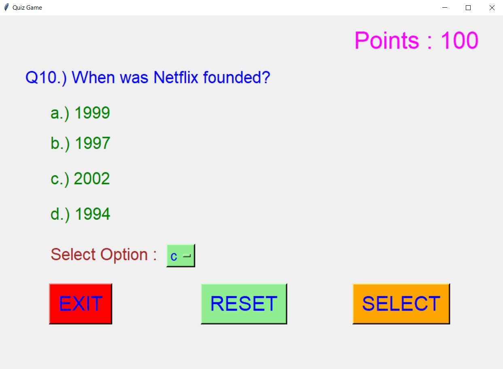
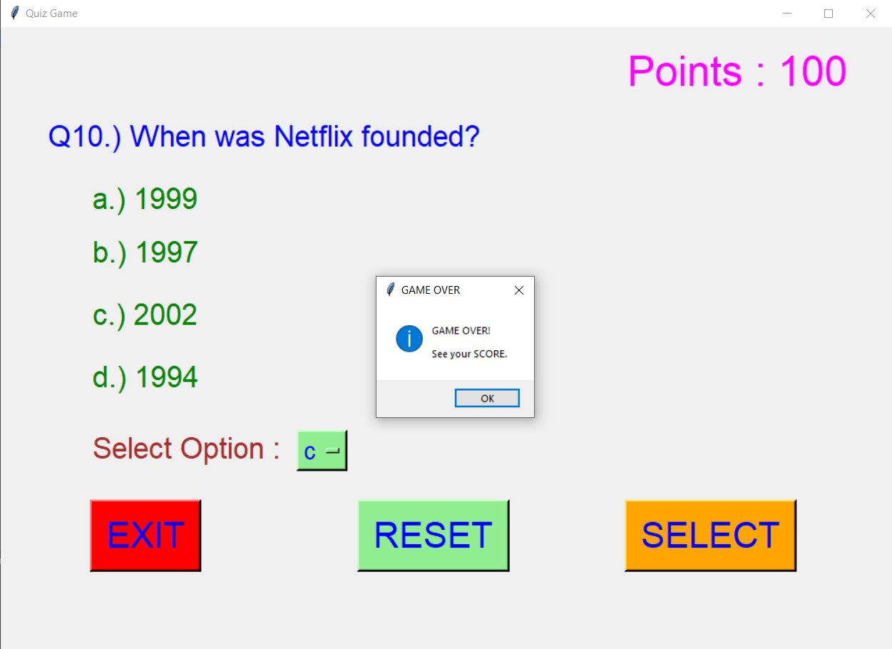
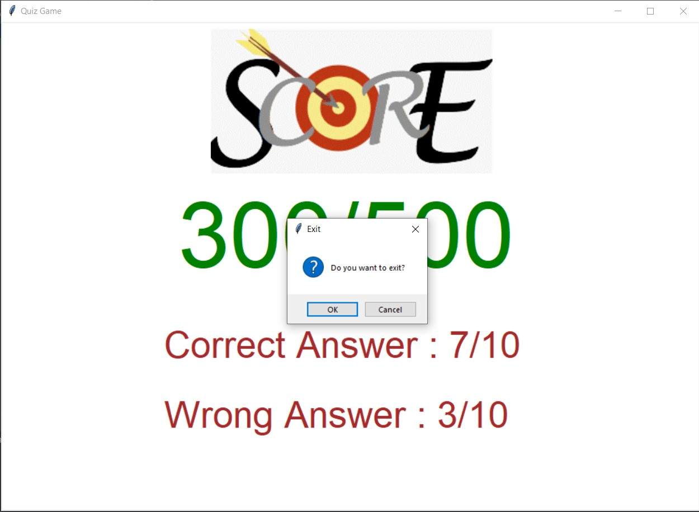

# ✔ QUIZ GAME
- ### A Quiz Game created in python with tkinter gui.
- ### In this script, the user gets 10 question one by one and he/she needs to select the correct option for the given question, ans can see the score at the last.
- ### The quiz question are base on the basic GeneraL Knowledge.

****

# REQUIREMENTS :
- ### python 3
- ### tkinter module
- ### from tkinter messagebox module
- ### PIL module
- ### json

****

# How this Script works :
- ### User just need to download the file and run the quiz_game.py on their local system.
- ### Now on the main window of the appplication, the user will get one by one 10 questions.
- ### The score for each question will be shown at the top right corner o each page.
- ### In each there will be four options given and user needs to select any one of them using drop down OptionMenu.
- ### When user chose an option for given question, then clicking on the select button, next question will be shown on the screen.
- ### Also there is a reset button, clicking on which allows the user to reset the option selected by the user to the default option.
- ### Also there is an exit button, clicking on which exit dialog box appears asking for the permission of the user for closing the window.
- ### At last the score will be shown at the last in new frame, with no. of correct and wrong answers.

****

# SCREENSHOTS :

****

   
   
   
   
   
   
   
   
   
   

****

# Below is the video links showing how the application works :
https://user-images.githubusercontent.com/57003737/122884646-fcb2e800-d35b-11eb-8387-21a9c2e17b7e.mp4
