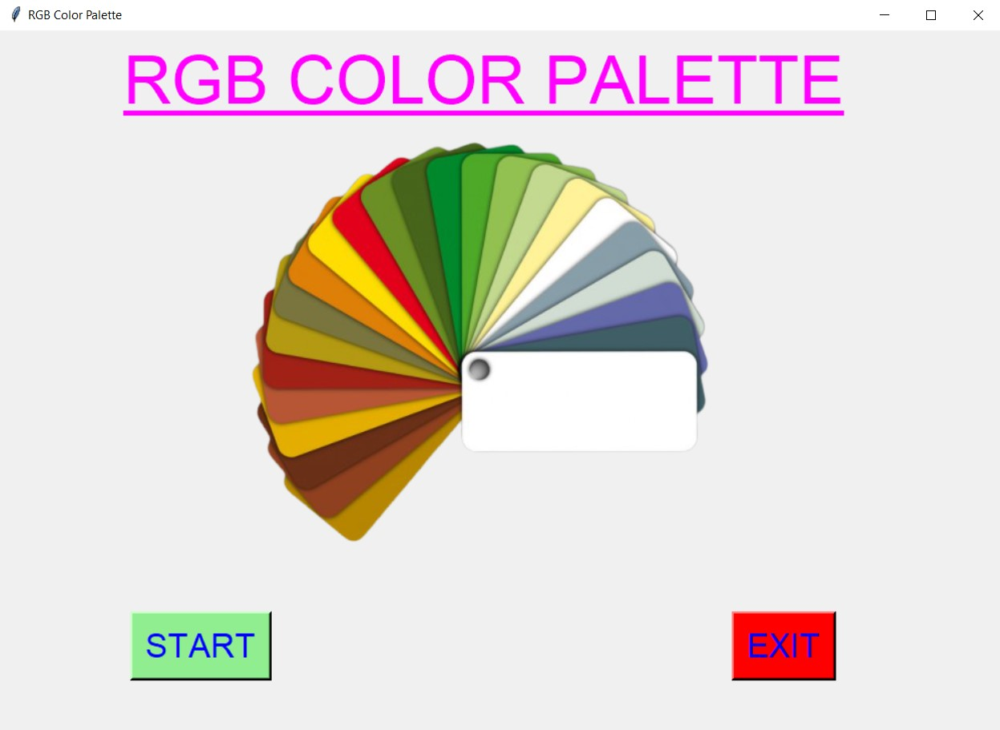
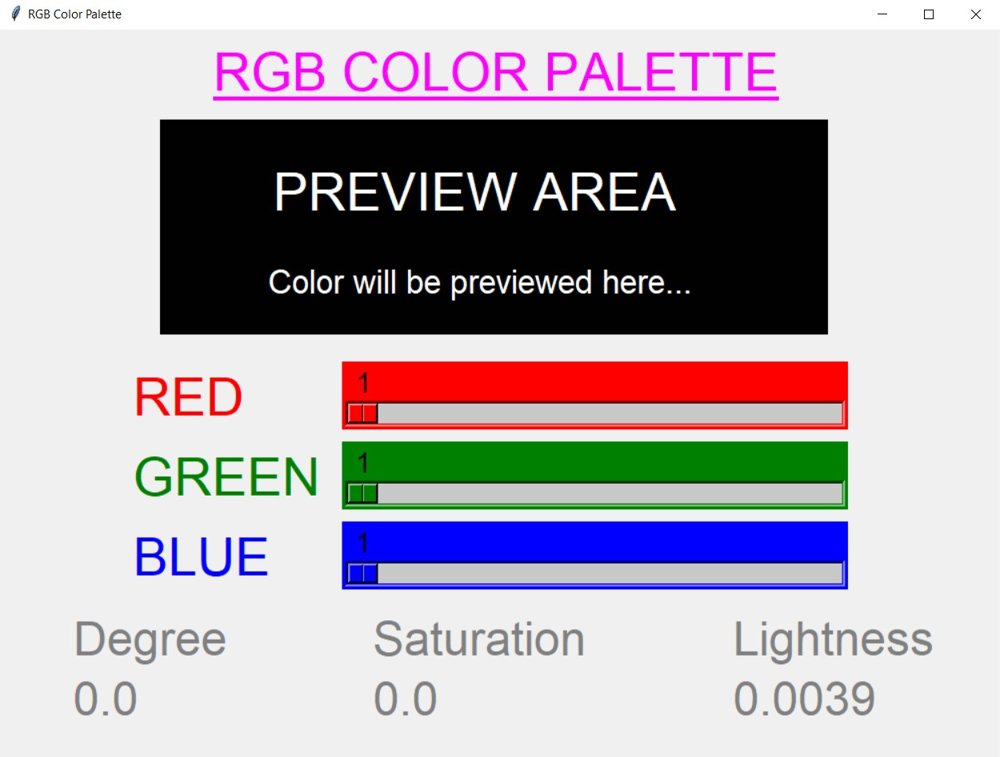
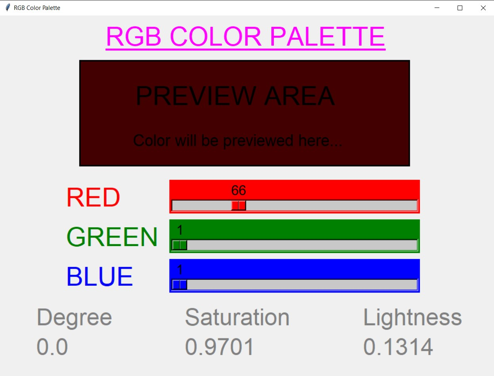
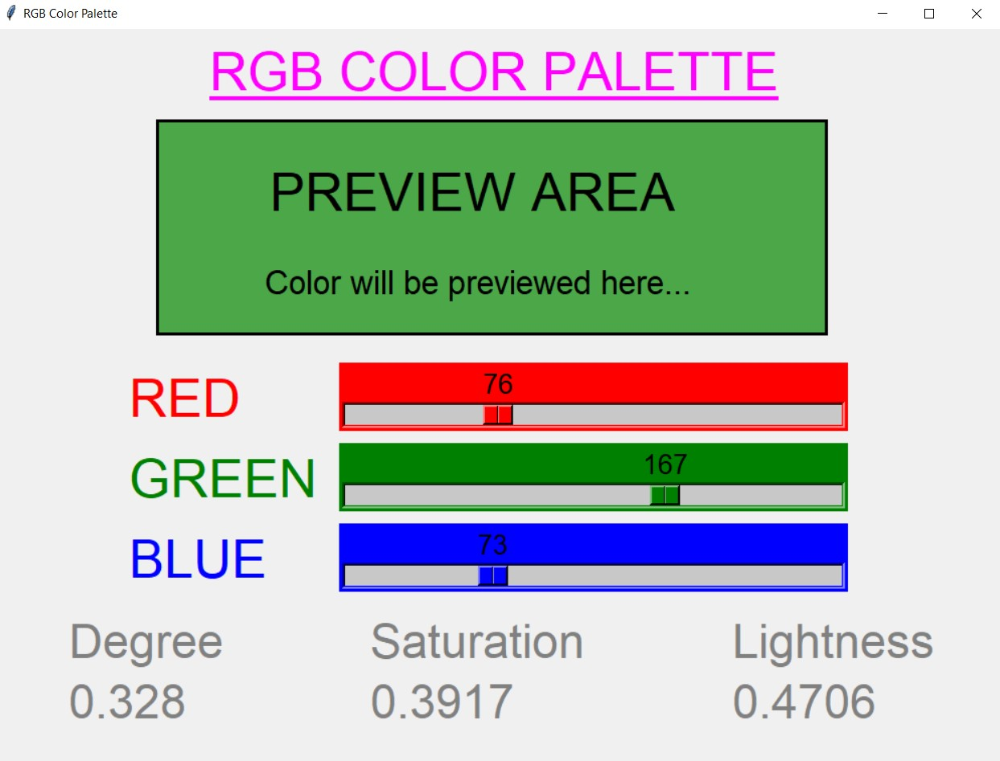
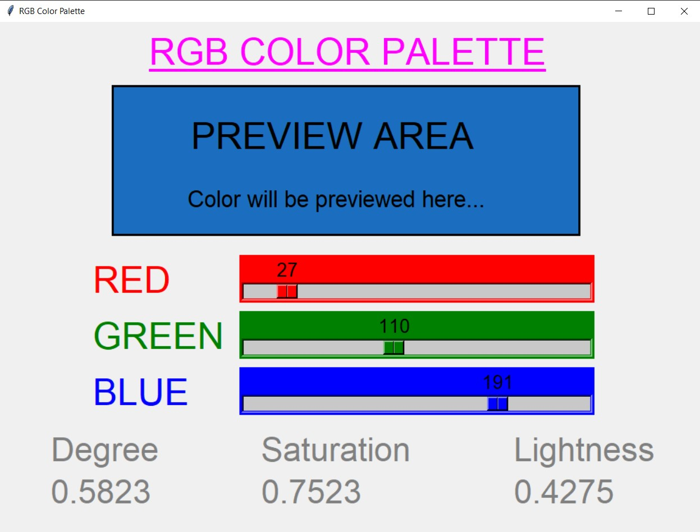
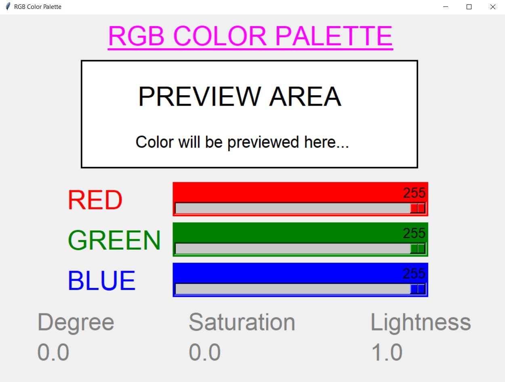
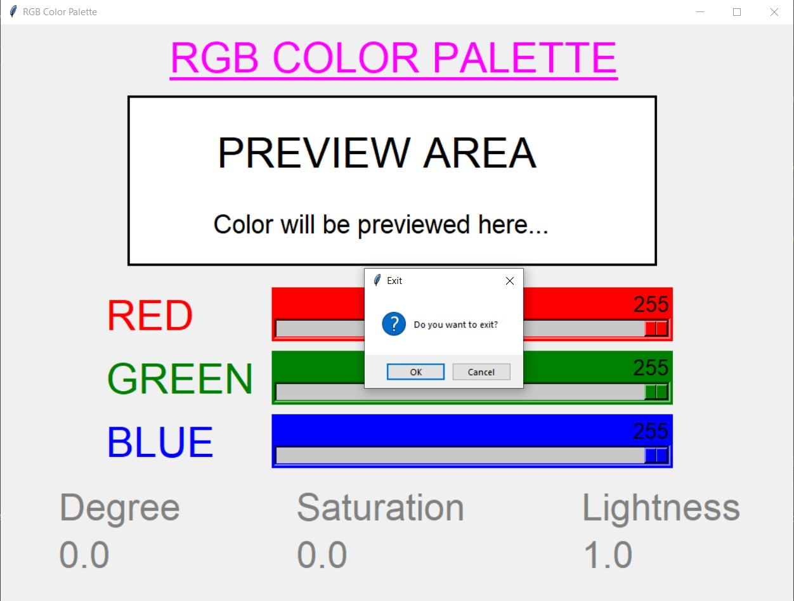

# ✔ RGB COLOR PALETTE
- ### An RGB Color Palette is an application created in python with tkinter gui.
- ### In this application user will be able to see the RGB color using the scales given for red, green and blue from 1 to 255 values.
- ### Ans as soon as user change the scale, user will be able to see the preview of the RGB color in the preview area.
- ### Also along with that, user will be able to get the Degree, Saturation and Lightness of that color previewed for each instance.

****

# REQUIREMENTS :
- ### python 3
- ### tkinter module
- ### filedialog from tkinter
- ### messagebox
- ### from PIL import Image, ImageTk
- ### colorsys

****

# HOW TO Use it :
- ### User just need to download the file, and run the RGB_color_palette.py, on local system.
- ### After running a GUI window appears, where user can start the palette application by clicking on the START button.
- ### After that a new GUI window will open, in which user will see one preview area, three pallete in form of scales for RED, GREEN and BLUE color.
- ### Now As soon as user changes values in the red, green and blue scales, user will be able to see that RGB color in preview area.
- ### Also along with that, user will be able to get the Degree, Saturation and Lightness of that color previewed for each instance.

# Purpose :
- ### This scripts helps user to easily get the preview of the RGB color and also can get the information about Degree, Saturation and Lightness of that color previewed for each instance.

# Compilation Steps :
- ### Install tkinter, PIL, colorsys
- ### After that download the code file, and run RGB_color_palette.py on local system.
- ### Then the script will start running and user can explore it by seeing the preview of RGB color by selecting the values of R,G, and B using scales and also getting information about Degree, Saturation and Lightness of that color previewed for each instance.

****

# SCREENSHOTS :
****

   
   
   
   
   
   
   

****

# Name : 
- ### Akash Ramanand Rajak
