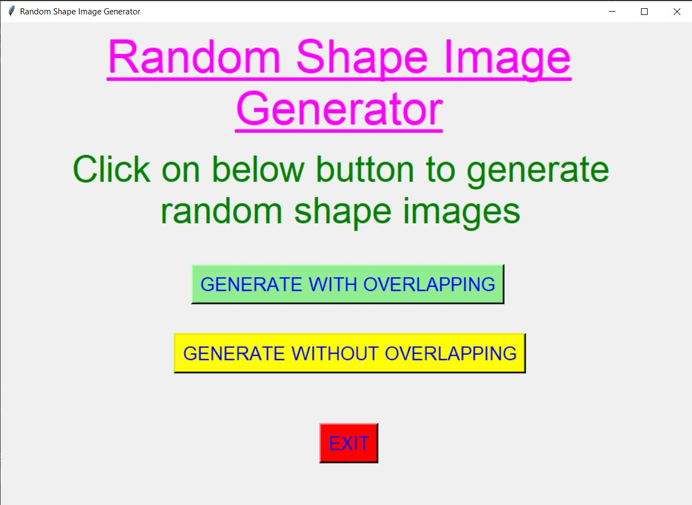
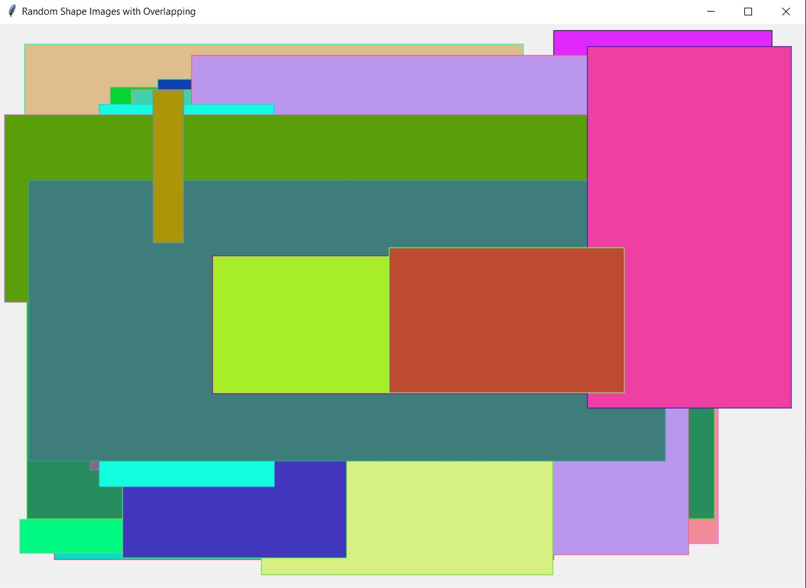
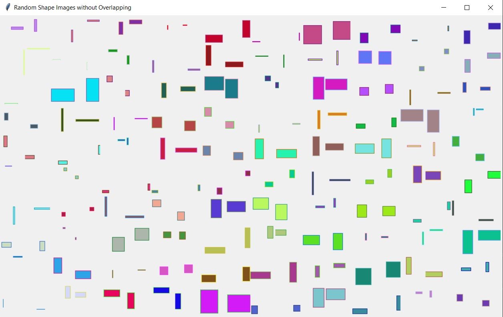
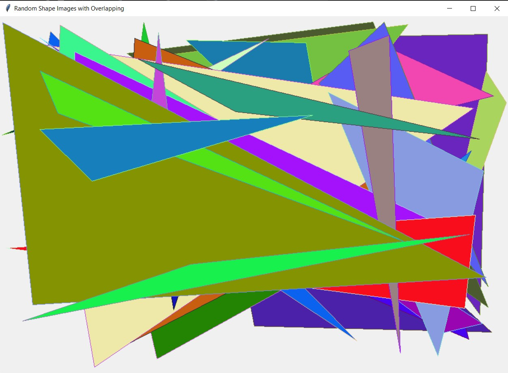
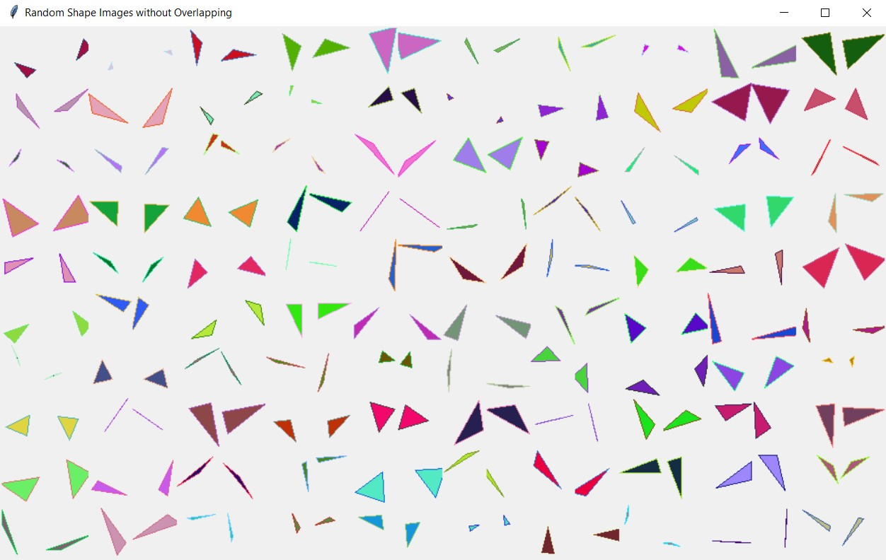
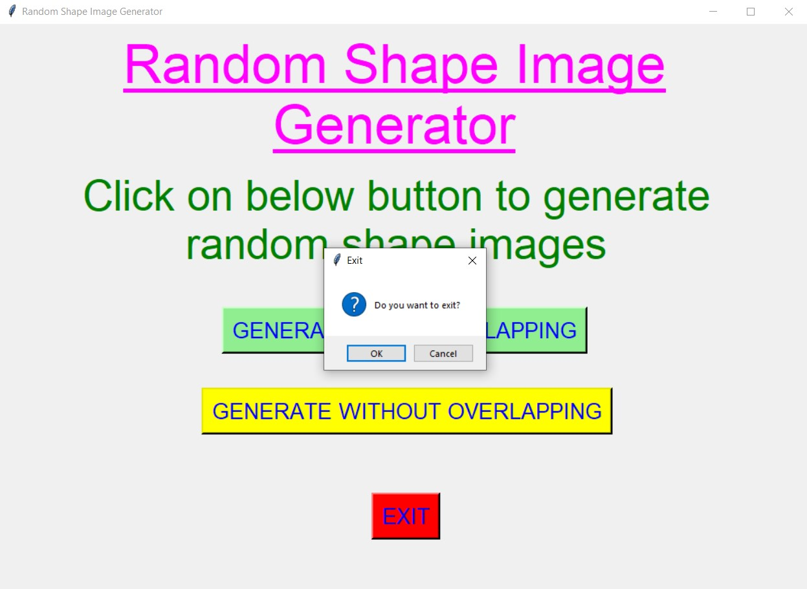

# ✔ RANDOM SHAPE IMAGE GENERATOR
- ### A "Random Shape Image Generator" is an application created in python with tkinter gui.
- ### In this application user will get option to generate images with random geometry shapes also, with and without overlapping of shapes.
- ### Also the random shapes in the image will be colored in different random colors.

****

# REQUIREMENTS :
- ### python 3
- ### tkinter module
- ### from tkinter messagebox
- ### from datetime import datetime
- ### from PIL import Image, ImageDraw, ImageTk
- ### from random import randint, randrange

****

# How this Script works :
- ### User just need to download the file and run the random_shape_image_generator.py on their local system.
- ### Now on the main window of the application, where user will see options like "GENERATE WITHOUT OVERLAPPING" and "GENERATE WITH OVERLAPPING".
- ### By clicking on any button, user can generate ramdom image with ramdom shapes in it colored with different random colors.
- ### Here user will have option to generate random images with or without shapes overlapping.
- ### When user clicks on any option button, user will be able to see a pop up window, which shows an image with random geometry shapes with different random colors.
- ### Also there is an exit button, clicking on which exit dialog box appears asking for the permission of the user for closing the window.

# Purpose :
- ### This programming keyboard will help user to easily generate random geometry shapes images with or without overlapping feature.

# Compilation Steps :
- #### Install tkinter, PIL, datetime, random
- #### After that download the code file, and run random_shape_image_generator.py on local system.
- #### Then the script will start running and user can explore it by selecting any option button and generating random image for the same.

****

# SCREENSHOTS :

****

   
   
   
   
   
   

****

# Name :
- ### Akash Ramanand Rajak

