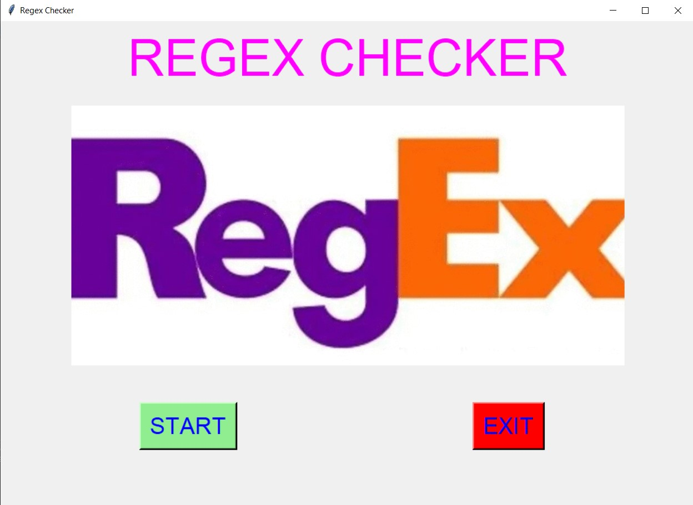
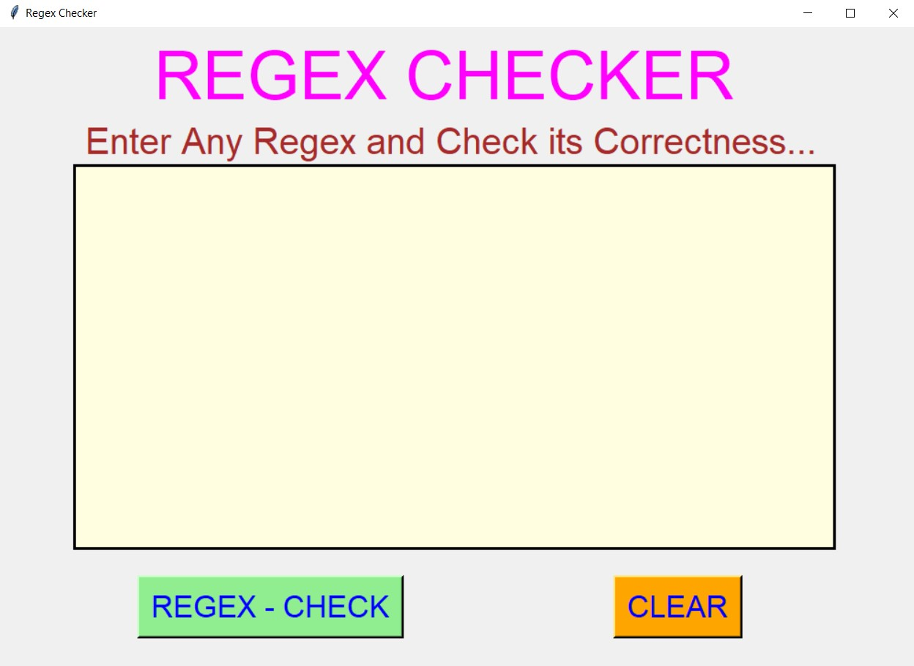
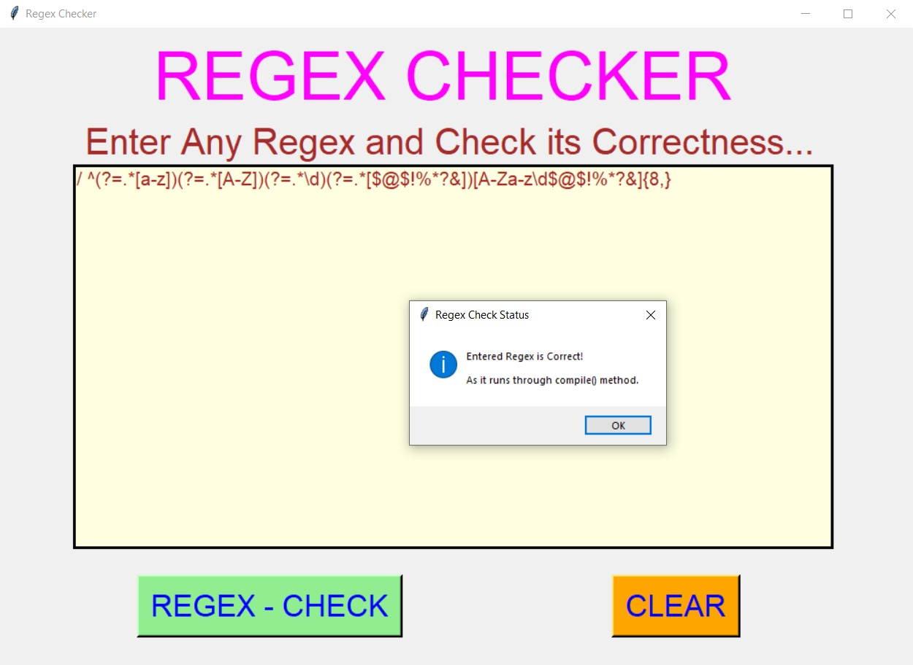
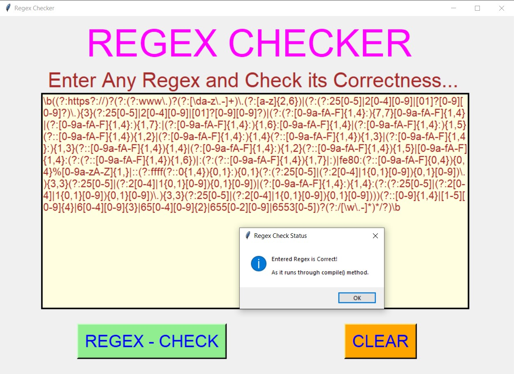
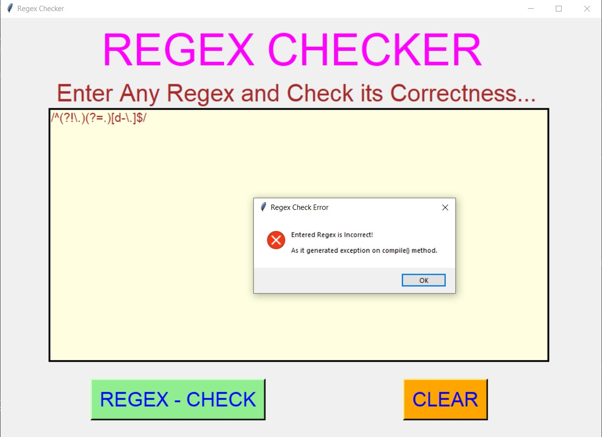
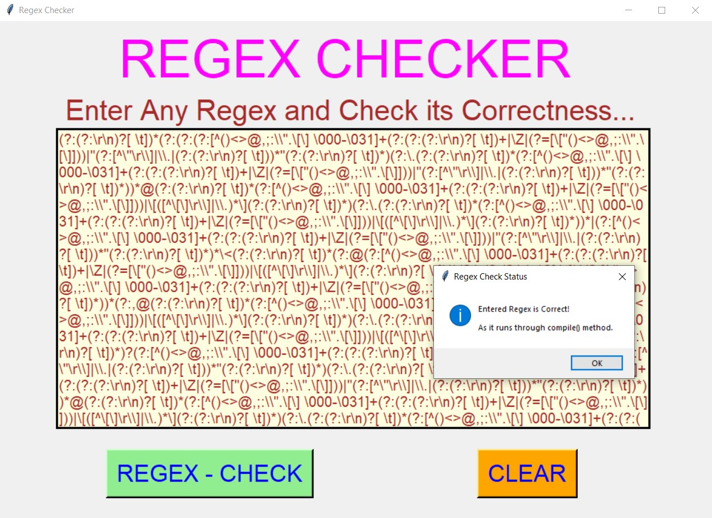
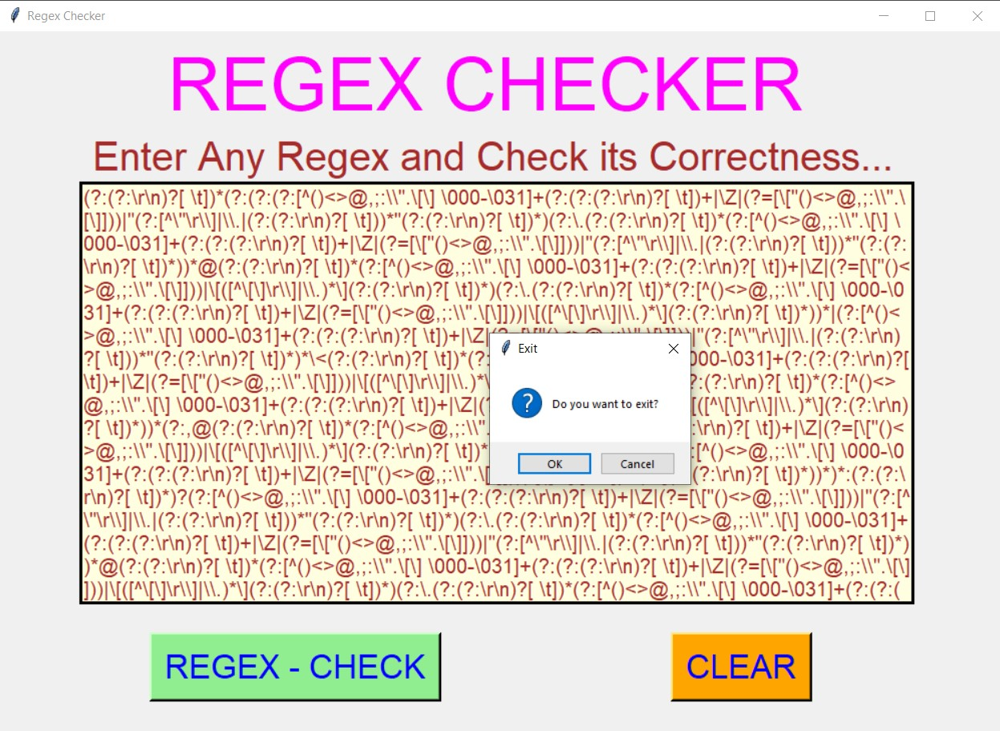

# ✔ REGEX CHECKER
- #### A "Regex Checker" is an application created in python with tkinter gui.
- #### In this application, user will be able to check the correctness of the any regex expression.
- #### for implementing this regex checker, using the compile method in re library of python.

****

# REQUIREMENTS :
- #### python 3
- #### tkinter module
- #### from tkinter messagebox module
- #### re

****

# How this Script works :
- #### User just need to download the file and run the regex_checker.py on their local system.
- #### Now on the main window of the application the user can click on the START button to get started with main application.
- #### ON the new window, user can enter any regex expression in the text area provided and by clicking on the REGEX CHECK button, user will be able to check the correctness of that regex.
- #### Also there is a CLEAR button, clicking on which user can clears the text area.
- #### Also there is an EXIT button, clicking on which exit dialog box appears asking for the permission of the user for closing the window.

# Purrpose :
- #### This scripts helps us to easily check the correctness of any regex expression.

# Compilation Steps :
- #### Install tkinter, re
- #### After that download the code file, and run regex_checker.py on local system.
- #### Then the script will start running and user can explore entering any valid or invalid regex and checking its correctness.

****

# SCREENSHOTS :

****

   
   
   
   
   
   
   

****

# Author :
- ### Akash Ramanand Rajak
