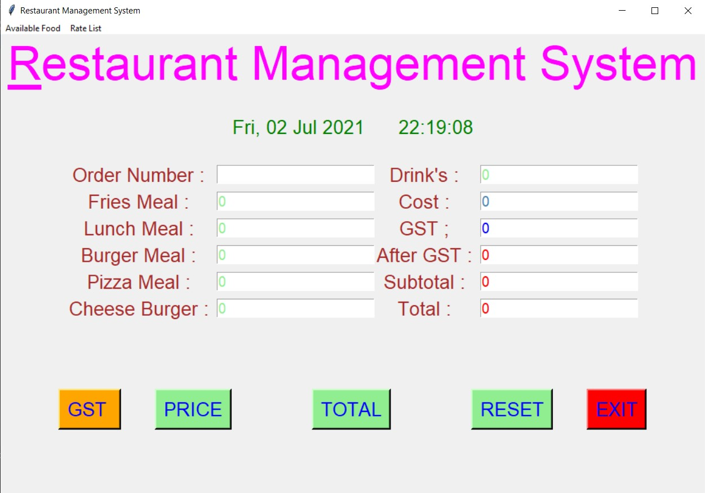
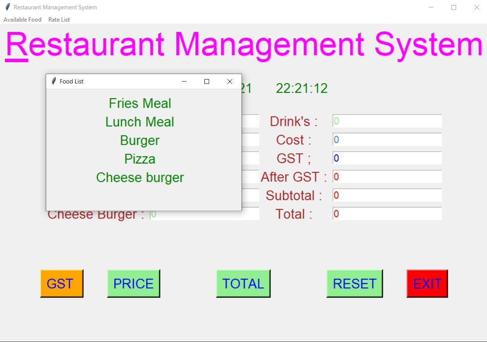
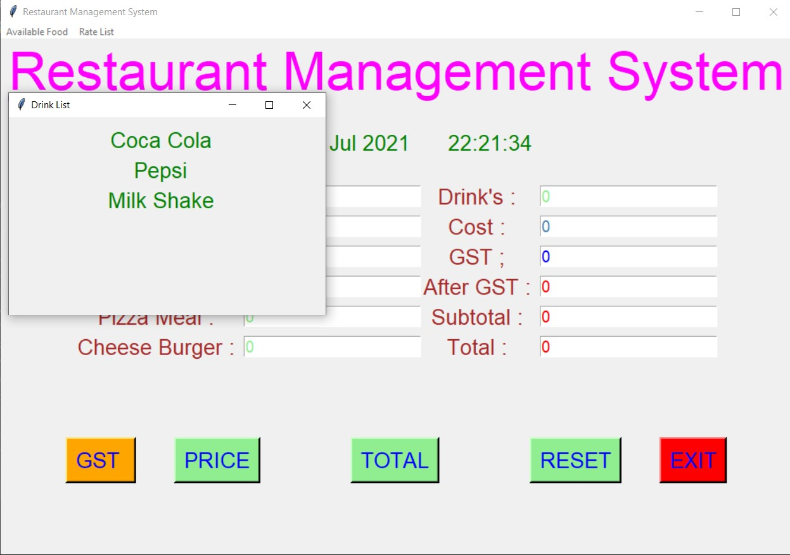
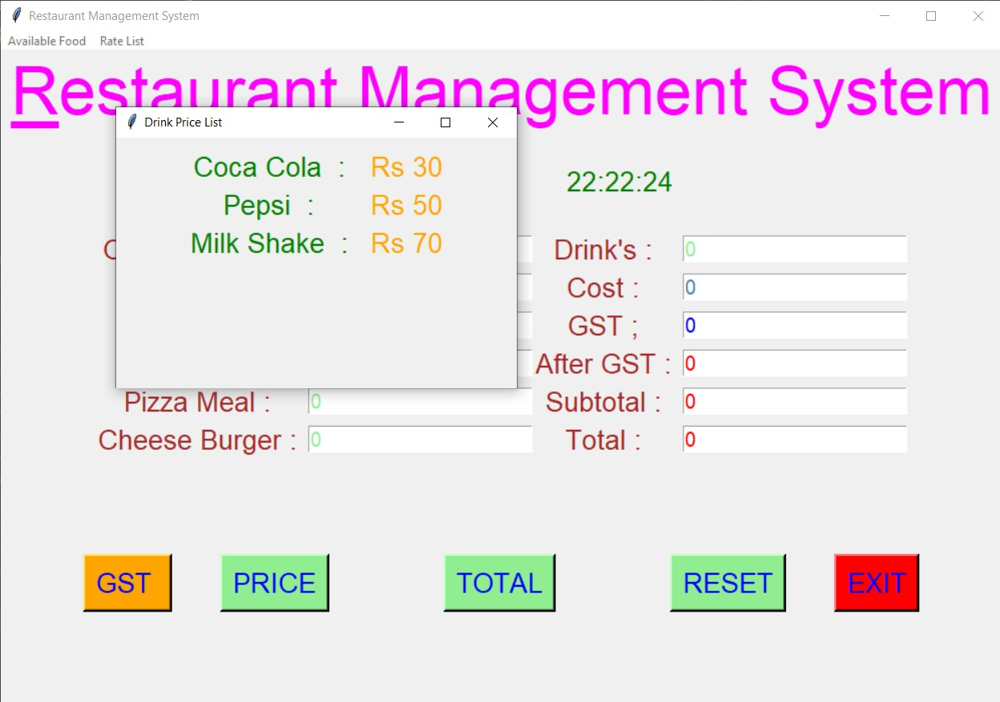
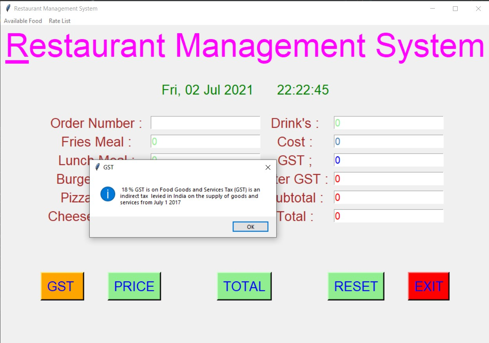
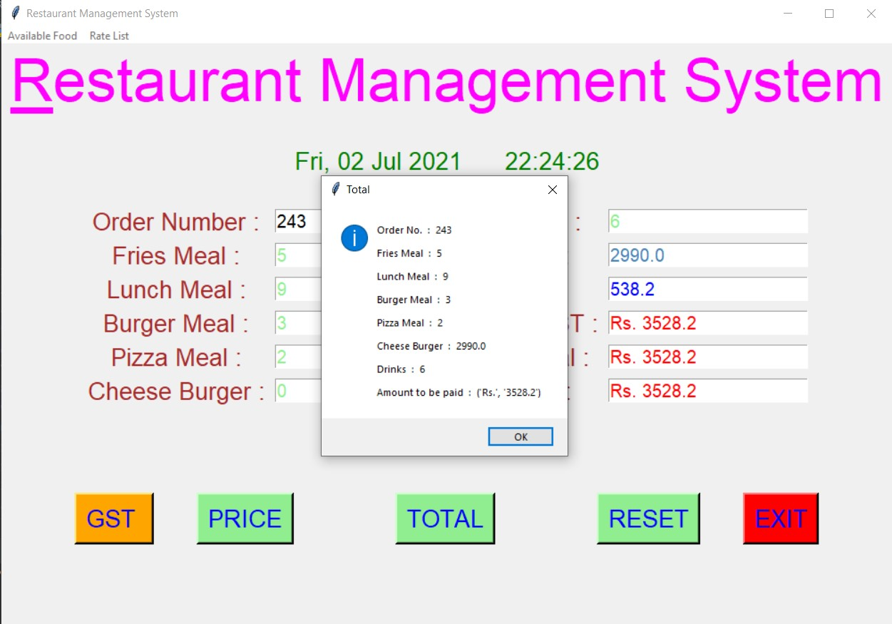
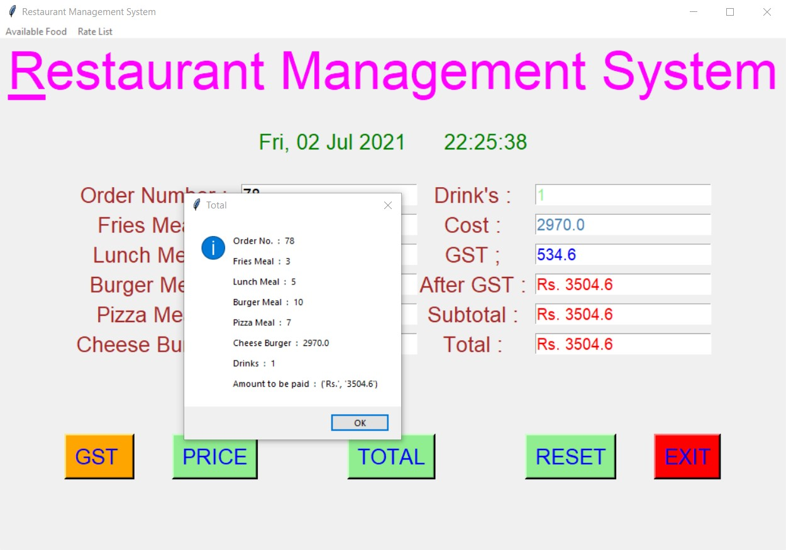
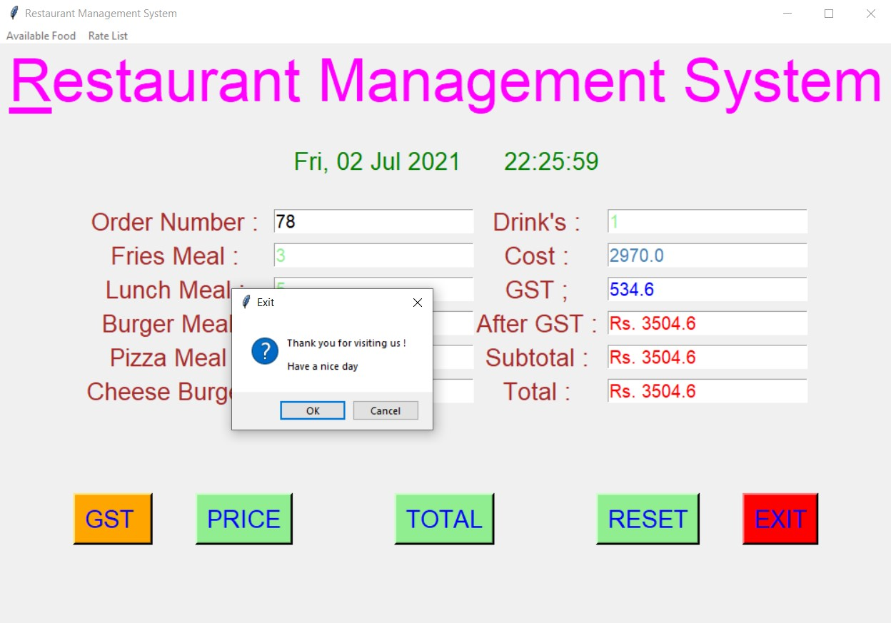

# ✔ RESTAURANT MANAGEMENT SYSTEM
- ### A Restaurant Management System created in python with tkinter gui.
- ### In this application, user will be able to select the food or drink of his/her choices and calculate the total price for it.
- ### Also user will be able to see the available food and drink menu along with its prices.
- ### Also while calculating the price GST of 18% is also applied to the total amount.
- ### User will also be able to see what was the price before GST and after GST.

****

# REQUIREMENTS :
- ### python 3
- ### tkinter module
- ### from tkinter messagebox module
- ### from time import gtime, strftime

****

# How this Script works :
- ### User just need to download the file and run the restaurant_management_system.py on their local system.
- ### Now on the main window of the game the user will be able to see the available menu and their prices from the top left menu bar.
- ### Here user will also be able to current time and date, so that he/she can accordingly select the menu.
- ### Then user will be asked to enter the Order No., No. of fries meal, no. of lunch meal, no. of burger, no. of pizza, no. of cheese burger, no. of drinks, and then click on Total button.
- ### Clicking on TOTAL button, showing the messagebo, showing the details about the order.
- ### Also there is a GST button, clicking on which user will be able to see how much GST is applied.
- ### Also there is a RESET button, clicking on which resets all the entry fields.
- ### And on clicking on the EXIT show a goog bye message and get exited.

# Purpose :
- ### This scripts helps us to understand how the online order process takes place.

# Compilation Steps :
- ### Install tkinter, python3, time
- ### After that download the code file, and run restaurant_management_system.py on local system.
- ### Then the script will start running and user can explore each and every option of restaurant management system.

****

# SCREENSHOTS :

****

   
   
   
   
   
   
   
   
   

****

# Name :
- ### Akash Ramanand Rajak
