# ✔ RESUME GENERATOR
- #### A "Resume Generator" is a Resume generating application created in python with tkinter gui.
- #### In this application, user can easily generate his/her resume by just filling the basic details asked.
- #### The basic details includes Name, Email ID, Education, Skills, Experience, Projects, Certificates and Awards, Links, and Hobbies and Interests.
- #### By entering this details, user can generate his/her Resume, and also the Resume will be saved successfully as PDF.

****

# REQUIREMENTS :
- #### python 3
- #### tkinter module
- #### from tkinter messagebox module
- #### from PIL import Image, ImageTk
- #### from fpdf import FPDF
- #### webbrowser

****

# How this Script works :
- #### User just need to download the file and run the resume_generator.py on their local system.
- #### Now on the main window of appliation, there will be buttons like START and TEMPLATE.
- #### When user clicks on the TEMPLATE button, user will be able to see the template of the resume through novoresume website.
- #### And when user clicks on the START button, the main application of Resume Generation starts where user will be asked to enter the basic details.
- #### The basic details includes Name, Email ID, Education, Skills, Experience, Projects, Certificates and Awards, Links, and Hobbies and Interests.
- #### After entering each details in the area provided user needs to click on the Enter button.
- #### After all the details are entered, when user clicks on the GENERATE RESUME button, user will get the pop up message showing resume generated and saved successfully.
- #### Also there is an exit button, clicking on which exit dialog box appears asking for the permission of the user for closing the window.

# Purpose :
- #### This scripts helps us to easily generate his/her resume by just filling the basic details asked.

# Compilation Steps :
- #### Install tkinter, PIL, fpdf, webbrowser
- #### After that download the code file, and run resume_generator.py on local system.
- #### Then the script will start running and user can explore it by entering his/her details and generating his/her resume as PDF.

****

# SCREENSHOTS :

****

  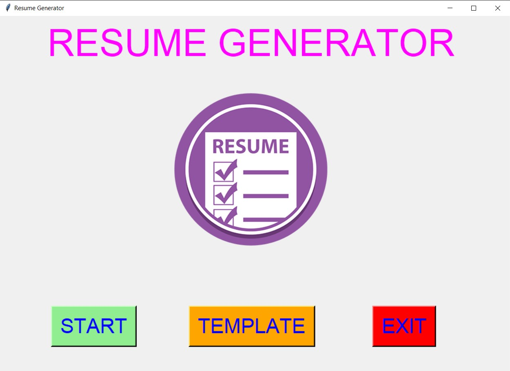 
  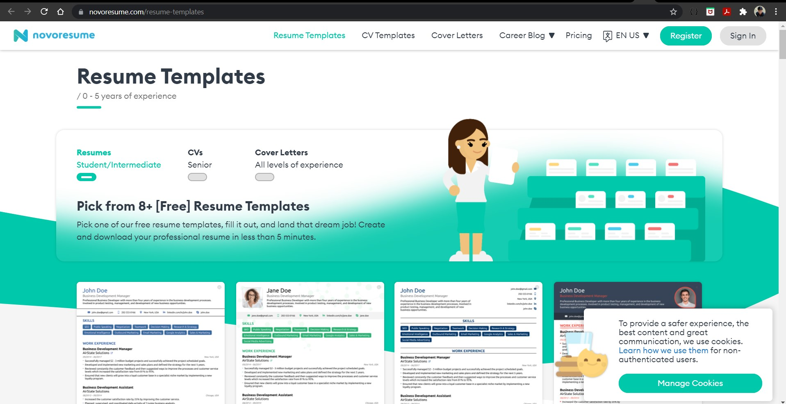 
  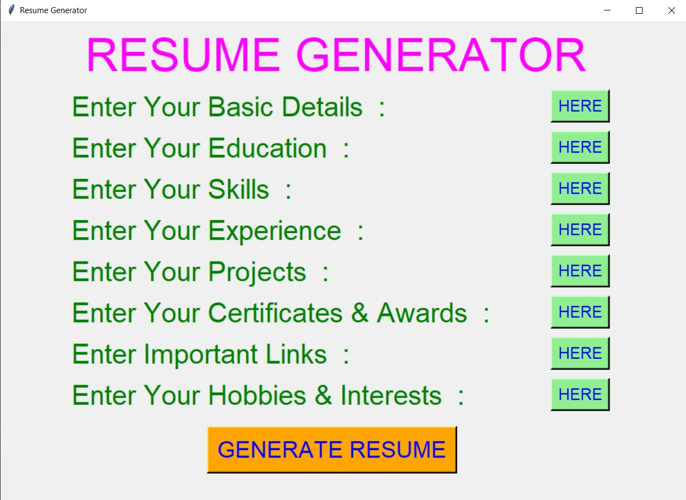 
  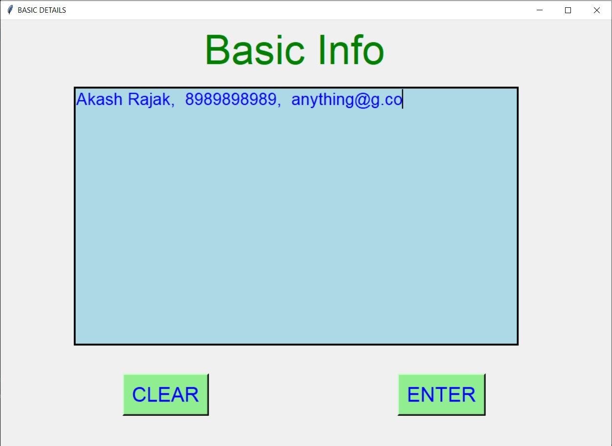 
  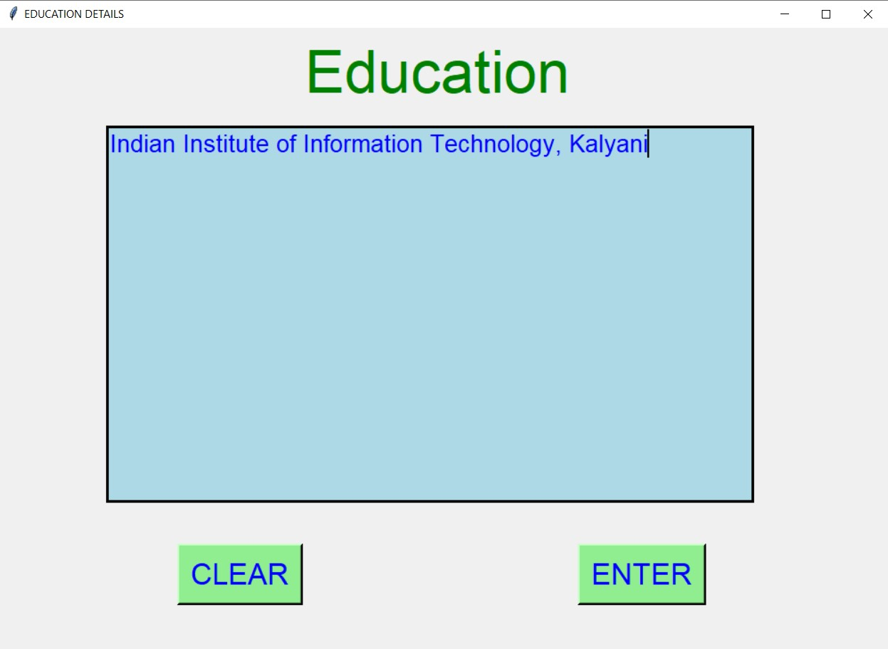 
  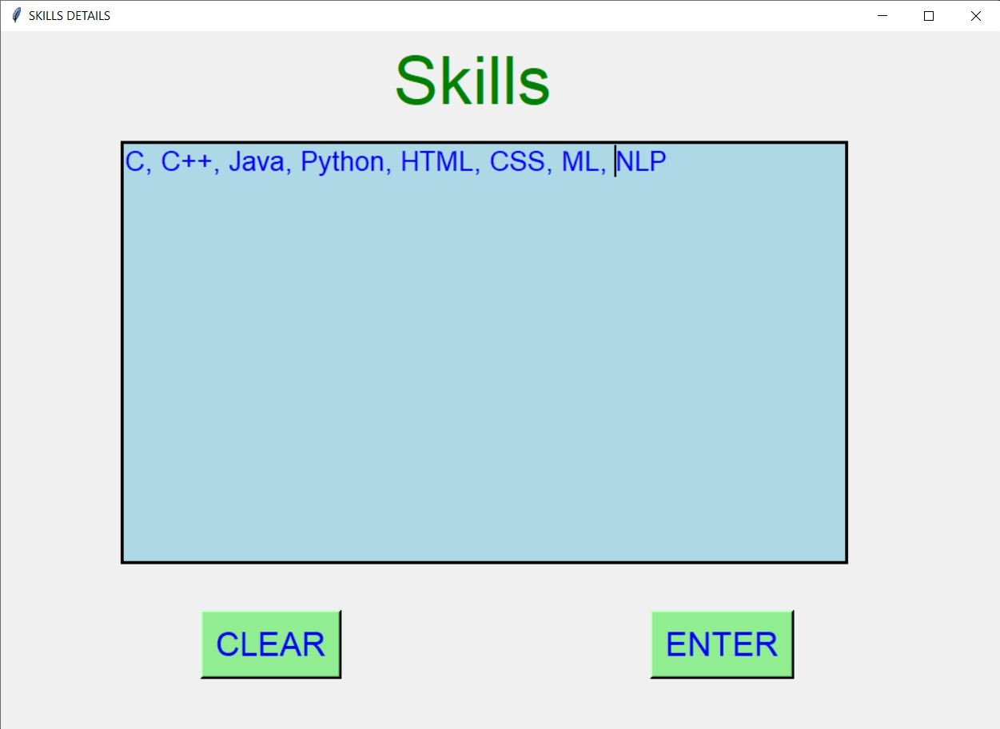 
  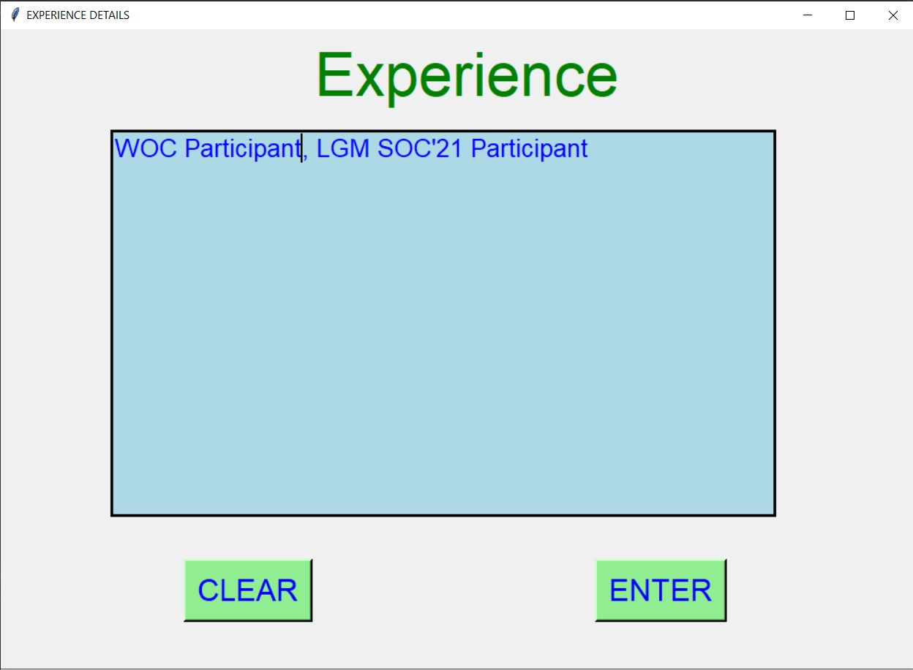 
  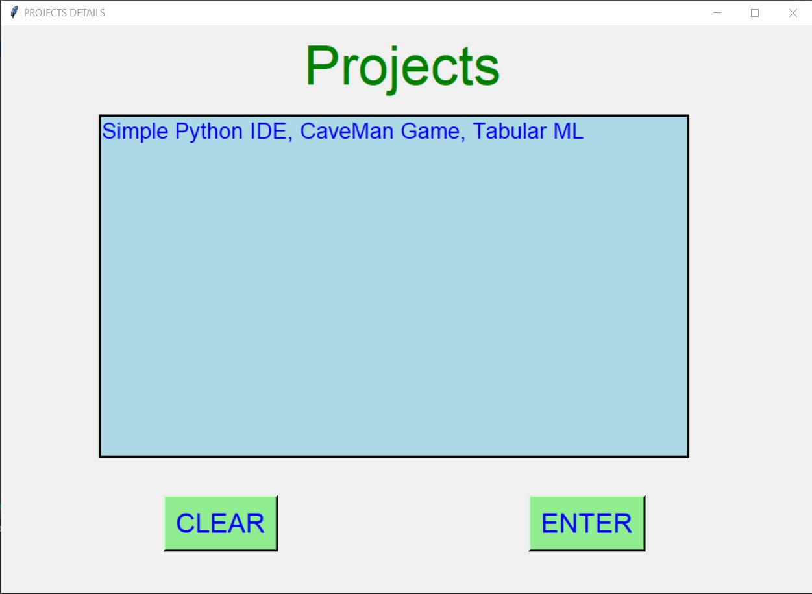 
  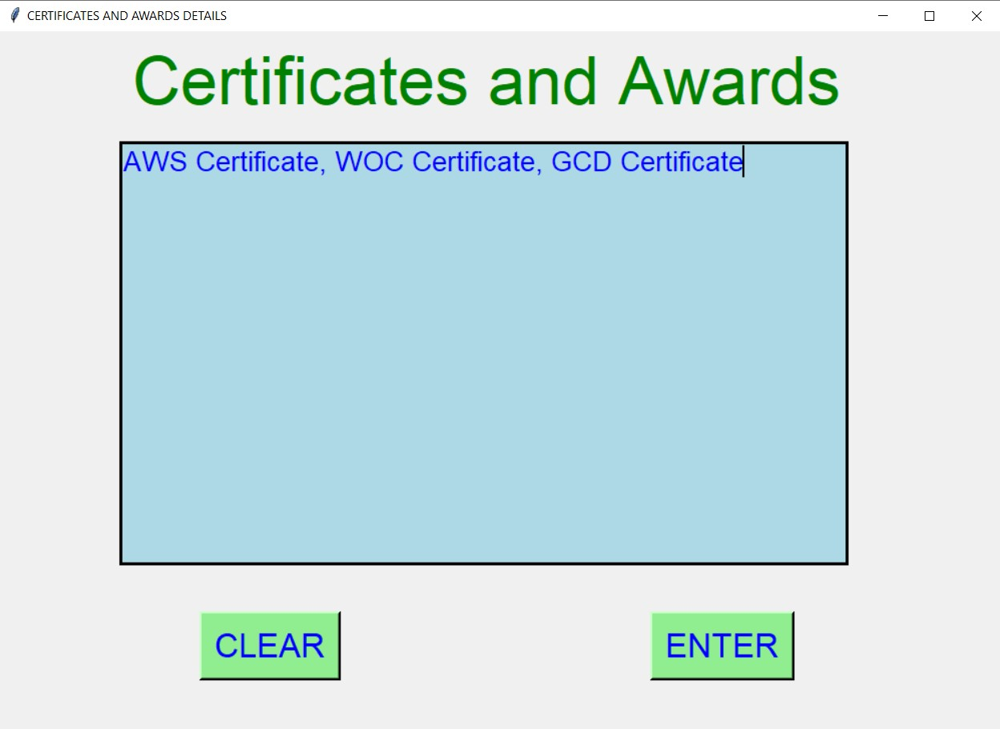 
  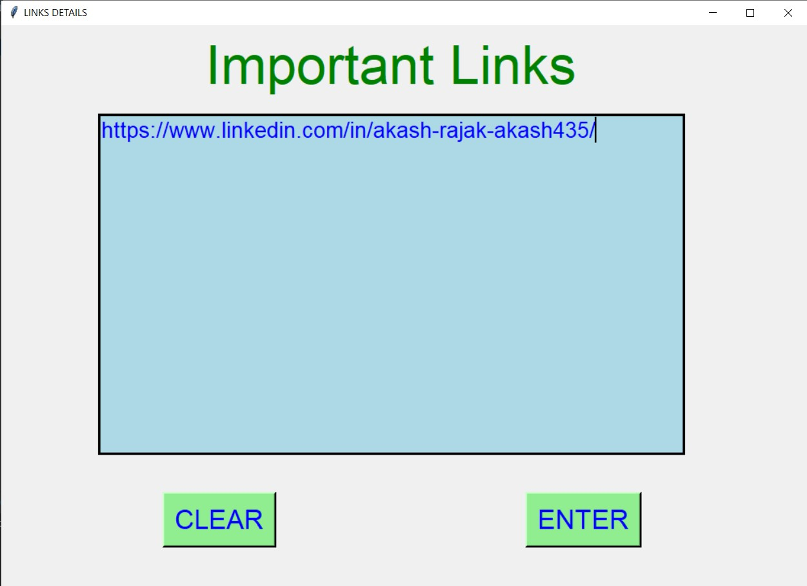 
  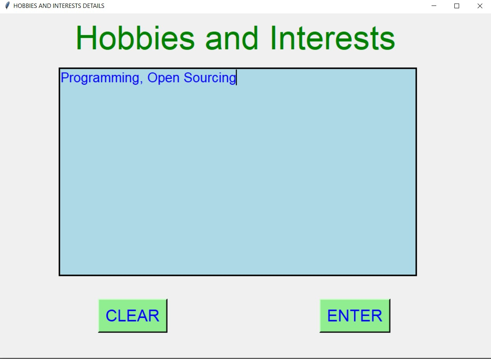 
  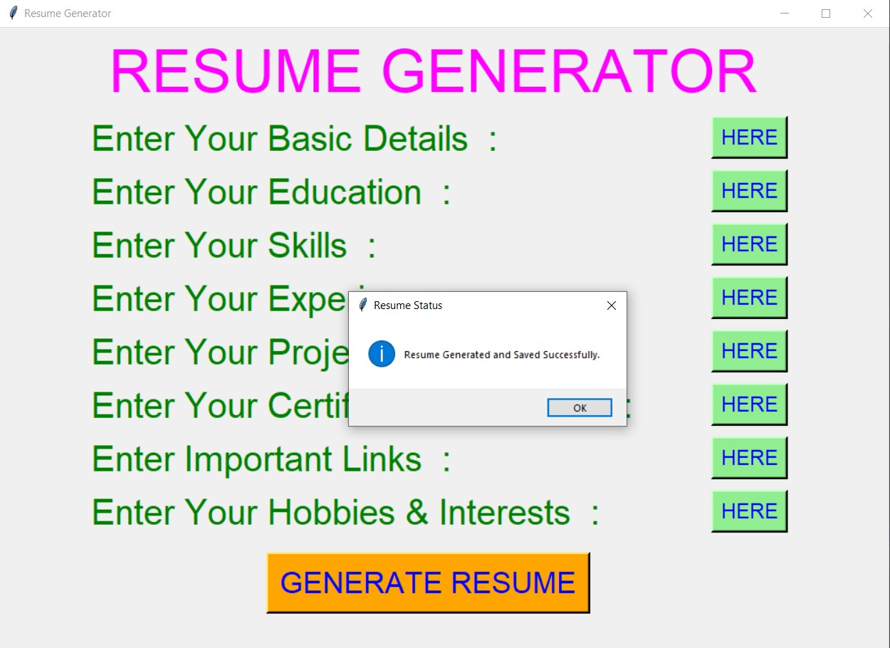 
  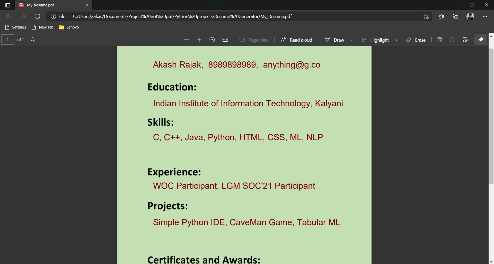 
  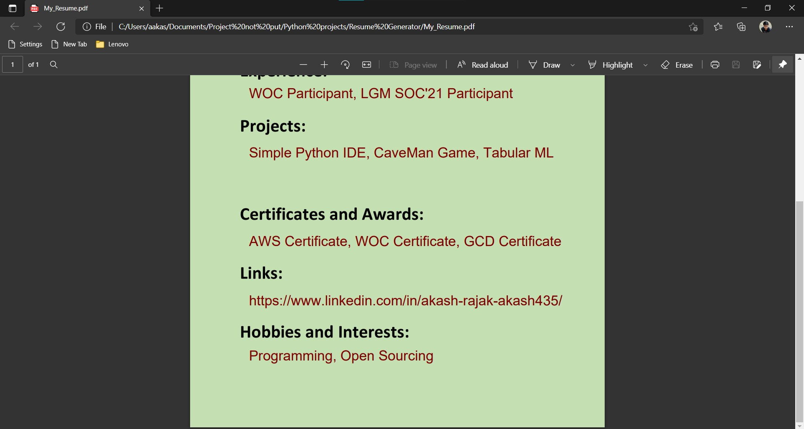 

****

# Name :
- #### Akash Ramanand Rajak
