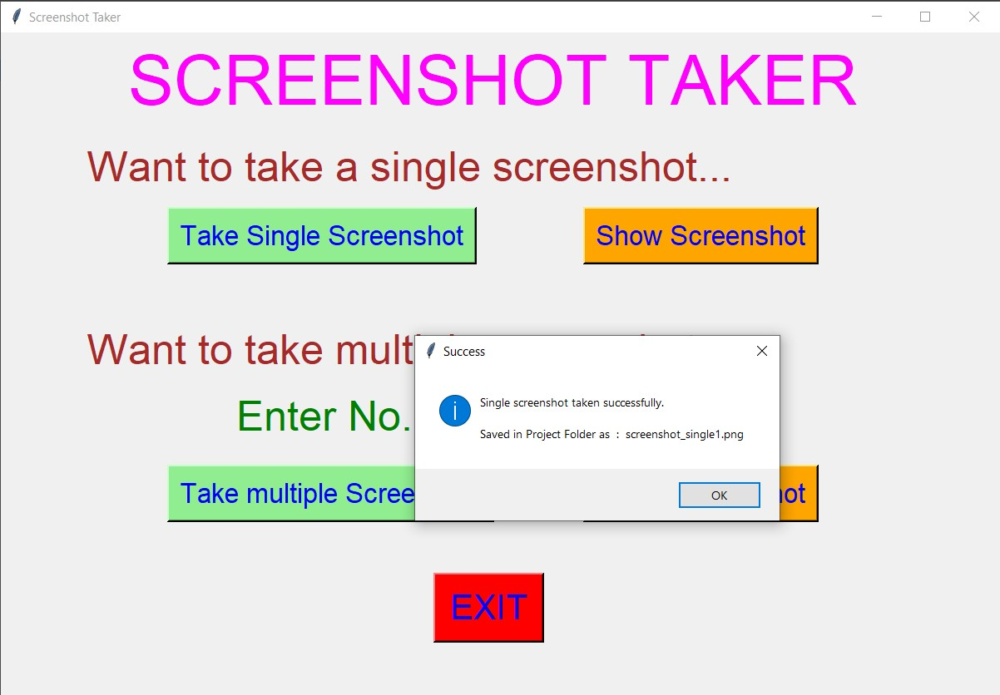
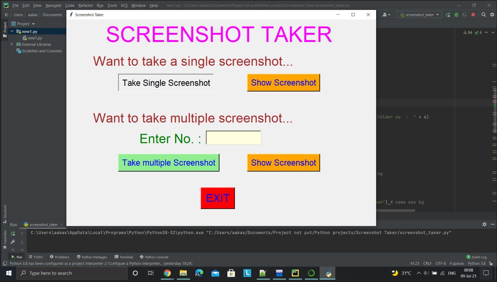
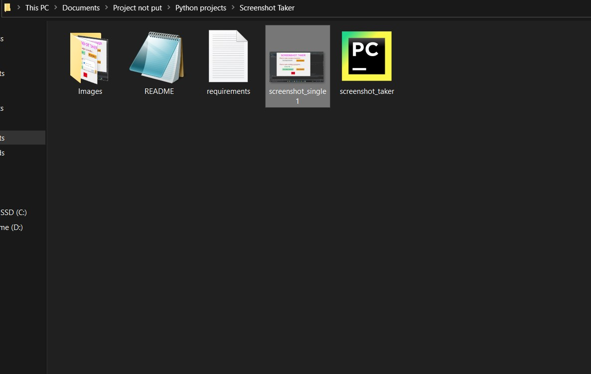
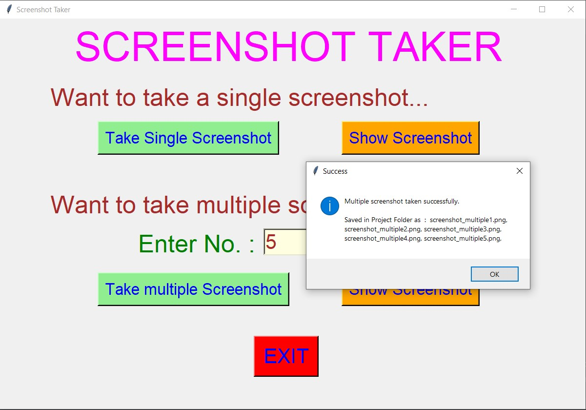
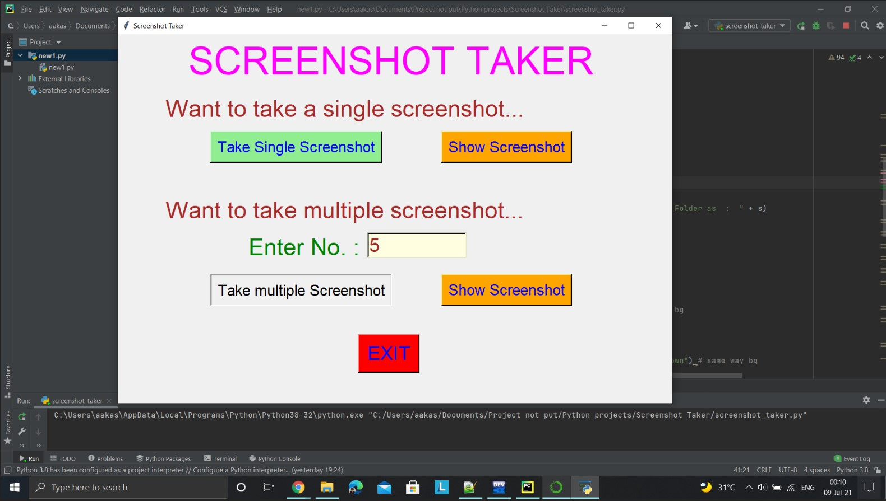
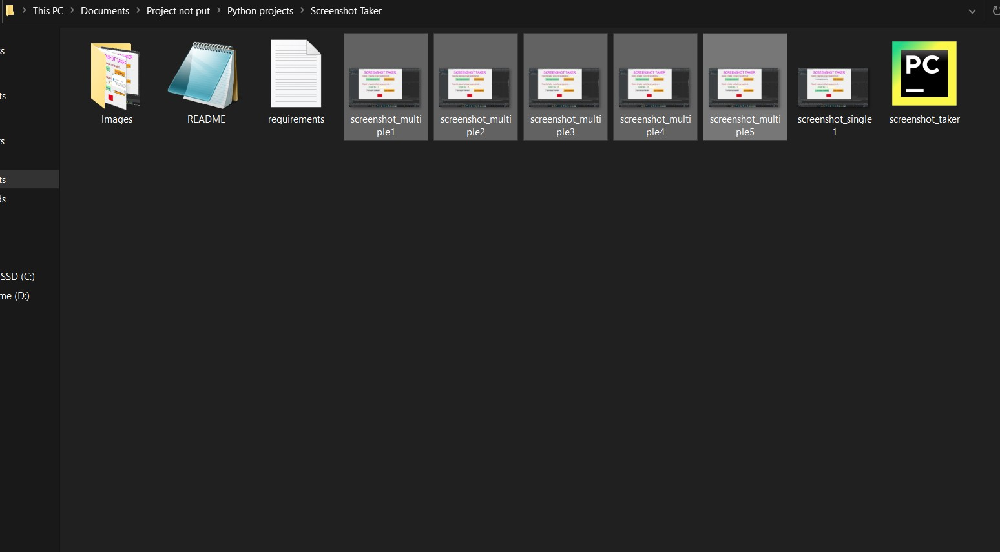
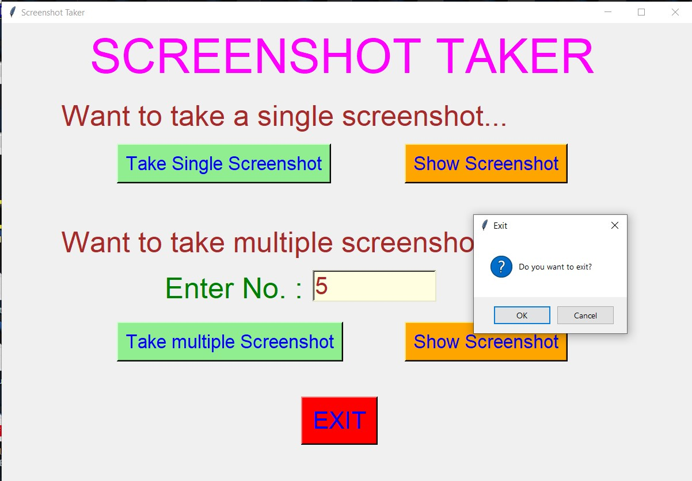

# ✔ SCREEN TAKER
- #### A "Screen Taker" is a screenshot taking application created in python with tkinter gui.
- #### In this application, user take either single screenshot or multiple screenshot(by entering the no of screenshots).
- #### After taking screenshot, user can even see the previewof screenshot using Show Screenshot button.
- #### Also after taking screenshot, the screenhot will be saved automatically in the project folder.
- #### For implementing this user pyautogui library in python.

****

# REQUIREMENTS :
- #### python 3
- #### tkinter module
- #### from tkinter messagebox module
- #### time
- #### pyautogui

****

# How this Script works :
- #### User just need to download the file and run the screenshot_taker.py on their local system.
- #### Now on the main window of the application the user will get the option to either take single screenshot or multiple screenshots.
- #### If user wants to select single screenshot, he/she can click on the Take Single Screenshot button, Clicking on it shows the message of success like Single screenshot taken successfully. Saved in Project Folder with so-so file name.
- #### Also user can take multiplpe screenshots by entering the no.of screenshots user needs to take and cliking on the Take multiple Screenshot, after which it shows the message of success like Multiple screenshot taken successfully. Saved in Project Folder with so-so file name.
- #### Also in both the cases user will be able to see the preview of the screenshot using Show Screenshot button.
- #### Also there is an exit button, clicking on which exit dialog box appears asking for the permission of the user for closing the window.

# Purrpose :
- #### This scripts helps us to easily take either single or multiple screenshots.

# Compilation Steps :
- #### Install tkinter, time, pyautogui
- #### After that download the code file, and run screenshot_taker.py on local system.
- #### Then the script will start running and user can explore it by taking single and multiple screenshots.

****

# SCREENSHOTS :

****

   
   
   
   
   
   
   
   

****

# Author :
- #### Akash Ramanand Rajak
