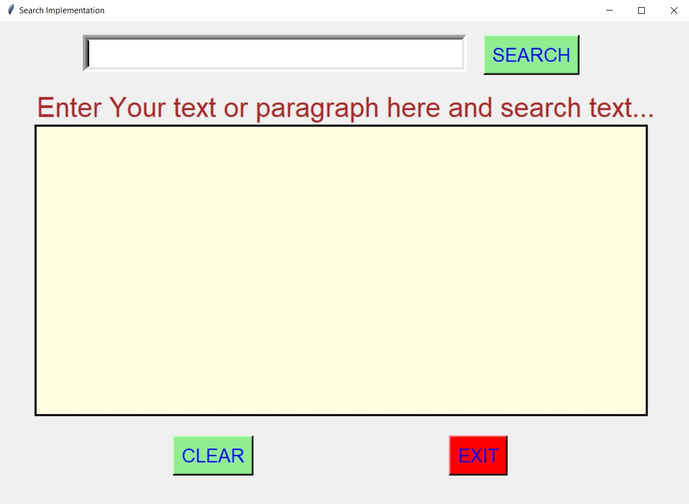
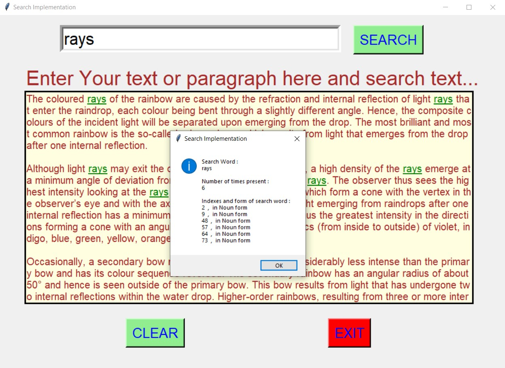
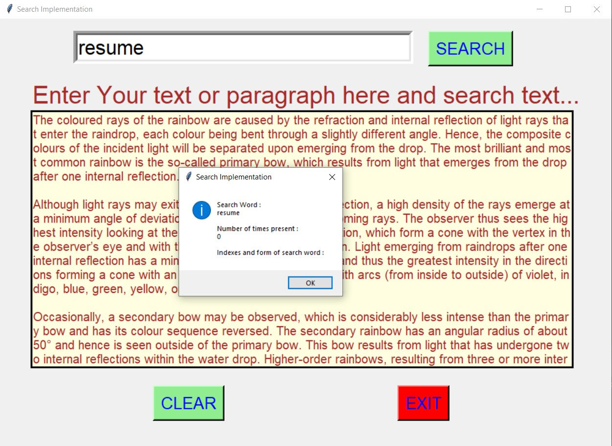
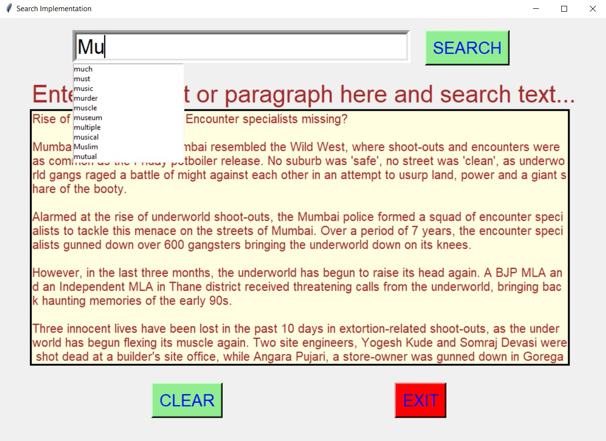
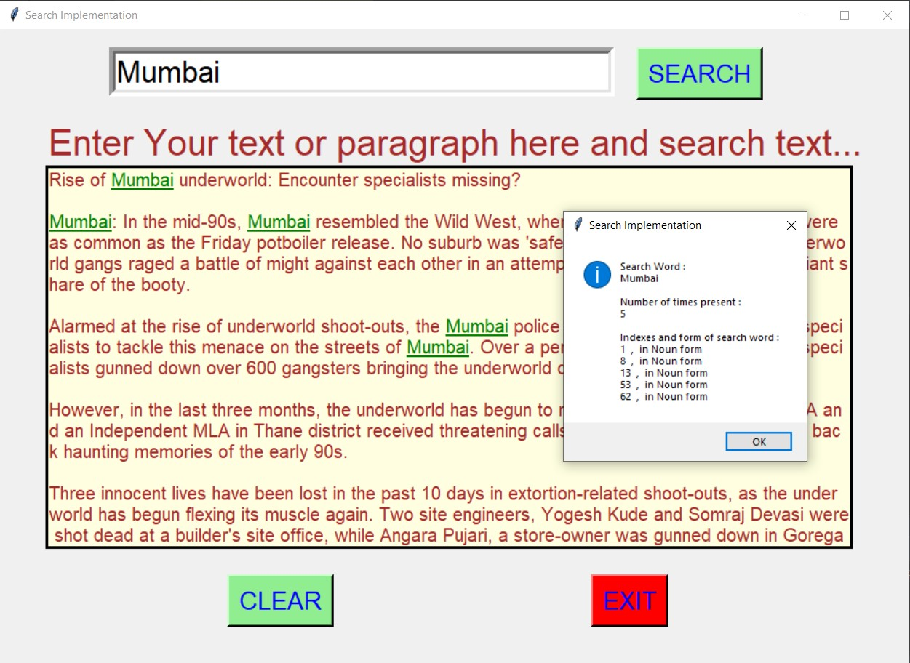
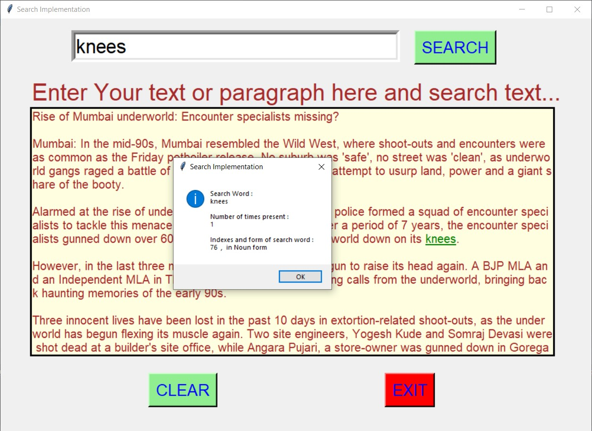
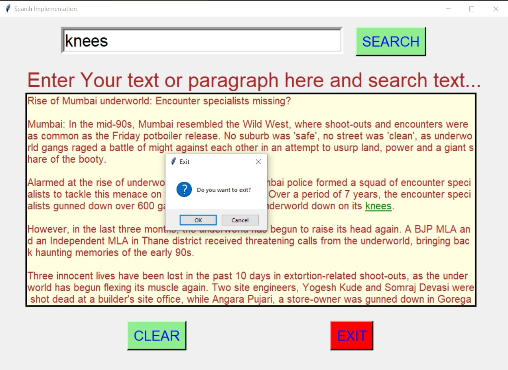

# ✔ SEARCH IMPLEMENTATION
- ### A Search Implementation is an application created in python with tkinter gui.
- ### In this application user can enter any text or sentence or paragraph, and then will be able to search any word in that pargraph or text entered.
- ### In this application, auto complete feature is implemented on the search entry area, and also colouring of searched word in the text area when clicked on search button.
- ### And used word.csv data for implementing auto complete feature in search entry area.

****

# REQUIREMENTS :
- ### python 3
- ### tkinter module
- ### from tkinter messagebox module
- ### PIL module
- ### nltk
- ### from nltk.corpus import stopwords
- ### from nltk.tokenize import word_tokenize, sent_tokenize
- ### pandas

****

# How this Script works :
- ### User just need to download the file and run the search_implementation.py on their local system.
- ### Now on the main window of the game the user allowed to enter any text oe paragraph in given text area.
- ### After entering the text in text area provided, when user enters any word to search in the search area, and clicks on the search button, all the words present in the text area that usr want to search get highlighted with green colour and also all word gets underlined.
- ### Also a message box will be shown to user showing count of that word present in text, their indices and their form (of which part of speech).
- ### Also autocomplete feature is implemented on the search button, so that when user enter some alphabet then he/she gets the suggestion of words starting with that alphabet or prefix in form of drop down list. And if user finds word in the suggested word, then user can select the word from there without typing the whole word.
- ### Also there is a clear button, clicking on which user can clears the input text area.
- ### Also there is an exit button, clicking on which exit dialog box appears asking for the permission of the user for closing the window.

****

# SCREENSHOTS :

****

   
   
   
   
   
   
   

****
