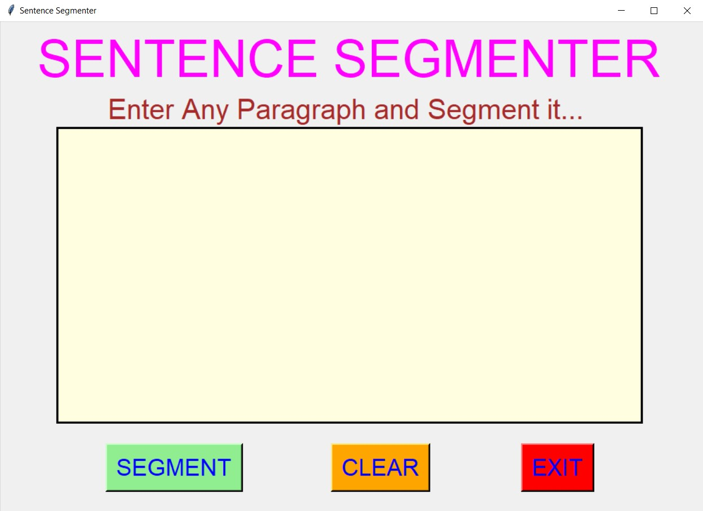
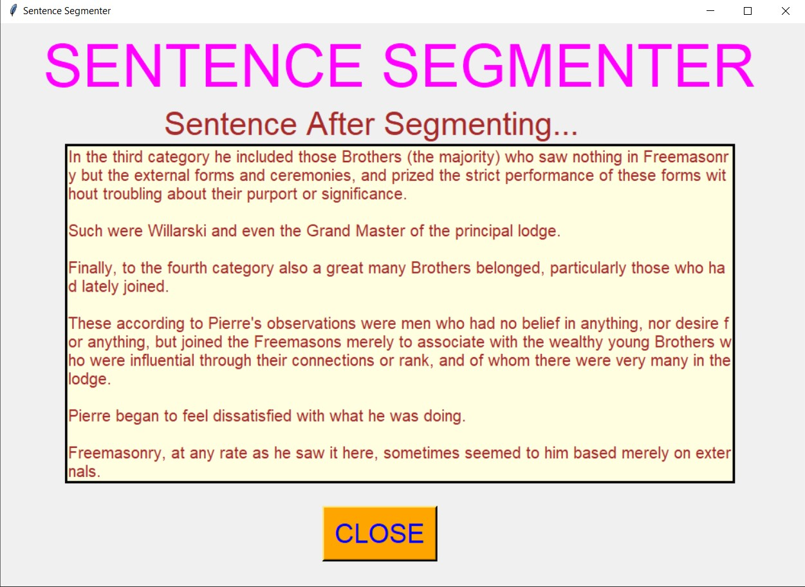
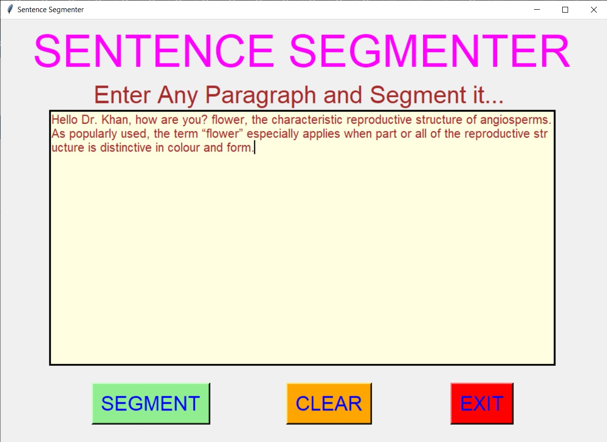
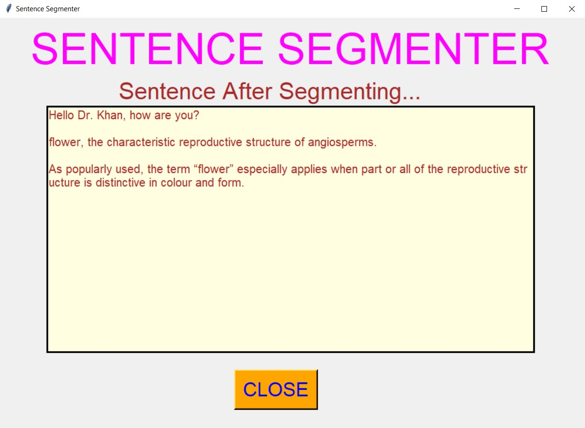
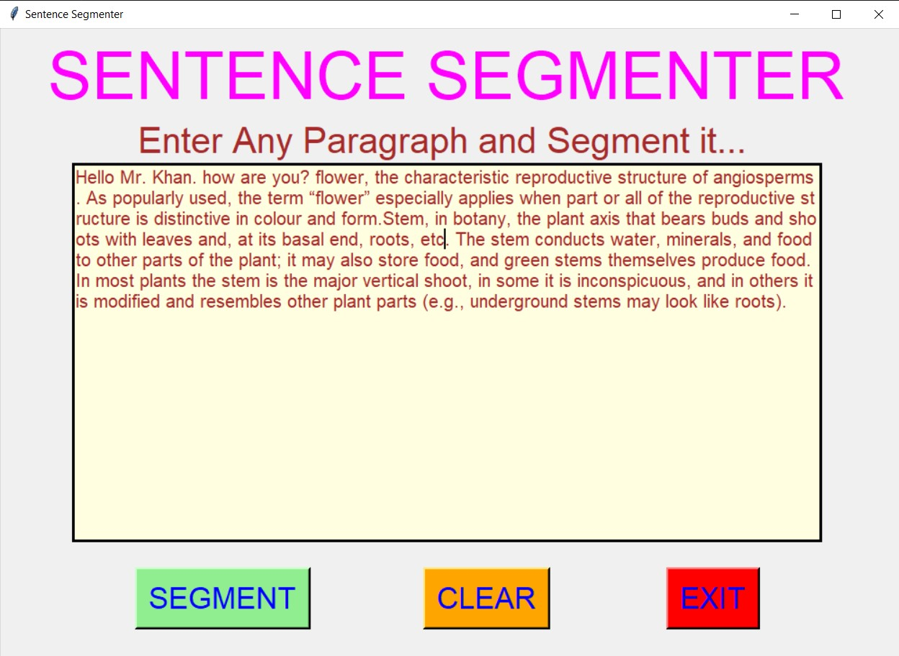
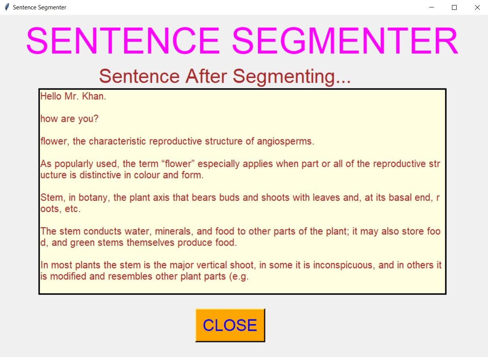

# ✔ SENTENCE SEGMENTER
- #### A "Sentence Segmenter" is an application created in python with tkinter gui.
- #### In this application, user will be able segment any paragrah or text.
- #### We need this application because paragraph and huge text are sometimes very tough to read and understand.
- #### So using Sentence Segmentation, we split a given paragraph of text into sentences, by identifying the sentence boundaries.
- #### for implementing this regex, that automatically detect which should be the correct sentence boundary and splits the sentence from there.

****

# REQUIREMENTS :
- #### python 3
- #### tkinter module
- #### from tkinter messagebox module
- #### re

****

# How this Script works :
- #### User just need to download the file and run the sentence_segmenter.py on their local system.
- #### Now on the main window of the application the user can enter any huge paragraph or text and segment it.
- #### Sentence Segmenting means to split a huge paragraph of text into sentences, by identifying the sentence boundaries. For most of the cases this sentence boundary is yhe full stop. But we defined the regex for segmenting in such a way that it doesn't consider all the fullstop. Like support "Dr." or "Mr.", like this full stop is there in paragraph, then it will not segment at this, because they are not the segment boundaries.
- #### Thus this script will segment the given paragraph into sentences which are easy to read and understand in real life.
- #### Also there is a CLEAR button, clicking on which user can clears the text area.
- #### Also there is an EXIT button, clicking on which exit dialog box appears asking for the permission of the user for closing the window.

# Purpose :
- #### This scripts helps us to easily segment or split the paragraph into sentences for better readability.

# Compilation Steps :
- #### Install tkinter, re
- #### After that download the code file, and run sentence_segmenter.py on local system.
- #### Then the script will start running and user can explore by entering any huge paragraph or text and segmenting it.

****

# SCREENSHOTS :

****

   
   
   
   
   
   
   

****

# Author :
- ### Akash Ramanand Rajak
