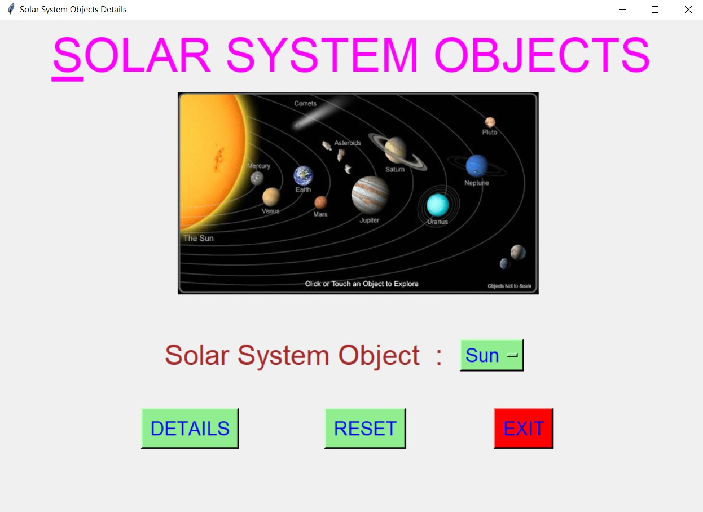
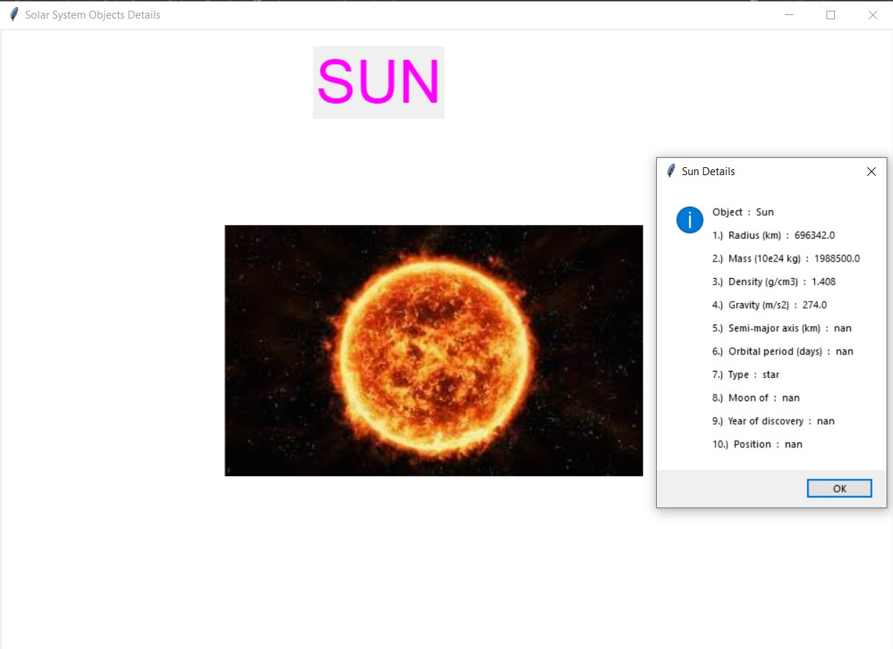
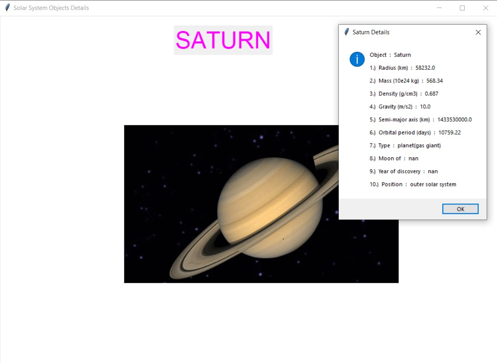
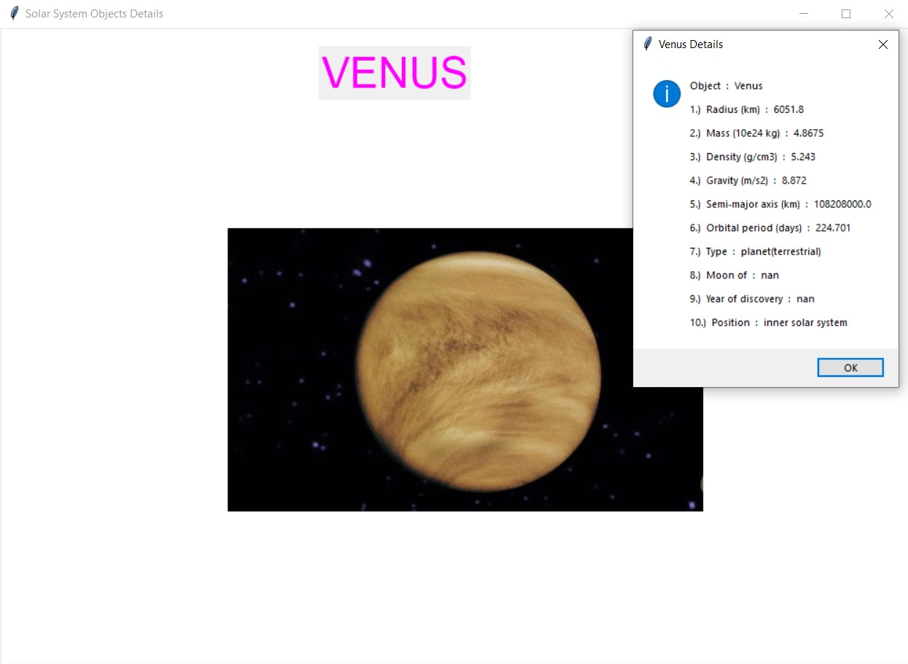
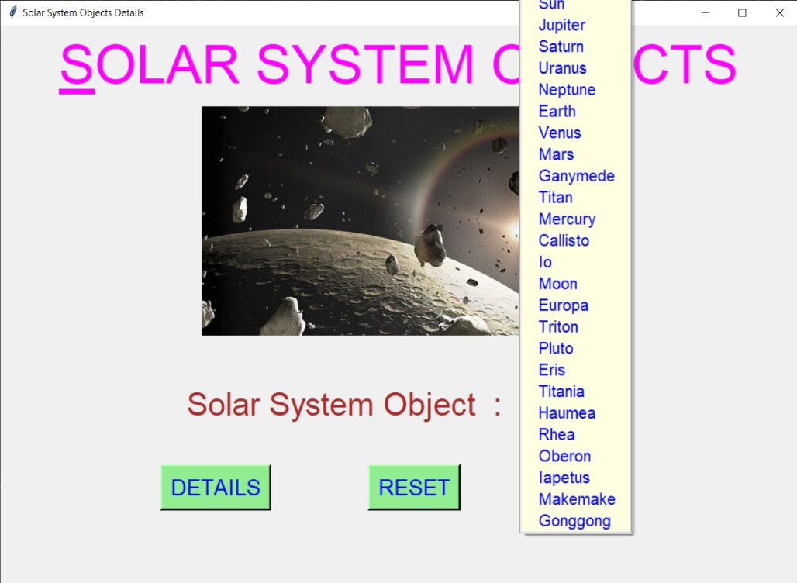
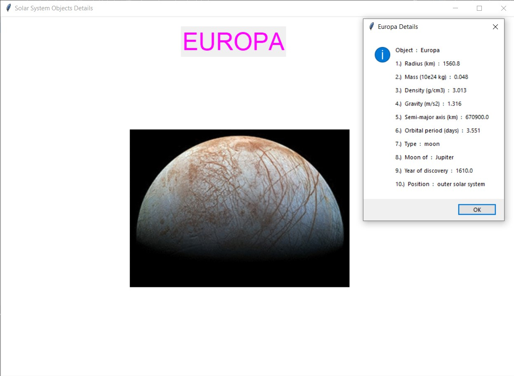
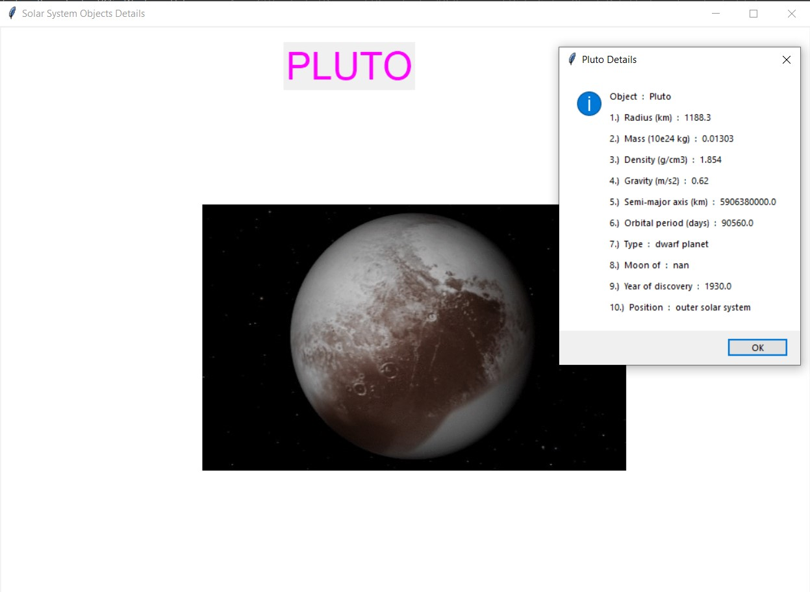
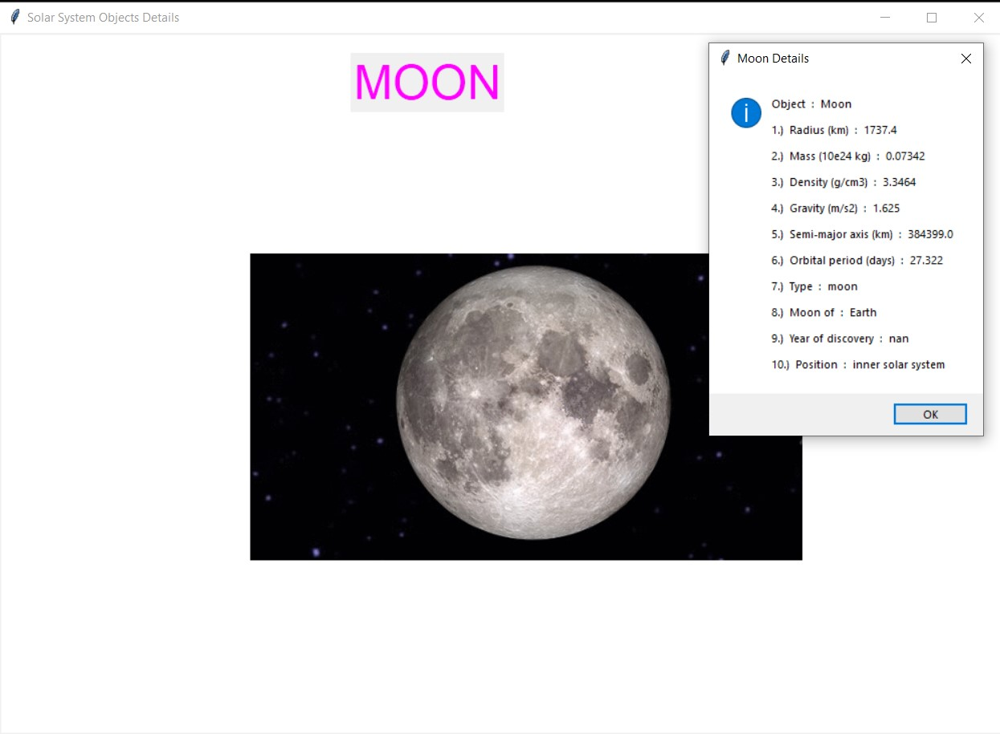
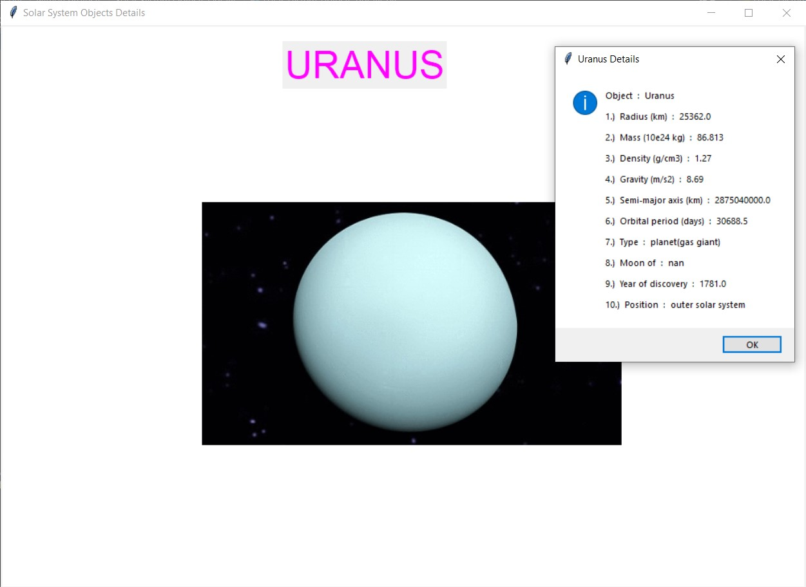
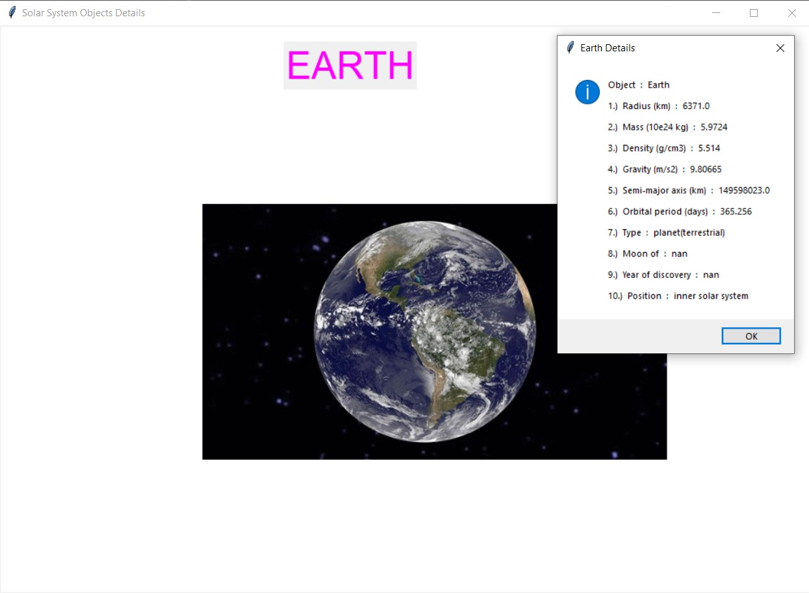

# ✔ SOLAR SYSTEM OBJECT DETAILS
- ### A "Solar System Object Details" created in python with tkinter gui.
- ### In this script, the user will be able select any object from 24 solar system object listed in drop down OptionMenu, can get the details about it.
- ### Also the details will be in terms of 1.)  Radius (km), 2.)  Mass (10e24 kg), 3.)  Density (g/cm3), 4.)  Gravity (m/s2), 5.)  Semi-major axis (km), 6.)  Orbital period (days), 7.)  Type (either planet, moon or star), 8.)  Moon of which planet (if its a moon), 9.)  Year of discovery, 10.)  Position n solar system.
- ### Along with this details, also user will be able to see the images of each solar system object.
- ### For the data read the solar_details.csv and read using pandas library.

****

# REQUIREMENTS :
- ### python 3
- ### tkinter module
- ### from tkinter messagebox module=
- ### pandas

****

# How this Script works :
- ### User just need to download the file and run the solar_system_object_details.py on their local system.
- ### Now on the main window of the script the user is asked to select any solar system object from the Option Menu.
- ### After choosing the object, when player click on the DETAILS button, he will be redirected to new frame showing information about that selected object in messagebox.
- ### The user will also be able to see how that solar system object looks in real.
- ### Also there is a reset button, clicking on which user can reset the values he/she has entered to the default value.
- ### Also there is an exit button, clicking on which exit dialog box appears asking for the permission of the user for closing the window.
- ### This way user can get to know about which each solar system object, and also get some interesting information about it.

# Purrpose :
- ### This scripts helps user to easily interesting information about the solar system ojects by just selecting its name.

# Compilation Steps :
- ### Install tkinter, pandas
- ### After that download the code file, and run solar_system_object_details.py on local system.
- ### Then the script will start running and user explore each object listed in Optionmenu.

****

# SCREENSHOTS :

****

   
   
   
   
   
   
   
   
   
   

****

# Name :
- ### Akash Ramanand Rajak