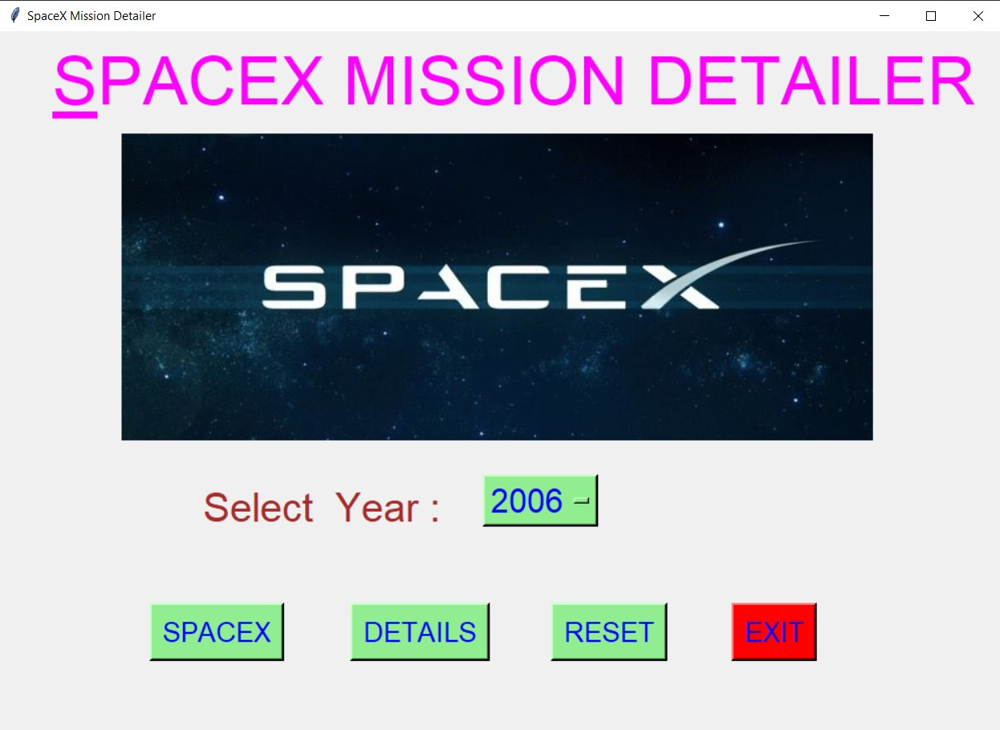
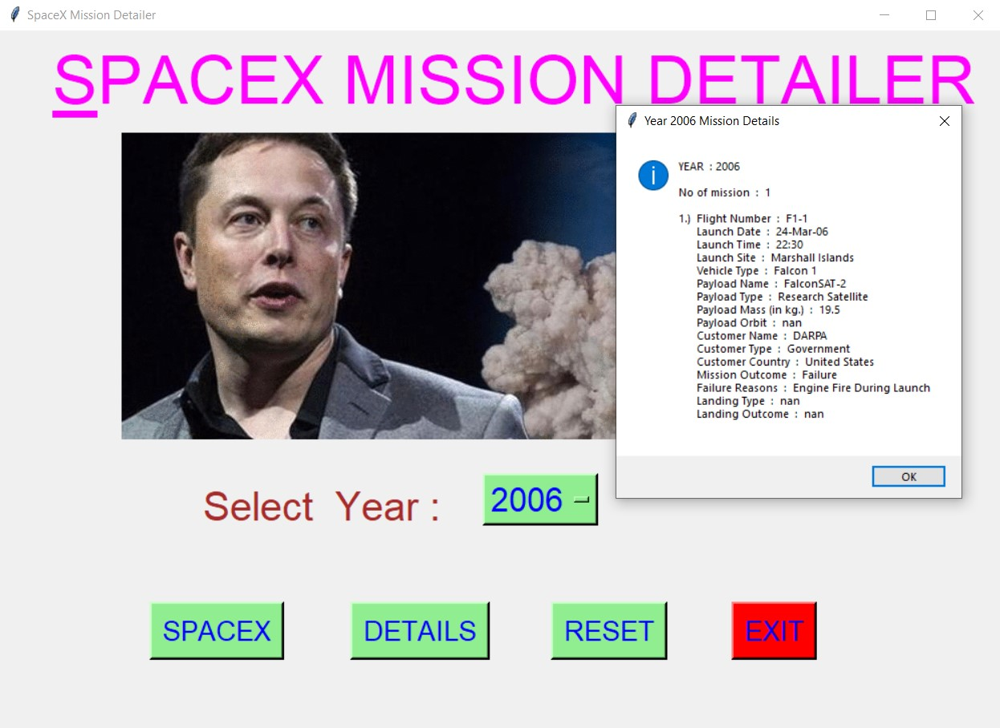
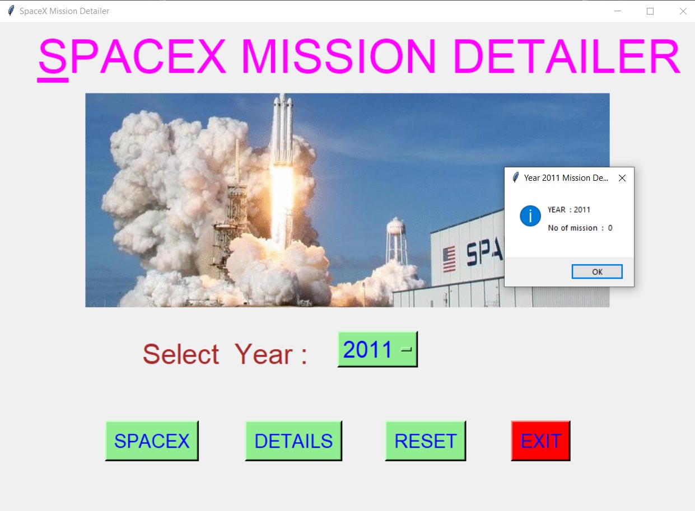
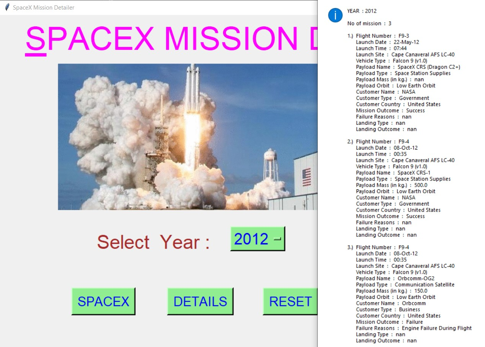
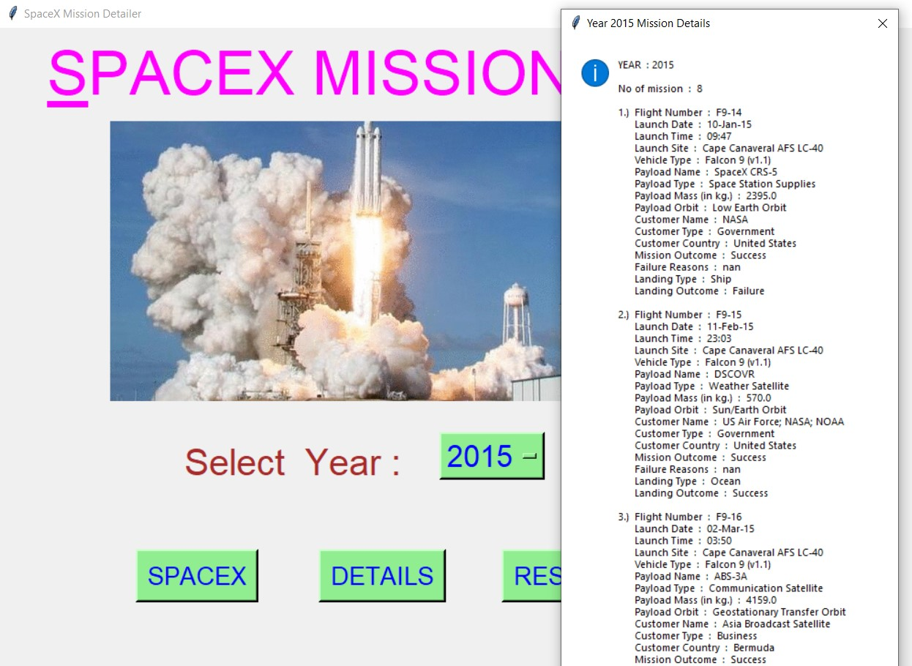
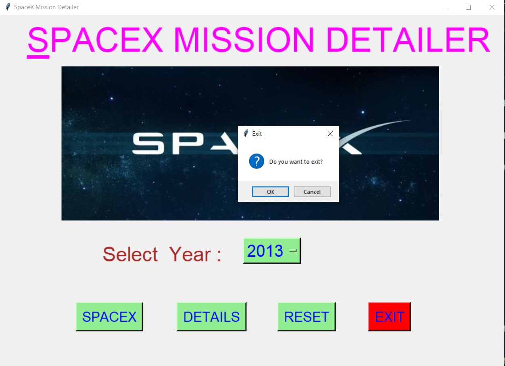

# ✔ SPACEX MISSION DETAILER
- ### A "SpaceX Mission Detailer" is an application created in python with tkinter gui.
- ### In this application, user can find the details about any how many SpaceX Mission took place between March 2006 to February 2017.
- ### The details for each mission will be in terms of Flight Number, Launch Date, Launch Time, Launch Site, Vehicle Type, Payload Type, Payload Mass, Payload Orbit, Customer Name, Customer Type, Customer Country, Mission Outcome, Failure Reasons if failed, Landing Type and landing Outcome.
- ### for the data, used the spaceX_data.csv data, and read using pandas library.

****

# REQUIREMENTS :
- ### python 3
- ### tkinter module
- ### from tkinter messagebox module
- ### pandas

****

# How this Script works :
- ### User just need to download the file and run the spacex_mission_detailer.py on their local system.
- ### Now on the main window of the application the user needs to select the year from the drop down OptionMenu.
- ### After user has chosen the year, when user clicks on the BY DETAILS button, he/she will be able to see the details about mission that took place in that year in the message box.
- ### Also there is a SPACEX button, clicking on which shows What is SpaceX.
- ### Also there is a reset button, clicking on which user can resets both the Option Menu to default character ot integer.
- ### Also there is an exit button, clicking on which exit dialog box appears asking for the permission of the user for closing the window.

# Purrpose :
- ### This scripts helps us to easily get every details about the SpaceX mission that took place in any year between March 2006 to February 2017.

# Compilation Steps :
- ### Install tkinter, pandas
- ### After that download the code file, and run spacex_mission_detailer.py on local system.
- ### Then the script will start running and user can get the details about the spaceX mission that took place between given period of year.

****

# SCREENSHOTS :

****

   
   
   
   
   
   
   

****

# Author :
- ### Akash Ramanand Rajak
